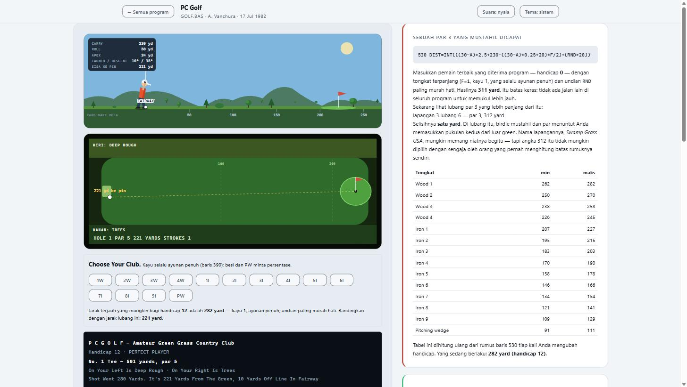
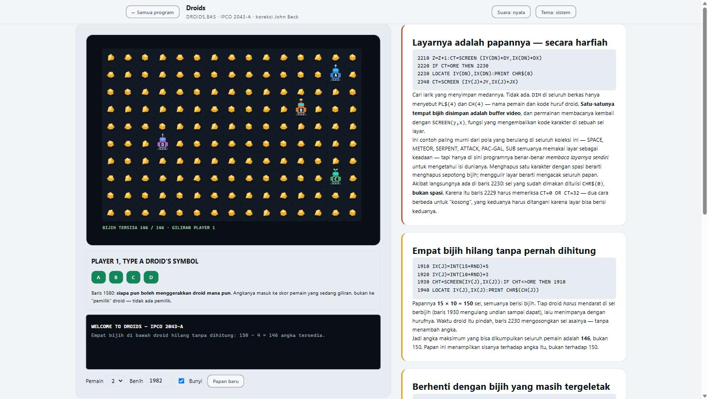
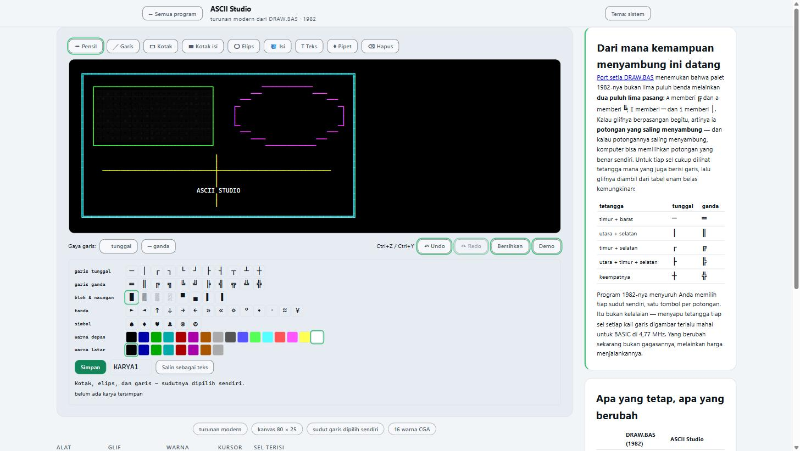

# GWBASIC-to-web

**83 BASIC programs from 1978–2000, read line by line and rebuilt for the web.**

In 1981 IBM shipped the PC with BASIC in ROM. It did not ship the programs.
Those came from somewhere else — small companies selling introductory disks,
magazine readers typing in listings by hand, and user groups mailing floppies
to each other. One file in this collection, `DROIDS.BAS`, still carries the
trail in line 193:

```basic
193 PRINT"██   Error correction by JOHN BECK   ██"
196 PRINT"██        Melbourne PC-Group         ██"
```

It travelled from Pittsburgh to Melbourne, was fixed there, and went back into
circulation. That is a fork and a patch, sent by post, in 1983.

These programs are small. Many are under 300 lines. And that is exactly why
they are worth reading: **a whole idea fits in your head at once**, and you can
still see every decision the author made — including the ones they got wrong.

| | |
|---|---|
|  |  |
| **GOLF** (1982) — the ballistics are new; the 311-yard ceiling is the original's | **DROIDS** (IPCO 2043-A) — a game whose only board is the video buffer |



*ASCII Studio — a modern derivative of `DRAW.BAS`. Its line tool picks its own
corners, because the 1982 palette turned out to be 25 matched pairs.*

## What this repository contains

| | |
|---|---|
| `run/` | the original `.BAS` sources, untouched |
| `reviews/` | a line-level analysis of every original program |
| `web/games/` | **66 offline web ports** — open `index.html`, no build step, no server |
| `web/docs/` | one architecture document per port: what was found, what was kept, what was changed, and why |
| `web/PLAN.md` | the full work log, session by session |

Everything runs from `file://`. No npm, no bundler, no CDN, no network. Clone
it and double-click.

## Run the originals, not just the ports

Every `.BAS` file ships with a matching `.bat` launcher — **91 of them** — so
you can run the 1982 program itself, under GW-BASIC, inside DOSBox-X:

```
run\BATSHIP.bat
```

The only requirement is **`dosbox-x` on your PATH**. Nothing else to configure:
each launcher mounts the folder, starts GW-BASIC, loads the program, and exits
cleanly when you quit.

The hardware profile lives in one shared file, `dosbox-games.conf`, and it is
tuned deliberately:

| setting | value | why |
|---|---|---|
| `cycles` | `fixed 315` | approximates a **4.77 MHz 8088** — the speed these games were written for. Many of them time things by counting loop iterations (`FOR HOLD=1 TO DELAY`), so on a modern CPU they finish before you can see them |
| `scaler` | `normal5x forced` | **5× zoom**, applied in every video mode. A 320×200 CGA screen is unreadable on a modern display otherwise |
| `output` | `openglnb` | nearest-neighbour scaling — pixels stay square blocks instead of being blurred into mush |

That last point matters more than it sounds. `DROIDS.BAS` reads its own screen
back with `SCREEN(y,x)` to find out where the ore is; a display that alters
pixels is not a cosmetic issue there, it is the game's memory.

**Run the original first, then the port.** The differences are the lesson, and
the four-column table in each document tells you exactly which ones were
deliberate.

## Where these programs actually came from

This part is worth getting right, because the popular version of the story is
wrong. IBM shipped the PC and shipped BASIC in ROM. **IBM did not write most of
these programs.** Counted from the catalogue:

| source | programs |
|---|--:|
| Friendlyware (commercial introductory disks) | 36 |
| Public domain / magazine type-in listings | 29 |
| **IBM** | **5** |
| *What Micro?* magazine | 4 |
| Attack / Serpent / Zap'em | 3 |
| Feldman & Rugg | 3 |
| IPCO — International PC Owners user group | 3 |

Years span **1978 to 2000**. The oldest predates the IBM PC itself.

So this is not a corporate teaching set. It is what people actually ran and
passed around on their first personal computers: disks you could buy for a few
dollars, listings you typed in by hand from a magazine, and floppies mailed
between user groups on two continents. That is a better story than the tidy one,
and it happens to be the true one.

## Why bother porting them

Because a small program you fully understand is a better teacher than a large
one you don't.

Each of these programs solves a real problem with almost nothing: no arrays
worth the name, no floating point to spare, 16 KB of memory, a text screen, and
one square-wave speaker. Watching how they cope teaches things that a modern
tutorial cannot, because modern tools hide the constraint that made the
decision interesting.

A few examples of what turned up, each verifiable from the source:

- **`DROIDS.BAS` has no board array at all.** Its only storage is the video
  buffer — it reads its own screen back with `SCREEN(y,x)` to find out where
  the ore is. Erase a character with a space and you have destroyed part of the
  game state.
- **`FOOTBALL.BAS` uses one 10×5 table in both directions.** The defensive
  formation you pick is the same column index that decides the computer's
  offensive gain — and codes 98/99 swap meaning depending on who has the ball.
  The same number either loses you the ball or wins it.
- **`STATS.BAS` gives team 0 ten free points** in line 2830, with no comment and
  nothing on screen. Across 300 seeds, that single line alone decides the
  winner 19 % of the time.
- **`GOLF.BAS` has a hard ceiling of 311 yards** — and course 3, hole 6 is a
  312-yard par 3. One yard out of reach for anybody.
- **`DRAW.BAS`'s palette is not 50 glyphs, it is 25 pairs.** Shift does not give
  you a capital letter; it gives you the *complementary piece*: `A` → ╔ and
  `a` → ╚, `I` → ─ and `i` → │. Nothing in its 287 lines ever says so.

None of these are trivia. Each one is a design lesson wearing 1982 clothes.

## What you get for learning

For every program:

1. **The original source**, unmodified, in `run/`.
2. **A code review** in `reviews/` — subroutine map, call graph, control-flow
   shape, what to learn from it, what not to imitate.
3. **A port** in `web/games/` you can actually play, with the findings surfaced
   *inside the app* — the hidden tables, the impossible holes, the dead data —
   so you can check them yourself instead of taking my word for it.
4. **An architecture document** in `web/docs/` using a fixed four-column rule
   for every deviation: **original form → the constraint that produced it →
   interpretation → present form and why**. Nothing changes without a written
   reason. When something was changed on taste, it says so.

5. **A line tracer** in `tracer/` — the original source on one side, the
   program running on the other, the executing line highlighted as it runs,
   and a panel explaining what a beginner can learn from that particular
   program. It covers **all 83 `.BAS` files in `run/`, 18,414 lines**, every
   one at full line coverage.

   The tracer executes a **line table**, not a rewritten function: highlight
   and execution come from the same structure, so they cannot drift apart.
   `GOTO` and `GOSUB` are line-number lookups, unwritten lines fail loudly,
   and a coverage checker compares the table against the real `.BAS` and
   prints the numbers on the page. Design notes and the working brief are in
   [`TRACER-PROMPT.md`](TRACER-PROMPT.md); the architecture record is in
   [`tracer/docs/_rancangan.md`](tracer/docs/_rancangan.md).

## Where to take it further

These ports are deliberately simple — one HTML file, one CSS file, one or two
JS files, no framework. That is the starting point, not the ceiling. Obvious
directions:

- **Mobile** — most are turn-based and would suit touch well
- **Multiplayer** — `DROIDS` and `FOOTBALL` are already two-player, hot-seat
- **Better AI** — several opponents are one `RND` call; replace them and see
  what the game becomes
- **Level editors** — `MAZE`, `LANDER`, and `DRAW` all store their worlds as
  data you could expose
- **New physics** — `GOLF` gained a real ballistic model; `LANDER` still uses
  its 1982 one

If you build one, open a pull request or an issue. Seeing what these programs
grow into is the point.

## A note on honesty

Several ports keep bugs from the original **on purpose**, because removing them
would hide what the code actually does. Where that happens, the app says so on
screen and the document explains it. Two examples: water hazards in `GOLF` cost
three strokes while announcing one, and two field-goal comparisons in
`FOOTBALL` have their signs backwards. Both are preserved, both are labelled.

Where a real fix was made, it is listed with the evidence that motivated it.

## Language

Code comments and all documents in `reviews/` and `web/docs/` are in
**Indonesian**. Application interfaces stay in **the original English**, as
written in 1982. Contributions in either language are welcome.

## Licence

The original `.BAS` files are period artefacts of mixed provenance —
commercial, public domain, and user group — reproduced here for study. The
ports, reviews, and documents are mine and licensed **MIT**.

### Personal data

Several 1982 files carried their authors' **home addresses and telephone
numbers** in headers and title screens — normal practice then, when a program
was how you reached its author.

Those have been **masked, not deleted**. The line stays, its length stays, and
the redaction is visible:

```basic
1040 REM [alamat rumah dan nomor telepon disunting - UU PDP No. 27/2022]
```

You can still see that the original had something there — which is itself part
of the history — without the data being republished. Where the text was inside
box-drawing art, the mask is padded to the **exact original character count**
so the artwork still lines up.

Nine occurrences across seven files were masked: `BATSHIP.BAS`, `BJ.BAS`,
`BLACK.BAS`, `STARTREK.BAS`, `TEM-INS.BAS`, `TRUCKER.BAS`, `YAHTZEE.BAS`.
**Author names, cities, and employers are kept** — that is attribution, and
these people deserve the credit. A regex sweep across all 83 sources confirms
nothing matching a street address or phone number remains.
