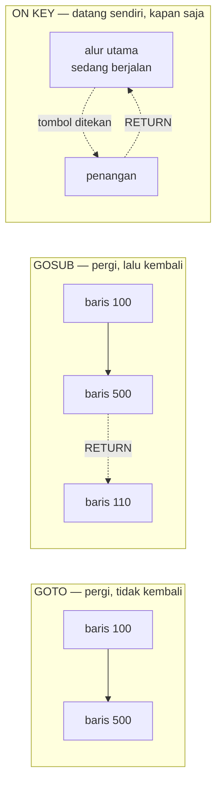
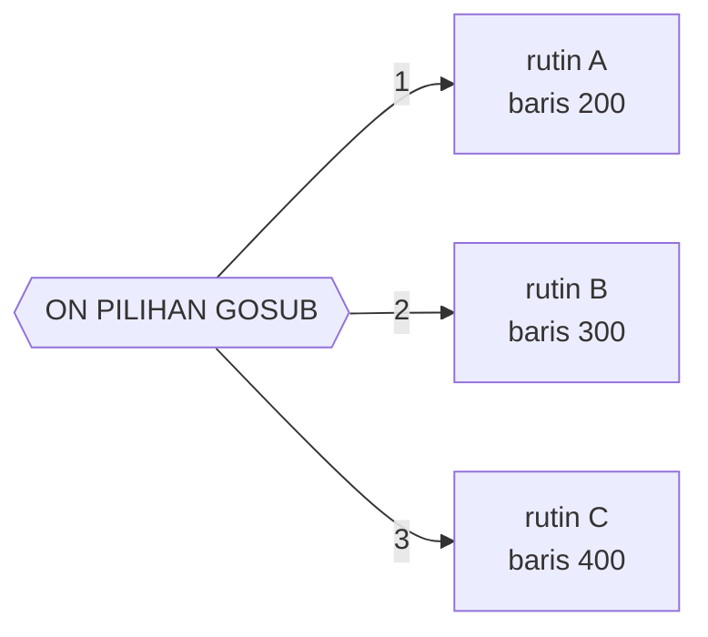
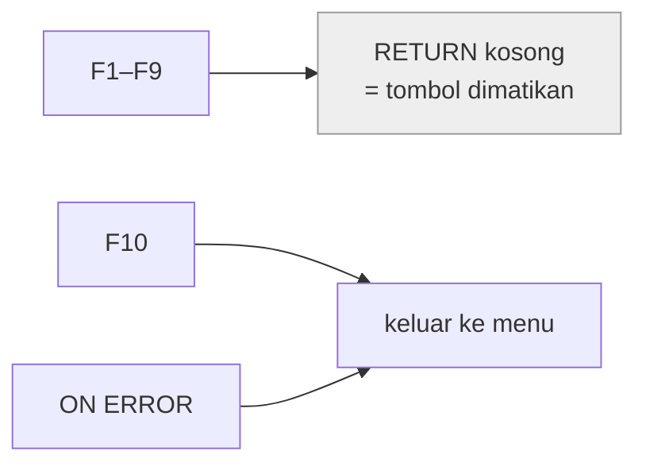
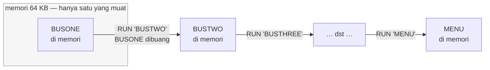

# Dasar-dasar GW-BASIC untuk membaca koleksi ini

Berkas ini menjelaskan sekali saja hal-hal yang berulang di hampir semua program,
supaya tiap review tidak perlu mengulanginya. Kalau Anda belum pernah menyentuh
BASIC era 1980-an, baca ini dulu.

## Kenapa arsitektur program-program ini menarik

GW-BASIC **tidak punya** fungsi bernama, parameter, nilai kembalian, variabel
lokal, `switch`, tipe bentukan, maupun modul. Yang ada cuma nomor baris, `GOTO`,
`GOSUB`, dan variabel global.

Meskipun begitu, program-program di koleksi ini tetap membangun tabel dispatch,
pemrograman berbasis kejadian, pemuatan modul dinamis, double buffering,
polimorfisme, dan pemisahan data dari mesin.

Itulah yang membuatnya berharga untuk dipelajari: **Anda bisa melihat pola-pola
arsitektur dalam bentuk telanjang**, tanpa dibungkus sintaks yang menyembunyikan
mekanismenya. Ketika Anda memahami kenapa `ON CARD+1 GOSUB 100,200,300,…` adalah
polimorfisme, `card.draw()` di bahasa berobjek jadi jauh lebih jelas.

Peta pola-pola itu dan program mana yang menunjukkannya ada di
[README.md](README.md).

---

## 1. Kenapa ada nomor di setiap baris?

```basic
10 PRINT "HALO"
20 GOTO 10
```

Di BASIC lama, **nomor baris adalah alamat**. Tidak ada nama fungsi, tidak ada
label. Kalau Anda ingin melompat ke suatu tempat, Anda menyebut nomornya.

Nomor juga berfungsi sebagai *editor*: mengetik `15 PRINT "SISIP"` akan
menyisipkan baris baru di antara 10 dan 20. Itulah sebabnya semua orang menomori
dengan kelipatan 10 — supaya masih ada ruang menyisipkan nanti. Kalau ruangnya
habis, ada perintah `RENUM` untuk menomori ulang seluruh program.

Konsekuensi yang penting: **memindahkan kode itu mahal**. Menyisipkan satu blok
di tengah bisa berarti menomori ulang dan memperbaiki semua `GOTO` yang menunjuk
ke sana. Ini menjelaskan banyak keanehan struktur yang Anda lihat di koleksi ini.

Di koleksi ini Anda akan melihat program yang mulai dari nomor ganjil, misalnya
`BACKGAM.BAS` yang mulai di baris 2430 dan `BATSHIP.BAS` di 1000. Itu jejak
bahwa program tersebut dulu bagian dari sesuatu yang lebih besar, atau sengaja
diberi ruang kosong di depan.

---

## 2. `GOTO`, `GOSUB`, dan tidak adanya fungsi

```basic
100 GOSUB 500        ' panggil "subrutin" di baris 500
110 PRINT "kembali"
120 END
500 PRINT "di dalam subrutin"
510 RETURN           ' kembali ke baris setelah GOSUB
```

`GOSUB` adalah satu-satunya bentuk pemanggilan yang ada. Perbedaannya dengan
fungsi di bahasa modern sangat besar:

- **Tidak ada parameter.** Anda mengoper nilai lewat variabel global.
- **Tidak ada nilai kembalian.** Hasilnya juga ditaruh di variabel global.
- **Tidak ada variabel lokal.** Semua variabel di seluruh program itu satu ruang
  nama. Kalau subrutin memakai `I` sebagai pencacah dan pemanggilnya juga sedang
  memakai `I`, program rusak — dan tidak ada peringatan apa pun.

Itulah sebabnya program BASIC lama sering punya konvensi tak tertulis semacam
"variabel `I` sampai `N` hanya untuk pencacah lokal, `A` sampai `H` untuk data".
Kalau Anda melihat sebuah program mematuhi konvensi begitu dengan disiplin,
itu tanda penulisnya berpengalaman.

Bandingkan tiga bentuk alur yang tersedia:



Perbedaan ketiganya menentukan bentuk seluruh program. `GOTO` membuat alur yang
tidak bisa dilacak balik; `GOSUB` membuat lapisan; `ON KEY` membuat kejadian.

**Varian berindeks:**

```basic
150 ON PILIHAN GOTO 200,300,400      ' PILIHAN=1 lompat 200, =2 lompat 300, dst.
160 ON PILIHAN GOSUB 200,300,400
```

Ini pengganti `switch`/`case`, dan di koleksi ini ia adalah **struktur
arsitektural paling penting**. Bentuknya:



Kalau `PILIHAN` di luar 1..3, **tidak terjadi apa-apa** dan eksekusi lanjut ke
baris berikutnya — perilaku yang gampang bikin bug diam-diam.

Kenali polanya, karena ia menyamar jadi banyak hal:

| Dipakai untuk | Contoh di koleksi |
|---|---|
| menu pilihan | `WIZARD.BAS` (18 tabel) |
| mesin keadaan | `ABM2A.BAS` (fase permainan) |
| tabel penggambar | `BLACK.BAS` (14 nilai kartu), `LANDER.BAS` (13 sudut) |
| kemajuan bertahap | `HANGMAN.BAS` (bagian tubuh) |
| perilaku acak | `SUB.BAS` (`ON FIX(RND*8) GOTO`) |
| pengiriman aturan | `ELIZA.BAS` (44 kata kunci) |

Di bahasa modern, semua itu jadi `Map<kunci, fungsi>` atau `switch`. Mekanismenya
sama: **tabel penunjuk yang diindeks oleh nilai.**

---

## 3. Variabel dan tipe

Tipe ditentukan oleh **akhiran nama**, bukan deklarasi:

| Akhiran | Tipe | Contoh |
|---|---|---|
| (tanpa) | single precision, 4 byte | `SKOR` |
| `%` | integer, 2 byte, −32768..32767 | `SKOR%` |
| `!` | single precision (eksplisit) | `SKOR!` |
| `#` | double precision, 8 byte | `SKOR#` |
| `$` | teks | `NAMA$` |

Ada juga deklarasi massal berdasarkan huruf awal:

```basic
20 DEFINT A-Z          ' semua variabel jadi integer kecuali diberi akhiran
30 DEFSTR Z            ' semua variabel berawalan Z jadi teks
40 DEFDBL B,J,M-Y      ' rentang huruf tertentu jadi double
```

`DEFINT A-Z` di awal program adalah **trik kecepatan**, bukan gaya. Aritmetika
integer jauh lebih cepat daripada floating point di 8088 yang tidak punya
koprosesor. Anda akan melihatnya di program yang butuh kecepatan seperti
`CRAZY8.BAS` dan `BACKGAM.BAS`.

`DEFSTR Z` dipakai supaya bisa menulis `Z = INKEY$` alih-alih `Z$ = INKEY$` —
menghemat satu karakter di ratusan tempat. Ini kebiasaan Friendlyware.

**Angka pecahan** disimpan dalam *Microsoft Binary Format*, bukan IEEE 754 yang
kita kenal sekarang. Presisinya mirip, tapi bit-nya tersusun berbeda. Ini
mendahului standar IEEE.

---

## 4. Array

```basic
50 DIM PAPAN(8,8), NAMA$(4)
```

Indeks mulai dari **0**, jadi `DIM NAMA$(4)` sebenarnya menyediakan lima slot:
0, 1, 2, 3, 4. Banyak program di koleksi ini menyia-nyiakan slot 0, dan sebagian
lain sengaja memakainya. Perhatikan `DIM NA$(3)` di `BOWLING.BAS` yang menampung
4 pemain — penulisnya sadar betul soal ini.

Array tidak bisa di-`DIM` dua kali. Kalau program perlu mengubah ukurannya,
harus `ERASE` dulu.

---

## 5. Membaca papan ketik: `INKEY$`

```basic
180 A$=INKEY$: IF A$="" THEN 180
```

Baris ini adalah **idiom paling sering muncul di seluruh koleksi**. Artinya:
"ambil satu tombol; kalau belum ada yang ditekan, ulangi terus". Ini *polling*
— program berputar sekencang-kencangnya sampai ada tombol.

Bandingkan dengan `INPUT` yang menunggu Enter dan menampilkan tanda `?`.
`INKEY$` tidak menunggu dan tidak menampilkan apa-apa, jadi itulah yang dipakai
untuk permainan.

**Tombol khusus** (panah, F1–F10) menghasilkan **dua** karakter: `CHR$(0)` lalu
kode pemindai. Karena itu Anda sering melihat:

```basic
250 Z=INKEY$: Z1=MID$(Z,2,1)
260 IF Z1=CHR$(72) THEN ...      ' panah atas
270 IF Z1=CHR$(80) THEN ...      ' panah bawah
```

### Idiom `POKE 106,0`

```basic
40 POKE 106,0
50 IF INKEY$<>"" THEN 40
60 RESP$=INKEY$: IF RESP$="" THEN 60
```

Blok ini muncul **persis sama** di semua program Friendlyware. Fungsinya
membuang tombol-tombol yang sudah menumpuk di penyangga sebelum menunggu tombol
baru, supaya pemain yang tak sabar menekan-nekan tombol tidak melewati layar
berikutnya tanpa membacanya.

`POKE 106,0` menulis langsung ke ruang kerja interpreter BASIC — alamat 106
menyimpan cacah karakter di penyangga ketik-dulu. Ini **tidak terdokumentasi**
dan hanya jalan di GW-BASIC/BASICA. Sebuah *hack* yang menyebar dari program ke
program karena berhasil, bukan karena benar.

---

## 6. Jebakan tombol: `ON KEY(n) GOSUB`

```basic
20 FOR A=1 TO 9: ON KEY(A) GOSUB 70: KEY(A) ON: NEXT
30 ON KEY(10) GOSUB 1290
70 RETURN
```

Ini **interupsi**, bukan pemeriksaan biasa. Setelah dinyalakan, menekan F1–F10
kapan pun akan menyela apa pun yang sedang berjalan dan melompat ke subrutin
yang ditunjuk.

Perhatikan pola aneh di atas: F1–F9 dijebak, tapi subrutinnya (`70 RETURN`) tidak
melakukan apa-apa. Kenapa? Karena efek sampingnya yang diinginkan — menjebak
tombol membuat tombol itu **tidak masuk ke penyangga biasa**, jadi F1–F9 jadi
mati total dan tidak mengacaukan permainan. F10 dipakai sungguhan, untuk keluar
ke menu. Ini cara Friendlyware "menonaktifkan" tombol yang tidak diinginkan —
padanan langsung dari `event.preventDefault()` sekarang.

Peta kejadian sebuah program adalah **antarmukanya**. Membaca daftar `ON KEY`
lebih cepat daripada menjalankan programnya:



Nomor tombol yang perlu diingat: **`KEY(11)`–`KEY(14)` adalah tombol panah**
(atas, kiri, kanan, bawah). `PEGLEAP.BAS`, `XWING.BAS`, dan `ZAP'EM.BAS`
memakainya untuk menggerakkan kursor lewat interupsi, bukan lewat `INKEY$` di
dalam loop. Bedanya arsitektural: dengan `ON KEY`, loop utama tidak perlu
mengurus input sama sekali.

---

## 7. Layar dan warna

```basic
10 SCREEN 0,0,0      ' mode teks
20 WIDTH 80          ' 80 kolom
30 CLS
40 COLOR 15,0        ' teks putih terang di latar hitam
50 LOCATE 12,30      ' baris 12, kolom 30
60 PRINT "TENGAH"
```

| Mode | Ukuran | Keterangan |
|---|---|---|
| `SCREEN 0` | 40 atau 80 kolom teks | 16 warna teks |
| `SCREEN 1` | 320×200 piksel | 4 warna |
| `SCREEN 2` | 640×200 piksel | 2 warna |

Koleksi ini **hanya memakai ketiga mode itu** — semuanya CGA. Tidak ada satu pun
yang butuh EGA atau VGA.

`LOCATE` punya argumen ketiga yang sering dipakai: `LOCATE 5,10,0` mematikan
kursor yang berkedip. Anda akan melihat `,0` bertebaran di program-program ini.

**Menggambar dengan karakter.** Karena mode grafis lambat dan boros memori,
kebanyakan program menggambar bingkai memakai karakter kotak CP437:

```basic
130 LOCATE 1,1: PRINT STRING$(80,219)      ' 219 = blok penuh █
500 LA = "╔" + STRING$(10,"═") + "╦" + STRING$(22,"═") + "╗"
```

`STRING$(n, kode)` menghasilkan satu karakter diulang n kali. Ini jauh lebih
cepat daripada menggambar garis piksel demi piksel.

---

## 8. Suara

```basic
20 PLAY "o2 t200 l8 d g a b >c d4"     ' bahasa makro not
30 SOUND 440, 18.2                      ' frekuensi 440 Hz selama 1 detik
```

`PLAY` memakai bahasa mini: `o` oktaf, `t` tempo, `l` panjang not, `>` naik
oktaf, `<` turun, `p` istirahat, `ml`/`mn`/`ms` gaya artikulasi.
Lihat `GERMFOLK.BAS` untuk contoh terbersih.

`SOUND` lebih mentah: frekuensi dalam Hz dan durasi dalam satuan 1/18,2 detik
(karena pencacah waktu PC berdetak 18,2 kali per detik).

Keduanya keluar lewat **speaker PC internal** — satu suara saja, gelombang kotak.

---

## 9. Sprite: `GET` dan `PUT`

```basic
40 DIM BOLA(14)
...
    GET (x1,y1)-(x2,y2), BOLA        ' salin sepotong layar ke array
    PUT (x,y), BOLA, XOR             ' tempelkan lagi di tempat lain
```

`PUT` dengan mode `XOR` punya sifat ajaib: **menempelkan gambar yang sama dua
kali akan mengembalikan layar seperti semula**. Jadi cara menggerakkan objek
adalah: gambar di posisi lama (menghapusnya), lalu gambar di posisi baru. Tidak
perlu menyimpan latar belakang. `BREAKOUT.BAS` memakai teknik ini dan hasilnya
mulus tanpa kedip.

---

## 10. Memuat program lain: `RUN` vs `CHAIN`

```basic
90 RUN "BUSSIX"          ' muat & jalankan program lain, SEMUA variabel hilang
90 CHAIN "BUSSIX"        ' muat & jalankan, variabel COMMON ikut terbawa
95 COMMON SKOR, NAMA$    ' daftar variabel yang ikut menyeberang
```

Ini disebut *overlay* — cara menjalankan program yang totalnya jauh lebih besar
daripada memori yang tersedia.



Rangkaian `BUSONE` → `BUSTWO` → … → `BUSTEN` di koleksi ini adalah contoh yang
sangat jelas. Hanya satu yang pernah ada di memori pada satu waktu.

Dalam istilah sekarang, ini setara dengan *code splitting* dan *lazy loading*.
Masalahnya persis sama juga: keadaan program harus dititipkan lewat sesuatu di
luar kode (di sini `COMMON`, di web sekarang mungkin `sessionStorage`).

Ada varian ketiga yang lebih jarang: `CHAIN MERGE` **menggabungkan** program lain
ke dalam yang sedang berjalan, alih-alih menggantinya. `READING.BAS` memakainya
untuk menyuntikkan daftar kata dari `WORDS.BAS` saat berjalan — pemuatan modul
dinamis, tahun 1982.

---

## 11. `DATA`, `READ`, `RESTORE`

```basic
100 READ NAMA$, HARGA
110 DATA "Pedang", 1500
120 RESTORE 110          ' putar balik penunjuk DATA
```

Ini cara menaruh tabel data di dalam kode. Penunjuknya global dan bergerak maju
terus; `RESTORE` mengembalikannya. Kalau `READ` dipanggil melebihi jumlah `DATA`,
program mati dengan galat `Out of DATA`.

---

## 12. Penanganan galat

```basic
20 ON ERROR GOTO 750
...
750 IF ERR=53 THEN RESUME 800      ' 53 = File not found
760 ON ERROR GOTO 0                ' matikan penangkap, biarkan program mati
```

`ERR` berisi nomor galat, `ERL` berisi nomor baris tempat galat terjadi.
`RESUME` melanjutkan; `RESUME NEXT` melanjutkan ke baris berikutnya.

Perhatikan `15PUZZLE.BAS` yang memakai ini dengan cerdik: ia menjalankan `PLAY "mf"`
di dalam pelindung galat, semata-mata untuk **mendeteksi** apakah interpreternya
BASICA atau bukan — kalau perintah itu gagal dengan galat 73 (Advanced feature),
berarti bukan BASICA.

---

## 13. Ringkasan idiom yang akan sering Anda lihat

| Potongan | Artinya |
|---|---|
| `A$=INKEY$:IF A$="" THEN <baris ini>` | tunggu satu tombol |
| `FOR I=1 TO 2000:NEXT` | jeda; lamanya tergantung kecepatan CPU |
| `DEF SEG=0:POKE 1047,0` | matikan status Caps/Num Lock lewat BIOS |
| `DEF SEG:POKE 106,0` | buang tombol yang menumpuk |
| `RANDOMIZE VAL(RIGHT$(TIME$,2))` | semai pengacak dengan detik jam |
| `LOCATE r,c,0` | pindah kursor, sekaligus sembunyikan kursor |
| `PRINT USING "$$#,###.##"; N` | cetak angka berformat mata uang |
| `X = (A>B)` | menghasilkan −1 kalau benar, 0 kalau salah |

Yang terakhir itu perlu diperhatikan: di BASIC, **benar bernilai −1**, bukan 1.
Jadi `SKOR = SKOR - (NYAWA>0)` sebenarnya menambah 1 kalau nyawa masih ada.
Trik ini dipakai untuk menghindari `IF`, dan Anda akan menemukannya di
`BJ.BAS` (`DEF FNA(Q)=Q+11*(Q>=22)`).

---

## 14. Kecepatan sebagai satuan waktu

Tidak ada `SLEEP` di GW-BASIC. Cara menunda adalah menghitung:

```basic
250 FOR I=1 TO 2000: NEXT
```

Berapa lama itu? **Tergantung kecepatan komputernya.** Di IBM PC 4,77 MHz mungkin
setengah detik; di 486 mungkin sekejap saja. Inilah alasan game-game ini jadi
tak bisa dimainkan di komputer yang lebih baru, dan alasan lahirnya utilitas
seperti `SLOWDOWN.COM` dan `GOSLOW.COM` yang ada di `..\tools\`.

Ini pelajaran yang masih relevan: **jangan pernah mengukur waktu dengan
menghitung pekerjaan.** Ukur waktu dengan jam.

---

Kembali ke [daftar review](README.md) · [katalog koleksi](../README.md)
