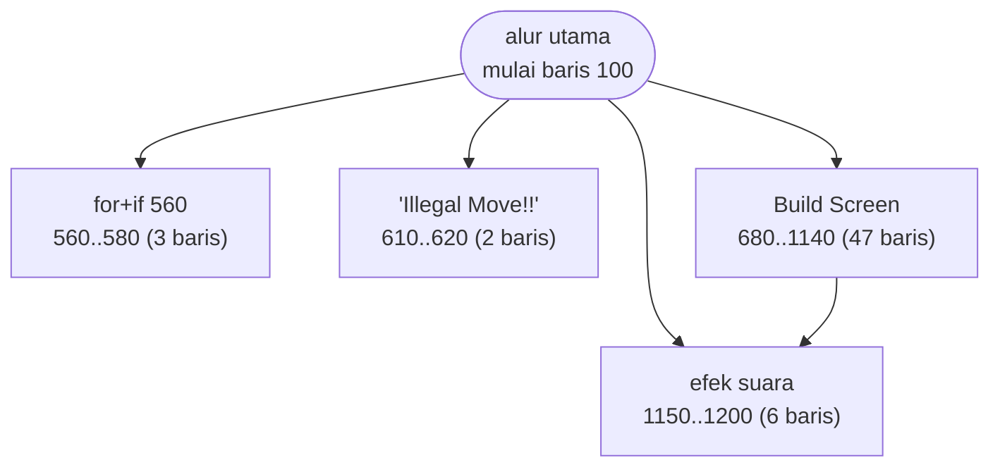
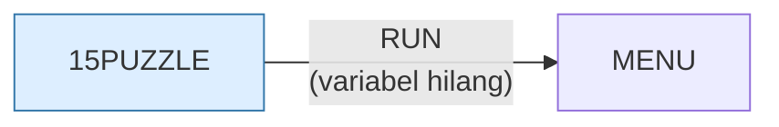

# 15PUZZLE.BAS — The 15 Puzzle

> Dale Dewey, Victor NY. Memeriksa keberadaan BASICA dan kartu Color/Graphics sebelum mulai.

| | |
|---|---|
| Sumber | Public domain / listing majalah lain-lain |
| Tahun | 1982 |
| Panjang | 117 baris (nomor 100–1200) |
| Subrutin | 4, dipanggil dari 6 tempat |
| Percabangan | 13 `GOTO`, 6 `GOSUB`, 4 target `ON…` |
| Komentar | 9% dari baris |
| Jalankan | `run\15PUZZLE.bat` |

## Peta arsitektur

*Diagram di bawah ini bukan tafsiran — semuanya diturunkan langsung dari
kode: tiap panah adalah `GOSUB` yang benar-benar ada, tiap kotak adalah
blok antara sebuah entri dan `RETURN`-nya.*



Kotak bersudut miring berwarna = **penangan kejadian** (`ON KEY`/`ON ERROR`), yang dipanggil oleh interupsi, bukan oleh alur utama.

### Subrutin dan perannya

| Baris | Panjang | Dipanggil | Peran (diambil dari kode) |
|---|--:|--:|---|
| `1150`–`1200` | 6 baris | 3× | efek suara |
| `560`–`580` | 3 baris | 1× | for+if @560 |
| `610`–`620` | 2 baris | 1× | "Illegal Move!!" |
| `680`–`1140` | 47 baris | 1× | Build Screen |

### Program lain yang dimuat



### Kejadian yang dijebak

- `ON ERROR` → baris 0, 130, 670

### Perulangan utama

`GOTO` mundur terpanjang: dari baris **430** kembali ke **350** — melingkupi 80 nomor baris.
Itulah loop utama program ini; segala sesuatu di dalam rentang tersebut
dijalankan berulang.

### Data yang dipegang

| Array | Dipakai | Ditulis di baris |
|---|--:|---|
| `S` | 10× | 1090, 1100 |
| `ST` | 6× | 1000, 1030 |

## Bagaimana program ini disusun

Bentuknya **kerucut**: alur utama panjang, empat subrutin kecil di ujung. Hanya
satu subrutin memanggil subrutin lain. Untuk program 117 baris ini pilihan yang
benar — memecah lebih jauh justru menambah lompatan tanpa menambah kejelasan.

Yang layak ditiru adalah **urutan tiga fase** di alur utamanya: (1) periksa
lingkungan, (2) bangun keadaan awal, (3) masuk loop permainan. Fase pertama
memakai `ON ERROR` sebagai alat uji, bukan sebagai jaring pengaman:

```basic
110 ON ERROR GOTO 130
120 PLAY "mf": ON ERROR GOTO 0: GOTO 200
130 IF ERR<>73 THEN RESUME 200
```

Program mencoba sebuah perintah dan melihat apakah meledak. Kalau galatnya 73
("Advanced feature"), berarti interpreternya bukan BASICA. Perhatikan baris 120
mematikan penangkap (`ON ERROR GOTO 0`) begitu ujinya selesai — jadi galat
sungguhan sesudah itu tetap terlihat. **Membuka penangkap sesempit mungkin,
lalu menutupnya lagi** adalah disiplin yang masih benar sampai sekarang.

Loop permainannya melingkupi baris 350–430: baca tombol, validasi, `SWAP` dua
ubin, gambar ulang, ulangi.

## Yang menarik dari kodenya

Program kecil yang dibuka dengan trik yang jauh lebih pintar daripada isinya.
Baris 110–130 menjalankan `PLAY "mf"` di dalam `ON ERROR`, bukan untuk
membunyikan apa pun, melainkan untuk **menanyai interpreternya sendiri**: kalau
perintah itu meledak dengan galat 73 ("Advanced feature"), berarti yang dipakai
bukan BASICA. Program lalu memeriksa kartu grafis dengan cara serupa. Baru
sesudah itu permainan dimulai.

Ini pola *feature detection* — mencoba sesuatu dan melihat apakah berhasil,
bukan menebak dari nama atau versi. Persis prinsip yang dipakai di JavaScript
modern (`if ('IntersectionObserver' in window)`) empat puluh tahun kemudian.

Papan disimpan di `S(5,5)`, bukan `S(4,4)`. Baris dan kolom nol dan kelima
sengaja dibiarkan kosong sebagai *sentinel* — jadi kode pemeriksa tetangga tidak
perlu memeriksa apakah dia sedang di pinggir papan. Menukar dua ubin cukup
dengan satu `SWAP`.

## Yang bisa dipelajari

- Deteksi kemampuan dengan mencobanya, bukan dengan menebak versi.
- Beri array satu baris/kolom pembatas ekstra agar kode tepi jadi sederhana. Ongkosnya beberapa byte, hematnya belasan `IF`.
- `SWAP A,B` menyatakan maksud 'tukar' dengan jelas, lebih baik daripada tiga baris dengan variabel sementara.

## Yang jangan ditiru

- `ON ERROR GOTO` dipakai sebagai alat kendali alur biasa. Di sini kebetulan pas, tapi menjadikan galat sebagai jalur normal membuat galat sungguhan jadi tak terlihat.

## Coba sendiri

Ubah `S(5,5)` jadi `S(4,4)` dan sesuaikan kodenya. Anda akan langsung merasakan
berapa banyak pemeriksaan tepi yang tadinya tidak perlu ditulis.

## Lampiran

### Perkakas bahasa yang dipakai

`PLAY` — musik lewat bahasa makro not, `SOUND` — nada mentah (frekuensi, durasi), `LINE` — menggambar garis & kotak, `CIRCLE`, `PAINT` — mengisi area tertutup, mode grafis CGA (`SCREEN 1`/`2`), `PEEK` — baca memori langsung, `POKE` — tulis memori langsung, `DEF SEG` — pindah segmen memori, `ON ERROR GOTO` — penanganan galat, `ON x GOTO` — percabangan berindeks, `INKEY$` — baca tombol tanpa menunggu Enter, `RUN "nama"` — muat program lain, variabel hilang, `WHILE`/`WEND` — perulangan berkondisi, `RANDOMIZE` — menyemai pengacak, `SWAP` — tukar isi dua variabel, `DEFINT` — variabel default bilangan bulat, `LOCATE` — posisikan kursor, `COLOR` — warna teks

### Deklarasi array

```basic
DIM ST(16), S(5,5)
```

### Sepuluh baris pembuka

```basic
100 REM                 The 15 Puzzle
101 REM                         by Dale Dewey
102 REM                            7284 High View Trail
103 REM                            Victor, New York  14564
104 REM                 Copyright, 1982
105 REM
110 ON ERROR GOTO 130
120 PLAY "mf": ON ERROR GOTO 0: GOTO 200
130 IF ERR<>73 THEN RESUME 200
140 WIDTH 80:CLS:LOCATE 3,1
```

### Baris terpanjang (103 kolom)

```basic
610 LOCATE 24,13: PRINT "Illegal Move!!";: FOR I=1 TO 2000: NEXT: LOCATE 24,13: PRINT "              ";
```

---
[Dasar-dasar BASIC](00-DASAR-BASIC.md) · [Daftar review](README.md) · [Katalog koleksi](../README.md)
