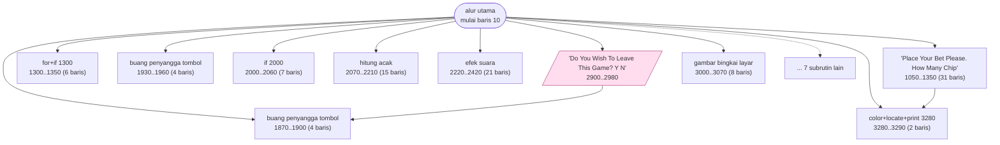
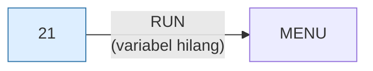

# 21.BAS — Blackjack

> Menu #1 pilihan D. Mendukung split dan double down.

| | |
|---|---|
| Sumber | Friendlyware PC Introductory Set |
| Tahun | 1982 |
| Panjang | 336 baris (nomor 10–3360) |
| Subrutin | 17, dipanggil dari 48 tempat |
| Percabangan | 39 `GOTO`, 48 `GOSUB`, 2 target `ON…` |
| Komentar | 2% dari baris |
| Jalankan | `run\21.bat` |

## Peta arsitektur

*Diagram di bawah ini bukan tafsiran — semuanya diturunkan langsung dari
kode: tiap panah adalah `GOSUB` yang benar-benar ada, tiap kotak adalah
blok antara sebuah entri dan `RETURN`-nya.*



Kotak bersudut miring berwarna = **penangan kejadian** (`ON KEY`/`ON ERROR`), yang dipanggil oleh interupsi, bukan oleh alur utama.

### Subrutin dan perannya

| Baris | Panjang | Dipanggil | Peran (diambil dari kode) |
|---|--:|--:|---|
| `2220`–`2420` | 21 baris | 13× | efek suara |
| `3280`–`3290` | 2 baris | 8× | color+locate+print @3280 |
| `1300`–`1350` | 6 baris | 6× | for+if @1300 |
| `1930`–`1960` | 4 baris | 4× | buang penyangga tombol |
| `1870`–`1900` | 4 baris | 3× | buang penyangga tombol |
| `2000`–`2060` | 7 baris | 2× | if @2000 |
| `2070`–`2210` | 15 baris | 2× | hitung acak |
| `30`–`30` | 1 baris | 1× | blok @30 |
| `1050`–`1350` | 31 baris | 1× | "Place Your Bet Please. How Many Chip" |
| `1420`–`1450` | 4 baris | 1× | if+locate+print @1420 |
| `2430`–`2460` | 4 baris | 1× | muat tabel DATA |
| `2620`–`2680` | 7 baris | 1× | color+if+for @2620 |
| `2690`–`2690` | 1 baris | 1× | gambar bingkai layar |
| `2900`–`2980` | 9 baris | 1× | "Do You Wish To Leave This Game? <Y/N" *(handler)* |

*(3 subrutin lain tidak ditampilkan)*

### Program lain yang dimuat



### Kejadian yang dijebak

- `ON KEY(10)` → baris 2900

### Perulangan utama

`GOTO` mundur terpanjang: dari baris **3330** kembali ke **70** — melingkupi 3260 nomor baris.
Itulah loop utama program ini; segala sesuatu di dalam rentang tersebut
dijalankan berulang.

### Data yang dipegang

| Array | Dipakai | Ditulis di baris |
|---|--:|---|
| `DK` | 20× | 2160 |
| `LIN$` | 7× | — |
| `CDSU` | 5× | 2160 |

## Bagaimana program ini disusun

Bentuknya **bintang**: 17 subrutin, tapi hanya 2 panah antar-subrutin. Nyaris
semuanya dipanggil langsung oleh alur utama, dan hampir tidak ada yang memanggil
tetangganya.

Topologi ini punya nama sekarang: *flat orchestration*. Ada satu "sutradara"
(alur utama) yang tahu seluruh urutan, dan sekumpulan "pekerja" yang tidak tahu
apa-apa tentang satu sama lain. Kelebihannya nyata — Anda bisa membaca alur utama
saja dan paham keseluruhan permainan tanpa membuka satu pun subrutin.

Kelemahannya juga nyata: sutradaranya jadi tahu terlalu banyak. Baris 60–90 saja
sudah memanggil enam subrutin berturut-turut, dan urutan itu tidak boleh salah.

Perhatikan tiga subrutin `buang penyangga tombol` yang hampir kembar
(1870, 1930, dan bagian dari 2220). Program ini memecah pekerjaan yang sama jadi
tiga salinan karena tiap tempat butuh sedikit variasi — gejala klasik ketika
bahasa tidak punya parameter. Dengan `DEF FN` atau satu variabel penanda,
ketiganya bisa jadi satu.

## Yang menarik dari kodenya

Blackjack Friendlyware. Yang menarik bukan permainannya, tapi cara kartu
disimpan: `DK(52)` untuk dek, `CDSU(52)` untuk suit, dan `LIN$(5,13)` untuk
gambar kartu. Jadi satu kartu direpresentasikan oleh **indeks** yang menunjuk
ke tiga tabel paralel sekaligus.

Ini disebut *parallel arrays*, dan pada zamannya wajar karena BASIC tidak punya
`struct` maupun record. Kelemahannya jelas: kalau satu tabel diurutkan atau
digeser tanpa yang lain, semuanya rusak diam-diam. Bahasa modern menyelesaikan
ini dengan satu array berisi objek.

Perhatikan `M$="$$#,###.##"` di baris 70. Itu templat `PRINT USING` untuk uang —
tanda `$$` berarti simbol dolar yang menempel di angka. Ada pemformat mata uang
bawaan di BASIC 1982, sesuatu yang sering dikira baru ada di bahasa modern.

## Yang bisa dipelajari

- `PRINT USING` sudah menyediakan pemformatan angka dan mata uang — tidak perlu merakit teks sendiri.
- Tabel paralel adalah cara BASIC meniru record. Kenali polanya, karena akan muncul di hampir semua permainan kartu di koleksi ini.

## Yang jangan ditiru

- Tabel paralel tanpa satu pun komentar yang menjelaskan bahwa ketiganya harus selalu bergerak bersama. Ini undangan bagi bug.
- Baris sepanjang 161 kolom (lihat baris 1000) yang menggabung sepuluh perintah. Nyaris mustahil ditelusuri saat mencari bug.

## Lampiran

### Perkakas bahasa yang dipakai

`PLAY` — musik lewat bahasa makro not, `SOUND` — nada mentah (frekuensi, durasi), `POKE` — tulis memori langsung, `DEF SEG` — pindah segmen memori, `ON KEY(n) GOSUB` — jebakan tombol fungsi, `ON x GOSUB` — pemanggilan berindeks, `INKEY$` — baca tombol tanpa menunggu Enter, `RUN "nama"` — muat program lain, variabel hilang, `WHILE`/`WEND` — perulangan berkondisi, `RANDOMIZE` — menyemai pengacak, `SWAP` — tukar isi dua variabel, `DEFSTR` — variabel default teks, `STRING$` — ulang satu karakter n kali, `LOCATE` — posisikan kursor, `COLOR` — warna teks

### Deklarasi array

```basic
DIM DK(52),CDSU(52),LIN$(5,13)
DIM DK(52)
```

### Sepuluh baris pembuka

```basic
10 SCREEN 0,0,0:KEY OFF:WIDTH 80:LOCATE ,,0
20 FOR A=1 TO 9:ON KEY(A) GOSUB 30: KEY(A) ON:NEXT:GOTO 40
30 RETURN
40 ON KEY(10) GOSUB 2900
50 DEFSTR Z:DIM DK(52),CDSU(52),LIN$(5,13)
60 XX=1:YY=1:GOSUB 2430:GOSUB 3000
70 GOSUB 2070:M$="$$#,###.##":CSH=2000
80 IF CSH<=0 AND PS<>1 THEN 3300
90 IF CSH>10000 THEN 3340
100 GOSUB 2690:GOSUB 3260:GOSUB 2940:TS=0:HOLD=0:GOSUB 2620
```

### Baris terpanjang (161 kolom)

```basic
1000 IF INKEY$="" THEN 1000 ELSE LOCATE 6,69:COLOR 15,0:PRINT USING M$;0:LOCATE 7,68:PRINT SPC(11):LOCATE 8,69:PRINT SPC(11):LOCATE 24,1:PRINT SPC(62);:COLOR 3,0
```

---
[Dasar-dasar BASIC](00-DASAR-BASIC.md) · [Daftar review](README.md) · [Katalog koleksi](../README.md)
