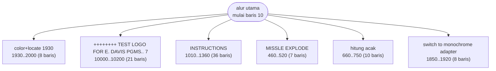
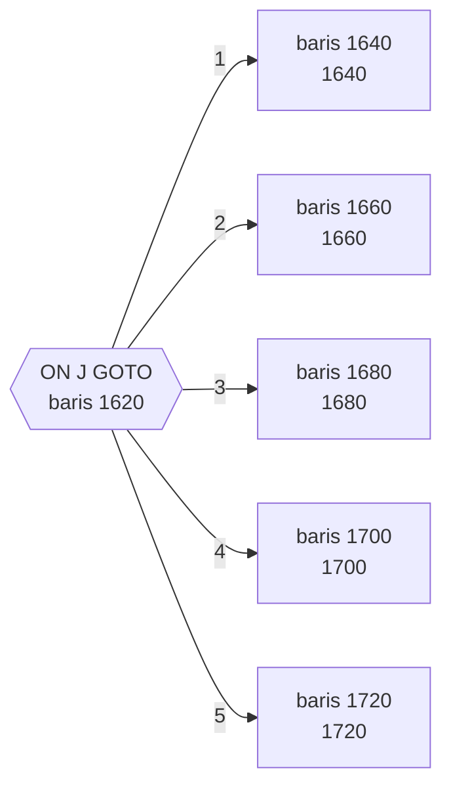

# ABM2A.BAS — ABM 2 (Anti-Ballistic Missile)

> Ed Davis, versi 18 Jul 1982. Enam tingkat kesulitan; kode joystick sudah dibuang.

| | |
|---|---|
| Sumber | Public domain / listing majalah lain-lain |
| Tahun | 1982 |
| Panjang | 231 baris (nomor 10–10270) |
| Subrutin | 6, dipanggil dari 8 tempat |
| Percabangan | 39 `GOTO`, 8 `GOSUB`, 5 target `ON…` |
| Komentar | 4% dari baris |
| Jalankan | `run\ABM2A.bat` |

## Peta arsitektur

*Diagram di bawah ini bukan tafsiran — semuanya diturunkan langsung dari
kode: tiap panah adalah `GOSUB` yang benar-benar ada, tiap kotak adalah
blok antara sebuah entri dan `RETURN`-nya.*



Kotak bersudut miring berwarna = **penangan kejadian** (`ON KEY`/`ON ERROR`), yang dipanggil oleh interupsi, bukan oleh alur utama.

### Subrutin dan perannya

| Baris | Panjang | Dipanggil | Peran (diambil dari kode) |
|---|--:|--:|---|
| `1010`–`1360` | 36 baris | 2× | INSTRUCTIONS |
| `1930`–`2000` | 8 baris | 2× | color+locate @1930 |
| `460`–`520` | 7 baris | 1× | MISSLE EXPLODE |
| `660`–`750` | 10 baris | 1× | hitung acak |
| `1850`–`1920` | 8 baris | 1× | switch to monochrome adapter |
| `10000`–`10200` | 21 baris | 1× | ++++++++ TEST LOGO FOR E. DAVIS PGMS..   7/8 |

### Tabel dispatch

Program ini punya **1** percabangan berindeks (`ON … GOTO/GOSUB`).
Yang terbesar ada di baris 1620 dengan 5 cabang:



### Perulangan utama

`GOTO` mundur terpanjang: dari baris **1730** kembali ke **110** — melingkupi 1620 nomor baris.
Itulah loop utama program ini; segala sesuatu di dalam rentang tersebut
dijalankan berulang.

### Data yang dipegang

| Array | Dipakai | Ditulis di baris |
|---|--:|---|
| `M` | 52× | 220, 250, 300, 370, 420, … |
| `T%` | 8× | 520, 870 |

## Bagaimana program ini disusun

**Nol panah antar-subrutin.** Enam subrutin, semuanya dipanggil hanya oleh alur
utama, tidak ada yang memanggil yang lain. Ini bentuk paling datar yang mungkin.

Untuk permainan aksi, itu bukan kebetulan. Loop utamanya melingkupi baris
110–1730 — 1600 nomor baris — dan di dalam loop seketat itu, tiap `GOSUB`
berbiaya nyata di prosesor 4,77 MHz. Jadi kode yang harus jalan tiap frame
ditaruh **langsung di dalam loop**, bukan dipanggil.

Ini keputusan rancangan yang sadar, dan namanya sekarang *inlining*. Bedanya:
sekarang kompiler yang melakukannya untuk Anda; di sini penulisnya melakukannya
dengan tangan, dan membayar dengan keterbacaan.

Yang tersisa sebagai subrutin justru pekerjaan yang **jarang** dijalankan: layar
instruksi (1010, 36 baris), logo (10000), ledakan misil (460), dan pemilihan
adaptor monokrom (1850). Aturan pembagiannya jelas: *sering dipanggil → tulis di
tempat; jarang dipanggil → jadikan subrutin.*

Satu-satunya percabangan berindeksnya, `ON J GOTO` di baris 1620, adalah mesin
keadaan lima arah untuk fase permainan.

## Yang menarik dari kodenya

Permainan aksi sungguhan, dan satu-satunya di koleksi ini yang memakai hampir
seluruh perkakas grafis CGA sekaligus: `DRAW`, `LINE`, `CIRCLE`, `PAINT`,
`PSET`, plus `GET`/`PUT` untuk sprite.

Baris 10 mencatat "ABM 2 WRITTEN BY ED DAVIS...THIS VERSION 7/18/82", dan di
tempat lain ada komentar "STICK COMMANDS WERE HERE" — jejak bahwa dukungan
joystick pernah ada lalu dicabut. Komentar semacam ini berharga: ia menerangkan
kenapa struktur di sekitarnya terlihat lebih rumit daripada yang dibutuhkan.

`T%(1,5)`, `M(6,15)`, dan `CH%(66)` diberi akhiran `%` di dua dari tiga array.
Itu bukan kebetulan — array integer memakai separuh memori array single dan
diakses lebih cepat. Di permainan yang harus menggambar puluhan objek per detik
di 8088, keputusan ini berarti.

Kesulitan permainan diatur lewat satu variabel `RS%` (0 = Mission-Impossible
sampai 5 = Junior) yang dibaca sekali di awal, lalu memodifikasi kecepatan
rudal. Sederhana, tapi efektif — dan lebih baik daripada menyalin seluruh loop
permainan untuk tiap tingkat kesulitan.

## Yang bisa dipelajari

- Pilih tipe data sesuai kebutuhan. `%` (integer) alih-alih single bukan sekadar gaya di mesin tanpa koprosesor.
- Satu variabel kesulitan yang menskalakan konstanta jauh lebih mudah dirawat daripada beberapa salinan loop permainan.
- Komentar yang mencatat kode yang *dihapus* sama bergunanya dengan komentar yang menjelaskan kode yang ada.

## Yang jangan ditiru

- Baris 35 sepanjang 190 kolom yang mencampur `LOCATE`, `COLOR`, dan lima `PRINT`. Layar bantuan seharusnya jadi data, bukan kode.

## Lampiran

### Perkakas bahasa yang dipakai

`PLAY` — musik lewat bahasa makro not, `SOUND` — nada mentah (frekuensi, durasi), `DRAW` — bahasa makro menggambar garis, `GET`/`PUT` — sprite disalin ke/dari array, `LINE` — menggambar garis & kotak, `CIRCLE`, `PAINT` — mengisi area tertutup, `PSET`/`PRESET` — piksel tunggal, mode grafis CGA (`SCREEN 1`/`2`), `PEEK` — baca memori langsung, `POKE` — tulis memori langsung, `DEF SEG` — pindah segmen memori, `ON x GOTO` — percabangan berindeks, `INKEY$` — baca tombol tanpa menunggu Enter, `RANDOMIZE` — menyemai pengacak, `LOCATE` — posisikan kursor, `COLOR` — warna teks

### Deklarasi array

```basic
DIM T%(1,5)
DIM M(6,15)
DIM CH%(66)
```

### Sepuluh baris pembuka

```basic
10 REM  ABM 2 WRITTEN BY ED DAVIS...THIS VERSION 7/18/82
20 GOSUB 1930:KEY OFF:ABM%=0
25 GOSUB 10000
30 CLS:SCREEN 0,1:LOCATE 3,10:PRINT"Before we begin...."
32 LOCATE 23,30:COLOR 1:PRINT"EMD 7/82";:COLOR 7
35 LOCATE 6,3:COLOR 14:PRINT"ENEMY ROCKET PERFORMANCE HANDICAP:":COLOR 7:PRINT:PRINT"  0=MISSION-IMPOSSIBLE  1=VERY FAST":PRINT:PRINT"  2=EXPERT            ";:COLOR 2:PRINT"  3=NORMAL":PRINT
36 COLOR 7:INPUT ;"  4=PRACTICE            5=JUNIOR   ";RS%
40 DIM T%(1,5):DIM M(6,15):DIM CH%(66)
50 GOSUB 1010
60 GOTO 770
```

### Baris terpanjang (190 kolom)

```basic
35 LOCATE 6,3:COLOR 14:PRINT"ENEMY ROCKET PERFORMANCE HANDICAP:":COLOR 7:PRINT:PRINT"  0=MISSION-IMPOSSIBLE  1=VERY FAST":PRINT:PRINT"  2=EXPERT            ";:COLOR 2:PRINT"  3=NORMAL":PRINT
```

---
[Dasar-dasar BASIC](00-DASAR-BASIC.md) · [Daftar review](README.md) · [Katalog koleksi](../README.md)
