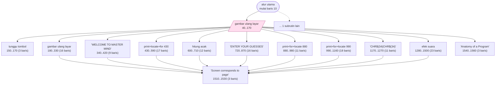
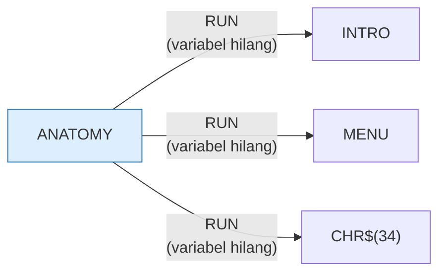

# ANATOMY.BAS — Anatomy of a Program

> Sembilan layar yang mencetak listing MASTER MIND potong demi potong, dirujuk
> ke halaman 11–15 sebuah manual cetak yang tidak ada dalam koleksi.
> F1 mundur satu halaman, F10 kembali ke menu.

> [!WARNING]
> **Koreksi manual, ditambahkan sesi 14 (port web).**
>
> Berkas ini dihasilkan otomatis, dan program ini menipu pembangkitnya lebih
> telak daripada program mana pun di koleksi. Sebabnya satu: **datanya adalah
> kode.** 115 dari 159 barisnya adalah `PRINT` yang mencetak baris BASIC milik
> program lain, dan pencari kata kunci tidak bisa membedakan `RANDOMIZE` yang
> dijalankan dari `RANDOMIZE` yang dicetak.
>
> Yang salah di bawah ini:
>
> | Klaim | Kenyataan |
> |---|---|
> | Judul *"Tutorial anatomi tubuh"* | Tebakan dari nama berkas. Judul sebenarnya dicetak baris 1540: **"Anatomy of a Program"** |
> | Memakai `PLAY` | Kata Inggris di kalimat *"DO YOU WISH TO PLAY AGAIN?"* — bukan kode |
> | Memakai `RANDOMIZE` | Baris 670, **di dalam string** — milik MASTER MIND |
> | `DIM GUESS(6)`, `DIM ANSWER(6)`, `DIM HITS$(10,6)`, `DIM MISSES$(10,6)` | Semuanya di dalam string. ANATOMY tidak punya satu larik pun |
> | Memakai `ON x GOTO` / `ON x GOSUB` berindeks | Tidak ada. Yang ada hanya `ON KEY` dan `ON ERROR` |
> | Memuat program bernama `CHR$(34)` | Dari `RUN"CHR$(34)"MENU` di dalam string — program hantu |
> | Peran subrutin: "efek suara" (1280), "hitung acak" (600) | Keduanya diambil dari isi string, bukan dari yang dikerjakan blok itu. Semua blok 180–1500 mengerjakan hal yang sama: mencetak sepotong listing |
>
> Peta arsitektur, tabel subrutin, dan hitungan percabangan di bawah **tetap
> benar** — semuanya diturunkan dari struktur `GOSUB`/`GOTO` yang nyata.
> Yang tidak bisa dipercaya adalah apa pun yang ditebak dari **isi** baris.
>
> Uraian lengkap: [`web/docs/anatomy.md`](../web/docs/anatomy.md).

| | |
|---|---|
| Sumber | Friendlyware PC Introductory Set |
| Tahun | 1982 |
| Panjang | 159 baris (nomor 10–1580) |
| Subrutin | 14, dipanggil dari 38 tempat |
| Percabangan | 12 `GOTO`, 43 `GOSUB`, 3 target `ON…` |
| Komentar | 0% dari baris |
| Jalankan | `run\ANATOMY.bat` |

## Peta arsitektur

*Diagram di bawah ini bukan tafsiran — semuanya diturunkan langsung dari
kode: tiap panah adalah `GOSUB` yang benar-benar ada, tiap kotak adalah
blok antara sebuah entri dan `RETURN`-nya.*



Kotak bersudut miring berwarna = **penangan kejadian** (`ON KEY`/`ON ERROR`), yang dipanggil oleh interupsi, bukan oleh alur utama.

### Subrutin dan perannya

| Baris | Panjang | Dipanggil | Peran (diambil dari kode) |
|---|--:|--:|---|
| `150`–`170` | 3 baris | 9× | tunggu tombol |
| `1510`–`1530` | 3 baris | 9× | "Screen corresponds to page" |
| `1540`–`1560` | 3 baris | 9× | "Anatomy of a Program" |
| `40`–`170` | 15 baris | 1× | gambar ulang layar *(handler)* |
| `180`–`330` | 16 baris | 1× | gambar ulang layar |
| `340`–`420` | 9 baris | 1× | "WELCOME TO MASTER MIND" |
| `430`–`590` | 17 baris | 1× | print+locate+for @430 |
| `600`–`710` | 12 baris | 1× | hitung acak |
| `720`–`870` | 16 baris | 1× | "ENTER YOUR GUESSES" |
| `880`–`980` | 11 baris | 1× | print+for+locate @880 |
| `990`–`1160` | 18 baris | 1× | print+for+locate @990 |
| `1170`–`1270` | 11 baris | 1× | "CHR$(34)CHR$(34)" |
| `1280`–`1500` | 23 baris | 1× | efek suara |
| `1570`–`1570` | 1 baris | 1× | blok @1570 *(handler)* |

### Program lain yang dimuat



### Kejadian yang dijebak

- `ON ERROR` → baris 41
- `ON KEY(1)` → baris 1570
- `ON KEY(10)` → baris 40

### Perulangan utama

`GOTO` mundur terpanjang: dari baris **140** kembali ke **40** — melingkupi 100 nomor baris.
Itulah loop utama program ini; segala sesuatu di dalam rentang tersebut
dijalankan berulang.

## Bagaimana program ini disusun

Ini **mesin presentasi**, dan strukturnya paling instruktif di seluruh koleksi:
14 subrutin dengan 20 panah antar-subrutin — jaringan terdalam di antara
program-program Friendlyware.

Rahasianya ada di tiga subrutin yang masing-masing dipanggil **sembilan kali**:

| Baris | Peran |
|---|---|
| 150–170 | tunggu tombol + tangani F1 (mundur) |
| 1510–1530 | tulis nomor halaman |
| 1540–1560 | gambar bingkai + judul |

Sembilan halaman, tiga rutin bersama. Sisanya — 180, 430, 720, 990, 1280 — adalah
**isi** tiap halaman. Jadi program ini memisahkan *kerangka* dari *isi* dengan
sangat bersih, dan itulah yang membuat 159 baris cukup untuk sembilan halaman
bergambar.

Bandingkan dengan komponen layout di aplikasi web sekarang: satu `<Layout>` yang
membungkus, satu `<Page>` yang mengisi. Persis pola yang sama, hanya sarananya
`GOSUB`.

Yang hilang: **tabel halaman**. Karena `GOSUB` tidak menerima nomor baris dari
variabel, urutan sembilan halaman itu ditulis sebagai sembilan baris kode yang
hampir identik (50–130). Kalau BASIC punya array fungsi, seluruh blok itu jadi
satu loop tiga baris.

## Yang menarik dari kodenya

Contoh terbaik di koleksi ini untuk melihat **bagaimana mesin presentasi
dibangun tanpa fungsi**. Baris 50–130 adalah seluruh alur programnya:

```basic
50 CLS:GOSUB 1540:GOSUB 180:GOSUB 150:IF BACKFLAG THEN 40
60 CLS:GOSUB 1540:GOSUB 340:GOSUB 150:IF BACKFLAG THEN 50
70 CLS:GOSUB 1540:GOSUB 430:GOSUB 150:IF BACKFLAG THEN 60
```

Polanya identik di setiap baris: bersihkan layar, gambar bingkai (1540), gambar
isi halaman (nomor yang berbeda-beda), tunggu tombol (150), dan kalau pemakai
menekan F1 lompat balik ke baris sebelumnya. Sembilan halaman, sembilan baris.

Yang sebenarnya sedang ditiru di sini adalah **tabel halaman**. Di bahasa modern
kita akan menulis `halaman = [180, 340, 430, ...]` lalu satu loop. Penulisnya
tidak bisa, karena `GOSUB` tidak menerima nomor baris dari variabel. Jadi tabel
itu "digulung" menjadi kode yang ditulis berulang.

`BACKFLAG` adalah variabel global yang dipakai sebagai kanal komunikasi dari
penjebak tombol F1 (baris 1570) ke alur utama. Karena `ON KEY` menyela dari
mana saja, ini satu-satunya cara menyampaikan "pemakai ingin mundur" ke tempat
yang tepat.

## Yang bisa dipelajari

- Kalau bahasanya tidak punya tabel fungsi, tabel itu tetap ada — cuma berbentuk kode berulang. Mengenalinya membuat program panjang jadi mudah dibaca.
- Bendera global adalah cara yang sah untuk menyampaikan keputusan dari penangan interupsi ke alur utama, karena penangan tidak bisa mengembalikan nilai.
- `GOSUB 1540` yang dipanggil dari sembilan tempat adalah 'komponen bingkai' yang dipakai ulang — prinsip yang sama dengan komponen UI sekarang.

## Yang jangan ditiru

- Nol persen komentar di 159 baris. Nomor-nomor seperti 180, 340, 430 tidak berarti apa-apa sampai Anda melompat ke sana satu per satu.
- `RUN "intro"` untuk keluar (baris 40) membuang seluruh keadaan program. Kalau ada yang perlu diingat, ia harus disimpan ke berkas dulu.

## Lampiran

### Perkakas bahasa yang dipakai

`PLAY` — musik lewat bahasa makro not, `POKE` — tulis memori langsung, `DEF SEG` — pindah segmen memori, `ON KEY(n) GOSUB` — jebakan tombol fungsi, `ON ERROR GOTO` — penanganan galat, `ON x GOTO` — percabangan berindeks, `ON x GOSUB` — pemanggilan berindeks, `INKEY$` — baca tombol tanpa menunggu Enter, `RUN "nama"` — muat program lain, variabel hilang, `RANDOMIZE` — menyemai pengacak, `LOCATE` — posisikan kursor, `COLOR` — warna teks

### Deklarasi array

```basic
DIM GUESS(6)
DIM ANSWER(6)
DIM HITS$(10,6)
DIM MISSES$(10,6)
```

### Sepuluh baris pembuka

```basic
10 SCREEN 0,0,0:COLOR 3,0:KEY OFF:WIDTH 80:ON KEY(10) GOSUB 40
20 ON KEY(1) GOSUB 1570:ON ERROR GOTO 41
30 KEY (10) ON:GOTO 50
40 RUN"intro
41 RUN"menu
50 CLS:GOSUB 1540:GOSUB 180:GOSUB 150:IF BACKFLAG THEN 40
60 CLS:GOSUB 1540:GOSUB 340:GOSUB 150:IF BACKFLAG THEN 50
70 CLS:GOSUB 1540:GOSUB 430:GOSUB 150:IF BACKFLAG THEN 60
80 CLS:GOSUB 1540:GOSUB 600:GOSUB 150:IF BACKFLAG THEN 70
90 CLS:GOSUB 1540:GOSUB 720:GOSUB 150:IF BACKFLAG THEN 80
```

### Baris terpanjang (250 kolom)

```basic
1120 PRINT"960          IF GUESS(X)=ANSWER(Y) AND X=Y AND HITS$(GUESS(X),X)<>"CHR$(34)"*"CHR$(34)"             THEN GUESSES=GUESSES+1:HITS=HITS+1:HITS$(GUESS(X),X)="CHR$(34)"*"CHR$(34)"             :MISSES$(GUESS(X),X)="CHR$(34)"*"CHR$(34)": GOTO 980
```

---
[Dasar-dasar BASIC](00-DASAR-BASIC.md) · [Daftar review](README.md) · [Katalog koleksi](../README.md)
