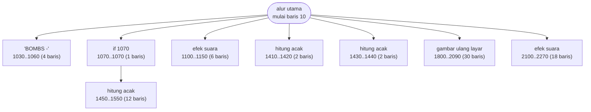

# ATTACK.BAS — Attack v1.1

> Bertanggal 7 Okt 1982, kode build MOD-5-5-M. Kerangka sama dengan SERPENT dan ZAP'EM.

| | |
|---|---|
| Sumber | Seri Attack / Serpent / Zap'em, 1982 |
| Tahun | 1982 |
| Panjang | 204 baris (nomor 10–2350) |
| Subrutin | 8, dipanggil dari 8 tempat |
| Percabangan | 17 `GOTO`, 8 `GOSUB`, 0 target `ON…` |
| Komentar | 0% dari baris |
| Jalankan | `run\ATTACK.bat` |

## Peta arsitektur

*Diagram di bawah ini bukan tafsiran — semuanya diturunkan langsung dari
kode: tiap panah adalah `GOSUB` yang benar-benar ada, tiap kotak adalah
blok antara sebuah entri dan `RETURN`-nya.*



Kotak bersudut miring berwarna = **penangan kejadian** (`ON KEY`/`ON ERROR`), yang dipanggil oleh interupsi, bukan oleh alur utama.

### Subrutin dan perannya

| Baris | Panjang | Dipanggil | Peran (diambil dari kode) |
|---|--:|--:|---|
| `1030`–`1060` | 4 baris | 1× | "BOMBS -" |
| `1070`–`1070` | 1 baris | 1× | if @1070 |
| `1100`–`1150` | 6 baris | 1× | efek suara |
| `1410`–`1420` | 2 baris | 1× | hitung acak |
| `1430`–`1440` | 2 baris | 1× | hitung acak |
| `1450`–`1550` | 12 baris | 1× | hitung acak |
| `1800`–`2090` | 30 baris | 1× | gambar ulang layar |
| `2100`–`2270` | 18 baris | 1× | efek suara |

### Perulangan utama

`GOTO` mundur terpanjang: dari baris **1799** kembali ke **540** — melingkupi 1259 nomor baris.
Itulah loop utama program ini; segala sesuatu di dalam rentang tersebut
dijalankan berulang.

### Data yang dipegang

| Array | Dipakai | Ditulis di baris |
|---|--:|---|
| `Y` | 17× | 560, 920, 1000, 1180, 1410, … |
| `X` | 16× | 560, 920, 930, 950, 1000, … |
| `R` | 7× | 890, 1180, 1410 |

## Bagaimana program ini disusun

Satu loop raksasa dari baris 540 sampai 1799 — 1259 nomor baris — dengan delapan
subrutin yang semuanya dipanggil sekali saja.

Subrutin yang dipanggil **satu kali** itu menarik. Secara teknis mereka tidak
menghemat apa pun; memindahkan 30 baris ke `GOSUB 1800` lalu memanggilnya sekali
justru menambah satu lompatan. Jadi kenapa dilakukan?

Karena **memberi nama**. Menaruh "gambar ulang layar akhir" di baris 1800–2090
mengeluarkan 30 baris itu dari tengah loop permainan, sehingga loopnya sendiri
tetap bisa dibaca. Ini *extract method* yang dipakai murni untuk keterbacaan,
bukan untuk pemakaian ulang — dan itu alasan yang sah, dulu maupun sekarang.

Struktur tiga lapis loopnya juga khas game era ini:

- 120→150 (30 baris) — loop tunggu tombol di layar judul
- 650→1020 (370 baris) — satu ronde permainan
- 540→1799 (1259 baris) — seluruh sesi

Tiga tingkat perulangan bersarang, dinyatakan seluruhnya dengan `GOTO` mundur.
Kalau Anda ingin melihat kenapa `WHILE`/`WEND` itu berharga, bandingkan ini
dengan `CRAZY8.BAS`.

## Yang menarik dari kodenya

Salah satu dari tiga bersaudara (`ATTACK`, `SERPENT`, `ZAP'EM`) yang berbagi
kerangka layar pembuka identik. Membandingkan ketiganya adalah latihan bagus
untuk melihat apa itu "kerangka aplikasi" sebelum istilah itu ada.

Baris 30–80 menggambar kotak judul dengan karakter CP437 satu per satu:

```basic
30 PRINT CHR$(213)+STRING$(21,205)+CHR$(184)     ' sudut + garis + sudut
40 PRINT CHR$(179)+"       ATTACK        "+CHR$(179)
```

Angka 213, 205, 184, 179 adalah karakter garis ganda dan tunggal. Menuliskannya
sebagai angka, bukan karakter, adalah keharusan waktu itu karena banyak editor
teks tidak bisa mengetik karakter di atas 127.

Perhatikan baris 1295 di ujung permainan: ia mengganti `COLOR N,N` sambil
`CLS` di dalam loop 15 kali, menghasilkan kilatan seluruh layar berwarna-warni
sebagai perayaan. Efek "kembang api" dengan tiga perintah. Ekonomis sekali.

Di akhir baris itu ada `DEF SEG=0:POKE 1047,0` — mematikan indikator Caps/Num
Lock lewat BIOS sebelum keluar. Detail kecil yang menunjukkan penulisnya
memikirkan keadaan mesin setelah programnya selesai.

## Yang bisa dipelajari

- Membersihkan keadaan mesin sebelum keluar (kursor, warna, lampu keyboard) adalah tanda program yang sopan. Ini padanan kuno dari 'tutup koneksi, hapus listener'.
- `STRING$` + `CHR$` adalah cara membuat bingkai yang jauh lebih hemat daripada menuliskan garisnya utuh sebagai teks.
- Efek visual mahal tidak perlu kode mahal. Lima belas kali `COLOR N,N:CLS` sudah cukup meriah.

## Yang jangan ditiru

- Nol komentar, sementara arti angka 213/205/184 sama sekali tidak jelas bagi pembaca. Satu baris `REM` menjelaskan tabel CP437 akan menolong banyak.

## Lampiran

### Perkakas bahasa yang dipakai

`PLAY` — musik lewat bahasa makro not, `SOUND` — nada mentah (frekuensi, durasi), `BEEP`, `POKE` — tulis memori langsung, `DEF SEG` — pindah segmen memori, `INKEY$` — baca tombol tanpa menunggu Enter, `RANDOMIZE` — menyemai pengacak, `STRING$` — ulang satu karakter n kali, `LOCATE` — posisikan kursor, `COLOR` — warna teks

### Deklarasi array

```basic
DIM X(4),Y(4),R(4)
```

### Sepuluh baris pembuka

```basic
10 KEY OFF:SCREEN 0,1:COLOR 15,0,0:WIDTH 40:CLS:LOCATE 5,19:PRINT "IBM"
20 LOCATE 7,8 ,0:PRINT "General  utility  programs"
30 COLOR 9 ,0:LOCATE 10,9,0:PRINT CHR$(213)+STRING$(21,205)+CHR$(184)
40 LOCATE 11,9,0:PRINT CHR$(179)+"       ATTACK        "+CHR$(179)
50 LOCATE 12,9,0:PRINT CHR$(179)+STRING$(21,32)+CHR$(179)
60 COLOR 9,0:LOCATE 13,9,0:PRINT CHR$(179)+"     Version  1.1    "+CHR$(179)
70 BEEP
80 LOCATE 14,9,0:PRINT CHR$(212)+STRING$(21,205)+CHR$(190)
90 COLOR 15,0,1:LOCATE 17,7,0:PRINT "OCTOBER 7  1982   MOD-5-5-M "
100 COLOR 9,0:LOCATE 23,6,0:PRINT "Press space bar to continue..."
```

### Baris terpanjang (208 kolom)

```basic
1295 IF SC>800 THEN FOR N=1 TO 15:COLOR N,N:CLS:SOUND N*37,7:FOR T=1 TO 115:NEXT T:NEXT N:COLOR 7,0:CLS:LOCATE 11,6:PRINT"G A M E    O V E R":PRINT:PRINT:PRINT"     GOOD JOB!!":DEF SEG=0:POKE 1047,0:GOTO 2300
```

---
[Dasar-dasar BASIC](00-DASAR-BASIC.md) · [Daftar review](README.md) · [Katalog koleksi](../README.md)
