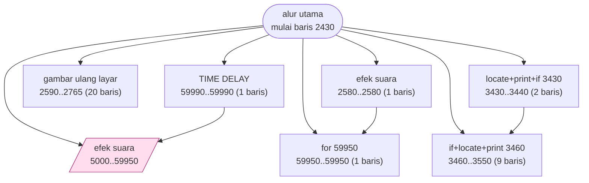
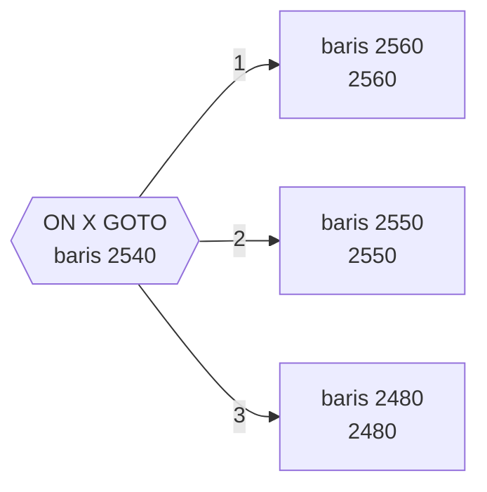

# BACKGAM.BAS — Backgammon

> Backgammon dua pemain lengkap dengan penghitungan pip.

| | |
|---|---|
| Sumber | Public domain / listing majalah lain-lain |
| Tahun | 1986 |
| Panjang | 161 baris (nomor 2430–59990) |
| Subrutin | 7, dipanggil dari 17 tempat |
| Percabangan | 35 `GOTO`, 17 `GOSUB`, 7 target `ON…` |
| Komentar | 1% dari baris |
| Jalankan | `run\BACKGAM.bat` |

## Peta arsitektur

*Diagram di bawah ini bukan tafsiran — semuanya diturunkan langsung dari
kode: tiap panah adalah `GOSUB` yang benar-benar ada, tiap kotak adalah
blok antara sebuah entri dan `RETURN`-nya.*



Kotak bersudut miring berwarna = **penangan kejadian** (`ON KEY`/`ON ERROR`), yang dipanggil oleh interupsi, bukan oleh alur utama.

### Subrutin dan perannya

| Baris | Panjang | Dipanggil | Peran (diambil dari kode) |
|---|--:|--:|---|
| `59950`–`59950` | 1 baris | 5× | for @59950 |
| `2580`–`2580` | 1 baris | 2× | efek suara |
| `2590`–`2765` | 20 baris | 2× | gambar ulang layar |
| `3430`–`3440` | 2 baris | 2× | locate+print+if @3430 |
| `3460`–`3550` | 9 baris | 2× | if+locate+print @3460 |
| `5000`–`59950` | 6 baris | 2× | efek suara *(handler)* |
| `59990`–`59990` | 1 baris | 2× | TIME DELAY |

### Tabel dispatch

Program ini punya **2** percabangan berindeks (`ON … GOTO/GOSUB`).
Yang terbesar ada di baris 2540 dengan 3 cabang:



### Kejadian yang dijebak

- `ON KEY(10)` → baris 5000

### Perulangan utama

`GOTO` mundur terpanjang: dari baris **3820** kembali ke **2440** — melingkupi 1380 nomor baris.
Itulah loop utama program ini; segala sesuatu di dalam rentang tersebut
dijalankan berulang.

### Data yang dipegang

| Array | Dipakai | Ditulis di baris |
|---|--:|---|
| `A` | 77× | 2480, 2482, 2670, 2720, 2950, … |

## Bagaimana program ini disusun

Program ini menaruh **pustaka utilitasnya di nomor baris 59950 ke atas** —
sejauh mungkin dari kode permainan yang mulai di 2430.

```basic
3070 PLAY "ae":TIMEOUT=3:GOSUB 59950: ... :TIMEOUT=6:GOSUB 59950
```

`GOSUB 59950` adalah jeda waktu, dan lamanya dititipkan lewat variabel global
`TIMEOUT` yang diisi tepat sebelum memanggil. Itu **pengoperan parameter**, dan
karena BASIC tidak punya parameter sungguhan, konvensinya harus dipegang manual:
isi dulu, baru panggil.

Pemisahan wilayah nomor baris ini adalah bentuk modularisasi paling awal yang
tersedia. Blok 2400–3900 = permainan; 5000 = penangan F10; 59950+ = utilitas.
Sekarang kita menyebutnya *namespace*, dan tujuannya sama: menjaga hal-hal yang
tidak berhubungan tetap berjauhan.

Loop terluarnya 2440←3820 (1380 baris) adalah satu pertandingan penuh; 2510←3070
di dalamnya adalah satu giliran.

Papan disimpan di satu array `A(25)` yang dibaca 77 kali — satu-satunya struktur
data penting di program ini, dan semua rutin bekerja di atasnya.

## Yang menarik dari kodenya

Program ini mulai di baris **2430**, bukan 10. Itu petunjuk pertama bahwa ia
dulunya bagian dari sesuatu yang lebih besar, atau sengaja disisakan ruang
2400 baris di depan untuk sesuatu yang tak pernah ditulis.

Seluruh papan backgammon disimpan di satu array `A(25)`. Backgammon punya 24
titik, ditambah dua slot untuk bar dan bear-off — jadi 0..25 pas. Nilai positif
berarti bidak pemain 1, negatif berarti pemain 2, nol berarti kosong. **Satu
angka bertugas menyimpan dua hal sekaligus** (siapa pemiliknya, dan berapa
banyak).

Ini pengkodean yang elegan dan masih dipakai sampai sekarang di mesin catur
maupun backgammon. Efeknya, membalik papan untuk giliran lawan cukup dengan
mengalikan −1, dan menghitung pip tidak perlu `IF` sama sekali.

`DEFINT` di awal membuat semua aritmetika papan berjalan di integer. Untuk
program yang harus mengevaluasi banyak kemungkinan langkah, ini penting.

Ada juga subrutin jeda di baris 59950 yang dipanggil dengan `TIMEOUT=3:GOSUB 59950`.
Karena `GOSUB` tidak menerima parameter, nilai dititipkan lewat variabel global
`TIMEOUT` — pola pengoperan parameter yang akan Anda temui di seluruh koleksi.

## Yang bisa dipelajari

- Encoding tanda (positif/negatif) untuk membedakan dua pemain menghemat setengah memori dan menghapus banyak percabangan.
- Slot pembatas di ujung array (indeks 0 dan 25) menghilangkan kasus khusus.
- Konvensi 'isi variabel global lalu GOSUB' adalah pengganti parameter. Kalau Anda memakainya, beri nama variabelnya jelas seperti `TIMEOUT` — bukan `T`.

## Yang jangan ditiru

- Nomor baris 59950 untuk utilitas. Trik ini umum (menaruh rutin bantu jauh di belakang), tapi tanpa daftar isi di awal program, pembaca harus menebak.

## Lampiran

### Perkakas bahasa yang dipakai

`PLAY` — musik lewat bahasa makro not, `ON KEY(n) GOSUB` — jebakan tombol fungsi, `ON x GOTO` — percabangan berindeks, `ON x GOSUB` — pemanggilan berindeks, `INKEY$` — baca tombol tanpa menunggu Enter, `SWAP` — tukar isi dua variabel, `DEFINT` — variabel default bilangan bulat, `LOCATE` — posisikan kursor, `COLOR` — warna teks

### Deklarasi array

```basic
DIM A(25)
```

### Sepuluh baris pembuka

```basic
2430 KEY OFF:CLS:COLOR 0,7:LOCATE 1,30:KEY(10) ON:ON KEY(10) GOSUB 5000:PRINT" B A C K G A M M O N ":COLOR 7,0
2435 LOCATE 12,12:PRINT "If you want instruction press ENTER else press SPACE BAR";
2436 I$=INKEY$:IF I$="" THEN 2436
2437 IF I$=CHR$(13) THEN 3600
2438 IF I$=" " THEN 2440
2439 GOTO 2436
2440 CLS:FOR X=1 TO 2:LOCATE 12,1:PRINT SPC(79):LOCATE 12,1:PRINT"Enter the name of player #" X;:PLAY "mbc":INPUT " - " ,A$(X)
2442 IF LEN(A$(X))>15 THEN PRINT "Name too long, use a max of 15 characters":FOR I=1 TO 4000:NEXT:GOTO 2440
2444 NEXT X
2450 DEFINT A,D-J,L-M,S-U,X-Z:DIM A(25)
```

### Baris terpanjang (169 kolom)

```basic
3070 PLAY "ae":TIMEOUT=3:GOSUB 59950:LOCATE 25,1:PRINT SPC(79);:LOCATE 25,1:PRINT"You can't move!";:W=ABS(W-1):TIMEOUT=6:GOSUB 59950:LOCATE 25,1:PRINT SPC(79);:GOTO 2510
```

---
[Dasar-dasar BASIC](00-DASAR-BASIC.md) · [Daftar review](README.md) · [Katalog koleksi](../README.md)
