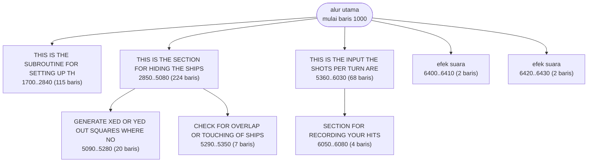
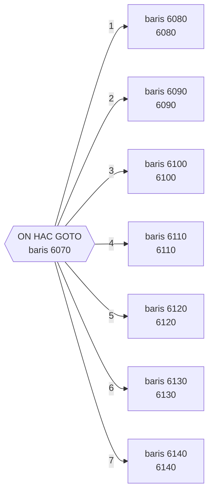
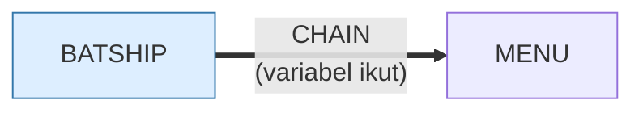

# BATSHIP.BAS — Battleship

> G.S. Alberts, Essex Jct. Vermont; revisi terakhir 27 Jul 1982. Dinyatakan public domain; cukup 64K dan layar monokrom.

| | |
|---|---|
| Sumber | Public domain / listing majalah lain-lain |
| Tahun | 1982 |
| Panjang | 544 baris (nomor 1000–6430) |
| Subrutin | 8, dipanggil dari 20 tempat |
| Percabangan | 95 `GOTO`, 20 `GOSUB`, 43 target `ON…` |
| Komentar | 14% dari baris |
| Jalankan | `run\BATSHIP.bat` |

## Peta arsitektur

*Diagram di bawah ini bukan tafsiran — semuanya diturunkan langsung dari
kode: tiap panah adalah `GOSUB` yang benar-benar ada, tiap kotak adalah
blok antara sebuah entri dan `RETURN`-nya.*



Kotak bersudut miring berwarna = **penangan kejadian** (`ON KEY`/`ON ERROR`), yang dipanggil oleh interupsi, bukan oleh alur utama.

### Subrutin dan perannya

| Baris | Panjang | Dipanggil | Peran (diambil dari kode) |
|---|--:|--:|---|
| `5090`–`5280` | 20 baris | 6× | GENERATE XED OR YED OUT SQUARES WHERE NO SHI |
| `5290`–`5350` | 7 baris | 5× | CHECK FOR OVERLAP OR TOUCHING OF SHIPS |
| `1700`–`2840` | 115 baris | 2× | THIS IS THE SUBROUTINE FOR SETTING UP THE GA |
| `5360`–`6030` | 68 baris | 2× | THIS IS THE INPUT THE SHOTS PER TURN AREA |
| `6400`–`6410` | 2 baris | 2× | efek suara |
| `2850`–`5080` | 224 baris | 1× | THIS IS THE SECTION FOR HIDING THE SHIPS |
| `6050`–`6080` | 4 baris | 1× | SECTION FOR RECORDING YOUR HITS |
| `6420`–`6430` | 2 baris | 1× | efek suara |

### Tabel dispatch

Program ini punya **11** percabangan berindeks (`ON … GOTO/GOSUB`).
Yang terbesar ada di baris 6070 dengan 7 cabang:



### Program lain yang dimuat



### Perulangan utama

`GOTO` mundur terpanjang: dari baris **5810** kembali ke **5380** — melingkupi 430 nomor baris.
Itulah loop utama program ini; segala sesuatu di dalam rentang tersebut
dijalankan berulang.

### Data yang dipegang

| Array | Dipakai | Ditulis di baris |
|---|--:|---|
| `Y` | 102× | 3070, 3100, 3110, 3150, 3160, … |
| `X` | 85× | 3080, 3090, 3140, 3170, 3180, … |
| `YY` | 23× | 5470, 5480, 5490, 5500, 5510, … |
| `YY$` | 22× | 5460, 5470, 5480, 5490, 5500, … |
| `XED` | 12× | 5120, 5130, 5140, 5150, 5160, … |
| `YED` | 12× | 5120, 5130, 5140, 5150, 5160, … |
| `S$` | 8× | 5780 |
| `XX` | 6× | 5700, 5930 |

## Bagaimana program ini disusun

Delapan subrutin, tapi lihat ukurannya: **224 baris**, 115 baris, 68 baris.
Ini bukan fungsi — ini **bab**.

| Baris | Panjang | Isi |
|---|--:|---|
| 2850–5080 | 224 | menyembunyikan kapal |
| 1700–2840 | 115 | menyiapkan permainan |
| 5360–6030 | 68 | menerima tembakan per giliran |
| 5090–5280 | 20 | cari petak kosong (dipanggil 6×) |

Pola ini muncul terus di program lama: beberapa blok raksasa yang masing-masing
mewakili satu fase, plus beberapa rutin kecil yang benar-benar dipakai ulang.
Yang kecil (5090 dan 5290) adalah satu-satunya yang berperilaku seperti fungsi.

Program ini juga punya **11 tabel dispatch** — terbanyak kedua di koleksi setelah
Eliza. Itu ciri program yang banyak menu bercabang: tiap `ON x GOTO` adalah satu
titik pilihan pemain.

Perhatikan sesuatu yang penting soal pemeliharaan: karena blok "menyembunyikan
kapal" panjangnya 224 baris dan berisi tiga loop bersarang (3410←3750,
3830←4170), setiap perubahan di sana berisiko. Blok sebesar ini adalah alasan
kenapa "satu fungsi, satu tanggung jawab" akhirnya jadi aturan.

## Yang menarik dari kodenya

544 baris, 95 `GOTO`, tapi **14% barisnya komentar** dan blok header-nya
mencantumkan nama, alamat, nomor telepon, tanggal revisi, dan konfigurasi
minimum yang dibutuhkan:

```basic
1070 REM MINIMUM CONFIGURATION BASICA, MONOCHROME DISPLAY, 64K MEMORY
```

Baris itu adalah *system requirements* — ditulis di dalam kode, tiga puluh tahun
sebelum orang menulis `engines` di `package.json`. Penulisnya juga menyatakan
programnya public domain secara eksplisit di baris 1010, sesuatu yang jarang
dilakukan sejelas ini.

Deklarasi `DIM`-nya boros dan menarik untuk dipelajari:

```basic
DIM X(25),Y(25),S$(100,3),YY$(100,3),XX(100,3),YY(100,3)
DIM XED(500),YED(500)
DIM A(500),B(500)
```

Total lebih dari 3000 sel untuk permainan di papan 10×10. Ini gejala khas ketika
program dikembangkan bertahap tanpa pernah dibersihkan: array baru ditambahkan
tiap kali ada kebutuhan baru, yang lama tidak pernah dihapus. Di mesin 64K, ini
berbahaya — dan sepertinya penulisnya sadar, karena ia mencantumkan syarat memori
di header.

Rasio 95 `GOTO` berbanding 20 `GOSUB` menunjukkan program ini ditulis sebagai
satu alur panjang dengan lompatan, bukan sebagai kumpulan rutin.

## Yang bisa dipelajari

- Tulis syarat sistem dan status lisensi di dalam kode. Berkas terpisah bisa hilang; header ikut ke mana pun berkasnya pergi.
- Komentar 14% membuat program 544 baris masih bisa diikuti orang lain. Bandingkan dengan program Friendlyware yang 0%.

## Yang jangan ditiru

- Array yang terus bertambah tanpa pernah dirapikan. Tanyakan berkala: masih dipakai tidak?
- Rasio GOTO:GOSUB hampir 5:1. Alur yang melompat ke mana-mana adalah alasan istilah 'spaghetti code' lahir dari era ini.

## Lampiran

### Perkakas bahasa yang dipakai

`PLAY` — musik lewat bahasa makro not, `SOUND` — nada mentah (frekuensi, durasi), `ON x GOTO` — percabangan berindeks, `ON x GOSUB` — pemanggilan berindeks, `CHAIN` — muat program lain, bawa variabel, `RANDOMIZE` — menyemai pengacak, `LOCATE` — posisikan kursor, `COLOR` — warna teks

### Deklarasi array

```basic
DIM X(25),Y(25),S$(100,3),YY$(100,3),XX(100,3),YY(100,3)
DIM XED(500),YED(500)
DIM A(500),B(500)
```

### Sepuluh baris pembuka

```basic
1000 REM ************* B A T T L E S H I P ********************
1010 REM PUBLIC DOMAIN SOFTWARE
1020 REM FILE NAME IS "BATSHIP.BAS"
1030 REM WRITTEN BY G.S. ALBERTS
1040 REM                    [disunting UU PDP]                   
1050 REM IBM BURLINGTON, VERMONT  [disunting PDP]  DEPT KO2 BLDG 965-2
1060 REM LAST REVISED 7-27-82
1070 REM MINIMUM CONFIGURATION BASICA, MONOCHROME DISPLAY, 64K MEMORY
1080 REM SET-UP AND OPERATION INCLUDED IN THE INSTRUCTIONS AS PART OF PROGRAM
1090 'REM THIS AREA FOR START UP OF THE PROGRAM
```

### Baris terpanjang (247 kolom)

```basic
5420 PRINT CHR$(0);CHR$(0);CHR$(0);CHR$(0);CHR$(0);CHR$(220);CHR$(220);CHR$(220);CHR$(220);CHR$(220);:LOCATE 23,55:PRINT CHR$(219):LOCATE 23,60:PRINT CHR$(219):LOCATE 23,65:PRINT CHR$(219):LOCATE 23,70:PRINT CHR$(219):LOCATE 23,75:PRINT CHR$(219);
```

---
[Dasar-dasar BASIC](00-DASAR-BASIC.md) · [Daftar review](README.md) · [Katalog koleksi](../README.md)
