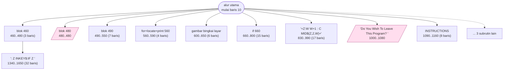
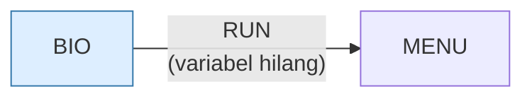

> [!WARNING]
> **Koreksi manual, ditambahkan sesi 15 (port web).**
>
> | Klaim | Kenyataan |
> |---|---|
> | Salah ketik `BIORTHYM` muncul sekali (baris 1180) | **Dua kali**: baris 1130 dan 1180, keduanya di subrutin petunjuk. Layar utama (baris 180) mengejanya dengan benar |
>
> **Dua temuan yang belum tercatat di berkas ini:**
>
> 1. **Baris 530 salah menyalin rumus Fliegel–Van Flandern.** Ia mengalikan 3
>    sebelum membagi 100, sedangkan rumus baku membagi dulu. Pada pembagian
>    bulat urutan itu tidak boleh ditukar. Diukur atas 73.414 tanggal
>    (1900–2100): 24.106 gagal pulang-pergi, **pertama pada 1 Maret 2034**.
>
> 2. **Cacat itu tidak bisa dicapai** karena baris 470 (`YEAR=YEAR+1900`,
>    tanpa syarat) mengunci jangkauan di 1900–1999. Di dalam jangkauan itu:
>    **nol kesalahan**. Memperbaiki tahun jadi empat digit akan
>    *membangunkan* cacat kalender itu.
>
> Selisih hari (`N=JC-JB`, baris 300) tetap **benar** meski rumusnya
> menyimpang 0–3 dari baku, karena offset yang sama di kedua sisi pengurangan
> saling menghapus. Diperiksa 1963–2000: nol kesalahan.
>
> Uraian lengkap: [`web/docs/bio.md`](../web/docs/bio.md).

# BIO.BAS — Biorhythm pribadi

> Menu #1 pilihan Q. Memplot siklus 23/28/33 hari dari tanggal lahir.

| | |
|---|---|
| Sumber | Friendlyware PC Introductory Set |
| Tahun | 1982 |
| Panjang | 169 baris (nomor 10–1690) |
| Subrutin | 13, dipanggil dari 24 tempat |
| Percabangan | 11 `GOTO`, 24 `GOSUB`, 10 target `ON…` |
| Komentar | 0% dari baris |
| Jalankan | `run\BIO.bat` |

## Peta arsitektur

*Diagram di bawah ini bukan tafsiran — semuanya diturunkan langsung dari
kode: tiap panah adalah `GOSUB` yang benar-benar ada, tiap kotak adalah
blok antara sebuah entri dan `RETURN`-nya.*



Kotak bersudut miring berwarna = **penangan kejadian** (`ON KEY`/`ON ERROR`), yang dipanggil oleh interupsi, bukan oleh alur utama.

### Subrutin dan perannya

| Baris | Panjang | Dipanggil | Peran (diambil dari kode) |
|---|--:|--:|---|
| `480`–`480` | 1 baris | 8× | blok @480 *(handler)* |
| `660`–`800` | 15 baris | 3× | if @660 |
| `460`–`480` | 3 baris | 2× | blok @460 |
| `490`–`550` | 7 baris | 2× | blok @490 |
| `560`–`590` | 4 baris | 1× | for+locate+print @560 |
| `600`–`650` | 6 baris | 1× | gambar bingkai layar |
| `630`–`650` | 3 baris | 1× | gambar bingkai layar |
| `830`–`990` | 17 baris | 1× | "+Z:W=W+1 : C=MID$(Z,2,W)+" |
| `1000`–`1080` | 9 baris | 1× | "Do You Wish To Leave This Program? <" *(handler)* |
| `1060`–`1080` | 3 baris | 1× | "Strike <F10> To Leave This Program" |
| `1090`–`1160` | 8 baris | 1× | INSTRUCTIONS |
| `1340`–`1650` | 32 baris | 1× | ": Z=INKEY$:IF Z=" |
| `1680`–`1680` | 1 baris | 1× | blok @1680 *(handler)* |

### Program lain yang dimuat



### Kejadian yang dijebak

- `ON KEY(1)` → baris 1680
- `ON KEY(10)` → baris 1000
- `ON KEY(2)` → baris 480
- `ON KEY(3)` → baris 480
- `ON KEY(4)` → baris 480
- `ON KEY(5)` → baris 480
- `ON KEY(6)` → baris 480
- `ON KEY(7)` → baris 480
- `ON KEY(8)` → baris 480
- `ON KEY(9)` → baris 480

### Perulangan utama

`GOTO` mundur terpanjang: dari baris **1690** kembali ke **160** — melingkupi 1530 nomor baris.
Itulah loop utama program ini; segala sesuatu di dalam rentang tersebut
dijalankan berulang.

## Bagaimana program ini disusun

Struktur programnya biasa; yang layak dipelajari adalah **pemetaan kejadiannya**.

```basic
40 ON KEY(2) GOSUB 480
50 ON KEY(3) GOSUB 480
60 ON KEY(4) GOSUB 480
...
```

Delapan tombol berbeda semuanya menunjuk ke baris 480 — dan baris 480 isinya
cuma `RETURN`. Subrutin kosong yang dipanggil delapan kali.

Kenapa? Karena di GW-BASIC, tombol yang **dijebak** tidak lagi masuk ke penyangga
biasa. Jadi menjebaknya ke rutin kosong adalah cara **menonaktifkan** tombol itu.
Efek yang diinginkan adalah efek sampingnya, bukan isi rutinnya.

Ini pola yang masih hidup: `event.preventDefault()` di browser melakukan hal yang
persis sama — mendaftarkan penangan bukan untuk menangani, melainkan untuk
mencegah perilaku bawaan.

Dua tombol lain diperlakukan berbeda: F1 → 1680 (instruksi), F10 → 1000
(keluar). Jadi peta kejadiannya punya tiga kategori: *dimatikan*, *bantuan*,
*keluar*. Membaca daftar `ON KEY` sebuah program adalah cara tercepat memahami
antarmukanya.

## Yang menarik dari kodenya

Program biorhythm ini adalah contoh paling gamblang tentang **kapan double
precision benar-benar dibutuhkan**:

```basic
20 CLEAR 200:DEFINT K,L:DEFDBL B,J,M-Y:DEFSTR C,E,Z
```

Satu baris menetapkan tiga tipe berbeda untuk tiga kelompok huruf. Kenapa
`DEFDBL`? Karena biorhythm dihitung dari **selisih hari antara tanggal lahir dan
hari ini** — bisa puluhan ribu hari — lalu dibagi 23, 28, dan 33. Single
precision hanya punya sekitar 7 digit berarti; menghitung sinus dari sudut
sebesar itu dengan presisi tunggal akan meleset.

Baris 30–90 menjebak F1 sampai F9 satu per satu, masing-masing dengan `ON KEY(n)
GOSUB` terpisah. Sepuluh baris untuk apa yang di program lain (`21.BAS`) selesai
dalam satu `FOR ... NEXT`. Perbandingan langsung dua gaya menulis untuk masalah
yang sama.

Ada salah ketik yang lucu dan sudah terlanjur abadi di baris 1180:
`"P E R S O N A L    B I O R T H Y M"` — seharusnya BIORHYTHM.

## Yang bisa dipelajari

- Pilih presisi berdasarkan rentang nilai yang akan diproses, bukan berdasarkan kebiasaan. Selisih tanggal adalah kasus klasik yang butuh double.
- `DEFINT`/`DEFDBL`/`DEFSTR` per kelompok huruf adalah cara BASIC menyatakan 'sistem tipe' untuk seluruh program dalam satu baris.

## Yang jangan ditiru

- Menulis sembilan `ON KEY(n) GOSUB` yang identik satu per satu. Lihat baris 20 di `21.BAS` untuk versi satu barisnya.
- Sistem tipe berdasarkan huruf awal nama memaksa penamaan variabel mengikuti tipe, bukan mengikuti makna. Itu sebabnya variabelnya bernama `C`, `E`, `Z`.

## Lampiran

### Perkakas bahasa yang dipakai

`POKE` — tulis memori langsung, `DEF SEG` — pindah segmen memori, `ON KEY(n) GOSUB` — jebakan tombol fungsi, `ON x GOSUB` — pemanggilan berindeks, `INKEY$` — baca tombol tanpa menunggu Enter, `RUN "nama"` — muat program lain, variabel hilang, `DEFINT` — variabel default bilangan bulat, `DEFSTR` — variabel default teks, `STRING$` — ulang satu karakter n kali, `LOCATE` — posisikan kursor, `COLOR` — warna teks

### Sepuluh baris pembuka

```basic
10 KEY OFF:SCREEN 0,0,0:WIDTH 80:COLOR 3,0,0
20 CLEAR 200:DEFINT K,L:DEFDBL B,J,M-Y:DEFSTR C,E,Z
30 ON KEY(1) GOSUB 1680
40 ON KEY(2) GOSUB 480
50 ON KEY(3) GOSUB 480
60 ON KEY(4) GOSUB 480
70 ON KEY(5) GOSUB 480
80 ON KEY(6) GOSUB 480
90 ON KEY(7) GOSUB 480
100 ON KEY(8) GOSUB 480
```

---
[Dasar-dasar BASIC](00-DASAR-BASIC.md) · [Daftar review](README.md) · [Katalog koleksi](../README.md)
