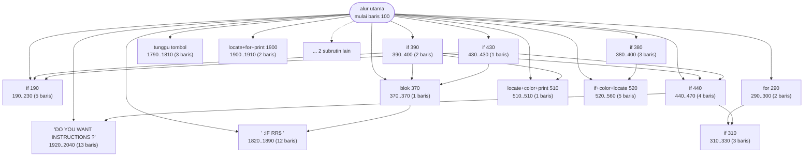
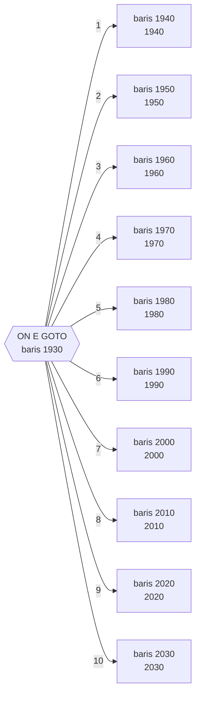
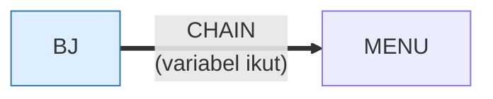

# BJ.BAS — Blackjack (versi ringkas)

> Nilai kartu dihitung aritmatika dari satu indeks dek, bukan disimpan per kartu.

| | |
|---|---|
| Sumber | Public domain / listing majalah lain-lain |
| Tahun | 1980 |
| Panjang | 218 baris (nomor 100–2190) |
| Subrutin | 16, dipanggil dari 59 tempat |
| Percabangan | 31 `GOTO`, 59 `GOSUB`, 16 target `ON…` |
| Komentar | 5% dari baris |
| Jalankan | `run\BJ.bat` |

## Peta arsitektur

*Diagram di bawah ini bukan tafsiran — semuanya diturunkan langsung dari
kode: tiap panah adalah `GOSUB` yang benar-benar ada, tiap kotak adalah
blok antara sebuah entri dan `RETURN`-nya.*



Kotak bersudut miring berwarna = **penangan kejadian** (`ON KEY`/`ON ERROR`), yang dipanggil oleh interupsi, bukan oleh alur utama.

### Subrutin dan perannya

| Baris | Panjang | Dipanggil | Peran (diambil dari kode) |
|---|--:|--:|---|
| `1920`–`2040` | 13 baris | 10× | "DO YOU WANT INSTRUCTIONS ?" |
| `370`–`370` | 1 baris | 8× | blok @370 |
| `1900`–`1910` | 2 baris | 8× | locate+for+print @1900 |
| `190`–`230` | 5 baris | 6× | if @190 |
| `290`–`300` | 2 baris | 6× | for @290 |
| `1790`–`1810` | 3 baris | 4× | tunggu tombol |
| `440`–`470` | 4 baris | 3× | if @440 |
| `510`–`510` | 1 baris | 3× | locate+color+print @510 |
| `310`–`330` | 3 baris | 2× | if @310 |
| `520`–`560` | 5 baris | 2× | if+color+locate @520 |
| `1820`–`1890` | 12 baris | 2× | ";:IF RR$=" |
| `380`–`400` | 3 baris | 1× | if @380 |
| `390`–`400` | 2 baris | 1× | if @390 |
| `430`–`430` | 1 baris | 1× | if @430 |

*(2 subrutin lain tidak ditampilkan)*

### Tabel dispatch

Program ini punya **3** percabangan berindeks (`ON … GOTO/GOSUB`).
Yang terbesar ada di baris 1930 dengan 10 cabang:



### Program lain yang dimuat



### Perulangan utama

`GOTO` mundur terpanjang: dari baris **1780** kembali ke **950** — melingkupi 830 nomor baris.
Itulah loop utama program ini; segala sesuatu di dalam rentang tersebut
dijalankan berulang.

### Data yang dipegang

| Array | Dipakai | Ditulis di baris |
|---|--:|---|
| `T` | 33× | 140, 930, 1740 |
| `S` | 24× | 950, 1080, 1170, 1270, 1430, … |
| `P` | 18× | 1070, 1360, 1430, 1450, 1470, … |
| `B` | 17× | 390, 960, 1020, 1270, 1440 |
| `Q` | 15× | 300, 440, 960, 1610 |
| `C` | 13× | 260, 540, 680 |
| `R` | 13× | 440, 490, 960, 1100, 1420, … |
| `PS` | 9× | 1080, 1430, 1450, 1470 |

## Bagaimana program ini disusun

Program kartu paling **berlapis** di koleksi: 16 subrutin dengan 12 panah
antar-subrutin. Bandingkan dengan `21.BAS` yang punya 17 subrutin tapi cuma 2
panah — jumlah yang sama, arsitektur yang sama sekali berbeda.

Perbedaannya: di sini subrutin memanggil subrutin. Rutin cetak kartu (1900)
dipanggil 8 kali, rutin tunggu tombol (1790) 4 kali, dan keduanya dipakai dari
dalam rutin lain, bukan hanya dari alur utama. Itu tanda adanya **lapisan**:
primitif di bawah, logika permainan di atas.

Fondasinya dua `DEF FN` di baris 130–140:

```basic
130 DEF FNA(Q)=Q+11*(Q>=22)      ' nilai As: 11 turun jadi 1
140 DEF FNT(Q)=(5-Q)*12+17       ' posisi kolom kartu ke-Q
```

`DEF FN` adalah satu-satunya bentuk fungsi sungguhan di GW-BASIC — punya
parameter, punya nilai kembali, tidak menyentuh variabel global. Program ini
memakainya untuk dua hal yang dipanggil paling sering, dan itu **tepat sasaran**:
gunakan alat terbaik yang ada untuk bagian terpanas.

Tabel dispatch `ON E GOTO` dengan 10 cabang di baris 1930 adalah menu utama
permainan.

## Yang menarik dari kodenya

Versi blackjack paling ringkas dan paling pintar di koleksi ini. Kuncinya ada
di dua baris:

```basic
130 DEF FNA(Q)=Q+11*(Q>=22)
140 DEF FNT(Q)=(5-Q)*12+17
```

`DEF FN` adalah fungsi buatan sendiri — satu-satunya bentuk fungsi sungguhan
(dengan parameter dan nilai kembali!) yang dimiliki GW-BASIC. Sayang sekali
hampir tidak ada program lain di koleksi ini yang memakainya.

`FNA` menangani aturan As di blackjack. Ingat bahwa di BASIC, ekspresi benar
bernilai **−1**. Jadi kalau `Q>=22`, hasilnya `Q + 11*(-1)` = `Q-11` — nilai As
diturunkan dari 11 jadi 1. Kalau tidak, `Q + 11*0` = `Q`. **Satu ekspresi
menggantikan sebuah `IF`.**

Kartu disimpan di `C(208)` — 208 = 4 dek × 52 kartu. Alih-alih menyimpan rupa
dan nilai tiap kartu, semuanya diturunkan secara aritmetika dari indeks:
nilai = `indeks MOD 13`, suit = `indeks MOD 4`. Tidak ada tabel paralel sama
sekali, berbeda dengan `21.BAS`.

`KEY 1,"C":KEY 3,"D":KEY 5,"/":KEY 9,"S"` di baris 110 mengisi ulang label
tombol fungsi supaya baris bantuan di dasar layar langsung menampilkan perintah
permainan. Pemanfaatan cerdas fitur bawaan sebagai antarmuka.

## Yang bisa dipelajari

- `DEF FN` memberi Anda fungsi sungguhan di BASIC. Pakailah — ia menghapus pengulangan dan memberi nama pada perhitungan.
- Menurunkan data dari indeks lebih baik daripada menyimpan tabel sejajar, kalau hubungannya memang aritmetis.
- Nilai benar = −1 bisa dipakai untuk aritmetika bersyarat tanpa `IF`. Kuat, tapi harus dikomentari.

## Yang jangan ditiru

- `FNA` dan `FNT` adalah nama yang tidak memberi tahu apa-apa. Fungsi yang bagus dengan nama yang buruk tetap sulit dibaca.
- Trik `11*(Q>=22)` tanpa komentar. Pembaca yang tidak tahu bahwa benar = −1 akan salah membacanya sama sekali.

## Lampiran

### Perkakas bahasa yang dipakai

`PEEK` — baca memori langsung, `POKE` — tulis memori langsung, `DEF SEG` — pindah segmen memori, `ON x GOTO` — percabangan berindeks, `ON x GOSUB` — pemanggilan berindeks, `INKEY$` — baca tombol tanpa menunggu Enter, `CHAIN` — muat program lain, bawa variabel, `DEF FN` — fungsi buatan sendiri satu baris, `RANDOMIZE` — menyemai pengacak, `LOCATE` — posisikan kursor, `COLOR` — warna teks, `KEY n,"..."` — isi ulang label tombol fungsi

### Deklarasi array

```basic
DIM P(15,12),Q(15),C(208),T(8),S(7),B(15),D(5)
DIM R(15),PS(15,12)
```

### Sepuluh baris pembuka

```basic
100 GOSUB 2050:RANDOMIZE(VAL(RIGHT$(TIME$,2)))
110 KEY 1,"C":KEY 3,"D":KEY 5,"/":KEY 7,"":KEY 9,"S"
120 KEY 2,"":KEY 4,"":KEY 6,"":KEY 8,"":KEY 10,""
130 DEF FNA(Q)=Q+11*(Q>=22)
140 DEF FNT(Q)=(5-Q)*12+17
150 DIM P(15,12),Q(15),C(208),T(8),S(7),B(15),D(5)
160 DIM R(15),PS(15,12)
170 CD$=CHR$(6)+CHR$(3)+CHR$(5)+CHR$(4)
180 CD=0:GOTO 660
190 IF C>=CZ THEN 240
```

### Baris terpanjang (116 kolom)

```basic
2090 PRINT "               ║ ║ ";:COLOR 11:PRINT "                BLACKJACK               ";:COLOR 15:PRINT "   ║ ║"
```

---
[Dasar-dasar BASIC](00-DASAR-BASIC.md) · [Daftar review](README.md) · [Katalog koleksi](../README.md)
