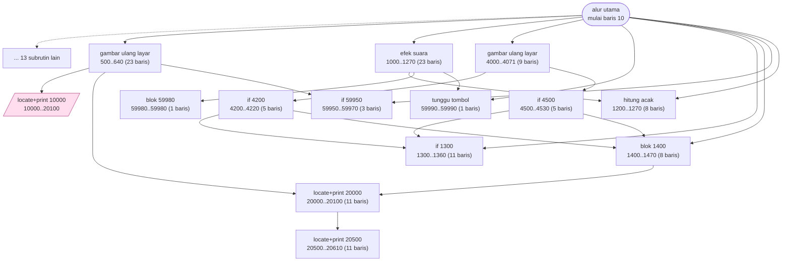
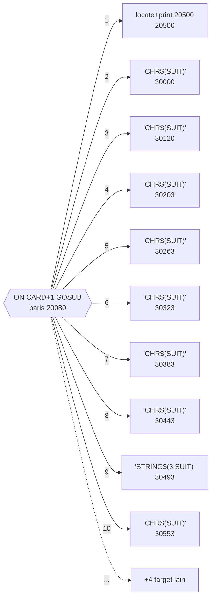
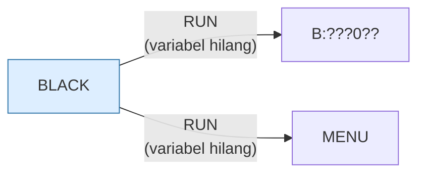

# BLACK.BAS — Blackjack (1-2 pemain)

> Program paling rajin dikomentari di koleksi ini; tiap subrutin punya blok header.

| | |
|---|---|
| Sumber | Public domain / listing majalah lain-lain |
| Tahun | 1982 |
| Panjang | 396 baris (nomor 10–59990) |
| Subrutin | 27, dipanggil dari 52 tempat |
| Percabangan | 16 `GOTO`, 39 `GOSUB`, 20 target `ON…` |
| Komentar | 37% dari baris |
| Jalankan | `run\BLACK.bat` |

## Peta arsitektur

*Diagram di bawah ini bukan tafsiran — semuanya diturunkan langsung dari
kode: tiap panah adalah `GOSUB` yang benar-benar ada, tiap kotak adalah
blok antara sebuah entri dan `RETURN`-nya.*



Kotak bersudut miring berwarna = **penangan kejadian** (`ON KEY`/`ON ERROR`), yang dipanggil oleh interupsi, bukan oleh alur utama.

### Subrutin dan perannya

| Baris | Panjang | Dipanggil | Peran (diambil dari kode) |
|---|--:|--:|---|
| `1300`–`1360` | 11 baris | 8× | if @1300 |
| `1400`–`1470` | 8 baris | 7× | blok @1400 |
| `20000`–`20100` | 11 baris | 5× | locate+print @20000 |
| `59950`–`59970` | 3 baris | 5× | if @59950 |
| `59990`–`59990` | 1 baris | 3× | tunggu tombol |
| `1200`–`1270` | 8 baris | 2× | hitung acak |
| `4000`–`4071` | 9 baris | 2× | gambar ulang layar |
| `500`–`640` | 23 baris | 1× | gambar ulang layar |
| `1000`–`1270` | 23 baris | 1× | efek suara |
| `4200`–`4220` | 5 baris | 1× | if @4200 |
| `4500`–`4530` | 5 baris | 1× | if @4500 |
| `10000`–`20100` | 13 baris | 1× | locate+print @10000 *(handler)* |
| `20500`–`20610` | 11 baris | 1× | locate+print @20500 |
| `30000`–`30110` | 11 baris | 1× | "CHR$(SUIT)" |

*(13 subrutin lain tidak ditampilkan)*

### Tabel dispatch

Program ini punya **2** percabangan berindeks (`ON … GOTO/GOSUB`).
Yang terbesar ada di baris 20080 dengan 14 cabang:



### Program lain yang dimuat



### Kejadian yang dijebak

- `ON ERROR` → baris 3000
- `ON KEY(10)` → baris 10000

### Perulangan utama

`GOTO` mundur terpanjang: dari baris **5640** kembali ke **2000** — melingkupi 3640 nomor baris.
Itulah loop utama program ini; segala sesuatu di dalam rentang tersebut
dijalankan berulang.

### Data yang dipegang

| Array | Dipakai | Ditulis di baris |
|---|--:|---|
| `A` | 28× | 1180, 2160, 2602, 2660, 4210, … |

## Bagaimana program ini disusun

27 subrutin, 14 panah — arsitektur paling seimbang di koleksi. Dan diagramnya
memperlihatkan sesuatu yang jarang: **hierarki yang sesungguhnya**.

Yang paling menarik adalah tabel dispatch di baris 20080:

```basic
ON CARD+1 GOSUB (14 target berbeda)
```

Empat belas cabang, satu untuk tiap nilai kartu (As sampai King). Jadi
"menggambar kartu" tidak ditulis sebagai satu rutin dengan `IF` bertingkat,
melainkan sebagai **tabel penggambar** yang diindeks nilai kartu.

Ini polimorfisme dalam bentuk paling telanjang. Di bahasa berobjek Anda akan
menulis `card.draw()` dan mesin virtual yang memilih implementasinya; di sini
`ON CARD+1 GOSUB` melakukan pemilihan itu secara eksplisit. Mekanismenya sama —
**tabel penunjuk yang diindeks oleh tipe**.

Utilitasnya juga dipisah ke nomor baris tinggi (59950, 59990, 20000), sama
seperti `BACKGAM.BAS`.

Rasio 16 `GOTO` berbanding 39 `GOSUB` di program 396 baris adalah yang terbaik
di koleksi untuk ukuran itu, dan bukan kebetulan program ini juga yang paling
rajin dikomentari.

## Yang menarik dari kodenya

**37% dari barisnya adalah komentar** — jauh tertinggi di seluruh koleksi. Kalau
Anda hanya membaca satu program dari sini untuk belajar gaya menulis, baca ini.

Struktur dokumentasinya konsisten: setiap bagian dibuka dengan spanduk,
dijelaskan maksudnya, baru kodenya:

```basic
100 REM======================================================================
110 REM=========================== MAIN ROUTINE =============================
120 REM This routine contains the main logic for the program.  It makes
130 REM extensive use of subroutines which are described later.
```

Perhatikan kalimat "which are described later". Penulisnya sadar bahwa pembaca
akan membaca berurutan dan memberi tahu apa yang akan datang. Ini menulis untuk
manusia, bukan untuk mesin.

Efeknya terukur: dengan 396 baris, program ini hanya punya **16 `GOTO`** —
paling sedikit di antara program sebesar ini — dan 39 `GOSUB`. Perbandingan
terbalik dari `BATSHIP.BAS`. Program yang didokumentasikan dengan baik cenderung
juga terstruktur dengan baik, karena menulis penjelasan memaksa penulisnya
memikirkan batas-batas tiap bagian.

Nama variabelnya pun panjang dan bermakna: `WINNING(X)`, `BET(X)` — bukan `W`
dan `B`. GW-BASIC mengizinkan nama panjang, tapi nyaris tidak ada program lain di
sini yang memanfaatkannya.

## Yang bisa dipelajari

- Menulis komentar bagian sebelum kodenya memaksa Anda memutuskan batas tanggung jawab tiap bagian. Struktur yang baik sering lahir dari sini.
- Nama variabel panjang tersedia dan gratis. `WINNING(X)` mengalahkan `W(X)` selamanya.
- Sedikit `GOTO` bukan kebetulan pada program yang terdokumentasi — keduanya gejala dari cara berpikir yang sama.

## Yang jangan ditiru

- Baris 5540 sepanjang 189 kolom dengan `IF ... ELSE IF ... ELSE`. Bahkan program paling rapi di sini pun punya satu baris yang seharusnya dipecah.

## Lampiran

### Perkakas bahasa yang dipakai

`PLAY` — musik lewat bahasa makro not, `ON KEY(n) GOSUB` — jebakan tombol fungsi, `ON ERROR GOTO` — penanganan galat, `ON x GOTO` — percabangan berindeks, `ON x GOSUB` — pemanggilan berindeks, `INKEY$` — baca tombol tanpa menunggu Enter, `RUN "nama"` — muat program lain, variabel hilang, `RANDOMIZE` — menyemai pengacak, `SWAP` — tukar isi dua variabel, `DEFINT` — variabel default bilangan bulat, `STRING$` — ulang satu karakter n kali, `LOCATE` — posisikan kursor

### Deklarasi array

```basic
DIM A(64)
```

### Sepuluh baris pembuka

```basic
10 REM=======================================================================
20 REM============================ BLACKJACK ================================
30 REM This program plays Blackjack with either one or two players.  The   ==
40 REM computer always plays the role of dealer and the players betting    ==
50 REM on the results of each play.                                        ==
70 REM=======================================================================
80 REM $s2
100 REM======================================================================
110 REM=========================== MAIN ROUTINE =============================
120 REM This routine contains the main logic for the program.  It makes    ==
```

### Baris terpanjang (189 kolom)

```basic
5540 IF V=U THEN LOCATE Y,65:PRINT"PUSH      "; ELSE IF V>U THEN LOCATE Y,65:PRINT"LOSE      ";:WINNING(X)=WINNING(X)-BET(X) ELSE LOCATE Y,65:PRINT"WIN       ";:WINNING(X)=WINNING(X)+BET(X)
```

---
[Dasar-dasar BASIC](00-DASAR-BASIC.md) · [Daftar review](README.md) · [Katalog koleksi](../README.md)
