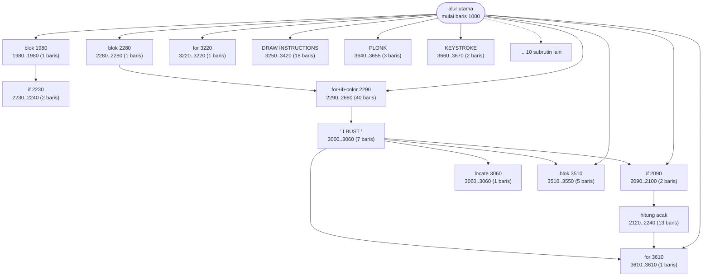
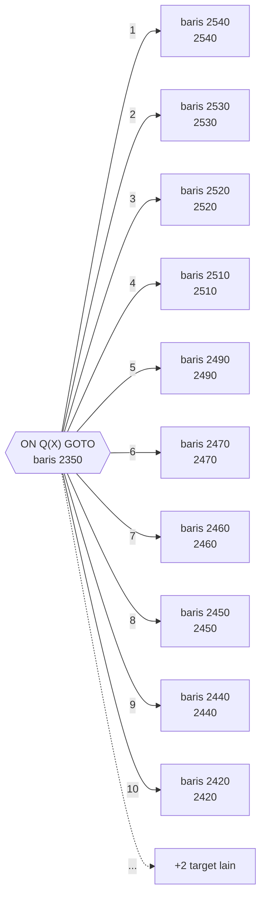

# BLACKJCK.BAS — CCII Blackjack

> Ditulis 3 Jan 1978 oleh Jessen untuk CCII; diadaptasi ke PC oleh Patrick Leabo, Tucson.

| | |
|---|---|
| Sumber | Public domain / listing majalah lain-lain |
| Tahun | 1978 |
| Panjang | 282 baris (nomor 1000–3820) |
| Subrutin | 24, dipanggil dari 48 tempat |
| Percabangan | 64 `GOTO`, 49 `GOSUB`, 16 target `ON…` |
| Komentar | 7% dari baris |
| Jalankan | `run\BLACKJCK.bat` |

## Peta arsitektur

*Diagram di bawah ini bukan tafsiran — semuanya diturunkan langsung dari
kode: tiap panah adalah `GOSUB` yang benar-benar ada, tiap kotak adalah
blok antara sebuah entri dan `RETURN`-nya.*



Kotak bersudut miring berwarna = **penangan kejadian** (`ON KEY`/`ON ERROR`), yang dipanggil oleh interupsi, bukan oleh alur utama.

### Subrutin dan perannya

| Baris | Panjang | Dipanggil | Peran (diambil dari kode) |
|---|--:|--:|---|
| `3610`–`3610` | 1 baris | 8× | for @3610 |
| `2090`–`2100` | 2 baris | 5× | if @2090 |
| `3510`–`3550` | 5 baris | 5× | blok @3510 |
| `2280`–`2280` | 1 baris | 4× | blok @2280 |
| `3640`–`3655` | 3 baris | 3× | PLONK |
| `1980`–`1980` | 1 baris | 2× | blok @1980 |
| `2290`–`2680` | 40 baris | 2× | for+if+color @2290 |
| `3220`–`3220` | 1 baris | 2× | for @3220 |
| `3660`–`3670` | 2 baris | 2× | KEYSTROKE |
| `2120`–`2240` | 13 baris | 1× | hitung acak |
| `2230`–`2240` | 2 baris | 1× | if @2230 |
| `3000`–`3060` | 7 baris | 1× | "*I BUST*" |
| `3060`–`3060` | 1 baris | 1× | locate @3060 |
| `3090`–`3090` | 1 baris | 1× | RE AHEAD $";W1;:RETURN |

*(10 subrutin lain tidak ditampilkan)*

### Tabel dispatch

Program ini punya **2** percabangan berindeks (`ON … GOTO/GOSUB`).
Yang terbesar ada di baris 2350 dengan 12 cabang:



### Kejadian yang dijebak

- `ON KEY(10)` → baris 3800

### Perulangan utama

`GOTO` mundur terpanjang: dari baris **3000** kembali ke **1100** — melingkupi 1900 nomor baris.
Itulah loop utama program ini; segala sesuatu di dalam rentang tersebut
dijalankan berulang.

### Data yang dipegang

| Array | Dipakai | Ditulis di baris |
|---|--:|---|
| `T$` | 65× | 2290, 2360, 2370, 2380, 2390, … |
| `T` | 41× | 1100, 1490, 1690, 1770, 1960, … |
| `V` | 38× | 1100, 1390, 1400, 1430, 1570, … |
| `E` | 30× | 1100, 1380, 1400, 1490, 1520, … |
| `Q` | 19× | 1090, 1910, 2560, 2570, 2580, … |
| `D` | 13× | 1080, 2150, 2170, 2180, 2220, … |
| `W` | 8× | 1350, 1970, 2060 |

## Bagaimana program ini disusun

24 subrutin, 10 panah, dan **utilitas di nomor 3000-an** — pola pemisahan yang
sama dengan `BACKGAM` dan `BLACK`, tapi dengan nama yang lebih jujur: rutin di
3640 diberi komentar `PLONK` (bunyi kartu) dan 3660 `KEYSTROKE`.

Tabel dispatch di baris 2350 adalah bagian terbaiknya:

```basic
ON Q(X) GOTO (12 target)
```

Perhatikan indeksnya: bukan variabel biasa, melainkan **elemen array**. `Q(X)`
menyimpan jenis kartu ke-X, dan nilainya langsung dipakai memilih cabang. Jadi
data menentukan alur — *data-driven dispatch*.

Ini penting untuk dipahami: alih-alih menulis 12 `IF` yang memeriksa isi `Q(X)`,
programnya menyimpan **nomor cabang** di dalam data itu sendiri. Menambah jenis
kartu baru berarti menambah satu target di tabel, bukan menambah satu `IF` di
tengah rantai.

Loop terluarnya 1100←3000 (1900 baris) adalah satu sesi; 1440←2010 (570 baris)
satu tangan.

Enam array bekerja bersama (`T$`, `T`, `V`, `E`, `Q`, `D`) — tabel paralel klasik
untuk memodelkan kartu tanpa record.

## Yang menarik dari kodenya

Program tertua kedua di koleksi: ditulis 3 Januari 1978 oleh Jessen untuk CCII,
lalu dipindahkan ke IBM PC oleh Patrick Leabo. Jejak asal-usulnya kelihatan
jelas dari gaya penulisannya:

```basic
1060 K= 0:W1= 0:R= RND (1):N= INT (1945* RND (1)+ 1)
```

Perhatikan spasi setelah `=` dan setelah nama fungsi (`RND (1)`, `INT (10*...)`).
Itu bukan gaya IBM PC — itu keluaran khas dari interpreter BASIC generasi
sebelumnya yang **menyisipkan spasi sendiri saat `LIST`**. Kode ini pernah
di-`LIST` di satu mesin, dicetak atau dikirim lewat modem, lalu diketik ulang
di mesin lain. Formatnya membawa fosil perjalanannya.

`COMMON MENU` di baris 1030 menandakan program ini dirancang untuk di-`CHAIN`
dari sebuah menu, dengan variabel `MENU` menyeberang. Ini potongan dari sistem
yang lebih besar.

`RANDOMIZE VAL(RIGHT$(TIME$,2))` menyemai pengacak dengan **dua digit terakhir
detik jam**. Artinya hanya ada 60 kemungkinan benih. Untuk permainan kartu, itu
sedikit sekali — dua sesi yang dimulai pada detik yang sama akan mendapat urutan
kartu identik.

## Yang bisa dipelajari

- Gaya penulisan kode menyimpan jejak asal-usulnya. Spasi yang aneh sering berarti kode itu pernah melewati `LIST` di mesin lain.
- `COMMON` adalah cara BASIC mengoper variabel antarprogram saat `CHAIN`.

## Yang jangan ditiru

- Menyemai pengacak dari 60 nilai yang mungkin. Kalau butuh acak yang layak, gabungkan lebih banyak sumber, misalnya `TIMER` yang punya resolusi jauh lebih halus.
- 64 `GOTO` untuk 282 baris. Kepadatan lompatan tertinggi kedua di koleksi.

## Lampiran

### Perkakas bahasa yang dipakai

`PLAY` — musik lewat bahasa makro not, `SOUND` — nada mentah (frekuensi, durasi), `BEEP`, `DRAW` — bahasa makro menggambar garis, `POKE` — tulis memori langsung, `DEF SEG` — pindah segmen memori, `ON KEY(n) GOSUB` — jebakan tombol fungsi, `ON x GOTO` — percabangan berindeks, `ON x GOSUB` — pemanggilan berindeks, `INKEY$` — baca tombol tanpa menunggu Enter, `RANDOMIZE` — menyemai pengacak, `STRING$` — ulang satu karakter n kali, `LOCATE` — posisikan kursor, `COLOR` — warna teks, `KEY n,"..."` — isi ulang label tombol fungsi

### Deklarasi array

```basic
DIM D(52),E(5),V(5),T(5),W(5),T$(34),Q(52)
```

### Sepuluh baris pembuka

```basic
1000 REM  ** CCII BLACKJACK - JAN 3,78 - JESSEN **
1010 REM ADAPTED TO PC BY PATRICK LEABO--TUCSON
1015 REM
1020 SCREEN 0:COLOR 7,0:WIDTH 80:KEY OFF:LOCATE ,,0
1025 SND = 1:KEY 10,"":ON KEY (10) GOSUB 3800 :KEY (10) ON
1030 COMMON MENU:RANDOMIZE VAL(RIGHT$(TIME$,2))
1040 CLS:GOSUB 3440:Z7= RND (1):GOSUB 3250:Y= 1:COLOR 7,0
1050 LOCATE 7,7:PRINT "WELCOME TO...";:PRINT "BLACKJACK!"
1060 K= 0:W1= 0:R= RND (1):N= INT (1945* RND (1)+ 1):X= INT (10* RND (1))
1070 DIM D(52),E(5),V(5),T(5),W(5),T$(34),Q(52)
```

### Baris terpanjang (114 kolom)

```basic
2200 TE= 0:NT= 0:R= 0:LOCATE 9,18:PRINT "*I RESHUFFLED*":GOSUB 3610:LOCATE 9,18:PRINT"                 ":GOTO 2120
```

---
[Dasar-dasar BASIC](00-DASAR-BASIC.md) · [Daftar review](README.md) · [Katalog koleksi](../README.md)
