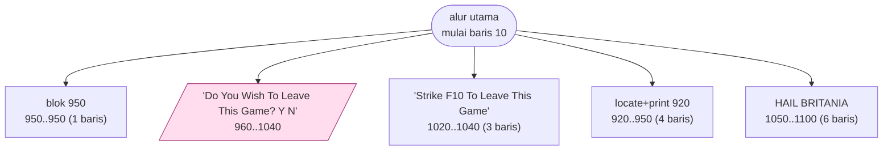
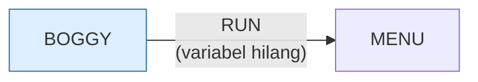

# BOGGY.BAS — Boggy Marsh

> Menu #1 pilihan T. Menyeberangi rawa tanpa tenggelam.

| | |
|---|---|
| Sumber | Friendlyware PC Introductory Set |
| Tahun | 1982 |
| Panjang | 101 baris (nomor 10–1100) |
| Subrutin | 5, dipanggil dari 6 tempat |
| Percabangan | 12 `GOTO`, 6 `GOSUB`, 2 target `ON…` |
| Komentar | 3% dari baris |
| Jalankan | `run\BOGGY.bat` |

## Peta arsitektur

*Diagram di bawah ini bukan tafsiran — semuanya diturunkan langsung dari
kode: tiap panah adalah `GOSUB` yang benar-benar ada, tiap kotak adalah
blok antara sebuah entri dan `RETURN`-nya.*



Kotak bersudut miring berwarna = **penangan kejadian** (`ON KEY`/`ON ERROR`), yang dipanggil oleh interupsi, bukan oleh alur utama.

### Subrutin dan perannya

| Baris | Panjang | Dipanggil | Peran (diambil dari kode) |
|---|--:|--:|---|
| `920`–`950` | 4 baris | 2× | locate+print @920 |
| `950`–`950` | 1 baris | 1× | blok @950 |
| `960`–`1040` | 9 baris | 1× | "Do You Wish To Leave This Game? <Y/N" *(handler)* |
| `1020`–`1040` | 3 baris | 1× | "Strike <F10> To Leave This Game" |
| `1050`–`1100` | 6 baris | 1× | HAIL BRITANIA |

### Program lain yang dimuat



### Kejadian yang dijebak

- `ON KEY(10)` → baris 960

### Perulangan utama

`GOTO` mundur terpanjang: dari baris **890** kembali ke **290** — melingkupi 600 nomor baris.
Itulah loop utama program ini; segala sesuatu di dalam rentang tersebut
dijalankan berulang.

### Data yang dipegang

| Array | Dipakai | Ditulis di baris |
|---|--:|---|
| `R` | 22× | 330, 370, 630, 640 |
| `C` | 22× | 350, 370 |

## Bagaimana program ini disusun

Lima subrutin, nol panah antar-subrutin, satu loop utama (290←890). Program
Friendlyware terkecil yang masih berupa permainan sungguhan.

Yang layak dilihat justru **apa yang tidak dipecah**. Seluruh logika permainan —
menggerakkan pemain, memeriksa tabrakan, menghitung skor — ada di dalam loop
utama sebagai satu blok panjang, dengan puncaknya di baris 640 sepanjang 228
kolom.

Baris itu mengerjakan sepuluh hal sekaligus, dan salah satunya adalah pola yang
patut dikenali:

```basic
R(I)=99
```

Objek yang sudah mati ditandai dengan mengganti koordinatnya jadi nilai mustahil,
bukan dihapus dari array. Namanya *tombstone*, dan alasannya arsitektural:
menghapus elemen berarti menggeser sisanya, yang akan mengacaukan setiap indeks
yang sudah dipegang kode lain. Menandai jauh lebih murah dan lebih aman.

Prinsipnya masih dipakai di basis data (baris dihapus ditandai dulu, dibersihkan
belakangan) dan di pengumpul sampah.

## Yang menarik dari kodenya

Permainan Friendlyware yang kecil (101 baris) tapi memperlihatkan satu masalah
gaya dengan sangat jelas. Lihat baris 640:

```basic
640     IF ROW=R(I) AND COL=C(I) THEN PRINT"You Just Killed Number" I:GOSUB 920:        LOCATE ERSROW,ERSCOL,0:COLOR 20,0:PRINT CHR$(26)CHR$(2)CHR$(27):                COLOR 3,0:NUMFOUND=NUMFOUND+1:R(I)=99:PR=PR+1:HIT=1:GOTO 750
```

228 kolom, sepuluh perintah, dan — ini bagian pentingnya — **penulisnya mencoba
memberi indentasi dengan spasi di tengah baris**. Anda bisa melihat niatnya
untuk membuat kode berlapis, tapi karena semuanya tetap satu baris, hasilnya
malah lebih sulit dibaca.

`R(I)=99` di tengah baris itu adalah cara menandai "objek ini sudah mati":
alih-alih menghapusnya dari array, koordinatnya diganti nilai mustahil.
Ini pola *tombstone* yang masih dipakai sampai sekarang di struktur data yang
tidak boleh digeser isinya.

Bingkai layar digambar dengan tiga baris (130–150) memakai karakter 219 (blok
penuh). Bandingkan dengan `ATTACK.BAS` yang memakai karakter garis — dua
pendekatan estetika berbeda dengan biaya sama.

## Yang bisa dipelajari

- Pola *tombstone*: tandai data sebagai tidak berlaku alih-alih menghapusnya, kalau indeks harus tetap stabil.
- Menggambar bingkai dengan `STRING$(80,219)` jauh lebih murah daripada mode grafis.

## Yang jangan ditiru

- Indentasi di dalam satu baris logis. Kalau Anda merasa butuh indentasi, itu tanda barisnya harus dipecah — bukan tanda butuh lebih banyak spasi.
- Angka ajaib `99` sebagai penanda mati, tanpa komentar dan tanpa konstanta.

## Lampiran

### Perkakas bahasa yang dipakai

`PLAY` — musik lewat bahasa makro not, `POKE` — tulis memori langsung, `DEF SEG` — pindah segmen memori, `ON KEY(n) GOSUB` — jebakan tombol fungsi, `ON x GOSUB` — pemanggilan berindeks, `INKEY$` — baca tombol tanpa menunggu Enter, `RUN "nama"` — muat program lain, variabel hilang, `RANDOMIZE` — menyemai pengacak, `STRING$` — ulang satu karakter n kali, `LOCATE` — posisikan kursor, `COLOR` — warna teks

### Deklarasi array

```basic
DIM R(3)
DIM C(3)
```

### Sepuluh baris pembuka

```basic
10 WIDTH 80:SCREEN 0,0,0:COLOR 3,0:CLS:KEY OFF
110 FOR A=1 TO 9:ON KEY(A) GOSUB 950:KEY(A) ON:NEXT
120 ON KEY(10) GOSUB 960
130 LOCATE 1,1:PRINT STRING$(80,219)
140 FOR A=2 TO 22:LOCATE A,1:PRINT CHR$(219):LOCATE A,80:PRINT CHR$(219):NEXT
150 LOCATE 23,1:PRINT STRING$(80,219);
160 LOCATE 4,30:COLOR 15,0:PRINT "B O G G Y   M A R S H"
170 LOCATE 8,23:PRINT "Would You Like Instructions? <Y/N>":COLOR 3,0
180 A$=INKEY$:IF A$="" THEN 180
190 IF A$="N" OR A$="n" THEN 290
```

### Baris terpanjang (228 kolom)

```basic
640     IF ROW=R(I) AND COL=C(I) THEN PRINT"You Just Killed Number" I:GOSUB 920:        LOCATE ERSROW,ERSCOL,0:COLOR 20,0:PRINT CHR$(26)CHR$(2)CHR$(27):                COLOR 3,0:NUMFOUND=NUMFOUND+1:R(I)=99:PR=PR+1:HIT=1:GOTO 750
```

---
[Dasar-dasar BASIC](00-DASAR-BASIC.md) · [Daftar review](README.md) · [Katalog koleksi](../README.md)
