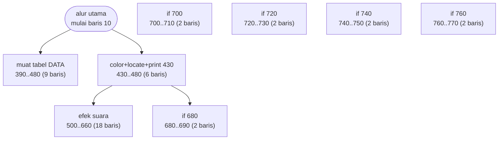
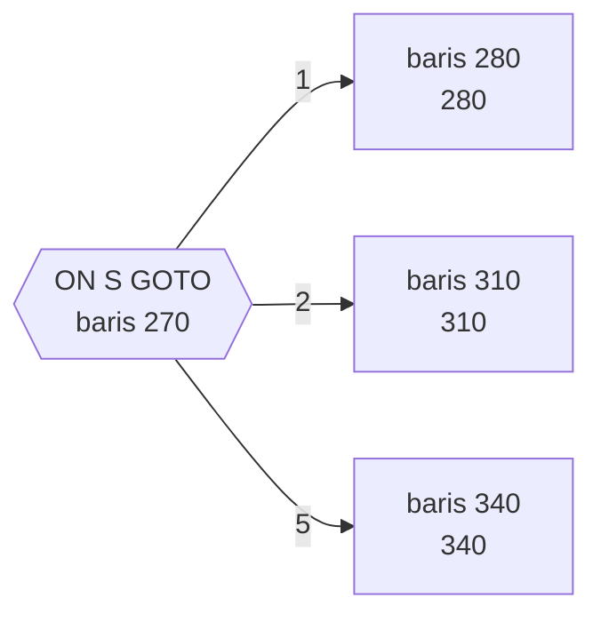

# BOWLING.BAS — Bowling Champ

> 1-4 pemain, kesulitan 0-60. Skor sepuluh frame penuh termasuk strike dan spare.

| | |
|---|---|
| Sumber | Public domain / listing majalah lain-lain |
| Tahun | 1986 |
| Panjang | 75 baris (nomor 10–1003) |
| Subrutin | 8, dipanggil dari 11 tempat |
| Percabangan | 5 `GOTO`, 7 `GOSUB`, 10 target `ON…` |
| Komentar | 0% dari baris |
| Jalankan | `run\BOWLING.bat` |

## Peta arsitektur

*Diagram di bawah ini bukan tafsiran — semuanya diturunkan langsung dari
kode: tiap panah adalah `GOSUB` yang benar-benar ada, tiap kotak adalah
blok antara sebuah entri dan `RETURN`-nya.*



Kotak bersudut miring berwarna = **penangan kejadian** (`ON KEY`/`ON ERROR`), yang dipanggil oleh interupsi, bukan oleh alur utama.

### Subrutin dan perannya

| Baris | Panjang | Dipanggil | Peran (diambil dari kode) |
|---|--:|--:|---|
| `390`–`480` | 9 baris | 3× | muat tabel DATA |
| `430`–`480` | 6 baris | 2× | color+locate+print @430 |
| `500`–`660` | 18 baris | 1× | efek suara |
| `680`–`690` | 2 baris | 1× | if @680 |
| `700`–`710` | 2 baris | 1× | if @700 |
| `720`–`730` | 2 baris | 1× | if @720 |
| `740`–`750` | 2 baris | 1× | if @740 |
| `760`–`770` | 2 baris | 1× | if @760 |

### Tabel dispatch

Program ini punya **2** percabangan berindeks (`ON … GOTO/GOSUB`).
Yang terbesar ada di baris 270 dengan 5 cabang:



5 nilai memetakan ke 3 target berbeda - beberapa nilai berbagi rutin yang sama.

### Perulangan utama

`GOTO` mundur terpanjang: dari baris **370** kembali ke **280** — melingkupi 90 nomor baris.
Itulah loop utama program ini; segala sesuatu di dalam rentang tersebut
dijalankan berulang.

### Data yang dipegang

| Array | Dipakai | Ditulis di baris |
|---|--:|---|
| `S` | 8× | 210, 330, 360, 370, 460 |
| `NA$` | 7× | 90 |
| `T` | 5× | 460 |

## Bagaimana program ini disusun

Tujuh puluh lima baris untuk penilaian bowling sepuluh frame — dan
arsitekturnya menjelaskan bagaimana itu muat.

Tabel dispatch di baris 270 adalah kuncinya:

```basic
ON S GOTO (5 target, hanya 3 unik)
```

Lima nilai memetakan ke tiga tujuan. Beberapa keadaan permainan ditangani rutin
yang sama — itu **penggabungan keadaan yang setara**, dan itulah yang menghemat
kode. Menemukan bahwa dua kasus berbeda sebetulnya butuh perlakuan sama adalah
salah satu cara paling ampuh memperkecil program.

Yang paling berani adalah keputusan menyimpan keadaan pin:

```basic
590 IF SCREEN(X1,X2)=234 THEN LOCATE X1,X2:PRINT " ";
```

`SCREEN(r,c)` **membaca karakter yang sedang tampil**. Jadi tidak ada array pin —
layar itu sendiri yang jadi struktur datanya.

Ini menghemat memori dan kode, tapi arsitekturnya salah, dan patut dipahami
kenapa: tampilan seharusnya **turunan** dari keadaan, bukan sumbernya. Begitu
tampilan jadi sumber kebenaran, apa pun yang menulis ke layar bisa mengubah
keadaan permainan tanpa sengaja. Kesalahan yang persis sama terjadi hari ini
ketika orang membaca `element.innerText` untuk mengetahui keadaan aplikasi.

## Yang menarik dari kodenya

Hanya 75 baris untuk penilaian bowling sepuluh frame lengkap dengan strike dan
spare — dan penilaian bowling terkenal sulit karena strike dan spare
"meminjam" nilai lemparan berikutnya. Kepadatan logika per baris di sini
termasuk yang tertinggi di koleksi.

Baris 590 menunjukkan teknik yang jarang muncul:

```basic
590 X1=X1+D:X2=X2+1:IF SCREEN(X1,X2)=234 THEN LOCATE X1,X2:PRINT " ";:J=J+1:SOUND 74,0.5
```

Fungsi `SCREEN(baris,kolom)` **membaca karakter yang sedang tampil di layar**.
Jadi program tidak menyimpan posisi pin di array sama sekali — layar itu sendiri
yang jadi struktur datanya. Bola menggelinding, memeriksa apakah karakter di
depannya adalah pin (kode 234), lalu menghapusnya.

Ini cerdas dan hemat, tapi juga rapuh: kalau ada yang menulis apa pun ke layar
di posisi itu, keadaan permainan ikut berubah. Menggunakan tampilan sebagai
sumber kebenaran adalah pola yang sekarang secara aktif dihindari — di web,
membaca `element.innerText` untuk mengetahui keadaan aplikasi adalah kesalahan
yang persis sama.

`WHILE+ A$=""` di baris 50 itu salah ketik (`WHILE+`), tapi GW-BASIC memaafkannya
karena `+` di depan ekspresi dianggap tanda positif.

## Yang bisa dipelajari

- Fungsi `SCREEN(r,c)` bisa membaca isi layar teks — berguna untuk deteksi tabrakan sederhana.
- Logika penilaian bowling yang benar dalam 75 baris patut dibaca sebagai latihan.

## Yang jangan ditiru

- **Menjadikan tampilan sebagai sumber kebenaran.** Simpan keadaan di data, lalu gambar dari data. Jangan sebaliknya.
- Salah ketik yang tidak dihukum oleh interpreter (`WHILE+`) — bahasa yang terlalu permisif menyembunyikan kesalahan.

## Lampiran

### Perkakas bahasa yang dipakai

`PLAY` — musik lewat bahasa makro not, `SOUND` — nada mentah (frekuensi, durasi), `POKE` — tulis memori langsung, `DEF SEG` — pindah segmen memori, `ON x GOTO` — percabangan berindeks, `ON x GOSUB` — pemanggilan berindeks, `INKEY$` — baca tombol tanpa menunggu Enter, `WHILE`/`WEND` — perulangan berkondisi, `LOCATE` — posisikan kursor, `COLOR` — warna teks

### Deklarasi array

```basic
DIM NA$(3),S(3),T(3)
```

### Sepuluh baris pembuka

```basic
10  DIM NA$(3),S(3),T(3):COLOR 3,0,0
20 WIDTH 40:KEY OFF:LOCATE 1,1,0:CLS:DEF SEG=0:POKE 1047,64
30 LOCATE 8,12:PRINT "BOWLING CHAMP!!"
40 LOCATE 13,7:PRINT "How many bowlers? (1-4):"
50 A$="":WHILE+ A$="":A$=INKEY$:WEND
60 IF ASC(A$)<49 OR ASC(A$)>52 THEN 50 ELSE A=VAL(A$)
70 FOR I=1 TO A:LOCATE 15+I,8:PRINT "Bowler";I;
80 LOCATE ,16:PRINT "'s name:";
90 INPUT A$:NA$(I-1)=LEFT$(A$,8):NEXT
95 CLS:LOCATE 13,7:PRINT "Difficulty level (0-60).":LOCATE 14,7:PRINT "60=extremely easy ; 0=impossible"
```

### Baris terpanjang (115 kolom)

```basic
590 X1=X1+D:X2=X2+1:IF SCREEN (X1,X2)=234 THEN LOCATE X1,X2:PRINT " ";:J=J+1:SOUND 74,0.5: SOUND 32767,0.1:GOTO 590
```

---
[Dasar-dasar BASIC](00-DASAR-BASIC.md) · [Daftar review](README.md) · [Katalog koleksi](../README.md)
