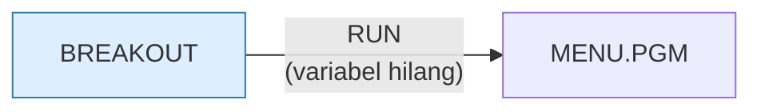

# BREAKOUT.BAS — Spinout (Breakout)

> K.R. Sloan Jr., 1 Jan 1982. Memakai GET/PUT dengan XOR agar paddle bergerak tanpa kedip.

| | |
|---|---|
| Sumber | Public domain / listing majalah lain-lain |
| Tahun | 1982 |
| Panjang | 164 baris (nomor 10–1530) |
| Subrutin | 1, dipanggil dari 2 tempat |
| Percabangan | 27 `GOTO`, 2 `GOSUB`, 0 target `ON…` |
| Komentar | 4% dari baris |
| Jalankan | `run\BREAKOUT.bat` |

## Peta arsitektur

*Diagram di bawah ini bukan tafsiran — semuanya diturunkan langsung dari
kode: tiap panah adalah `GOSUB` yang benar-benar ada, tiap kotak adalah
blok antara sebuah entri dan `RETURN`-nya.*

Hanya ada 1 subrutin, jadi diagram tidak menambah apa pun.

### Subrutin dan perannya

| Baris | Panjang | Dipanggil | Peran (diambil dari kode) |
|---|--:|--:|---|
| `1410`–`1490` | 9 baris | 2× | move paddle routine |

### Program lain yang dimuat



### Perulangan utama

`GOTO` mundur terpanjang: dari baris **1300** kembali ke **740** — melingkupi 560 nomor baris.
Itulah loop utama program ini; segala sesuatu di dalam rentang tersebut
dijalankan berulang.

## Bagaimana program ini disusun

**Satu subrutin.** Untuk seluruh program 164 baris. Ini arsitektur paling ekstrem
di koleksi, dan justru karena itu paling instruktif.

Semuanya ada di alur utama, dengan tiga loop bersarang:

- 160←260 (100 baris) — konfigurasi tombol
- 740←1300 (560 baris) — **loop permainan**
- satu-satunya `GOSUB` (1410) — `move paddle routine`, dipanggil 2×

Kenapa hanya paddle yang dijadikan subrutin? Karena itu satu-satunya kode yang
benar-benar dibutuhkan di dua tempat berbeda.

Yang membuat struktur sesederhana ini bisa bekerja adalah pilihan teknik
grafisnya. Dengan `PUT ... , XOR`, menggerakkan objek tidak butuh menyimpan latar
belakang, tidak butuh menggambar ulang layar, dan tidak butuh mengelola daftar
objek:

```basic
40 DIM BALL[14] : 50 DIM PADDLE[9] : 60 DIM BRICK[20,4]
```

Tiga sprite, tiga array, selesai. **Teknik yang tepat menghapus kebutuhan akan
arsitektur.** Itu pelajaran yang sering terlewat: sebelum menyusun lapisan-
lapisan abstraksi, periksa dulu apakah ada cara yang membuat masalahnya hilang.

Baris terpanjangnya cuma 69 kolom — terpendek di koleksi.

## Yang menarik dari kodenya

Berjudul asli "IBM PC Spinout", ditulis K.R. Sloan Jr. pada **1 Januari 1982** —
salah satu program tertua yang ditulis khusus untuk IBM PC di koleksi ini
(PC baru dirilis Agustus 1981).

Ini contoh terbaik teknik `GET`/`PUT` dengan mode `XOR`:

```basic
40 DIM BALL[14]
50 DIM PADDLE[9]
60 DIM BRICK[20,4]
```

(Perhatikan kurung siku — GW-BASIC menerima `[` dan `(` untuk indeks array.
Kebiasaan yang datang dari BASIC di mesin lain.)

Gambar bola, paddle, dan bata masing-masing di-`GET` sekali ke array, lalu
di-`PUT` dengan `XOR`. Karena XOR dua kali mengembalikan keadaan semula,
menggerakkan bola cukup dengan: PUT di posisi lama (menghapus), PUT di posisi
baru (menggambar). **Tidak perlu menyimpan latar belakang, tidak perlu
menggambar ulang layar, tidak ada kedip.**

Yang juga menonjol: baris terpanjangnya hanya **69 kolom** — terpendek di
seluruh koleksi. Bandingkan dengan `ANATOMY.BAS` (250 kolom). Program ini bisa
dibaca tanpa menggulung layar ke samping. Itu keputusan sadar, dan hasilnya
program aksi 164 baris yang tetap terbaca.

Baris 90–150 meminta pemain memilih tombolnya sendiri untuk kiri dan kanan,
lalu menyimpannya di `L$` dan `R$`. Konfigurasi tombol, di tahun 1982.

## Yang bisa dipelajari

- `PUT ... , XOR` adalah cara menggerakkan objek tanpa kedip dan tanpa menyimpan latar.
- Batasi panjang baris. 69 kolom di sini membuktikan program aksi tidak harus ditulis padat.
- Biarkan pemain memilih tombolnya sendiri. Murah untuk dibuat, besar dampaknya.

## Yang jangan ditiru

- Campur `[` dan `(` untuk array. Sah di GW-BASIC, tapi tidak portabel dan membingungkan.

## Lampiran

### Perkakas bahasa yang dipakai

`PLAY` — musik lewat bahasa makro not, `SOUND` — nada mentah (frekuensi, durasi), `GET`/`PUT` — sprite disalin ke/dari array, `LINE` — menggambar garis & kotak, `PSET`/`PRESET` — piksel tunggal, mode grafis CGA (`SCREEN 1`/`2`), `PEEK` — baca memori langsung, `POKE` — tulis memori langsung, `DEF SEG` — pindah segmen memori, `INKEY$` — baca tombol tanpa menunggu Enter, `RUN "nama"` — muat program lain, variabel hilang, `RANDOMIZE` — menyemai pengacak, `LOCATE` — posisikan kursor, `COLOR` — warna teks

### Deklarasi array

```basic
DIM BALL[14]
DIM PADDLE[9]
DIM BRICK[20,4]
```

### Sepuluh baris pembuka

```basic
10 REM ibm pc spinout
20 REM K.R. Sloan, Jr.
30 REM 1 January 1982
40 DIM BALL[14]
50 DIM PADDLE[9]
60 DIM BRICK[20,4]
65 RANDOMIZE(VAL(RIGHT$(TIME$,2)))
70 KEY OFF:PLAY "mb"
80 LOUD=0
90 BRUNO$="l16o2b-o3cl8ddc+16do2fp1"
```

---
[Dasar-dasar BASIC](00-DASAR-BASIC.md) · [Daftar review](README.md) · [Katalog koleksi](../README.md)
