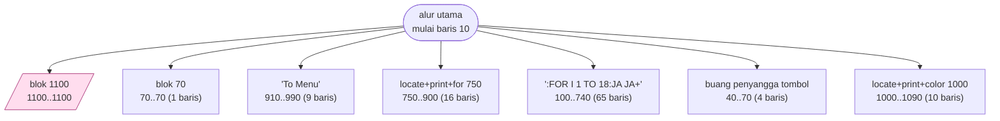
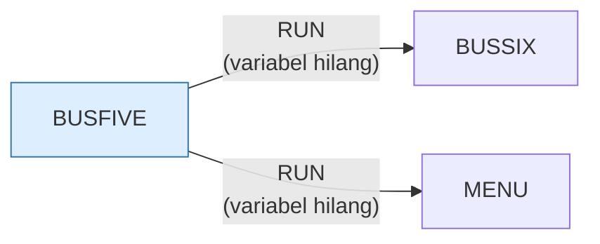

# BUSFIVE.BAS — Business Simulation, bagian 5

> Memperkenalkan worksheet. Berantai ke BUSSIX.

| | |
|---|---|
| Sumber | Friendlyware PC Introductory Set |
| Tahun | 1982 |
| Panjang | 110 baris (nomor 10–1100) |
| Subrutin | 7, dipanggil dari 9 tempat |
| Percabangan | 1 `GOTO`, 9 `GOSUB`, 2 target `ON…` |
| Komentar | 0% dari baris |
| Jalankan | `run\BUSFIVE.bat` |

## Peta arsitektur

*Diagram di bawah ini bukan tafsiran — semuanya diturunkan langsung dari
kode: tiap panah adalah `GOSUB` yang benar-benar ada, tiap kotak adalah
blok antara sebuah entri dan `RETURN`-nya.*



Kotak bersudut miring berwarna = **penangan kejadian** (`ON KEY`/`ON ERROR`), yang dipanggil oleh interupsi, bukan oleh alur utama.

### Subrutin dan perannya

| Baris | Panjang | Dipanggil | Peran (diambil dari kode) |
|---|--:|--:|---|
| `40`–`70` | 4 baris | 2× | buang penyangga tombol |
| `910`–`990` | 9 baris | 2× | "To Menu" |
| `70`–`70` | 1 baris | 1× | blok @70 |
| `100`–`740` | 65 baris | 1× | ":FOR I=1 TO 18:JA=JA+" |
| `750`–`900` | 16 baris | 1× | locate+print+for @750 |
| `1000`–`1090` | 10 baris | 1× | locate+print+color @1000 |
| `1100`–`1100` | 1 baris | 1× | blok @1100 *(handler)* ⚠ tanpa `RETURN` |

### Program lain yang dimuat



### Kejadian yang dijebak

- `ON KEY(10)` → baris 1100

## Bagaimana program ini disusun

Bagian kelima dari rangkaian sepuluh bagian. Arsitektur seluruh rangkaian identik,
dan sengaja: **kerangka yang disalin ke sepuluh berkas**.

Kerangka itu terdiri dari tiga bagian tetap:

```basic
20 FOR A=1 TO 9:KEY(A) ON:ON KEY(A) GOSUB 70:NEXT   ' matikan F1-F9
40 POKE 106,0                                        ' buang tombol menumpuk
50 IF INKEY$<>"" THEN 40
60 RESP$=INKEY$:IF RESP$="" THEN 60                  ' tunggu satu tombol
70 RETURN
```

Rutin 40–70 itulah yang dipanggil paling sering di tiap berkas — ia adalah
"tombol Lanjut" yang memisahkan satu halaman pelajaran dari berikutnya. Alur
utamanya kemudian cuma berupa selang-seling: *gambar halaman, tunggu tombol,
gambar halaman, tunggu tombol*, lalu `RUN "BUSSIX"`.

Ini arsitektur presentasi yang sama dengan `ANATOMY.BAS`, hanya saja di sini
tiap "halaman" cukup besar sehingga harus dipecah ke berkas terpisah.

Baris 100–740 adalah satu subrutin sepanjang 65 baris yang merakit tabel
worksheet karakter demi karakter. Blok sebesar itu di tengah program
presentasi adalah tanda bahwa datanya seharusnya ada di `DATA`, bukan di
kode.

Penjelasan lengkap soal teknik overlay ada di [BUSONE.md](BUSONE.md).

## Yang menarik dari kodenya

Bagian kelima dari tutorial sepuluh bagian Friendlyware. Kerangkanya (jebakan F1–F9, `POKE 106,0` untuk membuang tombol menumpuk, rutin tunggu-tombol di baris 40–70) identik dengan berkas lainnya — penjelasan lengkapnya ada di [BUSONE.md](BUSONE.md).

Baris 30 menyimpan karakter kotak yang sering dipakai ke variabel pendek (`A="║"`, `B="═"`, `C="│"`). Itu tabel konstanta — ide yang benar, hanya nama variabelnya yang tidak menolong siapa pun.

## Yang bisa dipelajari

- Bandingkan berkas ini dengan `BUSONE.BAS` baris demi baris: bagian yang identik adalah 'kerangka', bagian yang berbeda adalah 'isi'. Memisahkan keduanya adalah latihan dasar yang bagus.

## Yang jangan ditiru

- Duplikasi kerangka. Lihat [BUSONE.md](BUSONE.md).

## Lampiran

### Perkakas bahasa yang dipakai

`POKE` — tulis memori langsung, `DEF SEG` — pindah segmen memori, `ON KEY(n) GOSUB` — jebakan tombol fungsi, `ON x GOSUB` — pemanggilan berindeks, `INKEY$` — baca tombol tanpa menunggu Enter, `RUN "nama"` — muat program lain, variabel hilang, `DEFSTR` — variabel default teks, `LOCATE` — posisikan kursor, `COLOR` — warna teks

### Sepuluh baris pembuka

```basic
10 DEF SEG:SCREEN 0,0,0:KEY(10) ON:ON KEY(10) GOSUB 1100
20 FOR A=1 TO 9:KEY(A) ON:ON KEY(A) GOSUB 70:NEXT:DEFSTR A-E,J,L
30 A="║":B="═":C="│":D="╦":E="╔":GOTO 80
40 POKE 106,0
50 IF INKEY$<>"" THEN 40
60 RESP$=INKEY$:IF RESP$="" THEN 60
70 RETURN
80 CLS:GOSUB 910:GOSUB 750:GOSUB 100:GOSUB 40
90 CLS:NO=1:GOSUB 910:GOSUB 1000:GOSUB 40:RUN"BUSSIX"
100 JA=E+B+B
```

---
[Dasar-dasar BASIC](00-DASAR-BASIC.md) · [Daftar review](README.md) · [Katalog koleksi](../README.md)
