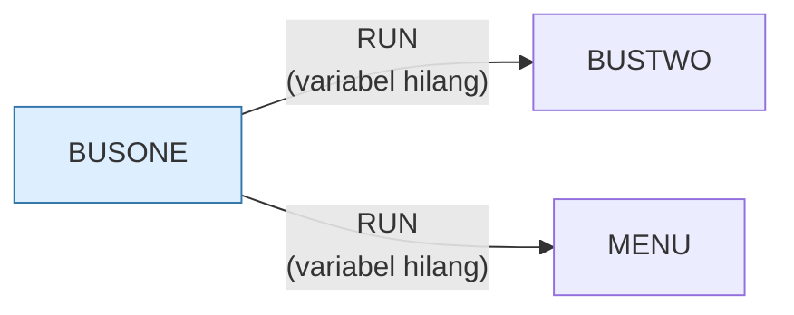

# BUSONE.BAS — Business Simulation, bagian 1

> Menu #2 pilihan A. Bagian pertama tutorial berantai sepuluh bagian; RUN BUSTWO di akhir.

| | |
|---|---|
| Sumber | Friendlyware PC Introductory Set |
| Tahun | 1982 |
| Panjang | 138 baris (nomor 10–1380) |
| Subrutin | 14, dipanggil dari 37 tempat |
| Percabangan | 1 `GOTO`, 37 `GOSUB`, 2 target `ON…` |
| Komentar | 0% dari baris |
| Jalankan | `run\BUSONE.bat` |

## Peta arsitektur

*Diagram di bawah ini bukan tafsiran — semuanya diturunkan langsung dari
kode: tiap panah adalah `GOSUB` yang benar-benar ada, tiap kotak adalah
blok antara sebuah entri dan `RETURN`-nya.*

```mermaid
flowchart TD
    MAIN(["alur utama<br/>mulai baris 10"])
    S50["buang penyangga tombol<br/>50..80 (4 baris)"]
    S700["gambar ulang layar<br/>700..770 (8 baris)"]
    S780["locate+print+for 780<br/>780..830 (6 baris)"]
    S840["locate+print+for 840<br/>840..890 (6 baris)"]
    S900["locate+print+for 900<br/>900..950 (6 baris)"]
    S960["locate+print+for 960<br/>960..1010 (6 baris)"]
    S1020["locate+print+for 1020<br/>1020..1070 (6 baris)"]
    S1080["locate+print+for 1080<br/>1080..1130 (6 baris)"]
    S1140["locate+print+for 1140<br/>1140..1190 (6 baris)"]
    S1200["locate+print+for 1200<br/>1200..1250 (6 baris)"]
    MORE["... 4 subrutin lain"]
    MAIN -.-> MORE
    MAIN --> S50
    MAIN --> S700
    MAIN --> S780
    MAIN --> S840
    MAIN --> S900
    MAIN --> S960
    MAIN --> S1020
    MAIN --> S1080
    MAIN --> S1140
    MAIN --> S1200
```



Kotak bersudut miring berwarna = **penangan kejadian** (`ON KEY`/`ON ERROR`), yang dipanggil oleh interupsi, bukan oleh alur utama.

### Subrutin dan perannya

| Baris | Panjang | Dipanggil | Peran (diambil dari kode) |
|---|--:|--:|---|
| `50`–`80` | 4 baris | 13× | buang penyangga tombol |
| `700`–`770` | 8 baris | 3× | gambar ulang layar |
| `780`–`830` | 6 baris | 2× | locate+print+for @780 |
| `840`–`890` | 6 baris | 2× | locate+print+for @840 |
| `900`–`950` | 6 baris | 2× | locate+print+for @900 |
| `960`–`1010` | 6 baris | 2× | locate+print+for @960 |
| `1020`–`1070` | 6 baris | 2× | locate+print+for @1020 |
| `1080`–`1130` | 6 baris | 2× | locate+print+for @1080 |
| `1140`–`1190` | 6 baris | 2× | locate+print+for @1140 |
| `1200`–`1250` | 6 baris | 2× | locate+print+for @1200 |
| `1260`–`1310` | 6 baris | 2× | locate+print+for @1260 |
| `80`–`80` | 1 baris | 1× | blok @80 |
| `1320`–`1370` | 6 baris | 1× | locate+print+for @1320 |
| `1380`–`1380` | 1 baris | 1× | blok @1380 *(handler)* ⚠ tanpa `RETURN` |

### Program lain yang dimuat



### Kejadian yang dijebak

- `ON KEY(10)` → baris 1380

## Bagaimana program ini disusun

Bagian pertama dari **satu tutorial akuntansi sepuluh bagian** yang saling
berantai. Arsitekturnya adalah contoh terbersih *overlay* di koleksi ini.

Rutin tunggu-tombol di baris 50–80 dipanggil **13 kali** — angka tertinggi di
berkas ini. Itu memberi tahu Anda bentuk programnya tanpa perlu membaca kodenya:
tiga belas halaman pelajaran, dipisahkan oleh tiga belas jeda.

Sisanya adalah tujuh subrutin penggambar halaman (700, 780, 840, 900, 960, 1020,
1080), masing-masing 6–8 baris, masing-masing dipanggil 2–3 kali. Halaman yang
sama digambar ulang setelah pemakai kembali dari layar lain.

### Kenapa dipecah sepuluh berkas

Karena memori. Seluruh materi tidak muat sekaligus di mesin 64 KB, jadi tiap
bagian memuat dirinya, menjalankan pelajarannya, lalu `RUN "BUSTWO"` yang
**membuang seluruh program saat ini** dan menggantinya.

Padanan modernnya *code splitting* dan *lazy loading*. Persoalannya sama (kode
lebih besar dari yang mau dimuat sekaligus), solusinya sama (pecah, muat
bergantian), dan konsekuensinya juga sama: **keadaan hilang saat berpindah**.

Di sini keadaan memang tidak perlu diteruskan, jadi `RUN` cukup. Kalau perlu,
`CHAIN` + `COMMON` yang dipakai — lihat `MORTGAGE.BAS` dan `READING.BAS`.

## Yang menarik dari kodenya

Bagian pertama dari **satu tutorial akuntansi sepuluh bagian** yang saling
berantai: `BUSONE` → `BUSTWO` → … → `BUSTEN` → kembali ke `MENU`. Baca review
ini dulu; sembilan berkas lainnya memakai kerangka yang persis sama.

Kenapa dipecah sepuluh? Karena **memori**. Seluruh materi tidak muat sekaligus
di mesin 64 KB, jadi tiap bagian memuat dirinya, menjalankan pelajarannya, lalu
memanggil `RUN "BUSTWO"` yang membuang seluruh program saat ini dan
menggantinya. Teknik ini disebut *overlay*.

Padanan modernnya adalah *code splitting* dan *lazy loading* di aplikasi web:
masalahnya sama (kode lebih besar daripada yang mau dimuat sekaligus), solusinya
sama (pecah, muat bergantian), dan kelemahannya juga sama — **keadaan program
hilang saat berpindah**. Di sini keadaan memang tidak perlu diteruskan, jadi
`RUN` cukup; kalau perlu, `CHAIN` + `COMMON` yang dipakai.

Kerangka bersama yang muncul di kesepuluh berkas:

```basic
20 FOR A=1 TO 9:KEY(A) ON:ON KEY(A) GOSUB 80:NEXT    ' matikan F1-F9
40 POKE 106,0                                         ' buang tombol menumpuk
50 IF INKEY$<>"" THEN 40
60 R$=INKEY$:IF R$="" THEN 60                         ' tunggu satu tombol
80 RETURN
```

Baris 20 menjebak F1–F9 ke subrutin kosong. Tujuannya bukan menangani tombol
itu, melainkan **menonaktifkannya** — tombol yang dijebak tidak lagi masuk ke
penyangga biasa. Cara Friendlyware mengunci antarmuka.

## Yang bisa dipelajari

- *Overlay* adalah nenek moyang *code splitting*. Persoalan dan konsekuensinya belum berubah.
- `RUN` membuang variabel, `CHAIN` + `COMMON` mempertahankannya. Pilih berdasarkan apakah keadaan perlu diteruskan.
- Kerangka bersama yang disalin ke sepuluh berkas adalah cara kuno membuat *library*. Perhatikan biayanya di poin berikutnya.

## Yang jangan ditiru

- Menyalin kerangka yang sama ke sepuluh berkas. Kalau ada bug di rutin tunggu-tombol, ia harus diperbaiki sepuluh kali — dan pasti ada yang terlewat.
- Nol komentar di kesepuluh berkas.

## Lampiran

### Perkakas bahasa yang dipakai

`POKE` — tulis memori langsung, `ON KEY(n) GOSUB` — jebakan tombol fungsi, `ON x GOTO` — percabangan berindeks, `ON x GOSUB` — pemanggilan berindeks, `INKEY$` — baca tombol tanpa menunggu Enter, `CHAIN` — muat program lain, bawa variabel, `RUN "nama"` — muat program lain, variabel hilang, `LOCATE` — posisikan kursor, `COLOR` — warna teks

### Sepuluh baris pembuka

```basic
10   KEY OFF:KEY(10) ON
20 FOR A=1 TO 9:KEY(A) ON:ON KEY(A) GOSUB 80:NEXT
30  ON KEY(10) GOSUB 1380
40  GOTO 90
50  POKE 106,0
60  IF INKEY$<>"" THEN 50
70  R$=INKEY$:IF R$="" THEN 70
80  RETURN
90  CLS:COLOR 3,0
100  LOCATE 1,1,0:PRINT"╔"
```

---
[Dasar-dasar BASIC](00-DASAR-BASIC.md) · [Daftar review](README.md) · [Katalog koleksi](../README.md)
