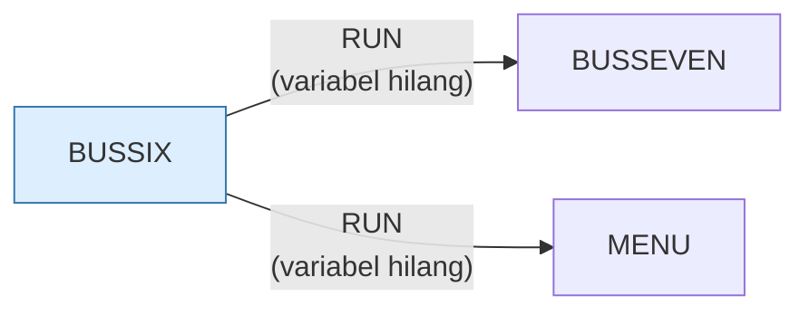

# BUSSIX.BAS — Business Simulation, bagian 6

> Pengurangan pendapatan dan biaya. Berantai ke BUSSEVEN.

| | |
|---|---|
| Sumber | Friendlyware PC Introductory Set |
| Tahun | 1982 |
| Panjang | 102 baris (nomor 10–1020) |
| Subrutin | 11, dipanggil dari 23 tempat |
| Percabangan | 1 `GOTO`, 23 `GOSUB`, 2 target `ON…` |
| Komentar | 0% dari baris |
| Jalankan | `run\BUSSIX.bat` |

## Peta arsitektur

*Diagram di bawah ini bukan tafsiran — semuanya diturunkan langsung dari
kode: tiap panah adalah `GOSUB` yang benar-benar ada, tiap kotak adalah
blok antara sebuah entri dan `RETURN`-nya.*

```mermaid
flowchart TD
    MAIN(["alur utama<br/>mulai baris 10"])
    S40["buang penyangga tombol<br/>40..70 (4 baris)"]
    S70["blok 70<br/>70..70 (1 baris)"]
    S150["gambar ulang layar<br/>150..220 (8 baris)"]
    S230["locate+print+for 230<br/>230..270 (5 baris)"]
    S280["color+locate+print 280<br/>280..360 (9 baris)"]
    S370["'ABC Hardware'<br/>370..500 (14 baris)"]
    S510["color+locate+print 510<br/>510..600 (10 baris)"]
    S610["'ABC Hardware'<br/>610..730 (13 baris)"]
    S740["color+locate+print 740<br/>740..820 (9 baris)"]
    S830["'ABC Hardware'<br/>830..1010 (19 baris)"]
    MORE["... 1 subrutin lain"]
    MAIN -.-> MORE
    MAIN --> S70
    MAIN --> S150
    MAIN --> S280
    MAIN --> S40
    MAIN --> S230
    MAIN --> S370
    MAIN --> S510
    MAIN --> S610
    MAIN --> S740
    MAIN --> S830
```



Kotak bersudut miring berwarna = **penangan kejadian** (`ON KEY`/`ON ERROR`), yang dipanggil oleh interupsi, bukan oleh alur utama.

### Subrutin dan perannya

| Baris | Panjang | Dipanggil | Peran (diambil dari kode) |
|---|--:|--:|---|
| `40`–`70` | 4 baris | 6× | buang penyangga tombol |
| `150`–`220` | 8 baris | 6× | gambar ulang layar |
| `230`–`270` | 5 baris | 3× | locate+print+for @230 |
| `70`–`70` | 1 baris | 1× | blok @70 |
| `280`–`360` | 9 baris | 1× | color+locate+print @280 |
| `370`–`500` | 14 baris | 1× | "ABC Hardware" |
| `510`–`600` | 10 baris | 1× | color+locate+print @510 |
| `610`–`730` | 13 baris | 1× | "ABC Hardware" |
| `740`–`820` | 9 baris | 1× | color+locate+print @740 |
| `830`–`1010` | 19 baris | 1× | "ABC Hardware" |
| `1020`–`1020` | 1 baris | 1× | blok @1020 *(handler)* ⚠ tanpa `RETURN` |

### Program lain yang dimuat



### Kejadian yang dijebak

- `ON KEY(10)` → baris 1020

## Bagaimana program ini disusun

Bagian keenam dari rangkaian sepuluh bagian. Arsitektur seluruh rangkaian identik,
dan sengaja: **kerangka yang disalin ke sepuluh berkas**.

Kerangka itu terdiri dari tiga bagian tetap:

```basic
20 FOR A=1 TO 9:KEY(A) ON:ON KEY(A) GOSUB 70:NEXT   ' matikan F1-F9
40 POKE 106,0                                        ' buang tombol menumpuk
50 IF INKEY$<>"" THEN 40
60 RESP$=INKEY$:IF RESP$="" THEN 60                  ' tunggu satu tombol
70 RETURN
```

Rutin 40–70 itulah yang dipanggil paling sering di tiap berkas — ia adalah
"tombol Lanjut" yang memisahkan satu halaman pelajaran dari berikutnya. Alur
utamanya kemudian cuma berupa selang-seling: *gambar halaman, tunggu tombol,
gambar halaman, tunggu tombol*, lalu `RUN "BUSSEVEN"`.

Ini arsitektur presentasi yang sama dengan `ANATOMY.BAS`, hanya saja di sini
tiap "halaman" cukup besar sehingga harus dipecah ke berkas terpisah.

Sebelas subrutin — terbanyak di rangkaian. Rutin bingkai di 150 dipanggil
enam kali, satu untuk tiap layar laporan keuangan.

Penjelasan lengkap soal teknik overlay ada di [BUSONE.md](BUSONE.md).

## Yang menarik dari kodenya

Bagian keenam dari tutorial sepuluh bagian Friendlyware. Kerangkanya (jebakan F1–F9, `POKE 106,0` untuk membuang tombol menumpuk, rutin tunggu-tombol di baris 40–70) identik dengan berkas lainnya — penjelasan lengkapnya ada di [BUSONE.md](BUSONE.md).

Materinya pengurangan pendapatan dan biaya. Angka-angka laporan keuangannya ditulis langsung di dalam `PRINT` (lihat baris 950: `" $3,500.00"`), jadi ini demonstrasi statis, bukan perhitungan.

## Yang bisa dipelajari

- Bandingkan berkas ini dengan `BUSONE.BAS` baris demi baris: bagian yang identik adalah 'kerangka', bagian yang berbeda adalah 'isi'. Memisahkan keduanya adalah latihan dasar yang bagus.

## Yang jangan ditiru

- Duplikasi kerangka. Lihat [BUSONE.md](BUSONE.md).

## Lampiran

### Perkakas bahasa yang dipakai

`POKE` — tulis memori langsung, `DEF SEG` — pindah segmen memori, `ON KEY(n) GOSUB` — jebakan tombol fungsi, `ON x GOSUB` — pemanggilan berindeks, `INKEY$` — baca tombol tanpa menunggu Enter, `RUN "nama"` — muat program lain, variabel hilang, `LOCATE` — posisikan kursor, `COLOR` — warna teks

### Sepuluh baris pembuka

```basic
10 DEF SEG:SCREEN 0,0,0:KEY(10) ON:ON KEY(10) GOSUB 1020
20 FOR A=1 TO 9:KEY(A) ON:ON KEY(A) GOSUB 70:NEXT
30 GOTO 80
40 POKE 106,0
50 IF INKEY$<>"" THEN 40
60 RESP$=INKEY$:IF RESP$="" THEN 60
70 RETURN
80 GOSUB 150:GOSUB 280:GOSUB 40
90 GOSUB 150:GOSUB 230:GOSUB 370:GOSUB 40
100 GOSUB 150:GOSUB 510:GOSUB 40
```

### Baris terpanjang (115 kolom)

```basic
950 LOCATE 19,8:PRINT"Total liabilities":LOCATE 19,54:FOR I= 1 TO 10:PRINT "─";:NEXT:LOCATE 19,64:PRINT" $3,500.00"
```

---
[Dasar-dasar BASIC](00-DASAR-BASIC.md) · [Daftar review](README.md) · [Katalog koleksi](../README.md)
