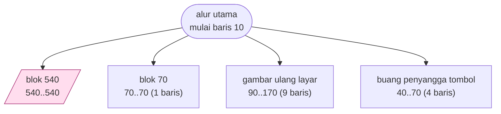

# BUSTEN.BAS — Business Simulation, bagian 10

> Bagian terakhir; kembali ke MENU.

| | |
|---|---|
| Sumber | Friendlyware PC Introductory Set |
| Tahun | 1982 |
| Panjang | 54 baris (nomor 10–540) |
| Subrutin | 4, dipanggil dari 6 tempat |
| Percabangan | 2 `GOTO`, 6 `GOSUB`, 2 target `ON…` |
| Komentar | 2% dari baris |
| Jalankan | `run\BUSTEN.bat` |

## Peta arsitektur

*Diagram di bawah ini bukan tafsiran — semuanya diturunkan langsung dari
kode: tiap panah adalah `GOSUB` yang benar-benar ada, tiap kotak adalah
blok antara sebuah entri dan `RETURN`-nya.*



Kotak bersudut miring berwarna = **penangan kejadian** (`ON KEY`/`ON ERROR`), yang dipanggil oleh interupsi, bukan oleh alur utama.

### Subrutin dan perannya

| Baris | Panjang | Dipanggil | Peran (diambil dari kode) |
|---|--:|--:|---|
| `40`–`70` | 4 baris | 2× | buang penyangga tombol |
| `90`–`170` | 9 baris | 2× | gambar ulang layar |
| `70`–`70` | 1 baris | 1× | blok @70 |
| `540`–`540` | 1 baris | 1× | blok @540 *(handler)* ⚠ tanpa `RETURN` |

### Program lain yang dimuat


### Kejadian yang dijebak

- `ON KEY(10)` → baris 540

## Bagaimana program ini disusun

Bagian kesepuluh dan terakhir dari rangkaian sepuluh bagian. Arsitektur seluruh rangkaian identik,
dan sengaja: **kerangka yang disalin ke sepuluh berkas**.

Kerangka itu terdiri dari tiga bagian tetap:

```basic
20 FOR A=1 TO 9:KEY(A) ON:ON KEY(A) GOSUB 70:NEXT   ' matikan F1-F9
40 POKE 106,0                                        ' buang tombol menumpuk
50 IF INKEY$<>"" THEN 40
60 RESP$=INKEY$:IF RESP$="" THEN 60                  ' tunggu satu tombol
70 RETURN
```

Rutin 40–70 itulah yang dipanggil paling sering di tiap berkas — ia adalah
"tombol Lanjut" yang memisahkan satu halaman pelajaran dari berikutnya. Alur
utamanya kemudian cuma berupa selang-seling: *gambar halaman, tunggu tombol,
gambar halaman, tunggu tombol*, lalu `RUN "MENU"`.

Ini arsitektur presentasi yang sama dengan `ANATOMY.BAS`, hanya saja di sini
tiap "halaman" cukup besar sehingga harus dipecah ke berkas terpisah.

Bagian penutup: merangkum, lalu kembali ke `MENU` alih-alih ke bagian
berikutnya. Rantai overlay berhenti di sini.

Penjelasan lengkap soal teknik overlay ada di [BUSONE.md](BUSONE.md).

## Yang menarik dari kodenya

Bagian kesepuluh dan terakhir dari tutorial sepuluh bagian Friendlyware. Kerangkanya (jebakan F1–F9, `POKE 106,0` untuk membuang tombol menumpuk, rutin tunggu-tombol di baris 40–70) identik dengan berkas lainnya — penjelasan lengkapnya ada di [BUSONE.md](BUSONE.md).

Bagian penutup: merangkum dan kembali ke `MENU`. Isinya nyaris seluruhnya teks penutup yang ramah — lihat baris 250 dan sesudahnya.

## Yang bisa dipelajari

- Bandingkan berkas ini dengan `BUSONE.BAS` baris demi baris: bagian yang identik adalah 'kerangka', bagian yang berbeda adalah 'isi'. Memisahkan keduanya adalah latihan dasar yang bagus.

## Yang jangan ditiru

- Duplikasi kerangka. Lihat [BUSONE.md](BUSONE.md).

## Lampiran

### Perkakas bahasa yang dipakai

`POKE` — tulis memori langsung, `DEF SEG` — pindah segmen memori, `ON KEY(n) GOSUB` — jebakan tombol fungsi, `ON x GOSUB` — pemanggilan berindeks, `INKEY$` — baca tombol tanpa menunggu Enter, `RUN "nama"` — muat program lain, variabel hilang, `WHILE`/`WEND` — perulangan berkondisi, `LOCATE` — posisikan kursor, `COLOR` — warna teks

### Sepuluh baris pembuka

```basic
10 DEF SEG:SCREEN 0,0,0:KEY(10) ON:ON KEY(10) GOSUB 540
20 FOR A=1 TO 9:KEY(A) ON:ON KEY(A) GOSUB 70:NEXT
30  GOTO 80
40  POKE 106,0
50  IF INKEY$<>"" THEN 40
60  RESP$=INKEY$:IF RESP$="" THEN 60
70  RETURN
80  GOSUB 90:GOTO 180
90 CLS:PRINT:COLOR 0,7:PRINT" F10 ";:COLOR 7,0:PRINT" To Menu":COLOR 11,0
100 FOR I=1 TO 3 STEP 2:FOR J=20 TO 62:LOCATE I,J,0:PRINT "─":NEXT:NEXT
```

### Baris terpanjang (108 kolom)

```basic
250    COLOR 11,0:LOCATE ,14:PRINT" A) ";:COLOR 7,0:PRINT"We wanted to demonstrate the efficiency and power"
```

---
[Dasar-dasar BASIC](00-DASAR-BASIC.md) · [Daftar review](README.md) · [Katalog koleksi](../README.md)
