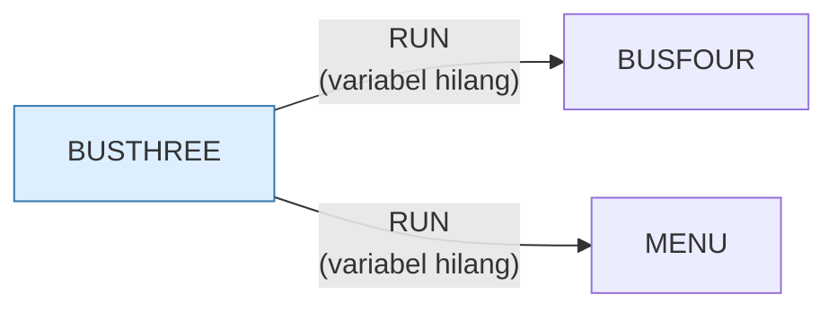

# BUSTHREE.BAS — Business Simulation, bagian 3

> Berantai ke BUSFOUR.

| | |
|---|---|
| Sumber | Friendlyware PC Introductory Set |
| Tahun | 1982 |
| Panjang | 125 baris (nomor 1–1440) |
| Subrutin | 13, dipanggil dari 23 tempat |
| Percabangan | 1 `GOTO`, 23 `GOSUB`, 2 target `ON…` |
| Komentar | 0% dari baris |
| Jalankan | `run\BUSTHREE.bat` |

## Peta arsitektur

*Diagram di bawah ini bukan tafsiran — semuanya diturunkan langsung dari
kode: tiap panah adalah `GOSUB` yang benar-benar ada, tiap kotak adalah
blok antara sebuah entri dan `RETURN`-nya.*

```mermaid
flowchart TD
    MAIN(["alur utama<br/>mulai baris 1"])
    S40["buang penyangga tombol<br/>40..70 (4 baris)"]
    S300["':FOR I 1 TO 10:JA JA+'<br/>300..810 (52 baris)"]
    S820["gambar ulang layar<br/>820..880 (7 baris)"]
    S930["'STEP IV. POSTING TO JOURNAL'<br/>930..950 (3 baris)"]
    S960["'STEP V. POSTING TO LEDGERS'<br/>960..970 (2 baris)"]
    S980["locate+print 980<br/>980..1030 (6 baris)"]
    S1040["locate+print+for 1040<br/>1040..1160 (13 baris)"]
    S1170["locate+print+color 1170<br/>1170..1230 (7 baris)"]
    S1240["color+locate+print 1240<br/>1240..1350 (12 baris)"]
    S1360["locate+print+color 1360<br/>1360..1430 (8 baris)"]
    MORE["... 3 subrutin lain"]
    MAIN -.-> MORE
    MAIN --> S820
    MAIN --> S980
    MAIN --> S300
    MAIN --> S40
    MAIN --> S930
    MAIN --> S1040
    MAIN --> S1170
    MAIN --> S960
    MAIN --> S1240
    MAIN --> S1360
```



Kotak bersudut miring berwarna = **penangan kejadian** (`ON KEY`/`ON ERROR`), yang dipanggil oleh interupsi, bukan oleh alur utama.

### Subrutin dan perannya

| Baris | Panjang | Dipanggil | Peran (diambil dari kode) |
|---|--:|--:|---|
| `40`–`70` | 4 baris | 5× | buang penyangga tombol |
| `820`–`880` | 7 baris | 5× | gambar ulang layar |
| `930`–`950` | 3 baris | 2× | "STEP IV. POSTING TO JOURNAL" |
| `960`–`970` | 2 baris | 2× | "STEP V. POSTING TO LEDGERS" |
| `70`–`70` | 1 baris | 1× | blok @70 |
| `300`–`810` | 52 baris | 1× | ":FOR I=1 TO 10:JA=JA+" |
| `890`–`920` | 4 baris | 1× | "STEP III. TRANSACTIONS OCCUR" |
| `980`–`1030` | 6 baris | 1× | locate+print @980 |
| `1040`–`1160` | 13 baris | 1× | locate+print+for @1040 |
| `1170`–`1230` | 7 baris | 1× | locate+print+color @1170 |
| `1240`–`1350` | 12 baris | 1× | color+locate+print @1240 |
| `1360`–`1430` | 8 baris | 1× | locate+print+color @1360 |
| `1440`–`1440` | 1 baris | 1× | blok @1440 *(handler)* ⚠ tanpa `RETURN` |

### Program lain yang dimuat



### Kejadian yang dijebak

- `ON KEY(10)` → baris 1440

## Bagaimana program ini disusun

Bagian ketiga dari rangkaian sepuluh bagian. Arsitektur seluruh rangkaian identik,
dan sengaja: **kerangka yang disalin ke sepuluh berkas**.

Kerangka itu terdiri dari tiga bagian tetap:

```basic
20 FOR A=1 TO 9:KEY(A) ON:ON KEY(A) GOSUB 70:NEXT   ' matikan F1-F9
40 POKE 106,0                                        ' buang tombol menumpuk
50 IF INKEY$<>"" THEN 40
60 RESP$=INKEY$:IF RESP$="" THEN 60                  ' tunggu satu tombol
70 RETURN
```

Rutin 40–70 itulah yang dipanggil paling sering di tiap berkas — ia adalah
"tombol Lanjut" yang memisahkan satu halaman pelajaran dari berikutnya. Alur
utamanya kemudian cuma berupa selang-seling: *gambar halaman, tunggu tombol,
gambar halaman, tunggu tombol*, lalu `RUN "BUSFOUR"`.

Ini arsitektur presentasi yang sama dengan `ANATOMY.BAS`, hanya saja di sini
tiap "halaman" cukup besar sehingga harus dipecah ke berkas terpisah.

Perhatikan baris 80: dua puluh `GOSUB` berturut-turut dalam satu baris
sepanjang 212 kolom. Itu **daftar putar halaman** yang ditulis sebagai satu
baris kode. Di bahasa modern ia akan jadi array berisi nama fungsi, lalu
satu loop. Bandingkan dengan `ANATOMY.BAS` yang menulis daftar yang sama
sebagai sembilan baris terpisah — dua cara menyamarkan tabel yang sama.

Penjelasan lengkap soal teknik overlay ada di [BUSONE.md](BUSONE.md).

## Yang menarik dari kodenya

Bagian ketiga dari tutorial sepuluh bagian Friendlyware. Kerangkanya (jebakan F1–F9, `POKE 106,0` untuk membuang tombol menumpuk, rutin tunggu-tombol di baris 40–70) identik dengan berkas lainnya — penjelasan lengkapnya ada di [BUSONE.md](BUSONE.md).

Perhatikan baris 80: dua puluh `GOSUB` berturut-turut dalam satu baris sepanjang 212 kolom. Itu sebenarnya sebuah *daftar putar* — urutan halaman pelajaran — yang ditulis sebagai satu baris kode. Di bahasa modern ini akan jadi array berisi nama fungsi.

## Yang bisa dipelajari

- Bandingkan berkas ini dengan `BUSONE.BAS` baris demi baris: bagian yang identik adalah 'kerangka', bagian yang berbeda adalah 'isi'. Memisahkan keduanya adalah latihan dasar yang bagus.

## Yang jangan ditiru

- Duplikasi kerangka. Lihat [BUSONE.md](BUSONE.md).

## Lampiran

### Perkakas bahasa yang dipakai

`POKE` — tulis memori langsung, `DEF SEG` — pindah segmen memori, `ON KEY(n) GOSUB` — jebakan tombol fungsi, `ON x GOSUB` — pemanggilan berindeks, `INKEY$` — baca tombol tanpa menunggu Enter, `RUN "nama"` — muat program lain, variabel hilang, `DEFSTR` — variabel default teks, `LOCATE` — posisikan kursor, `COLOR` — warna teks

### Sepuluh baris pembuka

```basic
1 DEFSTR J,L
10  DEF SEG:SCREEN 0,0,0:KEY(10) ON:ON KEY(10) GOSUB 1440
20 FOR A=1 TO 9:KEY(A) ON:ON KEY(A) GOSUB 70:NEXT
30  GOTO 80
40  POKE 106,0
50  IF INKEY$<>"" THEN 40
60  RESP$=INKEY$:IF RESP$="" THEN 60
70  RETURN
80  GOSUB 820:GOSUB 890:GOSUB 980:GOSUB 300:GOSUB 40:GOSUB 820:GOSUB 930:GOSUB 1040:GOSUB 40:GOSUB 820:GOSUB 930:GOSUB 1170:GOSUB 40:GOSUB 820:GOSUB 960:GOSUB 1240:GOSUB 40:GOSUB 820:GOSUB 960:GOSUB 1
290 RUN"BUSFOUR"
```

### Baris terpanjang (212 kolom)

```basic
80  GOSUB 820:GOSUB 890:GOSUB 980:GOSUB 300:GOSUB 40:GOSUB 820:GOSUB 930:GOSUB 1040:GOSUB 40:GOSUB 820:GOSUB 930:GOSUB 1170:GOSUB 40:GOSUB 820:GOSUB 960:GOSUB 1240:GOSUB 40:GOSUB 820:GOSUB 960:GOSUB 1360:GOSUB 40
```

---
[Dasar-dasar BASIC](00-DASAR-BASIC.md) · [Daftar review](README.md) · [Katalog koleksi](../README.md)
