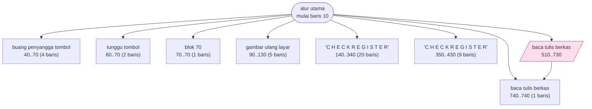
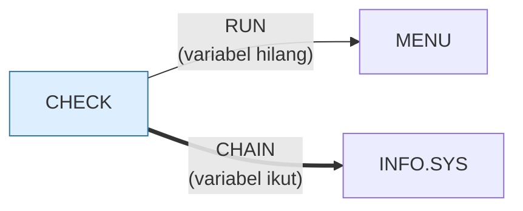

# CHECK.BAS — Buku Cek / Check Book Register

> Menu #2 pilihan J.

| | |
|---|---|
| Sumber | Friendlyware PC Introductory Set |
| Tahun | 1982 |
| Panjang | 65 baris (nomor 10–9000) |
| Subrutin | 8, dipanggil dari 10 tempat |
| Percabangan | 6 `GOTO`, 10 `GOSUB`, 3 target `ON…` |
| Komentar | 2% dari baris |
| Jalankan | `run\CHECK.bat` |

## Peta arsitektur

*Diagram di bawah ini bukan tafsiran — semuanya diturunkan langsung dari
kode: tiap panah adalah `GOSUB` yang benar-benar ada, tiap kotak adalah
blok antara sebuah entri dan `RETURN`-nya.*



Kotak bersudut miring berwarna = **penangan kejadian** (`ON KEY`/`ON ERROR`), yang dipanggil oleh interupsi, bukan oleh alur utama.

### Subrutin dan perannya

| Baris | Panjang | Dipanggil | Peran (diambil dari kode) |
|---|--:|--:|---|
| `90`–`130` | 5 baris | 2× | gambar ulang layar |
| `740`–`740` | 1 baris | 2× | baca/tulis berkas |
| `40`–`70` | 4 baris | 1× | buang penyangga tombol |
| `60`–`70` | 2 baris | 1× | tunggu tombol |
| `70`–`70` | 1 baris | 1× | blok @70 |
| `140`–`340` | 20 baris | 1× | "C H E C K   R E G I S T E R" |
| `350`–`430` | 9 baris | 1× | "C H E C K   R E G I S T E R" |
| `510`–`730` | 4 baris | 1× | baca/tulis berkas *(handler)* |

### Program lain yang dimuat



### Kejadian yang dijebak

- `ON ERROR` → baris 750
- `ON KEY(10)` → baris 510

## Bagaimana program ini disusun

Satu-satunya program di Menu #2 yang benar-benar menulis ke disket, dan
arsitekturnya berubah karenanya: ia butuh **jalur galat**.

```basic
20 ... ON ERROR GOTO 750
```

Alur normalnya sederhana (baris 80 memanggil lima subrutin berurutan lalu
`RUN "menu"`). Yang rumit adalah jalur keduanya, dan di sinilah letak
pelajarannya:

```basic
810 GOSUB 60:IF RS$=CHR$(27) THEN RESUME 820 ELSE ... IF ERL=730 THEN RESUME 730 ELSE IF ERL=740 THEN RESUME 740 ELSE RESUME
```

`ERL` adalah **nomor baris tempat galat terjadi**. Jadi penangan galat memutuskan
ke mana melanjutkan berdasarkan dari mana galat itu datang — dengan nomor baris
ditulis tangan satu per satu.

Ini arsitektur yang rapuh, dan cara mengenali kerapuhannya berguna: **kode ini
tidak bisa dipindahkan.** Menomori ulang program akan merusaknya, dan perintah
`RENUM` GW-BASIC pun tidak bisa menolong karena `ERL=730` hanyalah angka biasa
dalam sebuah ekspresi, bukan referensi yang bisa dilacak.

Aturannya: **jangan bercabang berdasarkan lokasi kode.** Bercabanglah berdasarkan
jenis galat (`ERR`), yang tetap bermakna ke mana pun kode dipindah. Versi
modernnya: jangan pernah `if (e.message === "not found")`.

## Yang menarik dari kodenya

Buku cek Friendlyware, dan satu-satunya program di Menu #2 yang benar-benar
menyimpan data ke berkas (`OPEN`). Karena itu ia juga satu-satunya yang butuh
penanganan galat sungguhan:

```basic
20 ... ON ERROR GOTO 750
810 GOSUB 60:IF RS$=CHR$(27) THEN RESUME 820 ELSE ... IF ERL=730 THEN RESUME 730 ELSE IF ERL=740 THEN RESUME 740 ELSE RESUME
```

Baris 810 memakai `ERL` — nomor baris tempat galat terjadi — untuk memutuskan ke
mana melanjutkan. Ini *stack trace* versi termiskin yang bisa dibayangkan:
penangan galat harus tahu nomor baris tiap pemanggil, satu per satu, ditulis
tangan.

Konsekuensinya brutal: **menomori ulang program akan merusak penanganan galat**,
karena `ERL=730` tidak lagi menunjuk ke tempat yang sama. Perintah `RENUM` di
GW-BASIC memang memperbaiki `GOTO` dan `GOSUB`, tapi tidak bisa memperbaiki
perbandingan `ERL` karena itu cuma angka biasa dalam ekspresi.

Ini pelajaran yang bertahan: **jangan mengambil keputusan berdasarkan lokasi
kode.** Yang benar adalah memberi galat sebuah jenis atau kode, lalu memutuskan
berdasarkan itu. Sama seperti sekarang: jangan pernah bercabang berdasarkan isi
pesan galat (`if (e.message === "not found")`), bercabanglah berdasarkan
jenisnya.

## Yang bisa dipelajari

- `ERR` (jenis galat) dan `ERL` (lokasi galat) adalah dua hal berbeda. Yang layak dipakai untuk memutuskan adalah jenisnya.
- Program yang menyentuh berkas butuh penanganan galat sejak awal, bukan ditambal belakangan.

## Yang jangan ditiru

- Bercabang berdasarkan **lokasi** kode. Itu membuat kode tidak bisa dipindahkan, dan di BASIC tidak bisa dinomori ulang.
- Satu baris `RESUME` bersarang tiga tingkat sepanjang 174 kolom.

## Lampiran

### Perkakas bahasa yang dipakai

`BEEP`, `POKE` — tulis memori langsung, `DEF SEG` — pindah segmen memori, `ON KEY(n) GOSUB` — jebakan tombol fungsi, `ON ERROR GOTO` — penanganan galat, `ON x GOTO` — percabangan berindeks, `ON x GOSUB` — pemanggilan berindeks, `INKEY$` — baca tombol tanpa menunggu Enter, `CHAIN` — muat program lain, bawa variabel, `RUN "nama"` — muat program lain, variabel hilang, `OPEN` — baca/tulis berkas, `LOCATE` — posisikan kursor, `COLOR` — warna teks

### Sepuluh baris pembuka

```basic
10  KEY OFF:DEF SEG:SCREEN 0,0,0:KEY(10) ON:ON KEY(10) GOSUB 510
20 FOR A=1 TO 9:KEY(A) ON:ON KEY(A) GOSUB 70:NEXT:ON ERROR GOTO 750
30  GOTO 80
40  POKE 106,0
50  IF INKEY$<>"" THEN 40
60  RS$=INKEY$:IF RS$="" THEN 60
70  RETURN
80  GOSUB 90:GOSUB 140:GOSUB 40:GOSUB 90:GOSUB 350:RUN"menu
90 CLS:PRINT:COLOR 0,7:PRINT" F10 ";:COLOR 7,0:PRINT" To Menu":COLOR 11,0
100 FOR I=1 TO 3 STEP 2:FOR J=20 TO 62:LOCATE I,J,0:PRINT"─":NEXT:NEXT
```

### Baris terpanjang (174 kolom)

```basic
810 GOSUB 60:IF RS$=CHR$(27) THEN RESUME 820 ELSE LOCATE 24,1:PRINT SPC(79);:LOCATE 25,1:PRINT SPC(79);:IF ERL=730 THEN RESUME 730 ELSE IF ERL=740 THEN RESUME 740 ELSE RESUME
```

---
[Dasar-dasar BASIC](00-DASAR-BASIC.md) · [Daftar review](README.md) · [Katalog koleksi](../README.md)
