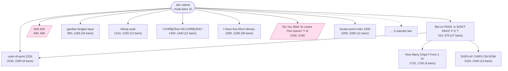
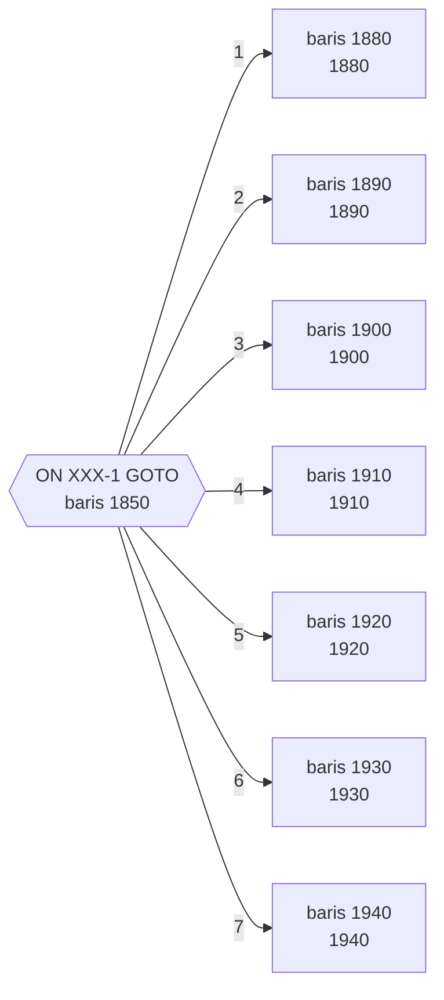
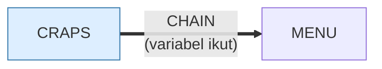

# CRAPS.BAS — Nevada Dice (Craps)

> Menu #1 pilihan L. Taruhan pass / don't-pass.

| | |
|---|---|
| Sumber | Friendlyware PC Introductory Set |
| Tahun | 1982 |
| Panjang | 254 baris (nomor 10–2540) |
| Subrutin | 14, dipanggil dari 24 tempat |
| Percabangan | 31 `GOTO`, 24 `GOSUB`, 17 target `ON…` |
| Komentar | 6% dari baris |
| Jalankan | `run\CRAPS.bat` |

## Peta arsitektur

*Diagram di bawah ini bukan tafsiran — semuanya diturunkan langsung dari
kode: tiap panah adalah `GOSUB` yang benar-benar ada, tiap kotak adalah
blok antara sebuah entri dan `RETURN`-nya.*



Kotak bersudut miring berwarna = **penangan kejadian** (`ON KEY`/`ON ERROR`), yang dipanggil oleh interupsi, bukan oleh alur utama.

### Subrutin dan perannya

| Baris | Panjang | Dipanggil | Peran (diambil dari kode) |
|---|--:|--:|---|
| `840`–`840` | 1 baris | 9× | blok @840 *(handler)* |
| `1210`–`1330` | 13 baris | 2× | hitung acak |
| `2230`–`2300` | 8 baris | 2× | color+if+print @2230 |
| `310`–`570` | 27 baris | 1× | "Bet on `PASS' or `DON'T PASS' <P/D>?" |
| `830`–`840` | 2 baris | 1× | locate+print @830 |
| `850`–`1180` | 34 baris | 1× | gambar bingkai layar |
| `1340`–`1440` | 11 baris | 1× | "+CHR$(254)+A5+CHR$(254)+" |
| `1450`–`1520` | 8 baris | 1× | gambar bingkai layar |
| `1720`–`1750` | 4 baris | 1× | "How Many Chips?   From 1 To" |
| `1830`–`2180` | 36 baris | 1× | t Have Any More Money. |
| `2100`–`2180` | 9 baris | 1× | "Do You Wish To Leave This Game? <Y/N" *(handler)* |
| `2150`–`2180` | 4 baris | 1× | "Strike <F10> To Leave This Game" |
| `2200`–`2300` | 11 baris | 1× | locate+print+color @2200 |
| `2310`–`2440` | 14 baris | 1× | DISPLAY CHIPS ON ROW |

### Tabel dispatch

Program ini punya **1** percabangan berindeks (`ON … GOTO/GOSUB`).
Yang terbesar ada di baris 1850 dengan 7 cabang:



### Program lain yang dimuat



### Kejadian yang dijebak

- `ON KEY(1)` → baris 840
- `ON KEY(10)` → baris 2100
- `ON KEY(2)` → baris 840
- `ON KEY(3)` → baris 840
- `ON KEY(4)` → baris 840
- `ON KEY(5)` → baris 840
- `ON KEY(6)` → baris 840
- `ON KEY(7)` → baris 840
- `ON KEY(8)` → baris 840
- `ON KEY(9)` → baris 840

### Perulangan utama

`GOTO` mundur terpanjang: dari baris **820** kembali ke **160** — melingkupi 660 nomor baris.
Itulah loop utama program ini; segala sesuatu di dalam rentang tersebut
dijalankan berulang.

## Bagaimana program ini disusun

Empat belas subrutin, tapi yang paling sering dipanggil (baris 840, sembilan
kali) isinya kosong — ia penangan untuk F1 sampai F9 yang dijebak hanya untuk
dimatikan. Pola yang sama dengan `BIO.BAS`.

Arsitektur sebenarnya ada di tabel dispatch baris 1850:

```basic
ON XXX-1 GOTO (7 target)
```

Tujuh cabang untuk tujuh hasil lemparan dadu yang bermakna di craps. Perhatikan
`-1`: karena `ON` menghitung dari 1 sementara nilai permainannya mulai dari 2,
indeksnya digeser di tempat pemakaian. **Menyesuaikan indeks di satu titik, lalu
menikmati tabel yang rapi** adalah trik yang masih sering dipakai.

Rutin gambar dadu di 1340 adalah bagian yang paling layak dipelajari:

```basic
1420 A1=CHR$(201)+STRING$(2,205)+CHR$(187)+CHR$(31)+STRING$(4,29)+CHR$(186)+...
```

`CHR$(31)` = kursor turun, `CHR$(29)` = kursor kiri. Keduanya karakter kendali.
Jadi string ini, saat dicetak, menggerakkan kursor naik-turun dan menggambar
kotak dua dimensi **dari satu `PRINT` tunggal**.

Gambar dirakit sekali ke variabel, lalu dicetak berkali-kali. Itu arsitektur
rendering yang benar: siapkan sekali, pakai berulang.

## Yang menarik dari kodenya

Craps versi Friendlyware ("Nevada Dice"). Sembilan baris pertama adalah sembilan
`ON KEY(n) GOSUB 840` yang identik — versi panjang dari apa yang bisa ditulis
dalam satu `FOR`. Sama seperti `BIO.BAS`.

Yang layak dipelajari ada di baris 1420, cara menggambar sebuah dadu:

```basic
1420 A1=CHR$(201)+STRING$(2,205)+CHR$(187)+CHR$(31)+STRING$(4,29)+CHR$(186)+STRING$(2,28)+CHR$(186)+CHR$(31)+STRING$(4,29)+CHR$(200)+STRING$(2,205)+CHR$(188)
```

Ini bukan sekadar sambungan karakter. `CHR$(31)` adalah **kursor turun** dan
`CHR$(29)` adalah **kursor kiri** — keduanya karakter kendali, bukan karakter
yang tampil. Jadi teks ini, ketika di-`PRINT`, menggerakkan kursor naik-turun
dan menggambar kotak dua dimensi **dari satu perintah `PRINT` tunggal**.

Teknik ini sekarang punya nama: *escape sequence*, dan itulah cara kerja warna
dan posisi kursor di terminal Unix sampai hari ini (`\033[2J`). Di sini
prinsipnya sama persis, hanya dengan kode karakter CP437.

Menyimpan gambar dadu sebagai satu string berarti menampilkannya hanya perlu
satu `PRINT` — jauh lebih cepat daripada enam `LOCATE` + `PRINT`.

## Yang bisa dipelajari

- Karakter kendali (`CHR$(28)`–`CHR$(31)`) memindahkan kursor. Gambar dua dimensi bisa dikemas jadi satu string dan dicetak sekali.
- Merakit gambar sekali ke variabel, lalu mencetaknya berulang, jauh lebih cepat daripada menggambar ulang tiap kali.

## Yang jangan ditiru

- Sembilan baris `ON KEY` yang identik.
- String kendali sepanjang 157 kolom tanpa satu pun komentar yang menjelaskan bahwa ini adalah gambar.

## Lampiran

### Perkakas bahasa yang dipakai

`PLAY` — musik lewat bahasa makro not, `SOUND` — nada mentah (frekuensi, durasi), `ON KEY(n) GOSUB` — jebakan tombol fungsi, `ON x GOTO` — percabangan berindeks, `ON x GOSUB` — pemanggilan berindeks, `INKEY$` — baca tombol tanpa menunggu Enter, `CHAIN` — muat program lain, bawa variabel, `RANDOMIZE` — menyemai pengacak, `DEFSTR` — variabel default teks, `STRING$` — ulang satu karakter n kali, `LOCATE` — posisikan kursor, `COLOR` — warna teks

### Sepuluh baris pembuka

```basic
10 ON KEY(1) GOSUB 840
20 ON KEY(2) GOSUB 840
30 ON KEY(3) GOSUB 840
40 ON KEY(4) GOSUB 840
50 ON KEY(5) GOSUB 840
60 ON KEY(6) GOSUB 840
70 ON KEY(7) GOSUB 840
80 ON KEY(8) GOSUB 840
90 ON KEY(9) GOSUB 840
100 FOR A=1 TO 9:KEY(A) ON:NEXT
```

### Baris terpanjang (157 kolom)

```basic
1420 A1=CHR$(201)+STRING$(2,205)+CHR$(187)+CHR$(31)+STRING$(4,29)+CHR$(186)+STRING$(2,28)+CHR$(186)+CHR$(31)+STRING$(4,29)+CHR$(200)+STRING$(2,205)+CHR$(188)
```

---
[Dasar-dasar BASIC](00-DASAR-BASIC.md) · [Daftar review](README.md) · [Katalog koleksi](../README.md)
