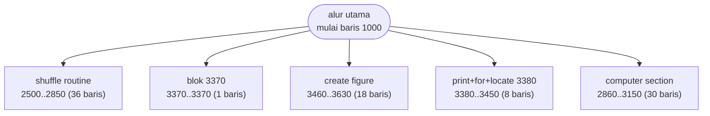

# CRAZY8.BAS — Crazy Eights

> Les Davids. Rutin kocok, bagi, dan urutkan kartu dipisah rapi.

| | |
|---|---|
| Sumber | Public domain / listing majalah lain-lain |
| Tahun | 1986 |
| Panjang | 294 baris (nomor 1000–3940) |
| Subrutin | 5, dipanggil dari 9 tempat |
| Percabangan | 8 `GOTO`, 9 `GOSUB`, 0 target `ON…` |
| Komentar | 5% dari baris |
| Jalankan | `run\CRAZY8.bat` |

## Peta arsitektur

*Diagram di bawah ini bukan tafsiran — semuanya diturunkan langsung dari
kode: tiap panah adalah `GOSUB` yang benar-benar ada, tiap kotak adalah
blok antara sebuah entri dan `RETURN`-nya.*



Kotak bersudut miring berwarna = **penangan kejadian** (`ON KEY`/`ON ERROR`), yang dipanggil oleh interupsi, bukan oleh alur utama.

### Subrutin dan perannya

| Baris | Panjang | Dipanggil | Peran (diambil dari kode) |
|---|--:|--:|---|
| `3380`–`3450` | 8 baris | 3× | print+for+locate @3380 |
| `3460`–`3630` | 18 baris | 3× | create figure |
| `2500`–`2850` | 36 baris | 1× | shuffle routine |
| `2860`–`3150` | 30 baris | 1× | computer section |
| `3370`–`3370` | 1 baris | 1× | blok @3370 |

### Perulangan utama

`GOTO` mundur terpanjang: dari baris **2480** kembali ke **1550** — melingkupi 930 nomor baris.
Itulah loop utama program ini; segala sesuatu di dalam rentang tersebut
dijalankan berulang.

### Data yang dipegang

| Array | Dipakai | Ditulis di baris |
|---|--:|---|
| `FIG$` | 28× | 3490, 3500, 3510, 3520, 3530, … |
| `PHAND$` | 19× | 1480, 1710, 1810, 2040, 2400, … |
| `CHAND$` | 19× | 1490, 3180, 3330 |
| `DECK$` | 7× | 2820 |
| `CARD$` | 5× | 2770 |
| `OLDHAND$` | 5× | 1720, 1820 |
| `TEST` | 4× | 2610, 2620, 3860 |
| `VALUE$` | 4× | — |

## Bagaimana program ini disusun

Lima subrutin untuk 294 baris, dan **hanya 8 `GOTO`** — rasio lompatan terendah
di koleksi untuk program sebesar ini.

Kenapa bisa begitu rendah? Karena program ini memakai `WHILE`/`WEND`. Loop
dinyatakan sebagai loop, bukan sebagai `GOTO` mundur. Bandingkan dengan
`ATTACK.BAS` yang punya tiga tingkat perulangan bersarang, semuanya `GOTO`.

Kelima subrutinnya diberi nama oleh penulisnya lewat komentar, dan namanya
menceritakan seluruh permainan:

| Baris | Peran |
|---|---|
| 2500–2850 | `shuffle routine` — kocok kartu |
| 2860–3150 | `computer section` — giliran komputer |
| 3460–3630 | `create figure` — bangun gambar kartu 5×5 |
| 3380–3450 | cetak gambar itu ke layar |

Pembagiannya bersih menurut **tanggung jawab**, bukan menurut urutan kejadian:
satu untuk data (kocok), satu untuk kecerdasan (komputer), dua untuk tampilan.
Itu pemisahan yang sama dengan model–view–controller, ditemukan sendiri.

`FIG$(5,5)` dibaca 28 kali — kartu digambar ulang dari data tiap kali
ditampilkan, bukan disimpan sebagai 52 gambar jadi. Satu rutin melayani seluruh
dek.

## Yang menarik dari kodenya

Salah satu program dengan struktur terbaik di koleksi ini, dan angkanya
membuktikan: **294 baris dengan hanya 8 `GOTO`**. Rasio lompatan terendah di
seluruh koleksi untuk program sebesar ini.

Kuncinya ada di baris 1030: `DEFINT A-Z`. Semua variabel jadi integer secara
default. Lalu deklarasi datanya dipisah rapi per tanggung jawab:

```basic
1010 DIM SUIT$(4),CARD$(52),DECK$(52)      ' nama & rupa kartu
1020 DIM FIG$(5,5)                          ' gambar kartu 5x5 karakter
1040 DIM DECK(52),PHAND$(26),CHAND$(26)     ' dek + tangan pemain & komputer
1050 DIM TEST(52),OLDHAND$(25)              ' ruang kerja
```

Komentar penulis (`shuffle cards`, `deal cards`, `sort player's hand`) menandai
tiap subrutin. Hasilnya program kartu yang bisa dibaca dari atas ke bawah.

`FIG$(5,5)` adalah kartu yang digambar sebagai kisi 5×5 karakter, dirakit ulang
tiap kali kartu ditampilkan (lihat baris 3660 yang menangani kasus khusus
kartu "10" yang butuh dua digit). Pendekatan berbeda dari `CRAPS.BAS` yang
menyimpan gambar sebagai satu string jadi — di sini gambar dibangun dari data,
jadi satu rutin melayani 52 kartu.

## Yang bisa dipelajari

- `DEFINT A-Z` di baris awal: satu keputusan yang mempercepat seluruh program di mesin tanpa koprosesor.
- Kelompokkan `DIM` menurut tanggung jawab dan beri komentar tiap kelompok. Itu peta data program Anda.
- Membangun tampilan dari data (satu rutin, 52 kartu) mengalahkan menyimpan 52 gambar jadi.

## Yang jangan ditiru

- Baris 3660 menangani kasus khusus '10' dengan `IF` bersarang di tengah rutin gambar. Kasus khusus lebih baik dipisah.

## Lampiran

### Perkakas bahasa yang dipakai

`PLAY` — musik lewat bahasa makro not, `SOUND` — nada mentah (frekuensi, durasi), `INKEY$` — baca tombol tanpa menunggu Enter, `WHILE`/`WEND` — perulangan berkondisi, `RANDOMIZE` — menyemai pengacak, `SWAP` — tukar isi dua variabel, `DEFINT` — variabel default bilangan bulat, `LOCATE` — posisikan kursor, `COLOR` — warna teks

### Deklarasi array

```basic
DIM SUIT$(4),CARD$(52),DECK$(52)
DIM FIG$(5,5)
DIM DECK(52),PHAND$(26),CHAND$(26)
DIM TEST(52),OLDHAND$(25)
DIM VALUE$(13),VALUE(13)
```

### Sepuluh baris pembuka

```basic
1000 REM Author Les Davids
1010 DIM SUIT$(4),CARD$(52),DECK$(52)
1020 DIM FIG$(5,5)
1030 DEFINT A-Z
1040 DIM DECK(52),PHAND$(26),CHAND$(26)
1050 DIM TEST(52),OLDHAND$(25)
1060 SCREEN 0,1:COLOR 0,2:CLS
1070 KEY OFF
1080 LOCATE 2,9
1090 PRINT "C R A Z Y   E I G H T S"
```

### Baris terpanjang (140 kolom)

```basic
3660 IF MID$(THE$,1,1)=" " THEN FIG$(2,2)=MID$(THE$,2,1): FIG$(4,4)=FIG$(2,2) ELSE FIG$(2,2)="1": FIG$(2,3)="0": FIG$(4,3)="1":FIG$(4,4)="0"
```

---
[Dasar-dasar BASIC](00-DASAR-BASIC.md) · [Daftar review](README.md) · [Katalog koleksi](../README.md)
