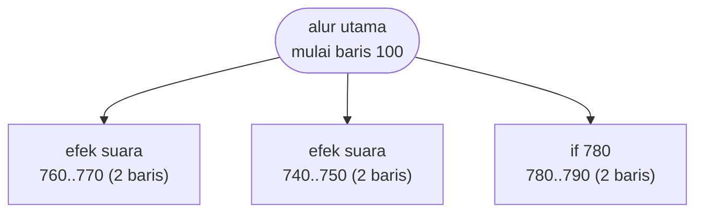

# CURVE.BAS — Curve - regresi kuadrat terkecil

> Phil Feldman & Tom Rugg. Ditulis untuk 'any BASIC, any CRT' - nol panggilan khas PC.

| | |
|---|---|
| Sumber | Listing Feldman & Rugg, 1982 |
| Tahun | 1982 |
| Panjang | 89 baris (nomor 100–980) |
| Subrutin | 3, dipanggil dari 5 tempat |
| Percabangan | 10 `GOTO`, 5 `GOSUB`, 0 target `ON…` |
| Komentar | 4% dari baris |
| Jalankan | `run\CURVE.bat` |

## Peta arsitektur

*Diagram di bawah ini bukan tafsiran — semuanya diturunkan langsung dari
kode: tiap panah adalah `GOSUB` yang benar-benar ada, tiap kotak adalah
blok antara sebuah entri dan `RETURN`-nya.*



Kotak bersudut miring berwarna = **penangan kejadian** (`ON KEY`/`ON ERROR`), yang dipanggil oleh interupsi, bukan oleh alur utama.

### Subrutin dan perannya

| Baris | Panjang | Dipanggil | Peran (diambil dari kode) |
|---|--:|--:|---|
| `740`–`750` | 2 baris | 3× | efek suara |
| `760`–`770` | 2 baris | 1× | efek suara |
| `780`–`790` | 2 baris | 1× | if @780 |

### Perulangan utama

`GOTO` mundur terpanjang: dari baris **430** kembali ke **390** — melingkupi 40 nomor baris.
Itulah loop utama program ini; segala sesuatu di dalam rentang tersebut
dijalankan berulang.

### Data yang dipegang

| Array | Dipakai | Ditulis di baris |
|---|--:|---|
| `A` | 16× | 510, 890, 910 |
| `R` | 16× | 470, 490, 500, 920 |
| `Y` | 8× | 330 |
| `V` | 8× | 790, 950, 980 |
| `X` | 6× | 330 |
| `P` | 6× | 450, 460 |

## Bagaimana program ini disusun

Tiga subrutin, semuanya dua baris, semuanya cuma bunyi bip. **Seluruh matematika
ada di alur utama.**

Untuk program yang menghitung regresi kuadrat terkecil, itu keputusan yang
menarik. Alasannya tertulis di headernya sendiri:

```basic
130 REM: Any BASIC, any CRT.
```

Program ini ditulis untuk diketik ulang dari majalah di komputer merek apa pun.
Setiap `GOSUB` menambah satu nomor baris yang harus diketik dengan benar, dan
setiap kesalahan ketik jadi bug yang sulit ditemukan pembaca. Jadi
**arsitekturnya sengaja dibuat sedatar mungkin** — bukan karena penulisnya tidak
tahu cara memecah, tapi karena target distribusinya kertas.

Ini contoh bagus bahwa arsitektur yang baik bergantung pada konteks, termasuk
konteks di luar kode.

Yang tetap dilakukan dengan benar: ukuran array diambil dari konstanta bernama.

```basic
160 MX=100
    DIM X(MX),Y(MX)
```

Ubah `MX`, seluruh program ikut. Di antara 83 program di koleksi ini, hanya
segelintir yang melakukannya.

Loopnya pendek-pendek (30–40 baris) — ciri kode numerik yang tiap bagiannya
mengerjakan satu perhitungan.

## Yang menarik dari kodenya

Bagian dari trio Feldman & Rugg (bersama `INTEGRAT.BAS` dan `SIMEQN.BAS`) yang
menonjol karena satu alasan yang tertulis di headernya sendiri:

```basic
130 REM: Any BASIC, any CRT.
```

Lihat daftar perkakas bahasa yang dipakai program ini: hanya `BEEP`, `SWAP`, dan
`COLOR`. Tidak ada `LOCATE`, tidak ada `SCREEN 1`, tidak ada `PEEK`/`POKE`,
tidak ada `ON KEY`. Bandingkan dengan program Friendlyware mana pun yang penuh
`LOCATE` dan `POKE 106,0`.

Ini keputusan rancangan yang sadar: **membatasi diri pada bagian bahasa yang ada
di semua mesin**, supaya program bisa diketik ulang dari majalah di Apple II,
TRS-80, atau IBM PC tanpa perubahan. Harganya, tampilannya polos. Imbalannya,
program ini satu-satunya di koleksi yang secara teori masih jalan di mana pun.

Perhatikan juga cara `DIM` ditulis:

```basic
160 MX=100
    DIM X(MX),Y(MX)
    DIM A(Q,Q),R(Q),V(Q)
```

Ukuran array diambil dari variabel, bukan angka tetap. Jadi mengubah batas
jumlah data cukup mengubah satu baris. Kedengarannya sepele, tapi di antara 83
program di sini, hanya segelintir yang melakukannya.

`EF=999` di baris 170 adalah *sentinel* — nilai yang diketik pemakai untuk
menandakan "data selesai". Dinamai, bukan ditulis langsung sebagai 999 di
sepuluh tempat.

## Yang bisa dipelajari

- Batasi diri pada bagian bahasa yang portabel kalau portabilitas memang tujuannya. Nyatakan keputusan itu di header.
- `DIM X(MX)` dengan `MX` sebagai konstanta bernama — ubah batas di satu tempat saja.
- Beri nama pada nilai sentinel (`EF=999`), jangan sebarkan angkanya.

## Yang jangan ditiru

- Nama variabel satu-dua huruf (`MX`, `EF`, `Q`) yang, meski konsisten, tetap menuntut pembaca menghafal kamusnya.

## Lampiran

### Perkakas bahasa yang dipakai

`BEEP`, `SWAP` — tukar isi dua variabel, `COLOR` — warna teks

### Deklarasi array

```basic
DIM X(MX),Y(MX)
DIM A(Q,Q),R(Q),V(Q)
DIM P(Q)
```

### Sepuluh baris pembuka

```basic
100 REM: CURVE
110 REM: Least squares curve fitting.
120 REM: COPYRIGHT 1982 Phil Feldman and Tom Rugg.
130 REM: Any BASIC, any CRT.
140 KEY OFF:SCREEN 0,0,0,0:WIDTH 40:COLOR 7,0,0
150 CLEAR:CLS
160 MX=100
170 EF=999
180 MD=7
190 DIM X(MX),Y(MX)
```

---
[Dasar-dasar BASIC](00-DASAR-BASIC.md) · [Daftar review](README.md) · [Katalog koleksi](../README.md)
