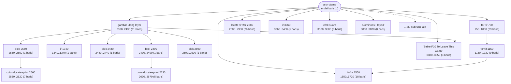
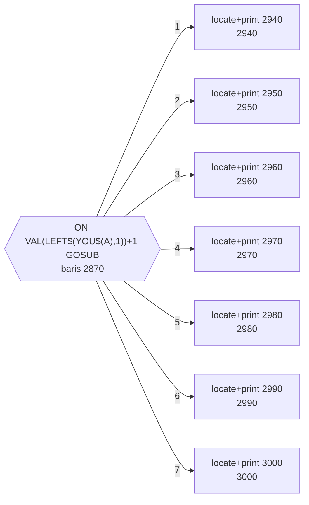
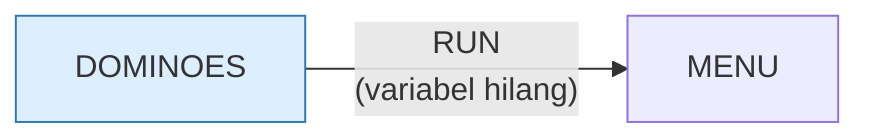

# DOMINOES.BAS — Domino

> Menu #1 pilihan H. Tiga ukuran papan.

| | |
|---|---|
| Sumber | Friendlyware PC Introductory Set |
| Tahun | 1982 |
| Panjang | 387 baris (nomor 10–3870) |
| Subrutin | 46, dipanggil dari 85 tempat |
| Percabangan | 77 `GOTO`, 65 `GOSUB`, 26 target `ON…` |
| Komentar | 0% dari baris |
| Jalankan | `run\DOMINOES.bat` |

## Peta arsitektur

*Diagram di bawah ini bukan tafsiran — semuanya diturunkan langsung dari
kode: tiap panah adalah `GOSUB` yang benar-benar ada, tiap kotak adalah
blok antara sebuah entri dan `RETURN`-nya.*



Kotak bersudut miring berwarna = **penangan kejadian** (`ON KEY`/`ON ERROR`), yang dipanggil oleh interupsi, bukan oleh alur utama.

### Subrutin dan perannya

| Baris | Panjang | Dipanggil | Peran (diambil dari kode) |
|---|--:|--:|---|
| `1150`–`1230` | 9 baris | 14× | for+if @1150 |
| `2560`–`2620` | 7 baris | 5× | color+locate+print @2560 |
| `2630`–`2670` | 5 baris | 5× | color+locate+print @2630 |
| `1550`–`1720` | 18 baris | 3× | if+for @1550 |
| `1320`–`1320` | 1 baris | 2× | if @1320 |
| `2330`–`2430` | 11 baris | 2× | gambar ulang layar |
| `2490`–`2490` | 1 baris | 2× | blok @2490 |
| `2550`–`2550` | 1 baris | 2× | blok @2550 |
| `2680`–`2930` | 26 baris | 2× | locate+if+for @2680 |
| `2940`–`2940` | 1 baris | 2× | locate+print @2940 |
| `2950`–`2950` | 1 baris | 2× | locate+print @2950 |
| `2960`–`2960` | 1 baris | 2× | locate+print @2960 |
| `2970`–`2970` | 1 baris | 2× | locate+print @2970 |
| `2980`–`2980` | 1 baris | 2× | locate+print @2980 |

*(32 subrutin lain tidak ditampilkan)*

### Tabel dispatch

Program ini punya **4** percabangan berindeks (`ON … GOTO/GOSUB`).
Yang terbesar ada di baris 2870 dengan 7 cabang:



### Program lain yang dimuat



### Kejadian yang dijebak

- `ON KEY(10)` → baris 3280

### Perulangan utama

`GOTO` mundur terpanjang: dari baris **3740** kembali ke **40** — melingkupi 3700 nomor baris.
Itulah loop utama program ini; segala sesuatu di dalam rentang tersebut
dijalankan berulang.

### Data yang dipegang

| Array | Dipakai | Ditulis di baris |
|---|--:|---|
| `YOU$` | 21× | 1260, 1880, 2290 |
| `MY$` | 13× | 100, 1300, 2300 |
| `BONE$` | 7× | 2180 |
| `PLD$` | 4× | 2340 |

## Bagaimana program ini disusun

**46 subrutin, 25 panah antar-subrutin** — program paling terbagi di koleksi.
Bandingkan dengan `BATSHIP.BAS` yang punya 8 subrutin untuk jumlah baris yang
mirip.

Rutin di 1150 dipanggil **14 kali**, dua rutin cetak (2560 dan 2630) masing-
masing 5 kali. Ini distribusi yang sehat: sedikit rutin dipakai sangat sering,
banyak rutin dipakai sekali — persis pola yang Anda harapkan dari kode yang
dipecah menurut kegunaan nyata.

Alur utamanya pun pendek dan terbaca:

```basic
50 PL1=1:GOSUB 2680:GOSUB 570:GOSUB 140:GOSUB 260
60 IF INVD THEN GOSUB 2050:GOTO 50 ELSE NOPLAY=0
70 GOSUB 1240:GOSUB 1550:YSCR=YSCR+HOLDY:PL1=0:IF PLNO=0 THEN 3590
```

Baca sebagai kalimat: *siapkan giliran, gambar papan, minta langkah, validasi;
kalau tidak sah ulangi; kalau sah hitung skor dan ganti pemain.*

Struktur ini **benar**. Yang membuatnya sulit dibaca cuma satu hal: nol komentar.
`GOSUB 2680` tidak memberi tahu apa pun, jadi memahami satu baris di atas
menuntut Anda melompat ke lima tempat.

Pelajarannya presisi: **arsitektur yang baik tidak menyelamatkan kode dari
penamaan yang buruk.** Di BASIC, satu-satunya cara menamai `GOSUB` adalah
komentar di sebelahnya.

## Yang menarik dari kodenya

387 baris, 77 `GOTO`, 65 `GOSUB`, dan **nol komentar**. Ini contoh paling murni
di koleksi tentang apa yang terjadi kalau program besar ditulis tanpa satu pun
penjelasan.

Baris 50–90 adalah seluruh giliran permainan:

```basic
50 PL1=1:GOSUB 2680:GOSUB 570:GOSUB 140:GOSUB 260
60 IF INVD THEN GOSUB 2050:GOTO 50 ELSE NOPLAY=0
70 GOSUB 1240:GOSUB 1550:YSCR=YSCR+HOLDY:PL1=0:IF PLNO=0 THEN 3590
```

Secara struktur ini bagus — alur utamanya pendek dan mendelegasikan ke subrutin.
Masalahnya, `GOSUB 2680` tidak memberi tahu apa pun. Untuk memahami satu baris
ini, pembaca harus melompat ke lima tempat berbeda dan membacanya semua.

Bandingkan dengan `LIFE2.BAS` yang menulis `GOSUB 500 'Get new pattern from
player`. Biayanya satu komentar; hasilnya, alur utama bisa dibaca tanpa melompat
sama sekali.

Yang bagus: baris terpanjangnya hanya 87 kolom. Penulisnya disiplin soal itu.
Dan `DIM PLD$(28),BONE$(28)` sesuai persis dengan jumlah kartu domino set ganda-6
(28 buah) — ukuran array yang mencerminkan domain, bukan angka bulat asal.

## Yang bisa dipelajari

- Alur utama yang pendek dan mendelegasikan ke subrutin adalah struktur yang benar.
- Ukuran array yang persis sesuai domain (28 kartu domino) mengungkap maksud lebih baik daripada membulatkan ke 30.

## Yang jangan ditiru

- **Nol komentar pada 387 baris.** Kalau Anda hanya sempat menulis satu jenis komentar seumur hidup, tulis nama di sebelah tiap `GOSUB`.

## Lampiran

### Perkakas bahasa yang dipakai

`PLAY` — musik lewat bahasa makro not, `DRAW` — bahasa makro menggambar garis, `POKE` — tulis memori langsung, `DEF SEG` — pindah segmen memori, `ON KEY(n) GOSUB` — jebakan tombol fungsi, `ON x GOSUB` — pemanggilan berindeks, `INKEY$` — baca tombol tanpa menunggu Enter, `RUN "nama"` — muat program lain, variabel hilang, `OPEN` — baca/tulis berkas, `WHILE`/`WEND` — perulangan berkondisi, `RANDOMIZE` — menyemai pengacak, `SWAP` — tukar isi dua variabel, `DEFINT` — variabel default bilangan bulat, `DEFSTR` — variabel default teks, `STRING$` — ulang satu karakter n kali, `LOCATE` — posisikan kursor, `COLOR` — warna teks

### Deklarasi array

```basic
DIM PLD$(28),BONE$(28),MY$(16),YOU$(16)
```

### Sepuluh baris pembuka

```basic
10 SCREEN 0,0,0:COLOR 3,0:KEY OFF:DEF SEG:DEFINT A-D:DEFSTR Z
20 YSCR=0:MYSCR=0:XLIN=1:XPOS=1:ON KEY(10) GOSUB 3280
30 GOSUB 3010:GOSUB 3430:GOSUB 2120
40 XLIN=1:XPOS=1:GOSUB 3330:FSTTME=1:NOSPR=1:PLAYED=1
50 PL1=1:GOSUB 2680:GOSUB 570:GOSUB 140:GOSUB 260
60 IF INVD THEN GOSUB 2050:GOTO 50 ELSE NOPLAY=0
70 GOSUB 1240:GOSUB 1550:YSCR=YSCR+HOLDY:PL1=0:IF PLNO=0 THEN 3590
80 GOSUB 3800:LOCATE 3,1:PRINT "One Moment Please":PRINT "I am Thinking
90 GOSUB 750:IF INVD THEN GOSUB 1320:IF EMPT THEN GOSUB 3530:GOTO 50
100 IF INVD THEN CONO=CONO+1:MY$(CONO)=NEXTBN$:GOTO 90 ELSE NOPLAY=0
```

---
[Dasar-dasar BASIC](00-DASAR-BASIC.md) · [Daftar review](README.md) · [Katalog koleksi](../README.md)
