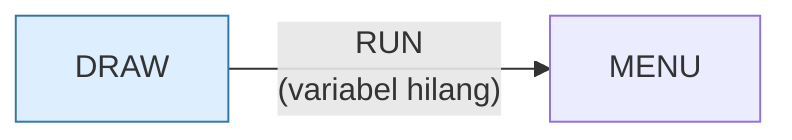

# DRAW.BAS — You Draw It (menggambar)

> Menu #1 pilihan O. Menyimpan gambar ke disket data; butuh drive yang bisa ditulis.

| | |
|---|---|
| Sumber | Friendlyware PC Introductory Set |
| Tahun | 1982 |
| Panjang | 287 baris (nomor 1–10000) |
| Subrutin | 23, dipanggil dari 55 tempat |
| Percabangan | 30 `GOTO`, 55 `GOSUB`, 14 target `ON…` |
| Komentar | 0% dari baris |
| Jalankan | `run\DRAW.bat` |

## Peta arsitektur

*Diagram di bawah ini bukan tafsiran — semuanya diturunkan langsung dari
kode: tiap panah adalah `GOSUB` yang benar-benar ada, tiap kotak adalah
blok antara sebuah entri dan `RETURN`-nya.*

```mermaid
flowchart TD
    MAIN(["alur utama<br/>mulai baris 1"])
    S720["'UPPER'<br/>720..780 (7 baris)"]
    S790["'You Are In AlphaNumeric Character Se'<br/>790..820 (4 baris)"]
    S830["gambar ulang layar<br/>830..880 (6 baris)"]
    S890["baca tulis berkas<br/>890..960 (8 baris)"]
    S970["if 970<br/>970..1010 (5 baris)"]
    S1020["'WHAT COLORS WOULD YOU LIKE? No,No '<br/>1020..1140 (13 baris)"]
    S1420["SAVE A SCREEN<br/>1420..1600 (19 baris)"]
    S1610["baca tulis berkas<br/>1610..1760 (16 baris)"]
    S1770["buang penyangga tombol<br/>1770..1800 (4 baris)"]
    S1950[/"gambar grafis<br/>1950..2140"/]
    S2150[/"for+if+locate 2150<br/>2150..2170"/]
    S2180[/"blok 2180<br/>2180..2180"/]
    S2190[/"gambar ulang layar<br/>2190..2230"/]
    S2330["blok 2330<br/>2330..2350 (3 baris)"]
    S2360["baca tulis berkas<br/>2360..2680 (33 baris)"]
    S2690[/"'Do You Wish To Leave This Program? '<br/>2690..2760"/]
    MORE["... 7 subrutin lain"]
    MAIN -.-> MORE
    MAIN --> S1950
    MAIN --> S2190
    MAIN --> S2150
    MAIN --> S2180
    MAIN --> S2690
    MAIN --> S830
    MAIN --> S720
    MAIN --> S970
    MAIN --> S2330
    MAIN --> S1420
    MAIN --> S790
    MAIN --> S1610
    MAIN --> S2360
    MAIN --> S890
    MAIN --> S1020
    S1020 --> S720
    S1420 --> S830
    S1420 --> S1770
    S1420 --> S2330
    S1610 --> S830
    S1610 --> S1770
    S1610 --> S2330
    S1950 --> S720
    S1950 --> S830
    S1950 --> S890
    S2150 --> S720
    S2150 --> S790
    S2360 --> S720
    S2360 --> S790
    S2360 --> S830
    S2360 --> S1770
    S2360 --> S2190
    S2360 --> S2330
    S2690 --> S720
    S2690 --> S790
    classDef ev fill:#fde,stroke:#a37
    class S2180,S2190,S1950,S2150,S2690 ev
```



Kotak bersudut miring berwarna = **penangan kejadian** (`ON KEY`/`ON ERROR`), yang dipanggil oleh interupsi, bukan oleh alur utama.

### Subrutin dan perannya

| Baris | Panjang | Dipanggil | Peran (diambil dari kode) |
|---|--:|--:|---|
| `720`–`780` | 7 baris | 10× | "UPPER" |
| `790`–`820` | 4 baris | 6× | "You Are In AlphaNumeric Character Se" |
| `830`–`880` | 6 baris | 6× | gambar ulang layar |
| `970`–`1010` | 5 baris | 5× | if @970 |
| `2330`–`2350` | 3 baris | 4× | blok @2330 |
| `1770`–`1800` | 4 baris | 3× | buang penyangga tombol |
| `2180`–`2180` | 1 baris | 3× | blok @2180 *(handler)* |
| `890`–`960` | 8 baris | 2× | baca/tulis berkas |
| `2190`–`2230` | 5 baris | 2× | gambar ulang layar *(handler)* |
| `1020`–`1140` | 13 baris | 1× | "WHAT COLORS WOULD YOU LIKE? <No,No>" |
| `1420`–`1600` | 19 baris | 1× | SAVE A SCREEN |
| `1610`–`1760` | 16 baris | 1× | baca/tulis berkas |
| `1890`–`1920` | 4 baris | 1× | if @1890 |
| `1900`–`1920` | 3 baris | 1× | if @1900 |

*(9 subrutin lain tidak ditampilkan)*

### Program lain yang dimuat



### Kejadian yang dijebak

- `ON ERROR` → baris 0, 1150
- `ON KEY(1)` → baris 1950
- `ON KEY(10)` → baris 2690, 10000
- `ON KEY(2)` → baris 2190
- `ON KEY(3)` → baris 1930
- `ON KEY(4)` → baris 1940
- `ON KEY(5)` → baris 2150
- `ON KEY(6)` → baris 2780
- `ON KEY(7)` → baris 2180
- `ON KEY(8)` → baris 2180
- `ON KEY(9)` → baris 2180

### Perulangan utama

`GOTO` mundur terpanjang: dari baris **1910** kembali ke **1150** — melingkupi 760 nomor baris.
Itulah loop utama program ini; segala sesuatu di dalam rentang tersebut
dijalankan berulang.

### Data yang dipegang

| Array | Dipakai | Ditulis di baris |
|---|--:|---|
| `NAMES$` | 9× | 2600 |
| `ARRAY%` | 6× | — |

## Bagaimana program ini disusun

23 subrutin, 21 panah, dan **enam tombol fungsi berbeda dipetakan ke enam
penangan berbeda**. Ini satu-satunya program di koleksi yang berarsitektur
seperti aplikasi sungguhan, bukan seperti permainan.

Peta kejadiannya adalah antarmukanya:

| Tombol | Ke baris | Peran |
|---|---|---|
| F1 | 1950 | ganti mode |
| F2 | 2190 | ganti mode |
| F3 | 1930 | ganti mode |
| F4 | 1940 | ganti mode |
| F10 | 2690 / 10000 | simpan / keluar |
| galat | 1150 | pulihkan |

Program dengan banyak *mode* butuh cara mengetahui sedang di mode mana, dan
di sini rutin 720 (dipanggil **10 kali**) adalah penampil status yang
memberi tahu pemakai posisi mereka. Rutin 790 mencetak
`"You Are In AlphaNumeric Character Set"` — umpan balik mode secara eksplisit.

**Program bermodus wajib menunjukkan modusnya.** Ini pelajaran antarmuka yang
lahir dari editor teks era ini (vi yang terkenal karena orang tersesat antara
mode) dan masih berlaku.

Yang paling teknis: baris 40–50 memuat kode bahasa mesin dari disket.

```basic
40 DEF SEG=&HE00
50 BLOAD "DRAW.EXE",0
```

Berkas `DRAW.EXE` itu **tidak ada di koleksi ini**, jadi program ini akan gagal.
Ironisnya, baris 20 memeriksa memori bebas sebelum jalan — tapi tidak memeriksa
keberadaan berkas yang jelas-jelas dibutuhkannya.

## Yang menarik dari kodenya

Program menggambar Friendlyware, dan satu-satunya di koleksi yang **memuat kode
bahasa mesin dari disket lalu memanggilnya**:

```basic
40 DEF SEG=&HE00
50 BLOAD "DRAW.EXE",0
```

`BLOAD` menyalin isi berkas mentah ke alamat memori tertentu, lalu `USR`/`CALL`
menjalankannya. Ini cara BASIC memanggil rutin assembly untuk hal-hal yang
terlalu lambat kalau ditulis di BASIC — menggambar piksel dalam jumlah besar,
misalnya.

Perhatikan: berkas `DRAW.EXE` yang dibutuhkan **tidak ada di koleksi ini**.
Jadi program ini kemungkinan besar akan gagal. Itu bukan akibat perapian —
berkasnya memang tidak pernah ikut tersalin.

Dua baris pembukanya juga layak dipelajari:

```basic
15 DEF SEG=&H40:POKE &H17,(PEEK(&H17) AND 64)
20 IF FRE(0)<15000 THEN 2240
```

Baris 15 membaca byte status keyboard BIOS di `0040:0017`, meng-`AND`-nya dengan
64, lalu menuliskannya kembali — mematikan semua bendera Shift/Ctrl/Alt kecuali
Caps Lock. Baris 20 memeriksa memori bebas dan menolak jalan kalau kurang dari
15 KB. **Pemeriksaan sumber daya sebelum mulai** — praktik yang masih benar
sampai sekarang.

## Yang bisa dipelajari

- Periksa sumber daya yang Anda butuhkan di awal, lalu gagal dengan pesan yang jelas. Jauh lebih baik daripada mati di tengah jalan.
- `BLOAD` + `CALL` adalah cara BASIC menyisipkan kode cepat. Padanan modernnya: memanggil pustaka native dari bahasa skrip.

## Yang jangan ditiru

- Bergantung pada berkas pendamping (`DRAW.EXE`) tanpa memeriksa keberadaannya lebih dulu. Program ini memeriksa memori tapi tidak memeriksa berkasnya sendiri.
- Menulis langsung ke alamat BIOS (`&H40:&H17`). Berhasil di IBM PC, tidak dijamin di mana pun selainnya.

## Lampiran

### Perkakas bahasa yang dipakai

`DRAW` — bahasa makro menggambar garis, `PEEK` — baca memori langsung, `POKE` — tulis memori langsung, `DEF SEG` — pindah segmen memori, `BLOAD` — muat blok biner, `USR`/`CALL` — panggil rutin bahasa mesin, `ON KEY(n) GOSUB` — jebakan tombol fungsi, `ON ERROR GOTO` — penanganan galat, `ON x GOTO` — percabangan berindeks, `ON x GOSUB` — pemanggilan berindeks, `INKEY$` — baca tombol tanpa menunggu Enter, `RUN "nama"` — muat program lain, variabel hilang, `OPEN` — baca/tulis berkas, `WHILE`/`WEND` — perulangan berkondisi, `DEFSTR` — variabel default teks, `LOCATE` — posisikan kursor, `COLOR` — warna teks

### Deklarasi array

```basic
DIM NAMES$(1)
DIM ARRAY%(1,25)
DIM NAMES$(50)
```

### Sepuluh baris pembuka

```basic
1 'update 8/30/82 11:00 am
10 SCREEN 0,0,0:WIDTH 80:KEY OFF:DEF SEG:POKE 106,0
15 DEF SEG=&H40:POKE &H17,(PEEK(&H17) AND 64)
20 IF FRE(0)<15000 THEN 2240
30 CLEAR:CLEAR ,28000:ON KEY(10) GOSUB 10000:KEY(10) ON
40 DEF SEG=&HE00
50 BLOAD"DRAW.EXE",0
60 DEFSTR Z
70 ON ERROR GOTO 1150
80 CLS:DIM NAMES$(1)
```

### Baris terpanjang (104 kolom)

```basic
620 IF Z1=CHR$(119) THEN GOSUB 2330:CLS:LOCATE 12,40,1:X=CSRLIN:Y=POS(0):            GOSUB 830:GOSUB 720
```

---
[Dasar-dasar BASIC](00-DASAR-BASIC.md) · [Daftar review](README.md) · [Katalog koleksi](../README.md)
