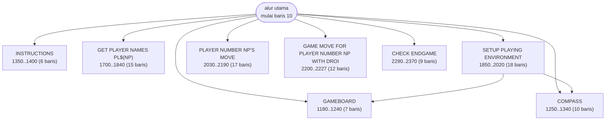
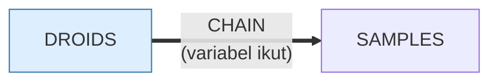

# DROIDS.BAS — Droids

> Disk IPCO 2043-A. Koreksi error oleh John Beck, Melbourne PC-Group.

| | |
|---|---|
| Sumber | International PC Owners (pustaka PD, Pittsburgh PA) |
| Tahun | 1986 |
| Panjang | 183 baris (nomor 10–3030) |
| Subrutin | 8, dipanggil dari 10 tempat |
| Percabangan | 26 `GOTO`, 10 `GOSUB`, 0 target `ON…` |
| Komentar | 7% dari baris |
| Jalankan | `run\DROIDS.bat` |

## Peta arsitektur

*Diagram di bawah ini bukan tafsiran — semuanya diturunkan langsung dari
kode: tiap panah adalah `GOSUB` yang benar-benar ada, tiap kotak adalah
blok antara sebuah entri dan `RETURN`-nya.*



Kotak bersudut miring berwarna = **penangan kejadian** (`ON KEY`/`ON ERROR`), yang dipanggil oleh interupsi, bukan oleh alur utama.

### Subrutin dan perannya

| Baris | Panjang | Dipanggil | Peran (diambil dari kode) |
|---|--:|--:|---|
| `1180`–`1240` | 7 baris | 2× | GAMEBOARD |
| `1250`–`1340` | 10 baris | 2× | COMPASS |
| `1350`–`1400` | 6 baris | 1× | INSTRUCTIONS |
| `1700`–`1840` | 15 baris | 1× | GET PLAYER NAMES PL$(NP) |
| `1850`–`2020` | 18 baris | 1× | SETUP PLAYING ENVIRONMENT |
| `2030`–`2190` | 17 baris | 1× | PLAYER NUMBER NP'S MOVE |
| `2200`–`2227` | 12 baris | 1× | GAME MOVE FOR PLAYER NUMBER NP WITH DROID SY |
| `2290`–`2370` | 9 baris | 1× | CHECK ENDGAME |

### Program lain yang dimuat



### Perulangan utama

`GOTO` mundur terpanjang: dari baris **3030** kembali ke **1130** — melingkupi 1900 nomor baris.
Itulah loop utama program ini; segala sesuatu di dalam rentang tersebut
dijalankan berulang.

### Data yang dipegang

| Array | Dipakai | Ditulis di baris |
|---|--:|---|
| `CH` | 16× | 1080 |
| `PL$` | 6× | — |

## Bagaimana program ini disusun

Delapan subrutin, dan **semuanya diberi nama oleh penulisnya** lewat komentar:

| Baris | Nama asli di kode |
|---|---|
| 1180 | `GAMEBOARD` |
| 1250 | `COMPASS` |
| 1350 | `INSTRUCTIONS` |
| 1700 | `GET PLAYER NAMES PL$(NP)` |
| 1850 | `SETUP PLAYING ENVIRONMENT` |
| 2030 | `PLAYER NUMBER NP'S MOVE` |
| 2200 | `GAME MOVE FOR PLAYER NUMBER NP WITH DROID SY` |
| 2290 | `CHECK ENDGAME` |

Baca kolom kanannya dari atas ke bawah dan Anda sudah memahami seluruh permainan
tanpa membuka satu baris kode pun. **Itulah gunanya menamai subrutin**, dan
program ini satu-satunya di koleksi yang melakukannya untuk semuanya.

Perhatikan dua nama yang menyebut variabelnya: `GET PLAYER NAMES PL$(NP)` dan
`...PLAYER NUMBER NP...`. Karena BASIC tidak punya parameter, komentar itu
merangkap **tanda tangan fungsi** — ia memberi tahu variabel global mana yang
jadi masukan rutin tersebut.

Kalau Anda terpaksa bekerja dengan variabel global, tirulah ini: tulis di
komentar variabel apa yang dibaca dan apa yang diubah. Itu mengembalikan
sebagian besar manfaat parameter tanpa mengubah bahasanya.

## Yang menarik dari kodenya

Salah satu dari tiga berkas IPCO. Sepuluh baris pertamanya bukan kode — melainkan
**logo kelompok pengguna** yang digambar dengan karakter blok CP437, lengkap
dengan nomor disk `2043-A.BAS` dan alamat pos di Pittsburgh.

Di dunia sebelum ada internet, ini adalah *metadata paket*: dari mana berkas ini
berasal, nomor katalognya berapa, ke mana harus menulis surat. Fungsinya sama
dengan `package.json` sekarang, hanya saja ditulis pakai karakter `█` dan `░`
supaya kelihatan bagus di layar.

Baris tambahan "Error correction by JOHN BECK, Melbourne PC-Group" adalah jejak
distribusi: berkas ini pergi dari Pittsburgh ke Melbourne, diperbaiki di sana,
lalu beredar lagi. Itu *fork* dan *patch*, dikirim lewat pos.

Isi programnya sendiri sederhana: `PL$(4)` dan `CH(4)` menyimpan nama dan
karakter untuk empat droid, dinamai acak dan ditampilkan lewat `CHR$(CH(n))`.

## Yang bisa dipelajari

- Cantumkan asal-usul di dalam berkas. Berkas berpindah tangan; berkas pendamping tidak selalu ikut.
- Menyimpan karakter tampilan sebagai kode angka di array (`CH(4)`) memisahkan identitas objek dari rupanya.

## Yang jangan ditiru

- Sepuluh `PRINT` berturut-turut untuk logo statis. Itu data, bukan kode — lebih baik di `DATA` dan dicetak dengan satu loop.

## Lampiran

### Perkakas bahasa yang dipakai

`PLAY` — musik lewat bahasa makro not, `POKE` — tulis memori langsung, `DEF SEG` — pindah segmen memori, `INKEY$` — baca tombol tanpa menunggu Enter, `CHAIN` — muat program lain, bawa variabel, `RANDOMIZE` — menyemai pengacak, `LOCATE` — posisikan kursor, `COLOR` — warna teks

### Deklarasi array

```basic
DIM PL$(4),CH(4)
```

### Sepuluh baris pembuka

```basic
10 KEY OFF:CLS
20 PRINT"░░░░░░░░░░░░░░░░░░░░░░░░░░░░░░░░░░░░░░░"
30 PRINT"░┌───────────────────────────────────┐░"
40 PRINT"░│                                   │░"
50 PRINT"░│            2043-A.BAS             │░"
60 PRINT"░│              DROIDS               │░"
90 PRINT"░│ BROUGHT TO YOU BY THE MEMBERS OF  │░"
100 PRINT"░│      ▄▄▄▄▄ ▄▄▄▄▄ ▄▄▄▄▄ ▄▄▄▄▄      │░"
110 PRINT"░│        █   █   █ █     █   █      │░"
120 PRINT"░│        █   █▄▄▄█ █     █   █      │░"
```

### Baris terpanjang (119 kolom)

```basic
1500 COLOR 7:PRINT:PRINT "THE DROIDS ARE  NAMED ";CHR$(CH(1));", ";CHR$(CH(2));", ";CHR$(CH(3));" AND ";CHR$(CH(4));"."
```

---
[Dasar-dasar BASIC](00-DASAR-BASIC.md) · [Daftar review](README.md) · [Katalog koleksi](../README.md)
