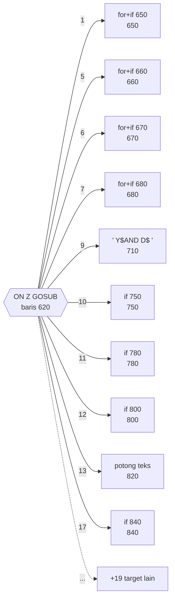

# ELIZA.BAS — Eliza v3.0

> Hak cipta 1981 Steve Grumette. Seluruh basis aturannya dibaca dari STRINGS.FIL.

| | |
|---|---|
| Sumber | Public domain / listing majalah lain-lain |
| Tahun | 1981 |
| Panjang | 514 baris (nomor 10–5120) |
| Subrutin | 82, dipanggil dari 156 tempat |
| Percabangan | 121 `GOTO`, 113 `GOSUB`, 260 target `ON…` |
| Komentar | 7% dari baris |
| Jalankan | `run\ELIZA.bat` |

## Peta arsitektur

*Diagram di bawah ini bukan tafsiran — semuanya diturunkan langsung dari
kode: tiap panah adalah `GOSUB` yang benar-benar ada, tiap kotak adalah
blok antara sebuah entri dan `RETURN`-nya.*

```mermaid
flowchart TD
    MAIN(["alur utama<br/>mulai baris 10"])
    S650["for+if 650<br/>650..700 (6 baris)"]
    S710["' Y$AND D$ '<br/>710..710 (1 baris)"]
    S750["if 750<br/>750..750 (1 baris)"]
    S800["if 800<br/>800..800 (1 baris)"]
    S820["potong teks<br/>820..830 (2 baris)"]
    S840["if 840<br/>840..850 (2 baris)"]
    S1070["'I AM SORRY, I SPEAK ONLY ENGLISH.'<br/>1070..1190 (13 baris)"]
    S1080["'I AM SORRY, I SPEAK ONLY ENGLISH.'<br/>1080..1190 (12 baris)"]
    S1100["'REMIND YOU OF'<br/>1100..1190 (10 baris)"]
    S1520["cari batas kata<br/>1520..1530 (2 baris)"]
    S1550["if 1550<br/>1550..1550 (1 baris)"]
    S1580["potong teks<br/>1580..1590 (2 baris)"]
    S1600["'DO COMPUTERS WORRY YOU?'<br/>1600..1620 (3 baris)"]
    S2190["'REALLY,'<br/>2190..2210 (3 baris)"]
    S4600["cari batas kata<br/>4600..4610 (4 baris)"]
    S4610["bungkus baris (word wrap)<br/>4610..4610 (1 baris)"]
    MORE["... 66 subrutin lain"]
    MAIN -.-> MORE
    MAIN --> S4610
    MAIN --> S4600
    MAIN --> S650
    MAIN --> S1580
    MAIN --> S1550
    MAIN --> S1520
    S650 --> S1600
    S710 --> S1520
    S710 --> S1550
    S750 --> S1520
    S750 --> S1550
    S750 --> S1580
    S800 --> S1520
    S820 --> S2190
    S840 --> S1520
    S840 --> S1550
    S840 --> S1580
```



Kotak bersudut miring berwarna = **penangan kejadian** (`ON KEY`/`ON ERROR`), yang dipanggil oleh interupsi, bukan oleh alur utama.

### Subrutin dan perannya

| Baris | Panjang | Dipanggil | Peran (diambil dari kode) |
|---|--:|--:|---|
| `1520`–`1530` | 2 baris | 27× | cari batas kata |
| `1580`–`1590` | 2 baris | 26× | potong teks |
| `650`–`700` | 6 baris | 4× | for+if @650 |
| `820`–`830` | 2 baris | 4× | potong teks |
| `1080`–`1190` | 12 baris | 4× | "I AM SORRY, I SPEAK ONLY ENGLISH." |
| `1100`–`1190` | 10 baris | 4× | "REMIND YOU OF" |
| `1550`–`1550` | 1 baris | 4× | if @1550 |
| `4610`–`4610` | 1 baris | 4× | bungkus baris (word wrap) |
| `4600`–`4610` | 4 baris | 3× | cari batas kata |
| `670`–`700` | 4 baris | 2× | for+if @670 |
| `1070`–`1190` | 13 baris | 2× | "I AM SORRY, I SPEAK ONLY ENGLISH." |
| `1180`–`1190` | 2 baris | 2× | if @1180 |
| `660`–`700` | 5 baris | 1× | for+if @660 |
| `680`–`700` | 3 baris | 1× | for+if @680 |

*(68 subrutin lain tidak ditampilkan)*

### Tabel dispatch

Program ini punya **47** percabangan berindeks (`ON … GOTO/GOSUB`).
Yang terbesar ada di baris 620 dengan 44 cabang:



44 nilai memetakan ke 29 target berbeda - beberapa nilai berbagi rutin yang sama.

### Perulangan utama

`GOTO` mundur terpanjang: dari baris **5070** kembali ke **290** — melingkupi 4780 nomor baris.
Itulah loop utama program ini; segala sesuatu di dalam rentang tersebut
dijalankan berulang.

### Data yang dipegang

| Array | Dipakai | Ditulis di baris |
|---|--:|---|
| `B$` | 14× | 200 |
| `A$` | 8× | 510, 520 |
| `K$` | 7× | 230 |
| `S$` | 6× | 370, 4608 |
| `RW$` | 5× | 180 |
| `M$` | 5× | 900, 4460 |
| `OW$` | 3× | — |
| `LO` | 3× | — |

## Bagaimana program ini disusun

**82 subrutin, 47 tabel dispatch, 60 panah.** Ini bukan permainan — ini
**penafsir bahasa kecil**, dan arsitekturnya berlapis seperti penafsir sungguhan.

### Lapisan bawah: primitif teks

Dua rutin terkecil adalah yang paling sering dipakai di seluruh koleksi:

| Baris | Dipanggil | Peran |
|---|--:|---|
| 1520–1530 | 27× | maju ke batas kata berikutnya |
| 1580–1590 | 26× | potong teks dari posisi A |

Dua baris kode, dipakai 53 kali. Ini **pustaka string** yang dibangun sendiri
karena GW-BASIC tidak menyediakannya.

### Lapisan tengah: tabel aturan

Seluruh "kepribadian" Eliza tidak ada di dalam program. Ia dibaca dari
`STRINGS.FIL` ke delapan array:

```basic
DIM OW$(22),RW$(22),LO(22),LR(22),A$(20),K$(44),B$(27),M$(20)
```

`OW$`/`RW$` = pasangan kata yang ditukar ("saya"↔"kamu"), `K$` = 44 kata kunci,
`B$` = 27 jawaban umum. Mengganti berkas itu mengganti seluruh perilaku program
tanpa menyentuh satu baris kode.

### Lapisan atas: tabel pengiriman

```basic
620 ON Z GOSUB 650,650,650,650,660,670,680,670,710,750,780,...
```

Empat puluh empat cabang, satu untuk tiap kata kunci — tapi hanya **29 tujuan
berbeda**. Beberapa kata kunci berbagi penangan.

Ini arsitektur *rule engine* yang lengkap: **data aturan → pencocokan →
pengiriman ke penangan**. Sistem pakar tahun 1980-an dibangun persis begini, dan
kerangka penanganan permintaan di web modern pun berbentuk sama.

## Yang menarik dari kodenya

Program paling menarik secara arsitektur di seluruh koleksi. Perhatikan
deklarasi datanya:

```basic
DIM OW$(22),RW$(22),LO(22),LR(22),A$(20),K$(44),B$(27),M$(20)
```

`OW$`/`RW$` = pasangan kata yang harus ditukar ("saya" ↔ "kamu"), `K$` = 44 kata
kunci yang dicari, `B$` = 27 jawaban umum, `M$` = pesan. Dan semuanya **dibaca
dari berkas `STRINGS.FIL`**, bukan ditulis di dalam kode.

Itu keputusan besar. Artinya seluruh "kepribadian" Eliza adalah data yang bisa
diganti tanpa menyentuh program — Anda bisa membuat Eliza berbahasa Indonesia
hanya dengan menulis ulang `STRINGS.FIL` (dan `WRTSTR.BAS` di koleksi ini adalah
alat untuk membuatnya). Pemisahan mesin dari aturan, tahun 1981.

Baris 620 adalah jantungnya, dan sekaligus contoh terekstrem dari sebuah pola:

```basic
620 ON Z GOSUB 650,650,650,650,660,670,680,670,710,750,780,800,820,820,820,...
```

Empat puluh empat target `GOSUB` dalam satu baris — satu untuk tiap kata kunci.
Ini **tabel pengiriman (dispatch table)**, ditulis dengan satu-satunya sarana
yang tersedia. Di bahasa modern ini akan jadi `Map<string, Handler>`.
Perhatikan pengulangan (650 muncul empat kali, 820 lima kali): beberapa kata
kunci ditangani rutin yang sama.

Baris 30–55 membaca lebar layar dari BIOS (`PEEK(&H4A)`) lalu menyesuaikan diri.
Program ini beradaptasi dengan perangkat kerasnya alih-alih mengasumsikan.

## Yang bisa dipelajari

- **Pisahkan aturan dari mesin.** Basis pengetahuan di berkas data, logika di program. Ini prinsip yang melahirkan seluruh sistem berbasis aturan.
- `ON x GOSUB a,b,c,...` adalah tabel pengiriman. Kenali polanya — ia muncul di mana-mana dengan nama berbeda.
- Baca konfigurasi lingkungan (lebar layar) daripada mengasumsikannya.

## Yang jangan ditiru

- Tabel pengiriman 225 kolom dalam satu baris. Isinya benar, penyajiannya tidak terbaca. Kalau bahasanya memaksa begitu, minimal beri komentar bernomor di atasnya.
- 121 `GOTO` — tertinggi di koleksi. Program dengan arsitektur data yang bagus tetap bisa punya alur kendali yang kusut.

## Lampiran

### Perkakas bahasa yang dipakai

`PEEK` — baca memori langsung, `DEF SEG` — pindah segmen memori, `ON x GOTO` — percabangan berindeks, `ON x GOSUB` — pemanggilan berindeks, `INKEY$` — baca tombol tanpa menunggu Enter, `OPEN` — baca/tulis berkas, `WHILE`/`WEND` — perulangan berkondisi, `DEFINT` — variabel default bilangan bulat

### Deklarasi array

```basic
DIM OW$(22),RW$(22),LO(22),LR(22),A$(20),K$(44),B$(27),M$(20)
DIM S$(100)
```

### Sepuluh baris pembuka

```basic
10 DEFINT A-Z
20 KEY OFF
30 DEF SEG=&H40
40 WD=PEEK(&H4A)
50 DEF SEG
55 WIDTH WD
60 CL$=CHR$(12)
90 BELL$=CHR$(7):PRINT CL$
100 PRINT TAB(30)"ELIZA - Version 3.0"
110 PRINT TAB(21)"Copyright (C) 1981 by Steve Grumette"
```

### Baris terpanjang (225 kolom)

```basic
620 ON Z GOSUB 650,650,650,650,660,670,680,670,710,750,    780,800,820,820,820,820,840,890,950,1220,960,990,    1020,1030,1070,1070,1080,1080,1080,1080,1090,1100,1100,1100,    1100,1110,1170,1180,1180,1190,1210,1230,1280,1490
```

---
[Dasar-dasar BASIC](00-DASAR-BASIC.md) · [Daftar review](README.md) · [Katalog koleksi](../README.md)
