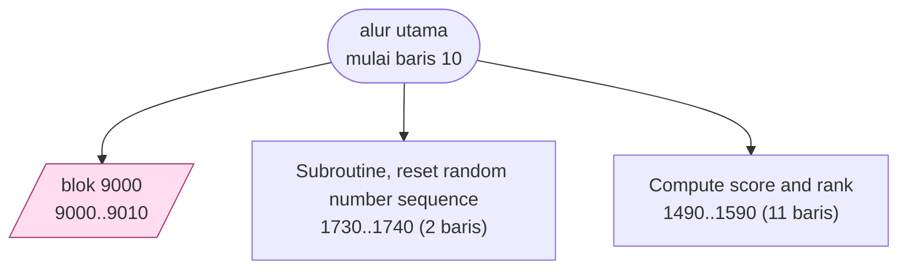
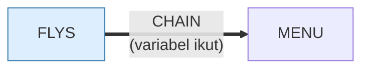

# FLYS.BAS — Flys (ikuti lalatnya)

> Sprite lalat dan pemukul dibangun dengan bahasa makro DRAW, lalu di-GET ke array.
>
> Judul review ini semula "pukul lalat". Diperbaiki saat porting web: lalatnya
> **dihapus sebelum pemukulnya turun**, jadi yang diuji ingatan, bukan
> ketangkasan. Lihat koreksi di bagian *Bagaimana program ini disusun*.

| | |
|---|---|
| Sumber | Public domain / listing majalah lain-lain |
| Tahun | 1985 |
| Panjang | 180 baris (nomor 10–9999) |
| Subrutin | 3, dipanggil dari 4 tempat |
| Percabangan | 3 `GOTO`, 4 `GOSUB`, 1 target `ON…` |
| Komentar | 1% dari baris |
| Jalankan | `run\FLYS.bat` |

## Peta arsitektur

*Diagram di bawah ini bukan tafsiran — semuanya diturunkan langsung dari
kode: tiap panah adalah `GOSUB` yang benar-benar ada, tiap kotak adalah
blok antara sebuah entri dan `RETURN`-nya.*



Kotak bersudut miring berwarna = **penangan kejadian** (`ON KEY`/`ON ERROR`), yang dipanggil oleh interupsi, bukan oleh alur utama.

### Subrutin dan perannya

| Baris | Panjang | Dipanggil | Peran (diambil dari kode) |
|---|--:|--:|---|
| `1490`–`1590` | 11 baris | 2× | Compute score and rank |
| `1730`–`1740` | 2 baris | 1× | Subroutine, reset random number sequence |
| `9000`–`9010` | 2 baris | 1× | blok @9000 *(handler)* |

### Program lain yang dimuat



### Kejadian yang dijebak

- `ON KEY(10)` → baris 9000

### Perulangan utama

`GOTO` mundur terpanjang: dari baris **1460** kembali ke **510** — melingkupi 950 nomor baris.
Itulah loop utama program ini; segala sesuatu di dalam rentang tersebut
dijalankan berulang.

### Data yang dipegang

| Array | Dipakai | Ditulis di baris |
|---|--:|---|
| `Y` | 3× | — |

## Bagaimana program ini disusun

Tiga subrutin untuk 180 baris, dan **hanya 3 `GOTO`** — rasio terbaik di koleksi.
Seluruh permainan ada di satu loop utama (510←1460).

Arsitekturnya sederhana karena aset dibangun lebih dulu, di luar loop:

```basic
DIM FLY0(21),FLY1(21),FLY2(21)     ' tiga fase kepakan sayap
DIM SWAT(714)                       ' pemukul
```

Lalat digambar dengan bahasa makro `DRAW`, lalu di-`GET` ke array. Setelah itu
loop permainan cukup mem-`PUT` array yang mana pun. Ini pemisahan **fase
persiapan** dari **fase jalan** — pola yang sama dengan mengompilasi shader
sebelum render, atau menyiapkan query sebelum loop.

> [!WARNING]
> **Koreksi, ditambahkan saat porting web (2026-08-09).**
> Kalimat berikutnya di review ini semula berbunyi *"tiga fase `FLY0`/`FLY1`/`FLY2`
> yang di-`PUT` bergantian"*. **Itu keliru, dan hanya ketahuan setelah makronya
> dijalankan.** Rinciannya di [`web/docs/flys.md`](../web/docs/flys.md) §2.
>
> Penanya menggambar 100 piksel, seluruhnya di kotak `x 154..169`, `y 94..114`.
> Persegi `GET` baris 280 berhenti di kolom **152** — lalat pertama baru mulai
> di kolom **154**:
>
> | Array | Persegi `GET` | Piksel di dalamnya |
> |---|---|--:|
> | `FLY0` | (131,91)-(152,103) | **0** |
> | `FLY1` | (151,91)-(172,103) | 50 |
> | `FLY2` | (151,105)-(172,117) | 50 |
>
> `FLY0` **persegi kosong**. Gunanya baris 630, `PUT …,FLY0,PSET` — karena
> `PSET` menimpa seluruh persegi termasuk piksel kosongnya, menaruh sprite
> kosong berarti **menghapus**. Kepakannya **dua fase, bukan tiga**.
>
> Dan itu mengubah pemahaman soal permainannya: baris 630 berjalan di akhir
> *setiap* hinggapan termasuk yang terakhir, jadi lalatnya sudah hilang sebelum
> pemukulnya turun. **Ini permainan ingatan, bukan ketangkasan** — dan nama
> berkasnya, judul katalognya, serta review ini semuanya sempat mengatakan hal
> lain.

Dua fase `FLY1`/`FLY2` yang di-`PUT` bergantian adalah animasi berbasis frame
paling dasar. Dua frame sudah cukup untuk kesan bergerak.

Ukuran array memberi tahu ukuran sprite tanpa membuka gambarnya: 21 elemen untuk
lalat, 714 untuk pemukul. Di GW-BASIC ukuran array `GET` dihitung dari lebar ×
tinggi × kedalaman warna, jadi angka itu adalah spesifikasi.

Rutin 1490 (`Compute score and rank`) dipanggil 2× — satu-satunya logika yang
benar-benar dipakai ulang.

## Yang menarik dari kodenya

Contoh terbersih di koleksi untuk **membuat sprite dari kode, bukan dari
gambar**. Alih-alih menyimpan bitmap, program menggambar lalatnya dengan bahasa
makro `DRAW` lalu memotretnya ke array:

```basic
DIM FLY0(21),FLY1(21),FLY2(21)     ' tiga fase kepakan sayap
DIM SWAT(714)                       ' pemukul, jauh lebih besar
```

String `DRAW`-nya sendiri, misalnya `"c1u5be1d6r1u6bf1d5"`, adalah instruksi
pena: `u5` = naik 5, `d6` = turun 6, `b` = pindah tanpa menggambar, `e`/`f` =
diagonal. Sebuah bahasa turtle-graphics yang tertanam di BASIC.

`FLY1` dan `FLY2` yang di-`PUT` bergantian menghasilkan animasi kepakan sayap
— **dua** frame, bukan tiga; lihat koreksi di atas. `FLY0` penghapusnya.

Angka-angka array mengungkap ukuran, dan **keduanya minimum yang muat**. Rumus
GW-BASIC: `4 + INT((lebar × bit_per_piksel + 7) ÷ 8) × tinggi`, dan `SCREEN 1`
memakai 2 bit per piksel. Larik `FLY*` dan `SWAT` presisi tunggal (4 bita per
elemen) karena `DEFINT X,Y` hanya mencakup `X` dan `Y`:

| | Ukuran | Butuh | `DIM` × 4 | Sisa |
|---|---|--:|--:|--:|
| lalat | 22×13 | 82 bita | 21 → **84** | 2 |
| swat | 76×150 | 2.854 bita | 714 → **2.856** | 2 |

Sisa dua bita itu bukan pilihan — ia dipaksa pembulatan ke kelipatan empat.
Angka 21 dan 714 **dihitung**, bukan ditebak.

Program ini juga punya rasio lompatan terbaik di koleksi: **3 `GOTO` untuk 180
baris**, dan baris terpanjang hanya 61 kolom.

## Yang bisa dipelajari

- Menggambar aset dengan kode lalu `GET` ke array menghemat ruang disket dan membuat aset mudah diubah.
- Animasi dua frame sudah cukup untuk kesan bergerak. Jangan mulai dari yang rumit.
- 3 `GOTO` dalam 180 baris membuktikan program aksi tidak wajib berantakan.
- **Sprite kosong adalah penghapus.** Kalau `PUT`-nya `PSET`, tidak perlu rutin hapus terpisah — dan larik yang isinya tidak ada tetap punya fungsi.
- **Ukuran larik grafis bisa dihitung, jadi hitunglah.** Angka yang pas persis memberi tahu pembaca berikutnya bahwa penulisnya tahu apa yang ia lakukan.
- **Jangan mengukur waktu dengan menghitung pekerjaan.** `ceil(DELAY/99)` membuat kurva kesulitan program ini mati diam-diam di lalat ke-12, padahal menang butuh 31 — dan `DELAY` maupun `SPEED` tetap terlihat bergerak rapi sampai akhir.

## Lampiran

### Perkakas bahasa yang dipakai

`PLAY` — musik lewat bahasa makro not, `SOUND` — nada mentah (frekuensi, durasi), `DRAW` — bahasa makro menggambar garis, `GET`/`PUT` — sprite disalin ke/dari array, `LINE` — menggambar garis & kotak, `PSET`/`PRESET` — piksel tunggal, mode grafis CGA (`SCREEN 1`/`2`), `ON KEY(n) GOSUB` — jebakan tombol fungsi, `ON x GOSUB` — pemanggilan berindeks, `INKEY$` — baca tombol tanpa menunggu Enter, `CHAIN` — muat program lain, bawa variabel, `WHILE`/`WEND` — perulangan berkondisi, `RANDOMIZE` — menyemai pengacak, `DEFINT` — variabel default bilangan bulat, `LOCATE` — posisikan kursor, `COLOR` — warna teks

### Deklarasi array

```basic
DIM FLY0(21),FLY1(21),FLY2(21)
DIM SWAT(714)
DIM X(3),Y(3)
```

### Sepuluh baris pembuka

```basic
10 '*****************
20 '**     FLY     **
30 '*****************
40 '
50 CLEAR
52 ON KEY(10) GOSUB 9000: KEY(10) ON
60 GOSUB 1730
70 SCREEN 1
80 KEY OFF
90 CLS
```

---
[Dasar-dasar BASIC](00-DASAR-BASIC.md) · [Daftar review](README.md) · [Katalog koleksi](../README.md)
