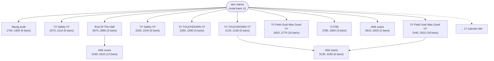
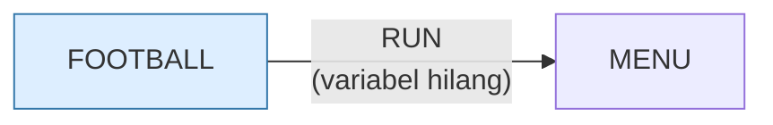

# FOOTBALL.BAS — Head Coach (football)

> Menu #1 pilihan J. Bertanggal 29 Jul 1982.

| | |
|---|---|
| Sumber | Friendlyware PC Introductory Set |
| Tahun | 1982 |
| Panjang | 345 baris (nomor 10–3450) |
| Subrutin | 29, dipanggil dari 47 tempat |
| Percabangan | 53 `GOTO`, 47 `GOSUB`, 2 target `ON…` |
| Komentar | 1% dari baris |
| Jalankan | `run\FOOTBALL.bat` |

## Peta arsitektur

*Diagram di bawah ini bukan tafsiran — semuanya diturunkan langsung dari
kode: tiap panah adalah `GOSUB` yang benar-benar ada, tiap kotak adalah
blok antara sebuah entri dan `RETURN`-nya.*



Kotak bersudut miring berwarna = **penangan kejadian** (`ON KEY`/`ON ERROR`), yang dipanggil oleh interupsi, bukan oleh alur utama.

### Subrutin dan perannya

| Baris | Panjang | Dipanggil | Peran (diambil dari kode) |
|---|--:|--:|---|
| `2780`–`2800` | 3 baris | 4× | if @2780 |
| `2120`–`2160` | 5 baris | 3× | "!!!!  TOUCHDOWN  !!!!" |
| `2250`–`2290` | 5 baris | 3× | "!!!!  TOUCHDOWN  !!!!" |
| `1750`–`1800` | 6 baris | 2× | hitung acak |
| `2070`–`2110` | 5 baris | 2× | "!!!!   Safety    !!!!" |
| `2200`–`2240` | 5 baris | 2× | "!!!!   Safety    !!!!" |
| `2620`–`2770` | 16 baris | 2× | "!!!!  Field Goal Was Good  !!!!" |
| `2810`–`2820` | 2 baris | 2× | efek suara |
| `2830`–`2840` | 2 baris | 2× | efek suara |
| `2850`–`2860` | 2 baris | 2× | efek suara |
| `2870`–`2890` | 3 baris | 2× | "End Of The Half" |
| `2900`–`2910` | 2 baris | 2× | "End Of The Quarter" |
| `3130`–`3180` | 6 baris | 2× | efek suara |
| `3450`–`3450` | 1 baris | 2× | efek suara |

*(15 subrutin lain tidak ditampilkan)*

### Program lain yang dimuat



### Kejadian yang dijebak

- `ON KEY(10)` → baris 3040

### Perulangan utama

`GOTO` mundur terpanjang: dari baris **2990** kembali ke **340** — melingkupi 2650 nomor baris.
Itulah loop utama program ini; segala sesuatu di dalam rentang tersebut
dijalankan berulang.

## Bagaimana program ini disusun

29 subrutin tapi hanya **4 panah antar-subrutin** — bentuk bintang yang sama
dengan `21.BAS`, dengan alur utama sebagai satu-satunya sutradara.

Yang menarik adalah nama-nama subrutinnya yang berpasangan:

| Baris | Isi | Baris | Isi |
|---|---|---|---|
| 2070 | `!!!! Safety !!!!` | 2200 | `!!!! Safety !!!!` |
| 2120 | `!!!! TOUCHDOWN !!!!` | 2250 | `!!!! TOUCHDOWN !!!!` |

Dua salinan untuk tiap kejadian. Kenapa? Hampir pasti karena satu untuk tim
pemain dan satu untuk tim komputer — pesannya sama, tapi papan skor yang
diperbarui berbeda.

Ini **duplikasi karena tidak ada parameter**. Dengan satu variabel `TIM` yang
menunjuk siapa yang mencetak angka, keempat rutin itu bisa jadi dua. Cara
`MATCH.BAS` menyelesaikannya lebih baik: jadikan pemain sebuah **indeks array**,
lalu tulis logikanya sekali.

Kalau Anda melihat dua blok kode yang bedanya cuma "yang ini untuk A, yang itu
untuk B", itu selalu tanda ada parameter yang belum diangkat.

Loop terluarnya 340←2990 melingkupi 2650 nomor baris — satu pertandingan penuh.

## Yang menarik dari kodenya

"Head Coach", simulasi football Friendlyware, bertanggal 29 Juli 1982 jam 9 malam.
Penanda waktu selengkap itu di baris pertama menunjukkan berkas ini bagian dari
alur kerja pengembangan yang aktif — semacam nomor build.

Baris 1470 memperlihatkan idiom penundaan yang khas era ini:

```basic
1470 FOR HOLD=1 TO DELAY:SOUND 50,0.5:LOCATE 10,33:PRINT"PLAY IN PROGRESS":LOCATE 10,33:PRINT"                 ":SOUND 50,0:NEXT HOLD
```

Teks "PLAY IN PROGRESS" ditulis lalu dihapus berulang kali, menghasilkan efek
berkedip, sambil membunyikan nada rendah. Lamanya diatur variabel `DELAY`.

Yang penting untuk dipelajari di sini: **`DELAY` adalah cacah loop, bukan satuan
waktu.** Di IBM PC 4,77 MHz mungkin dua detik; di mesin yang sepuluh kali lebih
cepat jadi seperlima detik. Inilah persisnya alasan koleksi ini dulu butuh
`SLOWDOWN.COM`, dan alasan `dosbox-games.conf` mengunci kecepatan di
`cycles=fixed 315`.

Setidaknya penulisnya menaruh angkanya di variabel bernama `DELAY` alih-alih
menuliskan angka mentah di sepuluh tempat — jadi kalau mau menyetel ulang untuk
mesin lebih cepat, cukup satu tempat.

## Yang bisa dipelajari

- Kalau terpaksa memakai loop sebagai penunda, taruh angkanya di satu variabel bernama. Itu jadi satu-satunya tombol yang perlu diputar.
- Efek berkedip cukup dibuat dengan menulis lalu menghapus teks di posisi yang sama.

## Yang jangan ditiru

- Mengukur waktu dengan menghitung pekerjaan. Ini kesalahan yang mematikan seluruh generasi permainan begitu prosesor jadi lebih cepat.

## Lampiran

### Perkakas bahasa yang dipakai

`PLAY` — musik lewat bahasa makro not, `SOUND` — nada mentah (frekuensi, durasi), `BEEP`, `POKE` — tulis memori langsung, `DEF SEG` — pindah segmen memori, `ON KEY(n) GOSUB` — jebakan tombol fungsi, `ON x GOSUB` — pemanggilan berindeks, `INKEY$` — baca tombol tanpa menunggu Enter, `RUN "nama"` — muat program lain, variabel hilang, `RANDOMIZE` — menyemai pengacak, `STRING$` — ulang satu karakter n kali, `LOCATE` — posisikan kursor, `COLOR` — warna teks

### Sepuluh baris pembuka

```basic
10 '7/29/82:09:00pm
20 KEY OFF:SCREEN 0,0,0:DEF SEG:WIDTH 80:ON KEY(10) GOSUB 3040
30 FOR A=1 TO 9:ON KEY(A) GOSUB 1800:KEY(A) ON:NEXT
40 COLOR 3,0:CLS:POKE 106,0
50 LOCATE 1,1:PRINT STRING$(80,219)
60 FOR A=2 TO 22:LOCATE A,1:PRINT"█":LOCATE A,80:PRINT"█":NEXT
70 LOCATE 23,1:PRINT STRING$(80,219);
80 COLOR 15,0:LOCATE 2,30:PRINT"H E A D   C O A C H
90 LOCATE 5,22,O:PRINT"Would You Like Instructions ? <Y/N>":COLOR 3,0
100 RESP$=INKEY$:IF RESP$="" THEN 100
```

### Baris terpanjang (154 kolom)

```basic
1470 COLOR 15,0:FOR HOLD=1 TO DELAY:SOUND 50,0.5:LOCATE 10,33:PRINT"PLAY IN PROGRESS":LOCATE 10,33:PRINT"                 ":SOUND 50,0:NEXT HOLD:COLOR 3,0
```

---
[Dasar-dasar BASIC](00-DASAR-BASIC.md) · [Daftar review](README.md) · [Katalog koleksi](../README.md)
