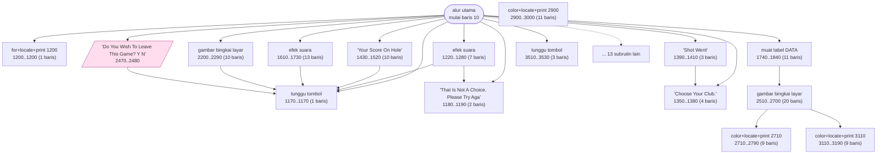
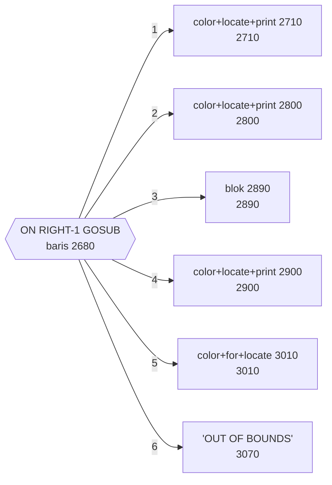
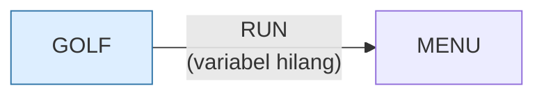

# GOLF.BAS — PC Golf

> Menu #1 pilihan I. Update terakhir 17 Jul 1982 oleh A. Vanchura.

| | |
|---|---|
| Sumber | Friendlyware PC Introductory Set |
| Tahun | 1982 |
| Panjang | 361 baris (nomor 10–3610) |
| Subrutin | 29, dipanggil dari 47 tempat |
| Percabangan | 39 `GOTO`, 37 `GOSUB`, 16 target `ON…` |
| Komentar | 1% dari baris |
| Jalankan | `run\GOLF.bat` |

## Peta arsitektur

*Diagram di bawah ini bukan tafsiran — semuanya diturunkan langsung dari
kode: tiap panah adalah `GOSUB` yang benar-benar ada, tiap kotak adalah
blok antara sebuah entri dan `RETURN`-nya.*



Kotak bersudut miring berwarna = **penangan kejadian** (`ON KEY`/`ON ERROR`), yang dipanggil oleh interupsi, bukan oleh alur utama.

### Subrutin dan perannya

| Baris | Panjang | Dipanggil | Peran (diambil dari kode) |
|---|--:|--:|---|
| `1170`–`1170` | 1 baris | 10× | tunggu tombol |
| `1350`–`1380` | 4 baris | 5× | "Choose Your Club." |
| `1390`–`1410` | 3 baris | 3× | "Shot Went" |
| `1180`–`1190` | 2 baris | 2× | "That Is Not A Choice. Please Try Aga" |
| `1200`–`1200` | 1 baris | 2× | for+locate+print @1200 |
| `3510`–`3530` | 3 baris | 2× | tunggu tombol |
| `1210`–`1210` | 1 baris | 1× | muat tabel DATA |
| `1220`–`1280` | 7 baris | 1× | efek suara |
| `1300`–`1380` | 9 baris | 1× | "This Is Your Bag Of Clubs:" |
| `1380`–`1380` | 1 baris | 1× | blok @1380 |
| `1430`–`1520` | 10 baris | 1× | "Your Score On Hole" |
| `1530`–`1600` | 8 baris | 1× | efek suara |
| `1610`–`1730` | 13 baris | 1× | efek suara |
| `1740`–`1840` | 11 baris | 1× | muat tabel DATA |

*(15 subrutin lain tidak ditampilkan)*

### Tabel dispatch

Program ini punya **3** percabangan berindeks (`ON … GOTO/GOSUB`).
Yang terbesar ada di baris 2680 dengan 6 cabang:



### Program lain yang dimuat



### Kejadian yang dijebak

- `ON KEY(10)` → baris 2470

### Perulangan utama

`GOTO` mundur terpanjang: dari baris **2460** kembali ke **1170** — melingkupi 1290 nomor baris.
Itulah loop utama program ini; segala sesuatu di dalam rentang tersebut
dijalankan berulang.

### Data yang dipegang

| Array | Dipakai | Ditulis di baris |
|---|--:|---|
| `Z` | 6× | — |

## Bagaimana program ini disusun

29 subrutin, 10 panah. Yang paling sering dipanggil — baris 1170, **sepuluh
kali** — adalah rutin tunggu tombol satu baris.

Angka itu sendiri sudah bercerita: sepuluh titik dalam permainan tempat program
berhenti dan menunggu pemain. Menghitung berapa kali sebuah rutin input dipanggil
adalah cara cepat mengukur seberapa **interaktif** sebuah program, tanpa
menjalankannya.

Tabel dispatch di baris 2680 (`ON RIGHT-1 GOSUB`, 6 cabang) adalah pemilihan
stik golf.

Yang perlu diperhatikan justru di baris 1580:

```basic
1580 IF STK=PAR-2 THEN IF PAR=3 THEN HOLEINONE=... ELSE EAGLE=...
```

`IF` bersarang dengan satu `ELSE`. Milik `IF` yang mana? Di GW-BASIC jawabannya
`IF` **terdalam** — dan kebetulan itu yang dimaksud. Tapi aturan ini tidak sama
di semua BASIC dan tidak terbaca dari tata letaknya.

Ini masalah *dangling else*, sama persis dengan di C dan Java. Solusinya juga
sama: jangan bergantung pada aturan bawaan — pisahkan jadi dua `IF`, atau beri
blok eksplisit. Aturan bahasa yang harus dihafal untuk membaca kode adalah aturan
yang sebaiknya tidak Anda pakai.

## Yang menarik dari kodenya

Ditandatangani A. Vanchura, 17 Juli 1982 — orang yang sama dengan `WILDCAT.BAS`,
dan gaya keduanya memang mirip.

Baris 1580 layak diperiksa karena ia menunjukkan sebuah bug menunggu terjadi:

```basic
1580 IF STK=PAR-2 THEN IF PAR=3 THEN HOLEINONE=HOLEINONE+1:... ELSE EAGLE=EAGLE+1:...
```

`IF` bersarang dengan satu `ELSE` di ujung. Pertanyaannya: `ELSE` itu milik `IF`
yang mana? Di GW-BASIC jawabannya adalah **`IF` terdalam** — jadi `ELSE
EAGLE=EAGLE+1` hanya berlaku kalau `STK=PAR-2` bernilai benar tapi `PAR=3` salah.
Kebetulan itu memang yang dimaksud di sini.

Tapi aturan ini tidak sama di semua BASIC, dan tidak terbaca dari tata letaknya.
Ini masalah *dangling else* yang sama persis dengan di C dan Java. Solusinya juga
sama: jangan mengandalkan aturan default — pisahkan jadi dua `IF` terpisah, atau
beri kurung/blok eksplisit.

Nama variabelnya bagus (`HOLEINONE`, `EAGLE`, `PAR`, `STK`) dan itu membuat baris
sepanjang 247 kolom pun masih bisa ditebak maksudnya. Nama yang baik memberi
toleransi terhadap format yang buruk — meski bukan alasan untuk membuat format
buruk.

## Yang bisa dipelajari

- Nama variabel bermakna menyelamatkan kode yang formatnya berantakan. `HOLEINONE` mengalahkan `H1`.
- Pahami aturan *dangling else* di bahasa yang Anda pakai — lalu tulis kode yang tidak bergantung padanya.

## Yang jangan ditiru

- `IF ... THEN IF ... THEN ... ELSE ...` dalam satu baris 247 kolom. Bahkan kalau perilakunya benar, tidak ada yang bisa memastikannya dengan membaca.

## Lampiran

### Perkakas bahasa yang dipakai

`PLAY` — musik lewat bahasa makro not, `SOUND` — nada mentah (frekuensi, durasi), `POKE` — tulis memori langsung, `DEF SEG` — pindah segmen memori, `ON KEY(n) GOSUB` — jebakan tombol fungsi, `ON x GOTO` — percabangan berindeks, `ON x GOSUB` — pemanggilan berindeks, `INKEY$` — baca tombol tanpa menunggu Enter, `RUN "nama"` — muat program lain, variabel hilang, `RANDOMIZE` — menyemai pengacak, `DEFSTR` — variabel default teks, `STRING$` — ulang satu karakter n kali, `LOCATE` — posisikan kursor, `COLOR` — warna teks

### Deklarasi array

```basic
DIM Z(10),A(10)
```

### Sepuluh baris pembuka

```basic
10 'Last Update - 7/17/82:AM:A.Vanchura
20 SCREEN 0,0,0:KEY OFF:LOCATE 1,1,0:WIDTH 80
30 COLOR 15,0,0:CLS:CLEAR 100
40 RANDOMIZE(VAL(RIGHT$(TIME$,2))):DEFSTR Z:DIM Z(10),A(10):GOSUB 2200
50 FOR A=1 TO 9:ON KEY(A) GOSUB 1380:KEY(A) ON:NEXT
60 ON KEY(10) GOSUB 2470
70 KEY(10) ON:DEF SEG:POKE 106,0
80 GOSUB 1210:COLOR 15,0:CLS:LOCATE 5,20:PRINT"What Is Your Name? "
90 LOCATE 23,18:PRINT"***** Enter Your Name And Strike Enter *****":LOCATE 5,38:PRINT" ";
100 GOSUB 3510:P$=" "+LEFT$(ZA,7)
```

### Baris terpanjang (247 kolom)

```basic
1580 IF STK=PAR-2 THEN IF PAR=3 THEN HOLEINONE=HOLEINONE+1:PRINT"A Hole In One !!!!":FOR X=1 TO 7:SOUND 2000,1:SOUND 1000,1:NEXT ELSE EAGLE=EAGLE+1:PRINT"      An Eagle. WOW !! You Should Be On The Tour.":FOR X=1 TO 7:SOUND 3000,1:SOUND 500,1:NEXT
```

---
[Dasar-dasar BASIC](00-DASAR-BASIC.md) · [Daftar review](README.md) · [Katalog koleksi](../README.md)
