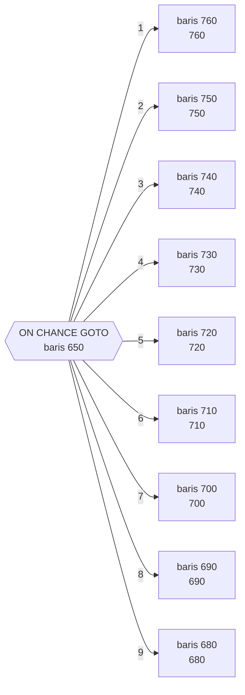
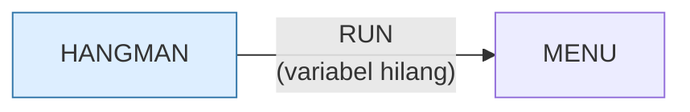

# HANGMAN.BAS — Hangman

> Menu #1 pilihan G. Diperbarui 1 Feb 1983.

| | |
|---|---|
| Sumber | Friendlyware PC Introductory Set |
| Tahun | 1983 |
| Panjang | 217 baris (nomor 1–2240) |
| Subrutin | 21, dipanggil dari 39 tempat |
| Percabangan | 7 `GOTO`, 39 `GOSUB`, 11 target `ON…` |
| Komentar | 3% dari baris |
| Jalankan | `run\HANGMAN.bat` |

## Peta arsitektur

*Diagram di bawah ini bukan tafsiran — semuanya diturunkan langsung dari
kode: tiap panah adalah `GOSUB` yang benar-benar ada, tiap kotak adalah
blok antara sebuah entri dan `RETURN`-nya.*

```mermaid
flowchart TD
    MAIN(["alur utama<br/>mulai baris 1"])
    S640["gambar ulang layar<br/>640..790 (16 baris)"]
    S810["HEAD<br/>810..860 (6 baris)"]
    S880["UPPER TORSO<br/>880..930 (6 baris)"]
    S950["LEGS<br/>950..950 (1 baris)"]
    S960["color+for+locate 960<br/>960..960 (1 baris)"]
    S970["color+locate+print 970<br/>970..970 (1 baris)"]
    S980["color+locate+print 980<br/>980..980 (1 baris)"]
    S1000["ARMS<br/>1000..1030 (4 baris)"]
    S1040["color+locate+print 1040<br/>1040..1070 (4 baris)"]
    S1080["color+locate+print 1080<br/>1080..1080 (1 baris)"]
    S1090["color+locate+print 1090<br/>1090..1090 (1 baris)"]
    S1100["efek suara<br/>1100..1210 (12 baris)"]
    S1230["GALLOWS<br/>1230..1280 (6 baris)"]
    S1320["gambar bingkai layar<br/>1320..1400 (9 baris)"]
    S1550["if 1550<br/>1550..1590 (5 baris)"]
    S1980["gambar bingkai layar<br/>1980..2120 (15 baris)"]
    MORE["... 5 subrutin lain"]
    MAIN -.-> MORE
    MAIN --> S1980
    MAIN --> S1320
    MAIN --> S1550
    MAIN --> S640
    S640 --> S810
    S640 --> S880
    S640 --> S950
    S640 --> S960
    S640 --> S970
    S640 --> S980
    S640 --> S1000
    S640 --> S1040
    S640 --> S1080
    S640 --> S1090
    S640 --> S1100
    S640 --> S1230
    S1320 --> S1550
```



Kotak bersudut miring berwarna = **penangan kejadian** (`ON KEY`/`ON ERROR`), yang dipanggil oleh interupsi, bukan oleh alur utama.

### Subrutin dan perannya

| Baris | Panjang | Dipanggil | Peran (diambil dari kode) |
|---|--:|--:|---|
| `1550`–`1590` | 5 baris | 4× | if @1550 |
| `1000`–`1030` | 4 baris | 3× | ARMS |
| `1040`–`1070` | 4 baris | 3× | color+locate+print @1040 |
| `1080`–`1080` | 1 baris | 3× | color+locate+print @1080 |
| `1090`–`1090` | 1 baris | 3× | color+locate+print @1090 |
| `810`–`860` | 6 baris | 2× | HEAD |
| `880`–`930` | 6 baris | 2× | UPPER TORSO |
| `950`–`950` | 1 baris | 2× | LEGS |
| `960`–`960` | 1 baris | 2× | color+for+locate @960 |
| `970`–`970` | 1 baris | 2× | color+locate+print @970 |
| `980`–`980` | 1 baris | 2× | color+locate+print @980 |
| `1980`–`2120` | 15 baris | 2× | gambar bingkai layar |
| `640`–`790` | 16 baris | 1× | gambar ulang layar |
| `790`–`790` | 1 baris | 1× | blok @790 |

*(7 subrutin lain tidak ditampilkan)*

### Tabel dispatch

Program ini punya **1** percabangan berindeks (`ON … GOTO/GOSUB`).
Yang terbesar ada di baris 650 dengan 9 cabang:



### Program lain yang dimuat



### Kejadian yang dijebak

- `ON KEY(10)` → baris 1600

### Perulangan utama

`GOTO` mundur terpanjang: dari baris **620** kembali ke **370** — melingkupi 250 nomor baris.
Itulah loop utama program ini; segala sesuatu di dalam rentang tersebut
dijalankan berulang.

### Data yang dipegang

| Array | Dipakai | Ditulis di baris |
|---|--:|---|
| `WORD` | 10× | — |
| `USED` | 5× | 220, 440 |
| `A` | 3× | 260, 270 |

## Bagaimana program ini disusun

**Arsitektur terbaik di koleksi untuk dipelajari**, dan alasannya bisa dilihat
langsung dari daftar subrutinnya:

| Baris | Nama di kode |
|---|---|
| 810 | `HEAD` |
| 880 | `UPPER TORSO` |
| 1000 | `ARMS` |
| 1040, 1080, 1090 | bagian tubuh berikutnya |

Tiap bagian tubuh orang gantung adalah satu subrutin. Lalu semuanya disambung
oleh satu baris:

```basic
650 ON CHANCE GOTO (9 target)
```

`CHANCE` adalah jumlah tebakan salah. Menebak salah menaikkan `CHANCE`, dan
tabel dispatch menggambar bagian tubuh berikutnya.

Ini pemetaan yang **sempurna**: satu keadaan permainan (jumlah kesalahan)
memetakan langsung ke satu tabel penggambar. Tidak ada `IF` bertingkat, tidak ada
bendera, tidak ada duplikasi. Menambah bagian tubuh berarti menambah satu
subrutin dan satu entri tabel.

Perhatikan juga bahwa 21 subrutin punya **25 panah antar-subrutin** — jaringan
terpadat di koleksi. Rutin gambar memanggil rutin gambar lain, karena
menggambar lengan mengandaikan tubuh sudah ada.

Datanya pun dipisah dengan benar: seratus kata di `DATA` baris 1290, dibaca ke
`WORD(100)` di baris 170. Menambah kata tidak menyentuh logika sama sekali.

## Yang menarik dari kodenya

Struktur terbaik di antara program Friendlyware: **7 `GOTO` untuk 217 baris**,
dengan 39 `GOSUB`. Rasionya kebalikan dari kebanyakan tetangganya.

Daftar katanya disimpan di `DATA`, bukan di dalam kode:

```basic
1290 DATA BUG,PRINTER,GAME,ELBOW,PIZZA,BUDGET,CRY,THING,FEIGN,CARD,TALK,...
```

Seratus kata di beberapa baris `DATA`, dibaca ke `WORD(100)` di baris 170.
Menambah kata cukup dengan menyunting `DATA` — tidak perlu menyentuh logika.
Ini pemisahan data dari kode yang benar, dilakukan dengan sarana yang ada.

`USED(27)` melacak huruf yang sudah ditebak. 27, bukan 26 — indeks 0 tidak
dipakai supaya `USED(1)` berarti "A", `USED(2)` berarti "B", dan seterusnya.
Menukar satu sel memori demi kode yang tidak perlu terus-menerus mengurangi 1.
Perdagangan yang hampir selalu layak.

`DEFINT A-T` dan `DEFSTR U,W` di baris 140–150 memberi tahu pembaca sebelum
melihat kodenya: variabel `U` dan `W` adalah teks, sisanya angka bulat.

## Yang bisa dipelajari

- Taruh daftar data di `DATA`, bukan di dalam logika. Menambah isi jadi tidak berisiko.
- Buang indeks 0 kalau itu membuat sisa kode lebih jelas. Satu sel memori jauh lebih murah daripada satu bug off-by-one.
- 7 `GOTO` untuk 217 baris — bukti bahwa program Friendlyware bisa ditulis rapi. Yang lain memilih tidak.

## Lampiran

### Perkakas bahasa yang dipakai

`PLAY` — musik lewat bahasa makro not, `SOUND` — nada mentah (frekuensi, durasi), `POKE` — tulis memori langsung, `DEF SEG` — pindah segmen memori, `ON KEY(n) GOSUB` — jebakan tombol fungsi, `ON x GOTO` — percabangan berindeks, `ON x GOSUB` — pemanggilan berindeks, `INKEY$` — baca tombol tanpa menunggu Enter, `RUN "nama"` — muat program lain, variabel hilang, `RANDOMIZE` — menyemai pengacak, `DEFINT` — variabel default bilangan bulat, `DEFSTR` — variabel default teks, `STRING$` — ulang satu karakter n kali, `LOCATE` — posisikan kursor, `COLOR` — warna teks

### Deklarasi array

```basic
DIM WORD(100),A(100),USED(27)
```

### Sepuluh baris pembuka

```basic
1 'update 2/1/83
10 KEY OFF:LOCATE ,,0:WIDTH 80:SCREEN 0,0,0
110 FOR A=1 TO 9:ON KEY(A) GOSUB 790:KEY(A) ON:NEXT
120 KEY(10) ON:DEF SEG:POKE 106,0
130 ON KEY(10) GOSUB 1600
140 DEFINT A-T
150 DEFSTR U,W:DIM WORD(100),A(100),USED(27)
160 GOSUB 1980
170 FOR B=0 TO 100
180     READ WORD(B)
```

### Baris terpanjang (253 kolom)

```basic
1290 DATA BUG,PRINTER,GAME,ELBOW,PIZZA,BUDGET,CRY,THING,FEIGN,CARD,TALK,EXAMPLE,TENSION,CALCULATOR,SHOE,TABLE,STEREO,BICYCLE,GUESS,BLENDER,FAULT,DIRTY,LOUDSPEAKER,CHICKEN,DANGEROUS,DIFFERENT,SCIENTIST,KIDNEY,SELF,MAHOGANY,UGLY,FRIENDLYWARE,PROGRAM,OPERA
```

---
[Dasar-dasar BASIC](00-DASAR-BASIC.md) · [Daftar review](README.md) · [Katalog koleksi](../README.md)
