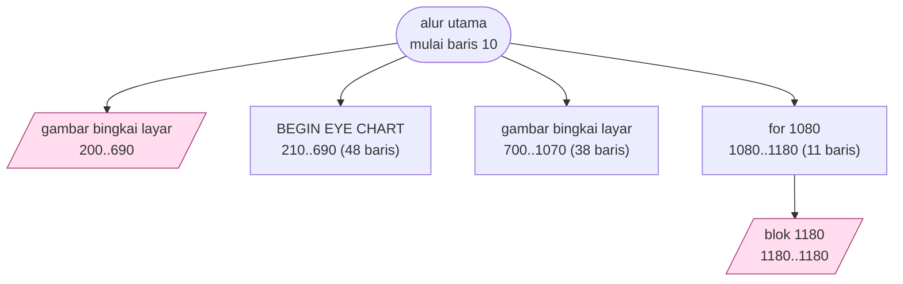
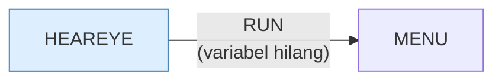

> [!WARNING]
> **Koreksi manual, ditambahkan sesi 15 (port web).**
>
> | Klaim / kesan | Kenyataan |
> |---|---|
> | Sembilan `ON KEY(1..9)` yang menunjuk ke `RETURN` kosong = tombol sengaja dimatikan | Bukan soal navigasi. Di GW-BASIC F1–F9 punya **makro bawaan** (F1 mengetik `LIST`, F2 `RUN`); `KEY OFF` hanya menyembunyikan tampilannya, makronya tetap mengetik. Program membaca `INKEY$`, jadi menjebak adalah satu-satunya cara mencegah `L-I-S-T` tumpah ke dalam uji |
> | `IF I=14000 THEN J=10` mempercepat sapuan di rentang atas | **Memperlambat** 10×. `J` adalah panjang nada dalam tik, bukan langkah. Hasilnya: 7,6 dtk untuk 100→14 kHz, lalu 88,5 dtk untuk 14→30 kHz — **92% waktunya** di rentang tempat pendengaran benar-benar habis (baris 810) |
>
> Baris 1180 juga melayani dua peran sekaligus: `RETURN` untuk `GOSUB 1080`
> **dan** badan kesembilan penangan.
>
> Uraian lengkap: [`web/docs/heareye.md`](../web/docs/heareye.md).

# HEAREYE.BAS — Tes Mata & Pendengaran

> Menu #1 pilihan M. Kartu Snellen plus tes nada lewat speaker PC.

| | |
|---|---|
| Sumber | Friendlyware PC Introductory Set |
| Tahun | 1982 |
| Panjang | 117 baris (nomor 10–1180) |
| Subrutin | 5, dipanggil dari 13 tempat |
| Percabangan | 3 `GOTO`, 13 `GOSUB`, 10 target `ON…` |
| Komentar | 3% dari baris |
| Jalankan | `run\HEAREYE.bat` |

## Peta arsitektur

*Diagram di bawah ini bukan tafsiran — semuanya diturunkan langsung dari
kode: tiap panah adalah `GOSUB` yang benar-benar ada, tiap kotak adalah
blok antara sebuah entri dan `RETURN`-nya.*



Kotak bersudut miring berwarna = **penangan kejadian** (`ON KEY`/`ON ERROR`), yang dipanggil oleh interupsi, bukan oleh alur utama.

### Subrutin dan perannya

| Baris | Panjang | Dipanggil | Peran (diambil dari kode) |
|---|--:|--:|---|
| `1180`–`1180` | 1 baris | 9× | blok @1180 *(handler)* |
| `200`–`690` | 49 baris | 1× | gambar bingkai layar *(handler)* |
| `210`–`690` | 48 baris | 1× | BEGIN EYE CHART |
| `700`–`1070` | 38 baris | 1× | gambar bingkai layar |
| `1080`–`1180` | 11 baris | 1× | for @1080 |

### Program lain yang dimuat



### Kejadian yang dijebak

- `ON KEY(1)` → baris 1180
- `ON KEY(10)` → baris 200
- `ON KEY(2)` → baris 1180
- `ON KEY(3)` → baris 1180
- `ON KEY(4)` → baris 1180
- `ON KEY(5)` → baris 1180
- `ON KEY(6)` → baris 1180
- `ON KEY(7)` → baris 1180
- `ON KEY(8)` → baris 1180
- `ON KEY(9)` → baris 1180

### Perulangan utama

`GOTO` mundur terpanjang: dari baris **180** kembali ke **10** — melingkupi 170 nomor baris.
Itulah loop utama program ini; segala sesuatu di dalam rentang tersebut
dijalankan berulang.

## Bagaimana program ini disusun

Lima subrutin, tapi dua di antaranya raksasa: baris 200–690 (49 baris) dan
210–690 (48 baris). Perhatikan keduanya **berakhir di baris yang sama**.

Itu bukan kesalahan analisis — itu **dua pintu masuk ke blok yang sama**.
Masuk lewat 200 menjalankan satu baris tambahan lalu meneruskan ke 210; masuk
lewat 210 melewatkannya.

Teknik ini punya nama: *entry point overloading*. Ia adalah cara BASIC meniru
argumen opsional. `GOSUB 200` berarti "dengan persiapan", `GOSUB 210` berarti
"tanpa persiapan" — satu blok kode, dua perilaku.

Anda akan melihat pola yang sama di `MORTGAGE.BAS` dan seluruh keluarga program
contoh IBM, di mana baris 980 versus 1000 memilih mode normal versus mode
demonstrasi.

Kelemahannya: hubungan antara kedua pintu itu tidak tertulis di mana pun.
Seseorang yang menyisipkan baris di antara 200 dan 210 akan merusaknya tanpa
tahu.

Peta kejadiannya sama dengan `BIO.BAS`: F1–F5 semua menunjuk baris 1180 yang
isinya `RETURN` kosong — tombol dimatikan dengan cara dijebak.

## Yang menarik dari kodenya

Program tes mata dan pendengaran. Menariknya, ini **satu-satunya program di
koleksi yang keluarannya adalah pengukuran terhadap penggunanya**, bukan
permainan.

Bingkainya dibangun dengan pola yang bersih:

```basic
60 LOCATE 1,19:PRINT "┌"STRING$(42,196)"┐"
70 LOCATE 3,19:PRINT "└"STRING$(42,196)"┘"
80 LOCATE 2,19:PRINT "│"SPC(42)"│"
```

Atas, bawah, lalu tengah. Perhatikan `SPC(42)` di baris tengah — bukan
`STRING$(42," ")`. Keduanya menghasilkan hal yang sama, tapi `SPC` lebih jelas
maksudnya ("beri jarak") daripada "ulangi spasi 42 kali". Detail kecil, tapi
inilah yang membedakan kode yang enak dibaca.

Struktur berkasnya nyaris identik dengan `INTRO.BAS` — baris 10–90 sama persis.
Keduanya jelas disalin dari templat yang sama, yang berarti Friendlyware punya
semacam "berkas kerangka" yang dipakai untuk memulai program baru. Bandingkan
keduanya berdampingan untuk melihat apa yang tetap dan apa yang berubah.

Uji pendengarannya memakai `SOUND` dengan frekuensi menaik; uji matanya memakai
teks yang mengecil. Keduanya sederhana dan, harus dikatakan, tidak akurat secara
medis — layar dan speaker PC tidak dikalibrasi.

## Yang bisa dipelajari

- `SPC(n)` menyatakan maksud lebih baik daripada `STRING$(n," ")` untuk memberi jarak.
- Membandingkan dua berkas yang lahir dari templat yang sama adalah cara cepat menemukan mana kerangka dan mana isi.

## Yang jangan ditiru

- Menyalin templat dengan menyalin berkas. Perbaikan pada kerangka tidak akan pernah sampai ke semua turunannya.

## Lampiran

### Perkakas bahasa yang dipakai

`PLAY` — musik lewat bahasa makro not, `SOUND` — nada mentah (frekuensi, durasi), `POKE` — tulis memori langsung, `DEF SEG` — pindah segmen memori, `ON KEY(n) GOSUB` — jebakan tombol fungsi, `ON x GOSUB` — pemanggilan berindeks, `INKEY$` — baca tombol tanpa menunggu Enter, `RUN "nama"` — muat program lain, variabel hilang, `STRING$` — ulang satu karakter n kali, `LOCATE` — posisikan kursor, `COLOR` — warna teks

### Sepuluh baris pembuka

```basic
10 KEY OFF
20  SCREEN 0,0,0:WIDTH 80:CLS:DEF SEG:POKE 106,0
30  ON KEY(10) GOSUB 200
40  KEY(10) ON
50  GOSUB 1080:DEF SEG:POKE 106,0:COLOR 11,0
60  LOCATE 1,19:PRINT "┌"STRING$(42,196)"┐"
70  LOCATE 3,19:PRINT "└"STRING$(42,196)"┘"
80  LOCATE 2,19:PRINT "│"SPC(42)"│"
90  COLOR 0,7
100 LOCATE  2,29:PRINT CHR$(255) "F R I E N D L Y W A R E" CHR$(255)
```

### Baris terpanjang (140 kolom)

```basic
140 LOCATE 19,13:COLOR 15,0:PRINT"*****";:COLOR 3,0:PRINT" Strike Key Corresponding To Function Desired ";:COLOR 15,0:PRINT"*****":COLOR 3,0
```

---
[Dasar-dasar BASIC](00-DASAR-BASIC.md) · [Daftar review](README.md) · [Katalog koleksi](../README.md)
