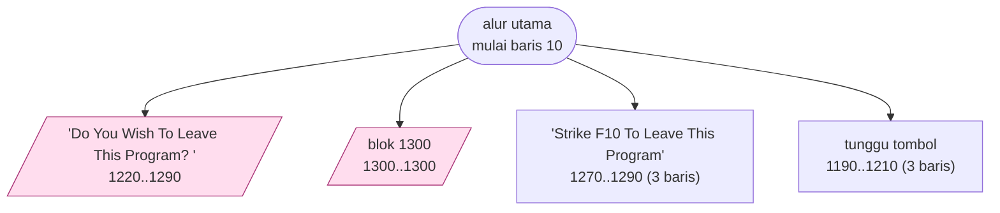
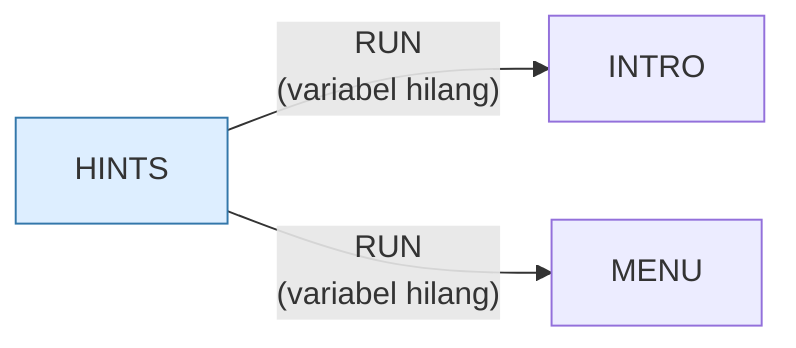

# HINTS.BAS — Layar bantuan / petunjuk

> Teks bantuan yang dipakai bersama oleh program-program Friendlyware.

| | |
|---|---|
| Sumber | Friendlyware PC Introductory Set |
| Tahun | 1982 |
| Panjang | 132 baris (nomor 10–1320) |
| Subrutin | 4, dipanggil dari 13 tempat |
| Percabangan | 1 `GOTO`, 13 `GOSUB`, 3 target `ON…` |
| Komentar | 4% dari baris |
| Jalankan | `run\HINTS.bat` |

## Peta arsitektur

*Diagram di bawah ini bukan tafsiran — semuanya diturunkan langsung dari
kode: tiap panah adalah `GOSUB` yang benar-benar ada, tiap kotak adalah
blok antara sebuah entri dan `RETURN`-nya.*



Kotak bersudut miring berwarna = **penangan kejadian** (`ON KEY`/`ON ERROR`), yang dipanggil oleh interupsi, bukan oleh alur utama.

### Subrutin dan perannya

| Baris | Panjang | Dipanggil | Peran (diambil dari kode) |
|---|--:|--:|---|
| `1270`–`1290` | 3 baris | 6× | "Strike <F10> To Leave This Program" |
| `1190`–`1210` | 3 baris | 5× | tunggu tombol |
| `1220`–`1290` | 8 baris | 1× | "Do You Wish To Leave This Program? <" *(handler)* |
| `1300`–`1300` | 1 baris | 1× | blok @1300 *(handler)* |

### Program lain yang dimuat



### Kejadian yang dijebak

- `ON ERROR` → baris 1320
- `ON KEY(1)` → baris 1300
- `ON KEY(10)` → baris 1220

## Bagaimana program ini disusun

Empat subrutin untuk 132 baris, **satu `GOTO` saja**, dan dua rutin yang
dipanggil berulang (1270 enam kali, 1190 lima kali).

Bentuk ini — sangat sedikit percabangan, sedikit rutin yang sering dipakai —
adalah tanda khas program **presentasi**: tidak ada keadaan yang berubah, tidak
ada percabangan berdasarkan tindakan pemakai, hanya urutan halaman.

Itu sendiri pelajaran arsitektur: **struktur kode mencerminkan struktur
masalah.** Kalau kode Anda kusut, periksa dulu apakah persoalannya memang
serumit itu, atau apakah beberapa persoalan sedang tercampur jadi satu.

Rutin 1190 adalah pasangan tetap Friendlyware:

```basic
1190 BACKFLAG=0:KEY(1) ON:LOCATE 24,12:PRINT "Strike Any Key To Continue   Strike <F1> For Previous Page"
```

Ia mengatur ulang bendera `BACKFLAG`, menyalakan jebakan F1, lalu menampilkan
baris bantuan. Tiga hal sekaligus, dan urutannya penting: bendera harus
di-nol-kan **sebelum** jebakan dinyalakan, kalau tidak tekanan F1 yang datang
lebih awal bisa hilang.

Mesin halaman yang sama muncul di `ANATOMY.BAS` dan `HISTORY.BAS` dengan nomor
baris berbeda — disalin, bukan dibagi.

## Yang menarik dari kodenya

Layar bantuan bersama untuk program-program Friendlyware. Bukan permainan, tapi
justru karena itu strukturnya bersih: **1 `GOTO` untuk 132 baris**.

Mesin halamannya sama dengan `ANATOMY.BAS` dan `HISTORY.BAS` — bendera
`BACKFLAG`, jebakan F1 untuk mundur, jebakan F10 untuk keluar:

```basic
1190 BACKFLAG=0:KEY(1) ON:LOCATE 24,12:COLOR 15,0:PRINT "Strike Any Key To Continue   Strike <F1> For Previous Page"
```

Ketiga berkas ini memakai rutin yang identik dengan nomor baris berbeda. Sekali
lagi: kerangka yang disalin, bukan dibagi.

Yang layak dicatat adalah variabel `XLIN` dan `XPOS` di baris 50. Keduanya muncul
di banyak program Friendlyware dan berfungsi sebagai **posisi kursor yang
diingat** — supaya ketika halaman digambar ulang setelah kembali dari layar
bantuan, kursor bisa dikembalikan ke tempatnya. Menyimpan dan memulihkan keadaan
tampilan; masalah yang sama persis dengan mengembalikan posisi gulir setelah
navigasi di aplikasi web.

## Yang bisa dipelajari

- Simpan dan pulihkan posisi tampilan ketika pengguna pergi lalu kembali. Detail kecil yang sangat terasa.
- Program tanpa logika permainan cenderung punya struktur paling bersih. Ia bisa jadi tempat belajar yang baik.

## Yang jangan ditiru

- Mesin halaman yang sama disalin ke tiga berkas dengan penomoran berbeda. Perbaiki satu, dua lainnya tetap salah.

## Lampiran

### Perkakas bahasa yang dipakai

`POKE` — tulis memori langsung, `DEF SEG` — pindah segmen memori, `ON KEY(n) GOSUB` — jebakan tombol fungsi, `ON ERROR GOTO` — penanganan galat, `ON x GOTO` — percabangan berindeks, `ON x GOSUB` — pemanggilan berindeks, `INKEY$` — baca tombol tanpa menunggu Enter, `RUN "nama"` — muat program lain, variabel hilang, `DEFSTR` — variabel default teks, `STRING$` — ulang satu karakter n kali, `LOCATE` — posisikan kursor, `COLOR` — warna teks

### Sepuluh baris pembuka

```basic
10 ON ERROR GOTO 1320
20 ON KEY(10) GOSUB 1220
30 ON KEY(1) GOSUB 1300
40 DEFSTR Z:SCREEN 0,0,0:WIDTH 80
50 XLIN=1:XPOS=1
60 CLS:GOSUB 1270
70 LOCATE 1,1:PRINT "╔"STRING$(78,"═")"╗"
80 FOR A=2 TO 22:LOCATE A,1:PRINT "║":LOCATE A,80:PRINT "║";:NEXT
90 LOCATE 23,1:PRINT "╚"STRING$(78,"═")"╝";
100 COLOR 15,0:LOCATE 3,31:PRINT "HELPFUL DOS COMMANDS":COLOR 3,0
```

### Baris terpanjang (127 kolom)

```basic
1190 BACKFLAG=0:KEY(1) ON:LOCATE 24,12:COLOR 15,0:PRINT "Strike Any Key To Continue   Strike <F1> For Previous Page";:COLOR 3,0
```

---
[Dasar-dasar BASIC](00-DASAR-BASIC.md) · [Daftar review](README.md) · [Katalog koleksi](../README.md)
