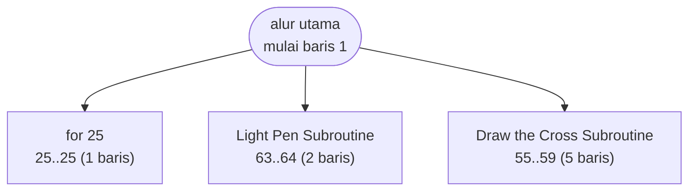

# HIQUE2.BAS — Hique (peg solitaire)

> Wes Meier, CompuServe 70215,1017. Mendukung input light pen.

| | |
|---|---|
| Sumber | Public domain / listing majalah lain-lain |
| Tahun | 1986 |
| Panjang | 142 baris (nomor 1–142) |
| Subrutin | 3, dipanggil dari 5 tempat |
| Percabangan | 19 `GOTO`, 5 `GOSUB`, 1 target `ON…` |
| Komentar | 1% dari baris |
| Jalankan | `run\HIQUE2.bat` |

## Peta arsitektur

*Diagram di bawah ini bukan tafsiran — semuanya diturunkan langsung dari
kode: tiap panah adalah `GOSUB` yang benar-benar ada, tiap kotak adalah
blok antara sebuah entri dan `RETURN`-nya.*



Kotak bersudut miring berwarna = **penangan kejadian** (`ON KEY`/`ON ERROR`), yang dipanggil oleh interupsi, bukan oleh alur utama.

### Subrutin dan perannya

| Baris | Panjang | Dipanggil | Peran (diambil dari kode) |
|---|--:|--:|---|
| `25`–`25` | 1 baris | 3× | for @25 |
| `55`–`59` | 5 baris | 1× | Draw the Cross Subroutine |
| `63`–`64` | 2 baris | 1× | Light Pen Subroutine |

### Perulangan utama

`GOTO` mundur terpanjang: dari baris **93** kembali ke **75** — melingkupi 18 nomor baris.
Itulah loop utama program ini; segala sesuatu di dalam rentang tersebut
dijalankan berulang.

### Data yang dipegang

| Array | Dipakai | Ditulis di baris |
|---|--:|---|
| `T` | 15× | 31 |
| `L` | 12× | — |
| `P` | 11× | 25, 57, 96, 108, 125, … |
| `L2T` | 3× | 31 |

## Bagaimana program ini disusun

Tiga subrutin saja, dan salah satunya cuma satu baris. Hampir semuanya di alur
utama. Untuk permainan papan, itu jarang — dan alasannya ada di struktur
datanya.

```basic
9 DEFINT B-Z:DEFSTR A:DIM P(33),L(33),T(33),L2T(33)
```

Papan hique punya 33 lubang. `P` = isi tiap lubang, `L` = daftar lokasi,
`T`/`L2T` = pemetaan lokasi ke target lompatan.

Keempat array itu **dihitung sekali di awal**, lalu seluruh permainan cuma
membaca tabel. Memeriksa apakah sebuah lompatan sah tidak butuh menghitung
geometri papan — cukup satu pencarian di `L2T`.

Karena logikanya sudah dipindahkan ke data, kode yang tersisa jadi tipis, dan
program tidak butuh banyak subrutin. **Struktur data yang tepat mengurangi
kebutuhan akan kode.** Ini salah satu pertukaran paling berharga dalam
pemrograman, dan program 142 baris ini menunjukkannya dengan jelas.

Dua subrutin lainnya: `Draw the Cross Subroutine` (55) dan `Light Pen
Subroutine` (63). Yang kedua membaca pena cahaya lewat fungsi `PEN` bawaan
GW-BASIC — jalur input alternatif di samping keyboard, dua puluh tahun sebelum
layar sentuh jadi biasa.

## Yang menarik dari kodenya

Peg solitaire karya Wes Meier. Headernya menyebut nomor CompuServe
(`70215,1017`) sebagai alamat kontak — bentuk "email" tahun 1986.

Yang membuat program ini istimewa ada di baris 6: **"Supports Light Pen
Operation"**. Light pen adalah pena yang ditempelkan ke layar CRT; ia mendeteksi
kilatan berkas elektron saat melewati posisinya. GW-BASIC punya fungsi `PEN`
bawaan untuk membacanya. Jadi program ini menawarkan dua cara input — keyboard
dan pena — dua puluh tahun sebelum layar sentuh jadi biasa.

Struktur datanya rapi:

```basic
9 DEFINT B-Z:DEFSTR A:DIM P(33),L(33),T(33),L2T(33)
```

Papan hique punya 33 lubang. `P` = isi tiap lubang, `L` = daftar lokasi,
`T`/`L2T` = tabel pemetaan lokasi ke target. Empat array 33 elemen yang bersama
membentuk graf gerakan yang sah — dihitung sekali di awal, lalu tinggal
dikonsultasi.

`DEFSTR A` berarti semua variabel berawalan A adalah teks, sisanya integer.
Konvensi yang dinyatakan dalam satu baris.

## Yang bisa dipelajari

- Precompute tabel gerakan yang sah di awal, lalu tinggal lihat tabel saat bermain. Jauh lebih cepat daripada menghitung ulang tiap langkah.
- Menawarkan lebih dari satu alat input, kalau perangkatnya ada, membuat program terasa jauh lebih hidup.

## Yang jangan ditiru

- Nama array satu huruf (`P`, `L`, `T`) untuk struktur data yang saling berhubungan. `L2T` sudah lebih baik karena setidaknya menyiratkan 'L ke T'.

## Lampiran

### Perkakas bahasa yang dipakai

`PLAY` — musik lewat bahasa makro not, `SOUND` — nada mentah (frekuensi, durasi), `DRAW` — bahasa makro menggambar garis, `POKE` — tulis memori langsung, `DEF SEG` — pindah segmen memori, `ON x GOSUB` — pemanggilan berindeks, `INKEY$` — baca tombol tanpa menunggu Enter, `DEFINT` — variabel default bilangan bulat, `DEFSTR` — variabel default teks, `STRING$` — ulang satu karakter n kali, `LOCATE` — posisikan kursor, `COLOR` — warna teks

### Deklarasi array

```basic
DIM P(33),L(33),T(33),L2T(33)
```

### Sepuluh baris pembuka

```basic
1 '             *** HIQUE ***
2 '             by Wes Meier (70215,1017)
3 '
4 '             Written for IBM PC with 80 Column Color.
5 '             Requires BASICA.
6 '             Supports Light Pen Operation.
7 '
8 SCREEN 0,1:KEY OFF:LOCATE ,,0,0,7:COLOR 7,9,0:CLS
9 DEFINT B-Z:DEFSTR A:DIM P(33),L(33),T(33),L2T(33)
10 DEF SEG=0:POKE &H417,96:DEF SEG
```

---
[Dasar-dasar BASIC](00-DASAR-BASIC.md) · [Daftar review](README.md) · [Katalog koleksi](../README.md)
