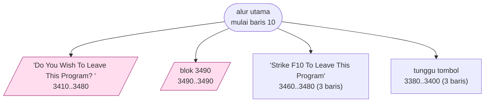
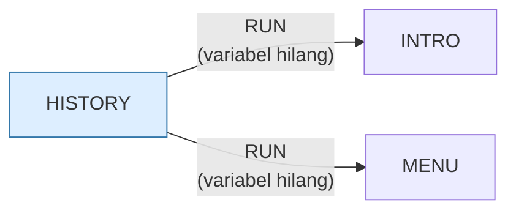

> [!WARNING]
> **Koreksi manual, ditambahkan sesi 15 (port web).**
>
> | Klaim | Kenyataan |
> |---|---|
> | Judul *"Evolusi Ukuran Komputer"* | Itu judul **halaman pertama** (baris 80). Program ini isi menu *"1 Information"* dari `INTRO.BAS` baris 170: 16 layar, hanya **3** tentang sejarah/ukuran; sisanya CPU, ALU, bus I/O, memori, DOS, bahasa, perawatan disket |
> | "mesin halaman sama dengan ANATOMY" | Tidak sama. ANATOMY maju-satu/mundur-satu secara ketat; di sini **5 dari 16** target mundur bukan halaman sebelumnya — 2 terpaksa (melompati halaman yang menimpa), 2 ke awal bab, 1 tanpa penjelasan (baris 1810 → 840) |
>
> Ini kali kedua berturut-turut judul katalog ternyata tebakan dari nama
> berkas, sesudah [ANATOMY](ANATOMY.md).
>
> Uraian lengkap: [`web/docs/history.md`](../web/docs/history.md).

# HISTORY.BAS — Evolusi Ukuran Komputer

> Pelajaran sejarah bergambar, mesin halaman sama dengan ANATOMY.

| | |
|---|---|
| Sumber | Friendlyware PC Introductory Set |
| Tahun | 1982 |
| Panjang | 351 baris (nomor 10–3510) |
| Subrutin | 4, dipanggil dari 31 tempat |
| Percabangan | 1 `GOTO`, 31 `GOSUB`, 3 target `ON…` |
| Komentar | 2% dari baris |
| Jalankan | `run\HISTORY.bat` |

## Peta arsitektur

*Diagram di bawah ini bukan tafsiran — semuanya diturunkan langsung dari
kode: tiap panah adalah `GOSUB` yang benar-benar ada, tiap kotak adalah
blok antara sebuah entri dan `RETURN`-nya.*



Kotak bersudut miring berwarna = **penangan kejadian** (`ON KEY`/`ON ERROR`), yang dipanggil oleh interupsi, bukan oleh alur utama.

### Subrutin dan perannya

| Baris | Panjang | Dipanggil | Peran (diambil dari kode) |
|---|--:|--:|---|
| `3380`–`3400` | 3 baris | 16× | tunggu tombol |
| `3460`–`3480` | 3 baris | 13× | "Strike <F10> To Leave This Program" |
| `3410`–`3480` | 8 baris | 1× | "Do You Wish To Leave This Program? <" *(handler)* |
| `3490`–`3490` | 1 baris | 1× | blok @3490 *(handler)* |

### Program lain yang dimuat



### Kejadian yang dijebak

- `ON ERROR` → baris 3510
- `ON KEY(1)` → baris 3490
- `ON KEY(10)` → baris 3410

## Bagaimana program ini disusun

Empat subrutin untuk **351 baris**, dan satu `GOTO`. Rasio paling datar di
koleksi.

Dua rutin memikul semuanya:

| Baris | Dipanggil | Peran |
|---|--:|---|
| 3380–3400 | 16× | tunggu tombol + tangani F1 |
| 3460–3480 | 13× | baris bantuan di dasar layar |

Enam belas panggilan berarti enam belas halaman. Dan itu berarti sisa 340 baris
program ini adalah **isi halaman yang ditulis lurus**, tanpa dipecah sama sekali.

Apakah itu buruk? Untuk kasus ini, tidak. Tiap halaman dipakai persis sekali,
tidak ada yang bisa dipakai ulang, dan memecahnya jadi 16 subrutin hanya akan
menambah 16 nomor baris yang harus dilacak tanpa satu pun manfaat.

**Jangan memecah kode yang tidak dipakai ulang dan tidak terlalu panjang untuk
dibaca.** Abstraksi punya biaya: setiap lapisan adalah satu lompatan lagi yang
harus diikuti pembaca. Program ini membayar biaya itu hanya untuk dua rutin yang
benar-benar sepadan.

Bandingkan dengan `ANATOMY.BAS` yang isinya serupa tapi memecah tiap halaman jadi
subrutin — karena di sana halaman bisa dikunjungi ulang lewat F1, jadi memang
harus bisa dipanggil lagi.

## Yang menarik dari kodenya

"The Evolution of Computer Size" — pelajaran sejarah bergambar. Mesin halamannya
sama dengan `ANATOMY.BAS`, tapi program ini **1 `GOTO` untuk 351 baris**, salah
satu rasio terbersih di koleksi.

Kenapa bisa sebersih itu? Karena isinya presentasi, bukan permainan. Tidak ada
keadaan yang berubah, tidak ada percabangan berdasarkan tindakan pemain — hanya
urutan halaman. Struktur yang bersih di sini adalah hadiah dari masalah yang
sederhana, bukan semata kepandaian penulisnya.

Itu sendiri adalah pelajaran: **kalau kode Anda kusut, tanyakan dulu apakah
masalahnya memang serumit itu.** Sering kali kerumitan datang dari mencampur
beberapa persoalan, bukan dari persoalannya sendiri.

Bingkai layarnya dua karakter tebal:

```basic
60 FOR A=4 TO 22:LOCATE A,2:PRINT "██":LOCATE A,78:PRINT "██":NEXT
```

Dua blok penuh (`█`) berdampingan, bukan satu, membuat bingkai kelihatan tebal
dan simetris dengan garis horizontal `STRING$(78,219)`. Perhatian pada detail
visual yang konsisten di seluruh produk Friendlyware.

## Yang bisa dipelajari

- Struktur kode mencerminkan struktur masalah. Kalau kodenya kusut, periksa apakah persoalannya sedang bercampur.
- Konsistensi visual (tebal bingkai, warna, posisi baris bantuan) di seluruh rangkaian program membuatnya terasa satu produk.

## Lampiran

### Perkakas bahasa yang dipakai

`POKE` — tulis memori langsung, `DEF SEG` — pindah segmen memori, `ON KEY(n) GOSUB` — jebakan tombol fungsi, `ON ERROR GOTO` — penanganan galat, `ON x GOTO` — percabangan berindeks, `ON x GOSUB` — pemanggilan berindeks, `INKEY$` — baca tombol tanpa menunggu Enter, `RUN "nama"` — muat program lain, variabel hilang, `DEFSTR` — variabel default teks, `STRING$` — ulang satu karakter n kali, `LOCATE` — posisikan kursor, `COLOR` — warna teks

### Sepuluh baris pembuka

```basic
10 SCREEN 0,0,0:WIDTH 80:CLS:DEFSTR Z:KEY OFF:COLOR 3,0
20 ON KEY(10) GOSUB 3410:ON ERROR GOTO 3510
30 ON KEY(1) GOSUB 3490
40 CLS:XLIN=1:XPOS=1:GOSUB 3460
50 LOCATE 3,2:PRINT STRING$(78,219)
60 FOR A=4 TO 22:LOCATE A,2:PRINT "██":LOCATE A,78:PRINT "██":NEXT
70 LOCATE 23,2:PRINT STRING$(78,219);
80 LOCATE 1,25:COLOR 15,0:PRINT"THE EVOLUTION OF COMPUTER SIZE"
90 COLOR 0,7:LOCATE 15,15:PRINT "          "
100 LOCATE 16,15:PRINT "   IBM    "
```

### Baris terpanjang (127 kolom)

```basic
3380 KEY(1) ON:BACKFLAG=0:LOCATE 24,12:COLOR 15,0:PRINT "Strike Any Key To Continue   Strike <F1> For Previous Page";:COLOR 3,0
```

---
[Dasar-dasar BASIC](00-DASAR-BASIC.md) · [Daftar review](README.md) · [Katalog koleksi](../README.md)
