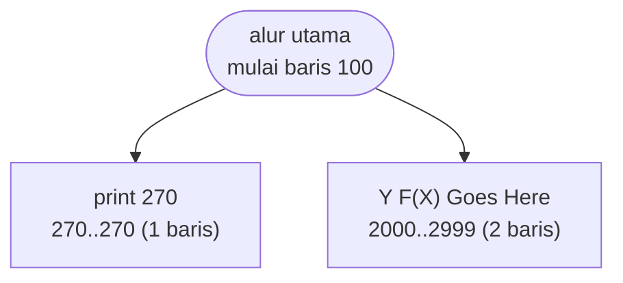

# INTEGRAT.BAS — Integrate - aturan Simpson

> Phil Feldman & Tom Rugg. Fungsinya Anda tulis sendiri di baris 2000-2999.

| | |
|---|---|
| Sumber | Listing Feldman & Rugg, 1982 |
| Tahun | 1982 |
| Panjang | 42 baris (nomor 100–2999) |
| Subrutin | 2, dipanggil dari 9 tempat |
| Percabangan | 2 `GOTO`, 9 `GOSUB`, 0 target `ON…` |
| Komentar | 21% dari baris |
| Jalankan | `run\INTEGRAT.bat` |

## Peta arsitektur

*Diagram di bawah ini bukan tafsiran — semuanya diturunkan langsung dari
kode: tiap panah adalah `GOSUB` yang benar-benar ada, tiap kotak adalah
blok antara sebuah entri dan `RETURN`-nya.*



Kotak bersudut miring berwarna = **penangan kejadian** (`ON KEY`/`ON ERROR`), yang dipanggil oleh interupsi, bukan oleh alur utama.

### Subrutin dan perannya

| Baris | Panjang | Dipanggil | Peran (diambil dari kode) |
|---|--:|--:|---|
| `270`–`270` | 1 baris | 5× | print @270 |
| `2000`–`2999` | 2 baris | 4× | Y=F(X) Goes Here |

### Perulangan utama

`GOTO` mundur terpanjang: dari baris **460** kembali ke **320** — melingkupi 140 nomor baris.
Itulah loop utama program ini; segala sesuatu di dalam rentang tersebut
dijalankan berulang.

## Bagaimana program ini disusun

Dua subrutin, dan yang kedua adalah **lubang yang sengaja ditinggalkan kosong**:

```basic
2000..2999   dipanggil 4x   ' Y=F(X) Goes Here
```

Fungsi yang mau diintegralkan bukan input program — ia **bagian dari program**
yang harus Anda tulis sendiri di baris 2000-an. Rentang 2000–2999 dicadangkan,
dan `WARNING!` di layar pembuka menegaskannya.

Ini *callback* yang diwujudkan dengan satu-satunya sarana yang ada: **kontrak
rentang nomor baris**. "Kode Anda di sini; kode saya di luar sini."

Idenya masih hidup di mana-mana — `conftest.py` di pytest, blok `<script>` di
HTML, berkas `Makefile` yang Anda tulis sendiri. Yang berubah cuma penegakannya:
sekarang bahasa yang memisahkan wilayah, dulu cuma komentar.

Karena `GOSUB 2000` dipanggil empat kali dari dalam loop integrasi
(320←460), fungsi pengguna dievaluasi berulang — persis seperti callback
sungguhan.

Kelemahannya jelas: kalau pemakai menaruh kodenya di baris 3000, tidak ada yang
memperingatkan. Kontrak yang hanya ditegakkan lewat komentar bukan kontrak.

## Yang menarik dari kodenya

Empat puluh dua baris, **21% komentar**, dan sebuah keputusan rancangan yang
sangat berani:

```basic
WARNING! The subroutine at lines 2000-2999 is assumed to define Y as a function of X
```

Fungsi yang mau diintegralkan **bukan input program — melainkan bagian dari
programnya**. Pemakai diharapkan menyunting baris 2000-an, mengetik rumusnya
sendiri, lalu menjalankan.

Dari sudut pandang sekarang ini terlihat aneh, tapi sebetulnya inilah *callback*
— hanya saja mekanismenya adalah menyunting kode, karena BASIC tidak punya
penunjuk fungsi. Rentang baris 2000–2999 yang dicadangkan adalah **kontrak
antarmuka**: "kode Anda di sini, kode saya di luar sini".

Idenya masih hidup di mana-mana: `conftest.py` di pytest, `Makefile` yang Anda
tulis sendiri, blok `<script>` di halaman HTML. Bedanya cuma, sekarang bahasanya
membantu Anda memisahkan keduanya.

Aturan Simpson sendiri hanya beberapa baris. Yang membuat program ini layak
dibaca adalah bagaimana penulisnya menyelesaikan masalah "bagaimana pemakai
memberi tahu saya sebuah fungsi" dengan sarana yang benar-benar tidak
mendukungnya.

## Yang bisa dipelajari

- Kalau bahasanya tidak punya fungsi sebagai nilai, cadangkan rentang untuk kode pengguna dan dokumentasikan kontraknya keras-keras.
- 21% komentar di 42 baris — program pendek justru paling untung dari penjelasan, karena konteksnya tidak terbaca dari ukurannya.

## Yang jangan ditiru

- Kontrak yang hanya ditegakkan lewat komentar. Kalau pemakai menaruh kodenya di baris 3000, tidak ada yang memperingatkan.

## Lampiran

### Perkakas bahasa yang dipakai

`STRING$` — ulang satu karakter n kali, `COLOR` — warna teks

### Sepuluh baris pembuka

```basic
100 REM: INTEGRATE
110 REM: Compute integrals by Simpson's rule.
120 REM: COPYRIGHT 1982 Phil Feldman and Tom Rugg.
130 REM: Any BASIC, any CRT.
140 KEY OFF:SCREEN 0,0,0,0:WIDTH 40:COLOR 7,0,0
150 CLEAR:CLS
160 N=2
170 PRINT TAB(4)"Integral by Simpson's Rule":B=186
180 PRINT:PRINT CHR$(201)STRING$(29,205)CHR$(187):GOSUB 270
190 PRINT CHR$(B)TAB(13)"WARNING!"TAB(31)CHR$(B):GOSUB 270
```

---
[Dasar-dasar BASIC](00-DASAR-BASIC.md) · [Daftar review](README.md) · [Katalog koleksi](../README.md)
