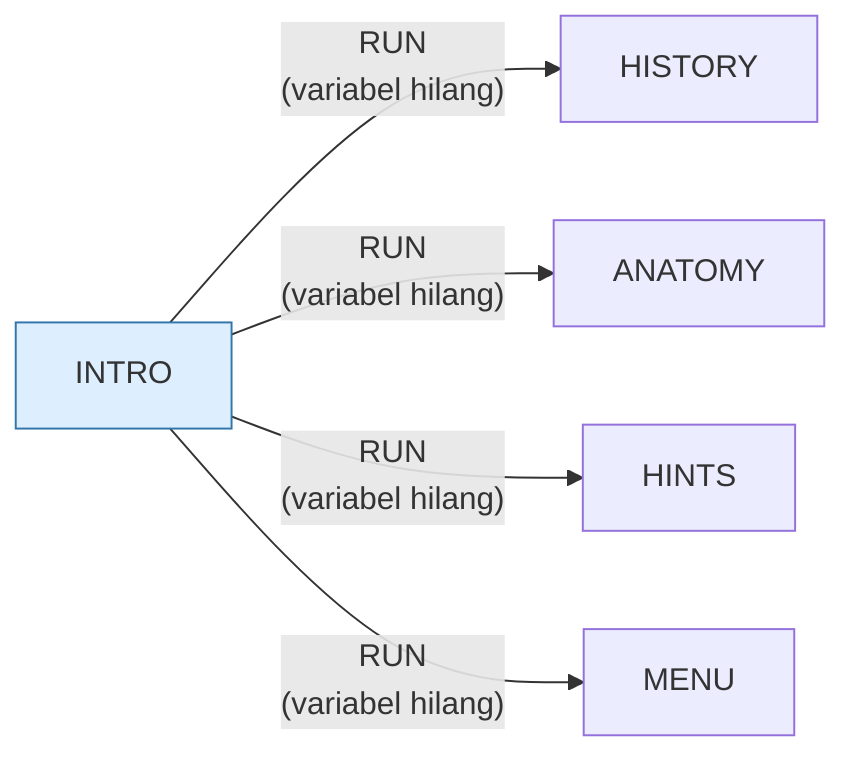

> [!WARNING]
> **Koreksi manual, ditambahkan sesi 15 (port web).**
>
> | Klaim | Kenyataan |
> |---|---|
> | "Baris 10–90 identik dengan HEAREYE.BAS" | Dibandingkan baris demi baris: **13 dari ~20 baris** identik byte demi byte. Baris 41 (`ON ERROR GOTO 200`) hanya ada di INTRO; baris 50 berbeda isinya; baris 110–140 dan 170–180 adalah menu masing-masing program |
> | Terkesan sebagai bahan ajar | Program ini **tidak mengajarkan apa pun**. Dua puluh tiga baris, satu layar, nol halaman — ia perute yang mengganti dirinya sendiri lewat `RUN` ke `HISTORY`, `anatomy`, dan `HINTS` |
>
> Uraian lengkap: [`web/docs/intro.md`](../web/docs/intro.md).

# INTRO.BAS — Pengantar Komputer

> Menu #2 pilihan G.

| | |
|---|---|
| Sumber | Friendlyware PC Introductory Set |
| Tahun | 1982 |
| Panjang | 23 baris (nomor 10–200) |
| Subrutin | 1, dipanggil dari 1 tempat |
| Percabangan | 2 `GOTO`, 1 `GOSUB`, 2 target `ON…` |
| Komentar | 0% dari baris |
| Jalankan | `run\INTRO.bat` |

## Peta arsitektur

*Diagram di bawah ini bukan tafsiran — semuanya diturunkan langsung dari
kode: tiap panah adalah `GOSUB` yang benar-benar ada, tiap kotak adalah
blok antara sebuah entri dan `RETURN`-nya.*

Hanya ada 1 subrutin, jadi diagram tidak menambah apa pun.

### Subrutin dan perannya

| Baris | Panjang | Dipanggil | Peran (diambil dari kode) |
|---|--:|--:|---|
| `200`–`200` | 1 baris | 1× | blok @200 *(handler)* ⚠ tanpa `RETURN` |

### Program lain yang dimuat



### Kejadian yang dijebak

- `ON ERROR` → baris 200
- `ON KEY(10)` → baris 200

### Perulangan utama

`GOTO` mundur terpanjang: dari baris **190** kembali ke **160** — melingkupi 30 nomor baris.
Itulah loop utama program ini; segala sesuatu di dalam rentang tersebut
dijalankan berulang.

## Bagaimana program ini disusun

Satu subrutin, 23 baris, dan **arsitektur keluar yang layak diperhatikan**:

```basic
30 ON KEY(10) GOSUB 200
41 ON ERROR GOTO 200
```

Tombol keluar dan penangan galat menunjuk ke **baris yang sama**. Apa pun yang
terjadi — pemakai menekan F10, atau ada galat tak terduga — hasilnya sama:
kembali ke menu dengan tenang.

Ini keputusan produk, bukan kemalasan. Friendlyware dijual ke pemula; menampilkan
`Syntax error in 170` dan meninggalkan mereka di prompt `Ok` yang menakutkan jauh
lebih buruk daripada kembali ke menu.

Bandingkan dengan `MENU.BAS` yang menangani galat 53 secara spesifik lalu
mematikan penangkap (`ON ERROR GOTO 0`) untuk sisanya. Dua sikap berbeda dalam
satu produk yang sama:

| | `INTRO.BAS` | `MENU.BAS` |
|---|---|---|
| Galat yang diantisipasi | ditelan | ditangani khusus |
| Galat lain | **juga ditelan** | dibiarkan terlihat |

Untuk produk konsumen, sikap `INTRO` masuk akal. Untuk perkakas pengembang, sikap
`MENU` yang benar. Yang tidak pernah benar adalah menelan semua galat **tanpa
mencatatnya di mana pun** — dan itulah yang dilakukan program ini.

## Yang menarik dari kodenya

Dua puluh tiga baris, program terpendek di rangkaian Friendlyware. Baris 10–90
identik dengan `HEAREYE.BAS` — keduanya lahir dari templat yang sama.

Justru karena pendek, program ini adalah tempat terbaik untuk melihat **kerangka
Friendlyware dalam bentuk telanjang**:

```basic
20 SCREEN 0,0,0:WIDTH 80:CLS:DEF SEG:POKE 106,0    ' siapkan layar, buang tombol
30 ON KEY(10) GOSUB 200                             ' F10 = keluar
40 KEY(10) ON
41 ON ERROR GOTO 200                                ' galat apa pun = keluar juga
```

Baris 41 patut diperhatikan: **semua galat diarahkan ke rutin keluar**. Ini
keputusan produk, bukan kemalasan. Friendlyware dijual ke pemula; kalau ada yang
tidak beres, lebih baik kembali ke menu dengan tenang daripada menampilkan
`Syntax error in 170` dan meninggalkan pemakai di prompt `Ok` yang menakutkan.

Sikap ini masih relevan. Untuk perkakas pengembang, galat harus berisik dan
detail. Untuk produk konsumen, galat harus dipulihkan dengan anggun. Program ini
tahu ia yang mana.

## Yang bisa dipelajari

- Rancang penanganan galat sesuai siapa penggunanya. Pemula tidak boleh diberi prompt interpreter.
- Program terpendek dari sebuah keluarga adalah tempat terbaik untuk mempelajari kerangkanya.

## Yang jangan ditiru

- `ON ERROR GOTO <keluar>` yang menelan **semua** galat tanpa mencatat apa pun. Anggun bagi pemakai, tapi pengembangnya jadi buta total.

## Lampiran

### Perkakas bahasa yang dipakai

`POKE` — tulis memori langsung, `DEF SEG` — pindah segmen memori, `ON KEY(n) GOSUB` — jebakan tombol fungsi, `ON ERROR GOTO` — penanganan galat, `ON x GOTO` — percabangan berindeks, `ON x GOSUB` — pemanggilan berindeks, `INKEY$` — baca tombol tanpa menunggu Enter, `RUN "nama"` — muat program lain, variabel hilang, `STRING$` — ulang satu karakter n kali, `LOCATE` — posisikan kursor, `COLOR` — warna teks

### Sepuluh baris pembuka

```basic
10 KEY OFF
20  SCREEN 0,0,0:WIDTH 80:CLS:DEF SEG:POKE 106,0
30  ON KEY(10) GOSUB 200
40  KEY(10) ON
41 ON ERROR GOTO 200
50  COLOR 11,0
60  LOCATE 1,19:PRINT "┌"STRING$(42,196)"┐"
70  LOCATE 3,19:PRINT "└"STRING$(42,196)"┘"
80  LOCATE 2,19:PRINT "│"SPC(42)"│"
90  COLOR 0,7
```

### Baris terpanjang (139 kolom)

```basic
140 LOCATE 19,14:COLOR 15,0:PRINT"*****";:COLOR 3,0:PRINT" Strike Key Corresponding To Program Desired ";:COLOR 15,0:PRINT"*****":COLOR 3,0
```

---
[Dasar-dasar BASIC](00-DASAR-BASIC.md) · [Daftar review](README.md) · [Katalog koleksi](../README.md)
