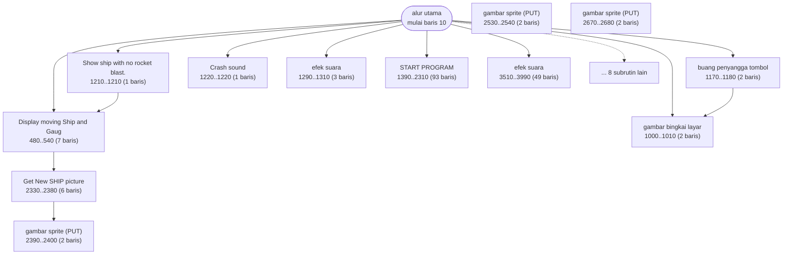
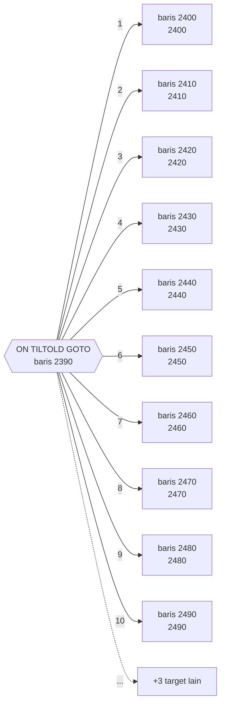
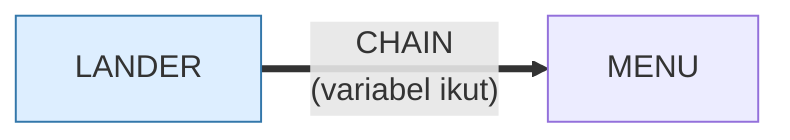

# LANDER.BAS — Lunar Lander v1.0

> Memuat LANDER.BIN lewat BLOAD dan menyimpan skor di LANDER.SCR.

| | |
|---|---|
| Sumber | Public domain / listing majalah lain-lain |
| Tahun | 1982 |
| Panjang | 399 baris (nomor 10–3990) |
| Subrutin | 20, dipanggil dari 35 tempat |
| Percabangan | 48 `GOTO`, 31 `GOSUB`, 50 target `ON…` |
| Komentar | 15% dari baris |
| Jalankan | `run\LANDER.bat` |

## Peta arsitektur

*Diagram di bawah ini bukan tafsiran — semuanya diturunkan langsung dari
kode: tiap panah adalah `GOSUB` yang benar-benar ada, tiap kotak adalah
blok antara sebuah entri dan `RETURN`-nya.*



Kotak bersudut miring berwarna = **penangan kejadian** (`ON KEY`/`ON ERROR`), yang dipanggil oleh interupsi, bukan oleh alur utama.

### Subrutin dan perannya

| Baris | Panjang | Dipanggil | Peran (diambil dari kode) |
|---|--:|--:|---|
| `1000`–`1010` | 2 baris | 5× | gambar bingkai layar |
| `1210`–`1210` | 1 baris | 4× | Show ship with no rocket blast. |
| `1220`–`1220` | 1 baris | 3× | Crash sound |
| `1290`–`1310` | 3 baris | 3× | efek suara |
| `480`–`540` | 7 baris | 2× | ############  Display moving Ship   and Gaug |
| `2390`–`2400` | 2 baris | 2× | gambar sprite (PUT) |
| `2530`–`2540` | 2 baris | 2× | gambar sprite (PUT) |
| `2670`–`2680` | 2 baris | 2× | gambar sprite (PUT) |
| `160`–`460` | 31 baris | 1× | ##########  SETUP  INITIAL  CONDITIONS  #### |
| `620`–`640` | 3 baris | 1× | ########  Check KEYBOARD for commands  ##### |
| `770`–`850` | 9 baris | 1× | ################ Revise CONTROL parameters   |
| `880`–`880` | 1 baris | 1× | alarm |
| `900`–`950` | 6 baris | 1× | ######## TEST FOR CRASH OR LANDING.  ####### |
| `1170`–`1180` | 2 baris | 1× | buang penyangga tombol |

*(6 subrutin lain tidak ditampilkan)*

### Tabel dispatch

Program ini punya **6** percabangan berindeks (`ON … GOTO/GOSUB`).
Yang terbesar ada di baris 2390 dengan 13 cabang:



### Program lain yang dimuat



### Perulangan utama

`GOTO` mundur terpanjang: dari baris **3620** kembali ke **10** — melingkupi 3610 nomor baris.
Itulah loop utama program ini; segala sesuatu di dalam rentang tersebut
dijalankan berulang.

### Data yang dipegang

| Array | Dipakai | Ditulis di baris |
|---|--:|---|
| `LY` | 18× | 360, 390, 400, 410, 420, … |
| `LAY` | 15× | 1790, 1800, 1810, 1820, 1830 |
| `EXPL` | 11× | — |
| `LX` | 10× | 360, 1790 |
| `LAX` | 9× | 1790 |
| `PDATA` | 7× | — |
| `TUNE` | 7× | 1940 |
| `TUNE1` | 7× | 2130 |

## Bagaimana program ini disusun

Dua puluh subrutin, enam tabel dispatch, dan yang terbesar adalah kunci seluruh
program:

```basic
2390 ON TILTOLD GOTO (13 target)
```

Tiga belas cabang untuk **tiga belas sudut kemiringan pesawat**. Tiap cabang
mem-`PUT` sprite yang berbeda. Jadi "gambar pesawat pada sudut X" bukan
perhitungan rotasi — ia **pencarian tabel**.

Itu sebabnya `DIM`-nya terlihat mengerikan:

```basic
DIM M1(S),M2(S),...,M13(S)
DIM R1(S),R2(S),...,R13(S)
DIM RR1(S),RR2(S),...,RR13(S)
```

**Tiga puluh sembilan** array bernomor — tiga belas kali tiga. Ini sebenarnya
**array tiga dimensi yang ditulis manual**, karena `GET`/`PUT` di GW-BASIC hanya
menerima nama array utuh — tidak bisa `M(i)`. Batasan bahasa memaksa bentuk yang
kikuk.

> **Koreksi.** Versi lebih awal review ini menulis "36 array" dan `M1…M12`.
> Angkanya salah, dan sumbernya terlihat di lampiran di bawah: baris `DIM`
> aslinya terpotong pada kolom ke-75, sehingga `M13` terbaca `M1`. Bagan
> `ON…GOTO` di halaman yang sama sudah benar dengan 13 cabang, dan
> `LANDER.BIN` menyimpan angkanya secara terpisah sebagai `PDATA(0)=NANG=13`.
> Lihat [dokumen port](../web/docs/lander.md) §1–2.

Mengenali "ini sebetulnya array berdimensi lebih tinggi" adalah keterampilan
membaca yang berharga. Kalau Anda melihat `X1, X2, X3, … X12`, hampir selalu
begitu ceritanya.

Rotasi yang dipraberhitung lalu dicari di tabel adalah teknik yang masih dipakai
di game 2D sampai sekarang — jauh lebih murah daripada memutar bitmap saat
berjalan.

Aset pesawatnya sendiri dimuat dari berkas terpisah (`BLOAD "LANDER.BIN"`),
jadi gambar bisa diganti tanpa menyentuh kode.

## Yang menarik dari kodenya

Program paling ambisius secara teknis di koleksi: 399 baris, **15% komentar**,
dan memakai hampir setiap kemampuan grafis, suara, berkas, dan memori yang
dimiliki GW-BASIC.

Tiga baris pembukanya adalah pelajaran tersendiri:

```basic
20 DEF SEG=&H40: EQUIP=PEEK(&H10)
30 IF (EQUIP AND &H30) = &H30 THEN I1 = 0 ELSE I1 = 1
```

Alamat `0040:0010` adalah **word perlengkapan BIOS**. Bit 4–5 memberi tahu jenis
kartu video yang terpasang. Program membacanya, lalu menyesuaikan diri. Deteksi
perangkat keras yang benar, bukan asumsi.

Deklarasi arraynya luar biasa:

```basic
DIM M1(S),M2(S),...,M13(S)      ' tiga belas array bernomor
DIM R1(S),R2(S),...,R13(S)
DIM RR1(S),RR2(S),...,RR13(S)
```

Tiga puluh sembilan array bernomor berurutan. Ini sebenarnya **array tiga
dimensi yang ditulis manual**, karena `GET`/`PUT` di GW-BASIC hanya menerima
nama array utuh, tidak bisa `M(i)`. Batasan bahasa memaksa struktur yang kikuk
— dan mengenali "ini sebetulnya array yang lebih tinggi dimensinya" adalah
kemampuan membaca yang berharga.

Dan urutannya bukan sekadar rapi, ia **kontrak**: baris 1730 mem-`BLOAD`
`LANDER.BIN` ke `VARPTR(PDATA(0))`, sehingga satu perintah mengisi keempat
puluh array sekaligus. Ubah urutan `DIM`-nya, dan berkasnya jatuh di tempat yang
salah.

Gambar pesawatnya dimuat dari `LANDER.BIN` lewat `BLOAD` (aset terpisah dari
kode), dan skornya disimpan ke `LANDER.SCR`. Kedua berkas ada di `run\`, jadi
program ini lengkap.

## Yang bisa dipelajari

- Deteksi perangkat keras lewat BIOS lalu sesuaikan — jangan mengasumsikan.
- Pisahkan aset (gambar) dari kode. `LANDER.BIN` bisa diganti tanpa menyentuh program.
- Kalau Anda melihat `X1, X2, X3, ... X12`, itu hampir selalu array yang ditulis manual karena bahasanya tidak mengizinkan yang sebenarnya.

## Yang jangan ditiru

- Tiga puluh sembilan array bernomor. Kalau bahasanya memaksa, beri komentar yang menerangkan bahwa ini sebenarnya satu struktur — dan kalau urutannya jadi kontrak dengan berkas di disket, katakan itu di tempat yang akan dibaca orang.

## Lampiran

### Perkakas bahasa yang dipakai

`PLAY` — musik lewat bahasa makro not, `SOUND` — nada mentah (frekuensi, durasi), `BEEP`, `DRAW` — bahasa makro menggambar garis, `GET`/`PUT` — sprite disalin ke/dari array, `LINE` — menggambar garis & kotak, `PAINT` — mengisi area tertutup, `PSET`/`PRESET` — piksel tunggal, mode grafis CGA (`SCREEN 1`/`2`), `PEEK` — baca memori langsung, `POKE` — tulis memori langsung, `DEF SEG` — pindah segmen memori, `BLOAD` — muat blok biner, `ON x GOTO` — percabangan berindeks, `ON x GOSUB` — pemanggilan berindeks, `INKEY$` — baca tombol tanpa menunggu Enter, `CHAIN` — muat program lain, bawa variabel, `RUN "nama"` — muat program lain, variabel hilang, `OPEN` — baca/tulis berkas, `DEFINT` — variabel default bilangan bulat, `STRING$` — ulang satu karakter n kali, `LOCATE` — posisikan kursor, `COLOR` — warna teks

### Deklarasi array

```basic
DIM PDATA(20)
DIM M1(S),M2(S),M3(S),M4(S),M5(S),M6(S),M7(S),M8(S),M9(S),M10(S),M11(S),M1
DIM R1(S),R2(S),R3(S),R4(S),R5(S),R6(S),R7(S),R8(S),R9(S),R10(S),R11(S),R1
DIM RR1(S),RR2(S),RR3(S),RR4(S),RR5(S),RR6(S),RR7(S),RR8(S),RR9(S),RR10(S)
DIM ANG(NANG)
DIM LX(LP),LY(LP),LAX(LP),LAY(LP) '  LAND PICTURES.
```

### Sepuluh baris pembuka

```basic
10 CLEAR,,2000:A$="VERSION   1.0"  ' Program : LANDER.BAS
20 DEF SEG=&H40: EQUIP=PEEK(&H10)
30 IF (EQUIP AND &H30) = &H30 THEN I1 = 0 ELSE I1 = 1
40 DEF SEG: WIDE = 40: JOY = 0: PRT = 0
50 COLR = 1: ADJUST = 1
60 PROGNAME$ = "     LUNAR LANDER"
70 SCREEN 0,1: KEY OFF: GOSUB 3190
80 GOSUB 1390    'Get lander pictures from disk.
90 GOSUB 160     'Setup initial conditions
100 GOSUB 480     'Display Moving ship
```

### Baris terpanjang (247 kolom)

```basic
1900 DATA 0,4,7,13.5,18,21.5,27,30,0,4,7,14.5,18,22.5,26,30,1,3,8,10,12.5,15,19,23,25.5,29,1,3,8,14.5,19,24,25,29,1,3,8,14.5,19,21,21.6,26.4,27,29,1,3,8,10,12.5,15,19,21,22.3,25.7,27,29,0,4,7,14.5,18,21,23,25,27,30,0,4,7,13.5,18,21,23.5,24.5,27,30
```

---
[Dasar-dasar BASIC](00-DASAR-BASIC.md) · [Daftar review](README.md) · [Katalog koleksi](../README.md)
