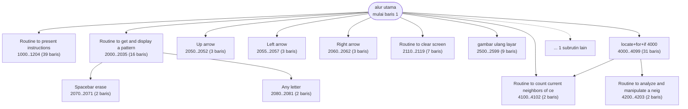

# LIFE2.BAS — Game of Life (Conway)

> Versi ini oleh John Sigle, 21 Feb 1983. Bersekat rapi dengan spanduk komentar.

| | |
|---|---|
| Sumber | Public domain / listing majalah lain-lain |
| Tahun | 1983 |
| Panjang | 188 baris (nomor 1–65005) |
| Subrutin | 13, dipanggil dari 21 tempat |
| Percabangan | 20 `GOTO`, 21 `GOSUB`, 0 target `ON…` |
| Komentar | 1% dari baris |
| Jalankan | `run\LIFE2.bat` |

## Peta arsitektur

*Diagram di bawah ini bukan tafsiran — semuanya diturunkan langsung dari
kode: tiap panah adalah `GOSUB` yang benar-benar ada, tiap kotak adalah
blok antara sebuah entri dan `RETURN`-nya.*



Kotak bersudut miring berwarna = **penangan kejadian** (`ON KEY`/`ON ERROR`), yang dipanggil oleh interupsi, bukan oleh alur utama.

### Subrutin dan perannya

| Baris | Panjang | Dipanggil | Peran (diambil dari kode) |
|---|--:|--:|---|
| `4200`–`4203` | 2 baris | 8× | Routine to analyze and manipulate a neighbor |
| `4100`–`4102` | 2 baris | 2× | Routine to count current neighbors of cell a |
| `1000`–`1204` | 39 baris | 1× | Routine to present instructions |
| `2000`–`2035` | 16 baris | 1× | Routine to get and display a pattern |
| `2050`–`2052` | 3 baris | 1× | Up arrow |
| `2055`–`2057` | 3 baris | 1× | Left arrow |
| `2060`–`2062` | 3 baris | 1× | Right arrow |
| `2065`–`2067` | 3 baris | 1× | Down arrow |
| `2070`–`2071` | 2 baris | 1× | Spacebar = erase |
| `2080`–`2081` | 2 baris | 1× | Any letter |
| `2110`–`2119` | 7 baris | 1× | Routine to clear screen |
| `2500`–`2599` | 9 baris | 1× | gambar ulang layar |
| `4000`–`4099` | 31 baris | 1× | locate+for+if @4000 |

### Perulangan utama

`GOTO` mundur terpanjang: dari baris **501** kembali ke **200** — melingkupi 301 nomor baris.
Itulah loop utama program ini; segala sesuatu di dalam rentang tersebut
dijalankan berulang.

### Data yang dipegang

| Array | Dipakai | Ditulis di baris |
|---|--:|---|
| `G` | 20× | 2071, 2078, 2081, 2082, 2114, … |
| `CLIST` | 19× | 2073, 2076, 4031, 4231 |
| `LLEN` | 13× | 2084, 2118, 4008, 4062 |
| `CH$` | 6× | 60 |

## Bagaimana program ini disusun

Tiga belas subrutin dengan nama yang ditulis penulisnya, dan dua di antaranya
membentuk **inti algoritma**:

| Baris | Dipanggil | Nama di kode |
|---|--:|---|
| 4200–4203 | 8× | `Routine to analyze and manipulate a neighbor` |
| 4100–4102 | 2× | `Routine to count current neighbors of cell` |

Delapan panggilan ke rutin "periksa satu tetangga" — satu untuk tiap arah mata
angin. Jadi menghitung tetangga tidak ditulis sebagai delapan salinan kode,
melainkan satu rutin yang dipanggil delapan kali.

Struktur datanya adalah bagian terbaiknya:

```basic
55 DIM G(NROWS+1, NCOLS+1, 1)
52 C=0:R=0:CUR=0:NXT=1: ...
```

Dimensi ketiga berukuran 2 (indeks 0 dan 1). `CUR` dan `NXT` menunjuk generasi
sekarang dan berikutnya, lalu ditukar tiap putaran. Itu **double buffering** —
teknik yang sama dengan yang dipakai kartu grafis modern, dan alasannya sama:
Anda tidak boleh menulis ke data yang sedang dibaca.

Kalau generasi berikutnya ditulis langsung ke grid yang sama, sel yang sudah
diperbarui akan ikut terhitung sebagai tetangga sel berikutnya — dan hasilnya
bukan Game of Life lagi. Ini bug klasik yang double buffering hilangkan secara
struktural.

`CLIST(1,1500,1)` menyimpan **daftar sel hidup** terpisah dari grid, supaya
menggambar ulang tidak perlu menyapu seluruh 21×78 sel.

## Yang menarik dari kodenya

Implementasi Game of Life karya John Sigle, 21 Februari 1983 — dan **contoh
terbaik gaya penulisan di seluruh koleksi**, bersama `BLACK.BAS`.

Perhatikan tiga hal sekaligus di baris 50-an:

```basic
50  ' Initialization
51     DEFINT A-Z
52     C=0:R=0:CUR=0:NXT=1:NN=0:CR=0:RN=0       'Mention early for efficiency
53     NROWS=21:NCOLS=78
55     DIM G(NROWS+1,NCOLS+1,1)
```

1. **Komentar bagian** (`' Initialization`) sebelum kode.
2. **Indentasi sungguhan** — dan karena tiap baris punya nomor sendiri, indentasi
   ini benar-benar berfungsi, tidak seperti percobaan di `BOGGY.BAS`.
3. Komentar `'Mention early for efficiency` menjelaskan sesuatu yang **tidak
   terbaca dari kodenya**: GW-BASIC menyimpan variabel dalam urutan pertama kali
   disebut, dan pencarian variabel bersifat linier. Menyebut variabel yang paling
   sering dipakai lebih dulu membuatnya berada di depan tabel, sehingga lebih
   cepat ditemukan.

Poin ketiga itu adalah **contoh sempurna komentar yang baik**. Ia tidak
mengulang apa yang dilakukan kode ("set C to 0"); ia menjelaskan *kenapa* baris
yang terlihat tak berguna ini ada.

Grid-nya `G(NROWS+1, NCOLS+1, 1)` — dimensi ketiga berukuran 2 (indeks 0 dan 1)
menyimpan generasi sekarang dan berikutnya, ditukar lewat `CUR`/`NXT`. Itu
**double buffering**, teknik yang sama dengan yang dipakai kartu grafis modern.

## Yang bisa dipelajari

- Komentar yang menjelaskan **kenapa**, bukan **apa**, adalah komentar yang berharga. Baris 52 adalah contohnya.
- Double buffering (`CUR`/`NXT` yang ditukar) adalah cara benar menghitung generasi berikutnya tanpa merusak yang sekarang.
- Baris berbatas plus indentasi bisa dilakukan di BASIC. Tidak ada yang mencegah Anda menulis rapi.

## Yang jangan ditiru

- Baris 2015 sepanjang 233 kolom untuk baris bantuan berwarna. Bahkan program serapi ini punya satu tempat yang menyerah.

## Lampiran

### Perkakas bahasa yang dipakai

`SOUND` — nada mentah (frekuensi, durasi), `DRAW` — bahasa makro menggambar garis, `PEEK` — baca memori langsung, `POKE` — tulis memori langsung, `DEF SEG` — pindah segmen memori, `ON x GOSUB` — pemanggilan berindeks, `INKEY$` — baca tombol tanpa menunggu Enter, `SWAP` — tukar isi dua variabel, `DEFINT` — variabel default bilangan bulat, `LOCATE` — posisikan kursor, `COLOR` — warna teks

### Deklarasi array

```basic
DIM G(NROWS+1,NCOLS+1,1)
DIM CLIST(1,1500,1), LLEN(1)
DIM CH$(1)
```

### Sepuluh baris pembuka

```basic
1 '   LIFE = The game of LIFE by John Conway - a simulation
2 '    This version by John Sigle        2/21/83
50  ' Initialization
51     DEFINT A-Z
52     C=0:R=0:CUR=0:NXT=1:NN=0:CR=0:RN=0       'Mention early for efficiency
53     NROWS=21:NCOLS=78
55     DIM G(NROWS+1,NCOLS+1,1)
58     DIM CLIST(1,1500,1), LLEN(1)
60     DIM CH$(1):CH$(0)="X" : CH$(1)="O"
70     KEY OFF
```

### Baris terpanjang (233 kolom)

```basic
2015 COLOR 15:PRINT"M";:COLOR 7:PRINT"=mark, ";:COLOR 15:PRINT"space";:COLOR 7:PRINT"=erase, ";:COLOR 15:PRINT"R";:COLOR 7:PRINT "=Run, ";:COLOR 15:PRINT"C";:  COLOR 7:PRINT"=Clear screen, ";:COLOR 15:PRINT"Q";:COLOR 7:PRINT "=quit";
```

---
[Dasar-dasar BASIC](00-DASAR-BASIC.md) · [Daftar review](README.md) · [Katalog koleksi](../README.md)
