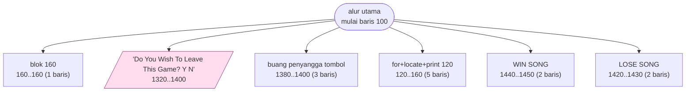
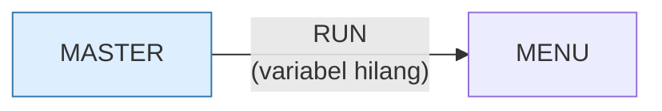

# MASTER.BAS — Mastermind

> Menu #1 pilihan E. Tebak deret 3 sampai 6 angka.

| | |
|---|---|
| Sumber | Friendlyware PC Introductory Set |
| Tahun | 1982 |
| Panjang | 137 baris (nomor 100–1460) |
| Subrutin | 6, dipanggil dari 7 tempat |
| Percabangan | 11 `GOTO`, 7 `GOSUB`, 2 target `ON…` |
| Komentar | 2% dari baris |
| Jalankan | `run\MASTER.bat` |

## Peta arsitektur

*Diagram di bawah ini bukan tafsiran — semuanya diturunkan langsung dari
kode: tiap panah adalah `GOSUB` yang benar-benar ada, tiap kotak adalah
blok antara sebuah entri dan `RETURN`-nya.*



Kotak bersudut miring berwarna = **penangan kejadian** (`ON KEY`/`ON ERROR`), yang dipanggil oleh interupsi, bukan oleh alur utama.

### Subrutin dan perannya

| Baris | Panjang | Dipanggil | Peran (diambil dari kode) |
|---|--:|--:|---|
| `120`–`160` | 5 baris | 2× | for+locate+print @120 |
| `160`–`160` | 1 baris | 1× | blok @160 |
| `1320`–`1400` | 9 baris | 1× | "Do You Wish To Leave This Game? <Y/N" *(handler)* |
| `1380`–`1400` | 3 baris | 1× | buang penyangga tombol |
| `1420`–`1430` | 2 baris | 1× | LOSE SONG |
| `1440`–`1450` | 2 baris | 1× | WIN SONG |

### Program lain yang dimuat



### Kejadian yang dijebak

- `ON KEY(10)` → baris 1320

### Perulangan utama

`GOTO` mundur terpanjang: dari baris **1290** kembali ke **430** — melingkupi 860 nomor baris.
Itulah loop utama program ini; segala sesuatu di dalam rentang tersebut
dijalankan berulang.

### Data yang dipegang

| Array | Dipakai | Ditulis di baris |
|---|--:|---|
| `GUESS` | 14× | 1050, 1110, 1160 |
| `MISSES$` | 6× | — |
| `ANSWER` | 5× | 720 |
| `HITS$` | 5× | — |

## Bagaimana program ini disusun

Enam subrutin, nol panah antar-subrutin, dan **seluruh logika permainan ada di
alur utama** — termasuk bagian tersulitnya.

Bagian tersulit di Mastermind adalah menghitung "benar tapi salah posisi" tanpa
menghitung satu angka dua kali. Program ini menyelesaikannya di baris 1160
dengan enam kondisi di-`AND`:

```basic
1160 IF GUESS(X)=ANSWER(Y) AND HITS$(GUESS(X),X)="" AND MISSES$(GUESS(X),X)=""
     AND X<>Y AND MISSES$(GUESS(X),Y)="" AND HITS$(GUESS(X),Y)="" THEN ...
```

Struktur datanya yang menarik: `HITS$` dan `MISSES$` adalah array **teks** dua
dimensi yang isinya hanya `""` atau `"*"`.

Kenapa teks untuk menyimpan ya/tidak? Karena BASIC tidak punya tipe boolean.
Boros memori, tapi `HITS$(...)=""` terbaca sebagai "belum ditandai" jauh lebih
jelas daripada `H(...)=0`.

Yang salah bukan pilihan tipenya, tapi **enam kondisi dalam satu ekspresi**.
Perbaikan yang benar: hitung dulu ke variabel bernama —
`BEBAS = (HITS$(...)="" AND MISSES$(...)="")` — lalu `IF` yang membacanya jadi
satu baris pendek. Memberi nama pada bagian ekspresi adalah bentuk abstraksi
paling murah yang ada, dan tersedia bahkan di BASIC.

## Yang menarik dari kodenya

Mastermind Friendlyware. Logika intinya ada di baris 1160, dan itu salah satu
kondisi paling rumit di koleksi:

```basic
1160 IF GUESS(X)=ANSWER(Y) AND HITS$(GUESS(X),X)="" AND MISSES$(GUESS(X),X)="" AND X<>Y AND MISSES$(GUESS(X),Y)="" AND HITS$(GUESS(X),Y)="" THEN ...
```

Enam kondisi di-`AND`. Yang sedang dipecahkan adalah masalah nyata: di
Mastermind, satu angka tidak boleh dihitung dua kali sebagai "benar tapi salah
posisi". Jadi program harus menandai angka yang sudah terpakai.

Cara penandaannya menarik: `HITS$` dan `MISSES$` adalah array **teks** dua
dimensi yang isinya hanya `""` atau `"*"`. Jadi array teks dipakai sebagai
**array boolean** — karena BASIC tidak punya tipe boolean.

Boros? Ya — tiap sel teks makan lebih banyak memori daripada satu bit. Tapi
efeknya kode jadi bisa dibaca: `HITS$(...)=""` berarti "belum ditandai", jauh
lebih jelas daripada `H(...)=0`.

Yang harus diperbaiki bukan pilihan tipenya, tapi **kondisi enam suku dalam satu
`IF`**. Ini seharusnya dipecah: hitung dulu "apakah sel ini bebas" ke satu
variabel bernama, lalu `IF` yang membacanya jadi satu baris pendek.

## Yang bisa dipelajari

- Masalah 'jangan hitung dua kali' di Mastermind adalah latihan logika yang bagus. Baca baris 1160 sampai paham kenapa tiap sukunya perlu.
- Kalau bahasanya tidak punya boolean, array teks berisi `""`/`"*"` setidaknya terbaca.

## Yang jangan ditiru

- Enam kondisi di-`AND` dalam satu baris 234 kolom. Beri nama pada bagiannya: `BEBAS = (HITS$(...)="" AND MISSES$(...)="")`, lalu `IF ... AND BEBAS THEN`.

## Lampiran

### Perkakas bahasa yang dipakai

`PLAY` — musik lewat bahasa makro not, `POKE` — tulis memori langsung, `DEF SEG` — pindah segmen memori, `ON KEY(n) GOSUB` — jebakan tombol fungsi, `ON x GOSUB` — pemanggilan berindeks, `INKEY$` — baca tombol tanpa menunggu Enter, `RUN "nama"` — muat program lain, variabel hilang, `RANDOMIZE` — menyemai pengacak, `STRING$` — ulang satu karakter n kali, `LOCATE` — posisikan kursor, `COLOR` — warna teks

### Deklarasi array

```basic
DIM GUESS(6)
DIM ANSWER(6)
DIM HITS$(10,6)
DIM MISSES$(10,6)
```

### Sepuluh baris pembuka

```basic
100 FOR A=1 TO 10:ON KEY(A) GOSUB 160:KEY(A) ON:NEXT
110 GOTO 170
120 FOR SUB=1 TO DIGITS
130    LOCATE 3,STARTANS-1,0:PRINT CHR$(255) ANSWER(SUB)
140    STARTANS=STARTANS+4
150 NEXT SUB
160 RETURN
170 KEY OFF:SCREEN 0,0,0:WIDTH 80:COLOR 3,0,0:ON KEY(10) GOSUB 1320
180 CLS:DEF SEG:POKE 106,0
190 LOCATE 1,1:PRINT STRING$(80,219)
```

### Baris terpanjang (234 kolom)

```basic
1160             IF GUESS(X)=ANSWER(Y) AND HITS$(GUESS(X),X)=""  AND MISSES$(GUESS(X),X)="" AND X<>Y AND MISSES$(GUESS(X),Y)="" AND HITS$(GUESS(X),Y)="" THEN:GUESSES=GUESSES+1:MISSES$(GUESS(X),X)="*":MISSES$(GUESS(X),Y)="*": GOTO 1180
```

---
[Dasar-dasar BASIC](00-DASAR-BASIC.md) · [Daftar review](README.md) · [Katalog koleksi](../README.md)
