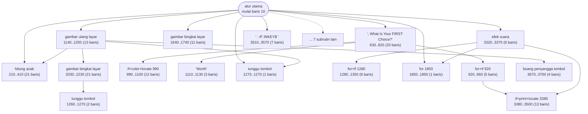
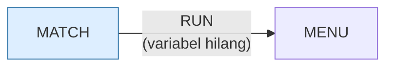

# MATCH.BAS — Match (permainan ingatan)

> Menu #1 pilihan K.

| | |
|---|---|
| Sumber | Friendlyware PC Introductory Set |
| Tahun | 1982 |
| Panjang | 369 baris (nomor 10–3780) |
| Subrutin | 23, dipanggil dari 39 tempat |
| Percabangan | 24 `GOTO`, 39 `GOSUB`, 2 target `ON…` |
| Komentar | 0% dari baris |
| Jalankan | `run\MATCH.bat` |

## Peta arsitektur

*Diagram di bawah ini bukan tafsiran — semuanya diturunkan langsung dari
kode: tiap panah adalah `GOSUB` yang benar-benar ada, tiap kotak adalah
blok antara sebuah entri dan `RETURN`-nya.*



Kotak bersudut miring berwarna = **penangan kejadian** (`ON KEY`/`ON ERROR`), yang dipanggil oleh interupsi, bukan oleh alur utama.

### Subrutin dan perannya

| Baris | Panjang | Dipanggil | Peran (diambil dari kode) |
|---|--:|--:|---|
| `1850`–`1850` | 1 baris | 6× | for @1850 |
| `1270`–`1270` | 1 baris | 3× | tunggu tombol |
| `1640`–`1740` | 11 baris | 3× | gambar bingkai layar |
| `210`–`410` | 21 baris | 2× | hitung acak |
| `920`–`960` | 5 baris | 2× | for+if @920 |
| `990`–`1100` | 12 baris | 2× | if+color+locate @990 |
| `3320`–`3370` | 6 baris | 2× | efek suara |
| `3380`–`3500` | 13 baris | 2× | if+print+locate @3380 |
| `3510`–`3570` | 7 baris | 2× | "; : IF INKEY$<>" |
| `3670`–`3700` | 4 baris | 2× | buang penyangga tombol |
| `410`–`410` | 1 baris | 1× | blok @410 |
| `420`–`620` | 21 baris | 1× | gambar bingkai layar |
| `630`–`820` | 20 baris | 1× | ",  What Is Your FIRST Choice?" |
| `1110`–`1130` | 3 baris | 1× | "Worth" |

*(9 subrutin lain tidak ditampilkan)*

### Program lain yang dimuat



### Kejadian yang dijebak

- `ON KEY(10)` → baris 3580

### Perulangan utama

`GOTO` mundur terpanjang: dari baris **2020** kembali ke **160** — melingkupi 1860 nomor baris.
Itulah loop utama program ini; segala sesuatu di dalam rentang tersebut
dijalankan berulang.

### Data yang dipegang

| Array | Dipakai | Ditulis di baris |
|---|--:|---|
| `B` | 32× | 290, 330, 350, 660, 800, … |
| `PL` | 20× | 1190, 1210 |
| `TBL` | 19× | 1610, 1960, 2260 |
| `T` | 18× | 1220 |
| `VL` | 13× | — |
| `A` | 7× | 230, 250 |
| `MATCH` | 7× | 1870, 1920, 1930 |
| `PZ` | 6× | — |

## Bagaimana program ini disusun

23 subrutin, 12 panah. Yang membuat program ini layak dipelajari adalah cara ia
memodelkan **dua pemain**.

```basic
130 DIM A(20),B(40),PV(40),PZ(81),VL(81),TBL(1,50),PL(1),T(1),MATCH(1),KEEP(1,21)
```

Perhatikan pola `(1)` yang muncul empat kali: `PL(1)`, `T(1)`, `MATCH(1)`,
`KEEP(1,21)`. Array berukuran dua — indeks 0 dan 1 — untuk pemain 0 dan pemain 1.

Jadi nama pemain ada di `PL(0)`/`PL(1)`, skornya di `MATCH(0)`/`MATCH(1)`.
**Pemain menjadi indeks, bukan variabel bernomor.**

Konsekuensi arsitekturalnya besar: seluruh logika giliran ditulis **sekali**,
dengan satu variabel penunjuk pemain aktif. Bandingkan dengan `FOOTBALL.BAS` yang
menulis rutin "TOUCHDOWN" dua kali — satu untuk tiap tim — karena tidak
mengangkat pemain jadi indeks.

Aturan yang bisa dibawa pulang: kalau Anda melihat dua blok kode yang bedanya
cuma "yang ini untuk A, yang itu untuk B", ada parameter yang belum diangkat.
Mengubahnya jadi indeks array biasanya menghapus separuh kode.

Sisi buruknya ada di baris 1490: `Q(T(T))` — array `T` diindeks oleh skalar `T`.
Sah di BASIC karena array dan skalar punya ruang nama terpisah, tapi tidak ada
alasan untuk melakukannya.

## Yang menarik dari kodenya

Permainan mencocokkan kartu, 369 baris, dan deklarasi `DIM` terpanjang di
koleksi:

```basic
130 DIM A(20),B(40),PV(40),PZ(81),VL(81),TBL(1,50),PL(1),T(1),MATCH(1),KEEP(1,21)
```

Sepuluh array dalam satu baris. Perhatikan pola `(1)` yang muncul empat kali:
`PL(1)`, `T(1)`, `MATCH(1)`, `KEEP(1,21)`. Array berukuran dua (indeks 0 dan 1)
adalah cara program ini menyimpan **data per pemain** — pemain 0 dan pemain 1.

Jadi `PL(0)` dan `PL(1)` adalah nama kedua pemain, `MATCH(0)`/`MATCH(1)` skor
mereka. Ini pola yang benar dan efisien: alih-alih menduplikasi variabel
(`PL1$`, `PL2$`), pemain jadi **indeks**. Konsekuensinya, seluruh logika giliran
cukup ditulis sekali dengan variabel `T` sebagai penunjuk pemain aktif — lihat
`Q(T(T))` di baris 1490.

Yang buruk: `T(T)` di baris 1490. Array `T` diindeks oleh variabel `T`. Sah
secara sintaks karena di BASIC nama array dan nama variabel skalar hidup di
ruang nama berbeda — tapi hampir mustahil dibaca dengan benar sekali lihat.

`PTR="$$##,###.##"` di baris 140 adalah templat `PRINT USING` yang dinamai dan
dipakai ulang. Bagus.

## Yang bisa dipelajari

- Jadikan pemain sebuah **indeks**, bukan sekumpulan variabel bernomor. Logika giliran jadi ditulis sekali.
- Simpan templat `PRINT USING` di variabel bernama, jangan disebar sebagai literal.

## Yang jangan ditiru

- `T(T)` — array dan skalar dengan nama sama. Legal, tapi jangan pernah.
- Sepuluh `DIM` dalam satu baris tanpa komentar. Ini peta data program; ia pantas dapat beberapa baris sendiri.

## Lampiran

### Perkakas bahasa yang dipakai

`PLAY` — musik lewat bahasa makro not, `SOUND` — nada mentah (frekuensi, durasi), `POKE` — tulis memori langsung, `DEF SEG` — pindah segmen memori, `ON KEY(n) GOSUB` — jebakan tombol fungsi, `ON x GOSUB` — pemanggilan berindeks, `INKEY$` — baca tombol tanpa menunggu Enter, `RUN "nama"` — muat program lain, variabel hilang, `WHILE`/`WEND` — perulangan berkondisi, `RANDOMIZE` — menyemai pengacak, `SWAP` — tukar isi dua variabel, `DEFINT` — variabel default bilangan bulat, `DEFSTR` — variabel default teks, `STRING$` — ulang satu karakter n kali, `LOCATE` — posisikan kursor, `COLOR` — warna teks

### Deklarasi array

```basic
DIM A(20),B(40),PV(40),PZ(81),VL(81),TBL(1,50),PL(1),T(1),MATCH(1),KEEP(1,
```

### Sepuluh baris pembuka

```basic
10 CLEAR:KEY OFF:SCREEN 0,0,0:WIDTH 80:COLOR 3,0,0:LOCATE 1,1,0
110 FOR A=1 TO 9:ON KEY(A) GOSUB 410:KEY(A) ON:NEXT
120 KEY(10) ON:DEF SEG:POKE 106,0:ON KEY(10) GOSUB 3580:XLIN=1:XPOS=1
130 DEFINT A-C:DEFSTR P,Z:DIM A(20),B(40),PV(40),PZ(81),VL(81),TBL(1,50),PL(1),T(1),MATCH(1),KEEP(1,21)
140 PTR="$$##,###.##"
150 GOSUB 1140
160 GOSUB 420
170 COLOR 3,0:GOSUB 630
180 IF FLAG=2 THEN GOSUB 1750:GOTO 1360
190 IF FLAG=1 THEN GOTO 1940
```

### Baris terpanjang (138 kolom)

```basic
1490 IF B<0 OR B>Q(T(T))-1 THEN LOCATE 23,30:PRINT"Please Try Again "PL(T)"    ":FOR X=1 TO 2000:NEXT:LOCATE 23,10:PRINT SPC(60):GOTO 1480
```

---
[Dasar-dasar BASIC](00-DASAR-BASIC.md) · [Daftar review](README.md) · [Katalog koleksi](../README.md)
