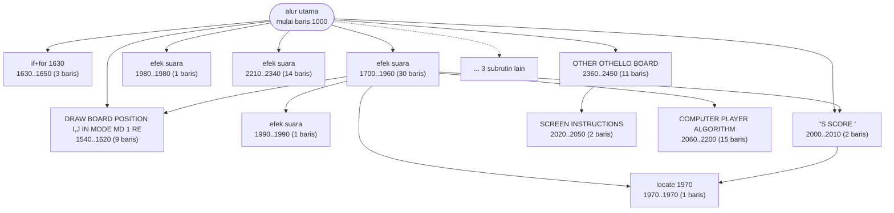
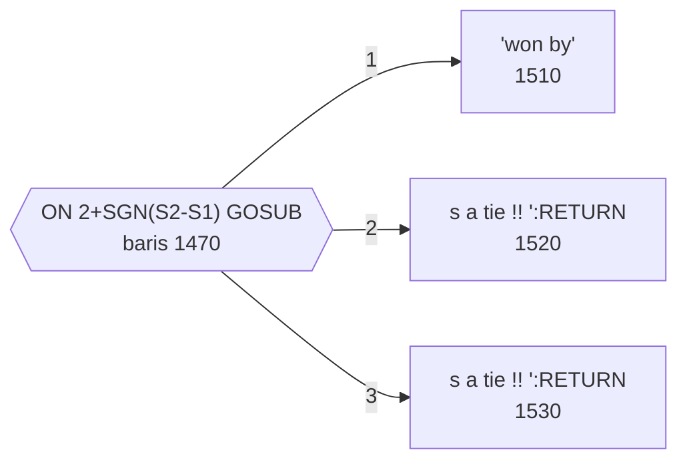

# MAXIT1.BAS — The Game of Maxit

> Diport dari Commodore PET ke IBM PC oleh Patrick Leabo, Tucson, 20 Mar 1982.

| | |
|---|---|
| Sumber | Public domain / listing majalah lain-lain |
| Tahun | 1982 |
| Panjang | 145 baris (nomor 1000–3000) |
| Subrutin | 14, dipanggil dari 29 tempat |
| Percabangan | 9 `GOTO`, 27 `GOSUB`, 5 target `ON…` |
| Komentar | 5% dari baris |
| Jalankan | `run\MAXIT1.bat` |

## Peta arsitektur

*Diagram di bawah ini bukan tafsiran — semuanya diturunkan langsung dari
kode: tiap panah adalah `GOSUB` yang benar-benar ada, tiap kotak adalah
blok antara sebuah entri dan `RETURN`-nya.*



Kotak bersudut miring berwarna = **penangan kejadian** (`ON KEY`/`ON ERROR`), yang dipanggil oleh interupsi, bukan oleh alur utama.

### Subrutin dan perannya

| Baris | Panjang | Dipanggil | Peran (diambil dari kode) |
|---|--:|--:|---|
| `1540`–`1620` | 9 baris | 6× | DRAW BOARD POSITION I,J IN MODE MD (1=RED,2= |
| `1970`–`1970` | 1 baris | 5× | locate @1970 |
| `1980`–`1980` | 1 baris | 4× | efek suara |
| `1630`–`1650` | 3 baris | 2× | if+for @1630 |
| `1700`–`1960` | 30 baris | 2× | efek suara |
| `2000`–`2010` | 2 baris | 2× | "'S SCORE=" |
| `1510`–`1510` | 1 baris | 1× | "won by" |
| `1520`–`1520` | 1 baris | 1× | s a tie !!                   ":RETURN |
| `1530`–`1530` | 1 baris | 1× | s a tie !!                   ":RETURN |
| `1990`–`1990` | 1 baris | 1× | efek suara |
| `2020`–`2050` | 2 baris | 1× | SCREEN INSTRUCTIONS |
| `2060`–`2200` | 15 baris | 1× | COMPUTER PLAYER ALGORITHM |
| `2210`–`2340` | 14 baris | 1× | efek suara |
| `2360`–`2450` | 11 baris | 1× | OTHER OTHELLO BOARD |

### Tabel dispatch

Program ini punya **2** percabangan berindeks (`ON … GOTO/GOSUB`).
Yang terbesar ada di baris 1470 dengan 3 cabang:



### Program lain yang dimuat


### Perulangan utama

`GOTO` mundur terpanjang: dari baris **1850** kembali ke **1770** — melingkupi 80 nomor baris.
Itulah loop utama program ini; segala sesuatu di dalam rentang tersebut
dijalankan berulang.

### Data yang dipegang

| Array | Dipakai | Ditulis di baris |
|---|--:|---|
| `BD` | 14× | 1330, 1905, 1910 |
| `AV` | 5× | 1270, 1310 |

## Bagaimana program ini disusun

Empat belas subrutin, tujuh panah, dan satu rutin gambar yang dipanggil enam
kali dengan **parameter lewat variabel global**:

```basic
1540  ' DRAW BOARD POSITION I,J IN MODE MD (1=RED,2=BLACK)
```

Komentar itu merangkap **tanda tangan fungsi**: ia memberi tahu bahwa rutin ini
membaca `I`, `J`, dan `MD`. Karena `GOSUB` tidak menerima argumen, satu-satunya
cara mendokumentasikan antarmuka sebuah rutin adalah menuliskannya.

Kalau Anda terpaksa bekerja dengan variabel global, tirulah ini. Menulis
"membaca I, J, MD" di atas rutin mengembalikan sebagian besar manfaat parameter
tanpa mengubah bahasanya.

Tabel dispatchnya adalah trik yang bagus:

```basic
1470 ON 2+SGN(S2-S1) GOSUB (3 target)
```

`SGN` mengembalikan −1, 0, atau 1. Ditambah 2 jadi 1, 2, atau 3 — tepat rentang
yang dibutuhkan `ON`. Jadi "siapa yang menang" diubah jadi indeks tabel dalam
satu ekspresi, tanpa satu pun `IF`.

Ini pola yang layak dihafal: **ubah perbandingan jadi indeks, lalu pakai tabel.**

Data konstantanya juga ditaruh dengan benar — `DATA` di baris 1100 tepat di
sebelah `READ` di baris 1120, jadi keduanya terbaca sebagai satu unit.

## Yang menarik dari kodenya

Diport dari Commodore PET oleh Patrick Leabo, 20 Maret 1982. Baris 1100
menunjukkan idiom yang bersih:

```basic
1100 DEFINT A-Z:DATA 49,51,53,54,56,58,60,61
1120 FOR N=0 TO 7:READ NT(N):NEXT
```

Tabel konstanta ditaruh di `DATA` tepat di sebelah kode yang membacanya, lalu
dimuat ke array dengan satu loop tiga kata. Delapan angka itu adalah kode nada
untuk skala musik. Menaruh `DATA` **berdekatan dengan `READ`-nya** membuat
keduanya terbaca sebagai satu unit — sesuatu yang tidak dilakukan `HANGMAN.BAS`
yang `DATA`-nya jauh di baris 1290.

Papannya `BD(7,7)` — 8×8 sel — dengan `AV(64)` sebagai daftar sel yang tersedia.
Dua representasi untuk data yang sama: yang satu untuk mencari cepat berdasarkan
koordinat, yang lain untuk mengiterasi cepat. Ini *index* dalam istilah basis
data, dan trade-off-nya juga sama: lebih cepat dibaca, tapi keduanya harus
dijaga tetap sinkron.

`WHILE C$="":C$=INKEY$:WEND` di baris 1480 lebih baik daripada
`IF C$="" THEN 1480` yang dipakai di mana-mana. `WHILE`/`WEND` menyatakan
"tunggu sampai" secara eksplisit tanpa nomor baris.

## Yang bisa dipelajari

- Taruh `DATA` di dekat `READ`-nya. Keduanya adalah satu unit.
- `WHILE cond:...:WEND` mengalahkan `IF NOT cond THEN <nomor baris>`. Tidak ada nomor baris yang bisa rusak saat kode dipindah.
- Menyimpan data dua kali dalam bentuk berbeda demi kecepatan itu sah — asal Anda sadar keduanya harus dijaga sinkron.

## Lampiran

### Perkakas bahasa yang dipakai

`PLAY` — musik lewat bahasa makro not, `BEEP`, `DRAW` — bahasa makro menggambar garis, `POKE` — tulis memori langsung, `ON x GOTO` — percabangan berindeks, `ON x GOSUB` — pemanggilan berindeks, `INKEY$` — baca tombol tanpa menunggu Enter, `RUN "nama"` — muat program lain, variabel hilang, `WHILE`/`WEND` — perulangan berkondisi, `RANDOMIZE` — menyemai pengacak, `DEFINT` — variabel default bilangan bulat, `STRING$` — ulang satu karakter n kali, `LOCATE` — posisikan kursor, `COLOR` — warna teks

### Deklarasi array

```basic
DIM BD(7,7),AV(64)
```

### Sepuluh baris pembuka

```basic
1000 '   MAXIT  FROM PET
1010 '   ADAPTED TO IPM PC BY PATRICK LEABO
1020 '   3-20-82              TUCSON ARIZONA
1030 '
1090 SCREEN 0:COLOR 5,8:WIDTH 40:KEY OFF
1100 DEFINT A-Z:DATA 49,51,53,54,56,58,60,61
1110 RANDOMIZE VAL(RIGHT$(TIME$,2))
1120 FOR N= 0 TO 7:READ NT(N):NEXT
1140 DIM BD(7,7),AV(64)
1150 CLS:LOCATE 3,10:COLOR 3,4:PRINT " THE GAME OF MAXIT ":COLOR 5,8
```

### Baris terpanjang (141 kolom)

```basic
1480 POKE 106,0:LOCATE 23,1:PRINT STRING$(39," ");:LOCATE 23,1:PRINT "Do you want to play again ?";:C$="":WHILE C$="":C$=INKEY$:WEND:PRINT C$
```

---
[Dasar-dasar BASIC](00-DASAR-BASIC.md) · [Daftar review](README.md) · [Katalog koleksi](../README.md)
