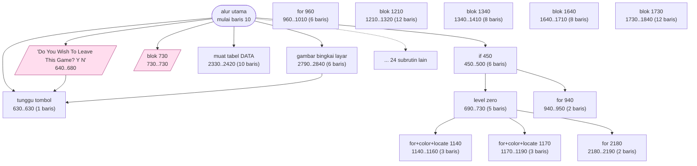
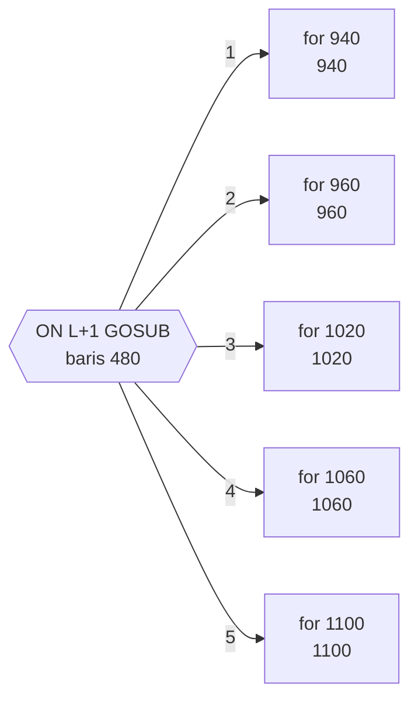
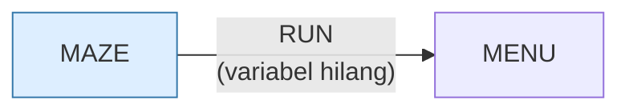

# MAZE.BAS — Killer Maze

> Menu #1 pilihan S. Labirin sudut-pandang-pertama, dikendalikan tombol panah.

| | |
|---|---|
| Sumber | Friendlyware PC Introductory Set |
| Tahun | 1982 |
| Panjang | 305 baris (nomor 10–3050) |
| Subrutin | 40, dipanggil dari 52 tempat |
| Percabangan | 11 `GOTO`, 44 `GOSUB`, 20 target `ON…` |
| Komentar | 11% dari baris |
| Jalankan | `run\MAZE.bat` |

## Peta arsitektur

*Diagram di bawah ini bukan tafsiran — semuanya diturunkan langsung dari
kode: tiap panah adalah `GOSUB` yang benar-benar ada, tiap kotak adalah
blok antara sebuah entri dan `RETURN`-nya.*



Kotak bersudut miring berwarna = **penangan kejadian** (`ON KEY`/`ON ERROR`), yang dipanggil oleh interupsi, bukan oleh alur utama.

### Subrutin dan perannya

| Baris | Panjang | Dipanggil | Peran (diambil dari kode) |
|---|--:|--:|---|
| `730`–`730` | 1 baris | 9× | blok @730 *(handler)* |
| `630`–`630` | 1 baris | 4× | tunggu tombol |
| `450`–`500` | 6 baris | 2× | if @450 |
| `640`–`680` | 5 baris | 1× | "Do You Wish To Leave This Game? <Y/N" *(handler)* |
| `690`–`730` | 5 baris | 1× | level zero |
| `740`–`780` | 5 baris | 1× | level one |
| `790`–`830` | 5 baris | 1× | level two |
| `840`–`880` | 5 baris | 1× | level three |
| `890`–`930` | 5 baris | 1× | level four |
| `940`–`950` | 2 baris | 1× | for @940 |
| `960`–`1010` | 6 baris | 1× | for @960 |
| `1020`–`1050` | 4 baris | 1× | for @1020 |
| `1060`–`1090` | 4 baris | 1× | for @1060 |
| `1100`–`1130` | 4 baris | 1× | for @1100 |

*(26 subrutin lain tidak ditampilkan)*

### Tabel dispatch

Program ini punya **2** percabangan berindeks (`ON … GOTO/GOSUB`).
Yang terbesar ada di baris 480 dengan 5 cabang:



### Program lain yang dimuat



### Kejadian yang dijebak

- `ON KEY(1)` → baris 730
- `ON KEY(10)` → baris 640
- `ON KEY(2)` → baris 730
- `ON KEY(3)` → baris 730
- `ON KEY(4)` → baris 730
- `ON KEY(5)` → baris 730
- `ON KEY(6)` → baris 730
- `ON KEY(7)` → baris 730
- `ON KEY(8)` → baris 730
- `ON KEY(9)` → baris 730

### Perulangan utama

`GOTO` mundur terpanjang: dari baris **620** kembali ke **140** — melingkupi 480 nomor baris.
Itulah loop utama program ini; segala sesuatu di dalam rentang tersebut
dijalankan berulang.

### Data yang dipegang

| Array | Dipakai | Ditulis di baris |
|---|--:|---|
| `A` | 4× | — |

## Bagaimana program ini disusun

**40 subrutin, 27 panah** — struktur terpadat kedua di koleksi setelah
`DOMINOES.BAS`. Tapi yang benar-benar menentukan arsitektur program ini ada di
dua baris pertama:

```basic
10 ... DEF SEG=0
20 IF (PEEK(1040) AND 48)=48 THEN DEF SEG=45056 ELSE DEF SEG=47104
```

Alamat 1040 adalah word perlengkapan BIOS. Program memeriksa jenis kartu video,
lalu **menunjuk segmen langsung ke memori layar** — `&HB000` (monokrom) atau
`&HB800` (CGA).

Sesudah itu, menulis ke layar dilakukan dengan `POKE` langsung ke memori video,
melewati `PRINT` sepenuhnya. Untuk labirin yang menggambar ulang seluruh
pandangan tiap langkah, ini perbedaan antara terasa responsif dan terasa lamban.

Keputusan ini **membentuk seluruh sisa program**. Karena menggambar jadi murah,
programnya mampu memecah tampilan jadi puluhan rutin kecil (1210, 1340, 1640,
1730 — masing-masing satu potongan dinding). Kalau tiap rutin harus memanggil
`PRINT` yang lambat, pemecahan sehalus itu akan terasa.

Harganya: program terikat mati pada tata letak memori PC. `&HB800` tidak berarti
apa-apa di mesin lain.

Tabel dispatch `ON L+1 GOSUB` di baris 480 memilih potongan dinding mana yang
digambar berdasarkan apa yang ada di depan pemain.

## Yang menarik dari kodenya

Labirin sudut pandang orang pertama, 11% komentar, dan pembuka yang paling
berani di koleksi:

```basic
10 SCREEN 0,0,0:COLOR 3,0,0:WIDTH 80:DEF SEG=0
20 IF (PEEK(1040) AND 48)=48 THEN DEF SEG=45056 ELSE DEF SEG=47104
```

Alamat 1040 (`0040:0010`) adalah word perlengkapan BIOS. Program memeriksa jenis
kartu video, lalu **menunjuk segmen langsung ke memori layar**: `45056` = `&HB000`
(monokrom) atau `47104` = `&HB800` (CGA).

Sesudah itu, menulis ke layar dilakukan dengan `POKE` langsung ke memori video,
melewati `PRINT` sepenuhnya. Ini jauh lebih cepat — `PRINT` di GW-BASIC harus
melewati penanganan gulir, tab, dan pemeriksaan lain, sementara `POKE` menulis
byte ke alamat.

Untuk labirin yang harus menggambar ulang seluruh pandangan tiap langkah, ini
perbedaan antara terasa responsif dan terasa lamban.

Harganya: program jadi terikat mati pada perangkat kerasnya. `&HB800` bukan
alamat memori layar di mesin lain. Ini pilihan yang sadar — kecepatan ditukar
dengan portabilitas — dan penulisnya setidaknya menangani dua kasus, bukan satu.

`A(7,7)` untuk labirin 8×8, dengan `DEFINT A-Y` supaya seluruh perhitungan posisi
berjalan di integer.

## Yang bisa dipelajari

- Menulis langsung ke memori layar (`&HB800`) adalah cara paling cepat menggambar teks di PC era ini.
- Kalau Anda menukar portabilitas demi kecepatan, tangani setidaknya kasus-kasus yang wajar — seperti dua jenis kartu di sini.

## Yang jangan ditiru

- Angka `45056` dan `47104` dalam desimal. Ditulis `&HB000` dan `&HB800` akan langsung dikenali siapa pun yang tahu PC.

## Lampiran

### Perkakas bahasa yang dipakai

`PLAY` — musik lewat bahasa makro not, `SOUND` — nada mentah (frekuensi, durasi), `PEEK` — baca memori langsung, `POKE` — tulis memori langsung, `DEF SEG` — pindah segmen memori, `ON KEY(n) GOSUB` — jebakan tombol fungsi, `ON x GOSUB` — pemanggilan berindeks, `INKEY$` — baca tombol tanpa menunggu Enter, `RUN "nama"` — muat program lain, variabel hilang, `RANDOMIZE` — menyemai pengacak, `DEFINT` — variabel default bilangan bulat, `DEFSTR` — variabel default teks, `STRING$` — ulang satu karakter n kali, `LOCATE` — posisikan kursor, `COLOR` — warna teks

### Deklarasi array

```basic
DIM A(7,7)
```

### Sepuluh baris pembuka

```basic
10 SCREEN 0,0,0:COLOR 3,0,0:WIDTH 80:DEF SEG=0
20 IF (PEEK(1040) AND 48)=48 THEN DEF SEG=45056 ELSE DEF SEG=47104
30 KEY OFF:CLS:DEFINT A-Y:DEFSTR Z:DIM A(7,7)
40 GOSUB 2790
50 ON KEY(1) GOSUB 730
60 ON KEY(2) GOSUB 730
70 ON KEY(3) GOSUB 730
80 ON KEY(4) GOSUB 730
90 ON KEY(5) GOSUB 730
100 ON KEY(6) GOSUB 730
```

---
[Dasar-dasar BASIC](00-DASAR-BASIC.md) · [Daftar review](README.md) · [Katalog koleksi](../README.md)
