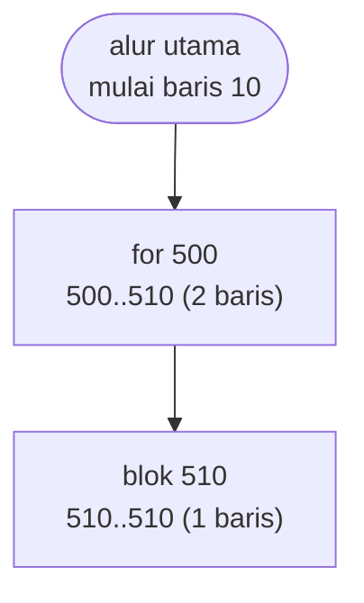
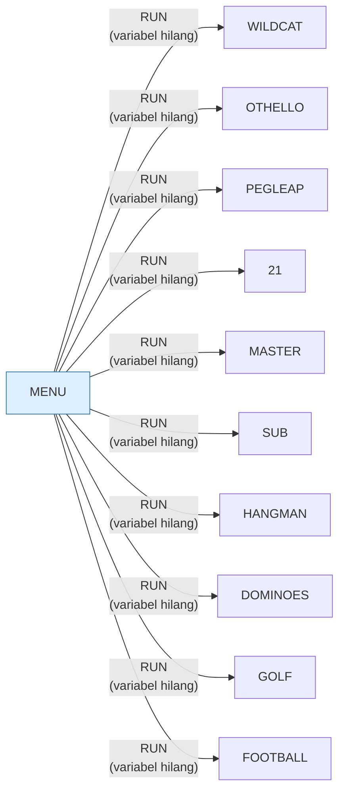

# MENU.BAS — Friendlyware Menu #1

> Peluncur 21 entri untuk separuh permainan dari disket.

| | |
|---|---|
| Sumber | Friendlyware PC Introductory Set |
| Tahun | 1982 |
| Panjang | 41 baris (nomor 10–530) |
| Subrutin | 2, dipanggil dari 2 tempat |
| Percabangan | 3 `GOTO`, 2 `GOSUB`, 3 target `ON…` |
| Komentar | 0% dari baris |
| Jalankan | `run\MENU.bat` |

## Peta arsitektur

*Diagram di bawah ini bukan tafsiran — semuanya diturunkan langsung dari
kode: tiap panah adalah `GOSUB` yang benar-benar ada, tiap kotak adalah
blok antara sebuah entri dan `RETURN`-nya.*



Kotak bersudut miring berwarna = **penangan kejadian** (`ON KEY`/`ON ERROR`), yang dipanggil oleh interupsi, bukan oleh alur utama.

### Subrutin dan perannya

| Baris | Panjang | Dipanggil | Peran (diambil dari kode) |
|---|--:|--:|---|
| `500`–`510` | 2 baris | 1× | for @500 |
| `510`–`510` | 1 baris | 1× | blok @510 |

### Program lain yang dimuat



### Kejadian yang dijebak

- `ON ERROR` → baris 0, 520

### Perulangan utama

`GOTO` mundur terpanjang: dari baris **390** kembali ke **260** — melingkupi 130 nomor baris.
Itulah loop utama program ini; segala sesuatu di dalam rentang tersebut
dijalankan berulang.

## Bagaimana program ini disusun

Empat puluh satu baris, dua subrutin sepele — dan **berkas paling penting di
seluruh disket**. Kalau Anda ingin memahami sebuah koleksi program, mulailah
dari menunya.

Arsitekturnya cuma dua bagian. Menggambar, lalu memetakan:

```basic
270 IF R$="A" OR R$="a" THEN RUN"WILDCAT"
280 IF R$="B" OR R$="b" THEN RUN"OTHELLO"
...
```

Dua puluh satu `IF` berturut-turut. Ini **tabel** — tombol → nama berkas — yang
ditulis sebagai rantai `IF` karena BASIC tidak punya array asosiatif.

Dengan `DATA`+`READ` sebenarnya bisa lebih ringkas. Tapi rantai `IF` lebih mudah
disunting orang yang bukan pemrogram, dan untuk berkas yang harus berubah tiap
kali isi disket berubah, itu pertimbangan yang sah. **Bentuk yang paling ringkas
bukan selalu bentuk yang paling tepat.**

Bagian terbaiknya ada di dua baris terakhir:

```basic
520 IF ERR=53 THEN RUN"menu
530 ON ERROR GOTO 0
```

Galat 53 = "File not found". Kalau pemakai memilih program yang tidak ada di
disket, menu **memuat ulang dirinya sendiri** alih-alih mati. Lalu baris 530
mematikan penangkap, sehingga galat lain tetap terlihat.

Menangani satu galat yang diantisipasi, lalu melepaskan sisanya — itulah
penanganan galat yang benar, dan program 41 baris ini melakukannya dengan tepat.

## Yang menarik dari kodenya

Hanya 41 baris, tapi ini **jantung seluruh disket Friendlyware** dan berkas
paling berguna di koleksi untuk memahami bagaimana semuanya tersambung.

Seluruh isinya cuma dua hal. Pertama, menggambar menu:

```basic
150 LOCATE 4,5:COLOR 0,7:PRINT" A ";:COLOR 3,0:PRINT" Wildcatter"TAB(31);...
```

Kedua, memetakan tombol ke program:

```basic
270 IF R$="A" OR R$="a" THEN RUN"WILDCAT"
280 IF R$="B" OR R$="b" THEN RUN"OTHELLO"
```

Dua puluh satu `IF` berturut-turut. Ini **tabel** — tombol → nama berkas — yang
ditulis sebagai rantai `IF` karena BASIC tidak punya array asosiatif. Dengan
`DATA`+`READ` sebenarnya bisa lebih ringkas, tapi rantai `IF` lebih mudah
disunting oleh orang yang bukan pemrogram, dan untuk berkas yang mungkin harus
diubah tiap kali disket berubah isi, itu pertimbangan yang sah.

Yang benar-benar layak dicontoh ada di dua baris terakhir:

```basic
520 IF ERR=53 THEN RUN"menu
530 ON ERROR GOTO 0
```

Galat 53 adalah "File not found". Jadi kalau pemakai menekan tombol untuk
program yang tidak ada di disket, menu **memuat ulang dirinya sendiri** alih-alih
mati. Pemulihan yang anggun dalam satu baris. Dan baris 530 mematikan penangkap
untuk galat lain — jadi hanya kasus yang memang diantisipasi yang ditangani,
sisanya tetap terlihat.

## Yang bisa dipelajari

- Tangani **galat yang spesifik** (`ERR=53`), lalu `ON ERROR GOTO 0` untuk sisanya. Ini kebalikan dari `INTRO.BAS` yang menelan semuanya.
- Pemulihan dengan memuat ulang diri sendiri adalah strategi yang sah untuk program berbasis menu.
- Baca berkas ini lebih dulu kalau ingin memahami sebuah koleksi. Menu adalah peta.

## Yang jangan ditiru

- Dua puluh satu `IF` sebagai pengganti tabel. Bisa dimengerti di sini, tapi kenali bahwa itu tabel yang sedang menyamar.

## Lampiran

### Perkakas bahasa yang dipakai

`DRAW` — bahasa makro menggambar garis, `POKE` — tulis memori langsung, `DEF SEG` — pindah segmen memori, `ON KEY(n) GOSUB` — jebakan tombol fungsi, `ON ERROR GOTO` — penanganan galat, `ON x GOTO` — percabangan berindeks, `ON x GOSUB` — pemanggilan berindeks, `INKEY$` — baca tombol tanpa menunggu Enter, `RUN "nama"` — muat program lain, variabel hilang, `LOCATE` — posisikan kursor, `COLOR` — warna teks

### Sepuluh baris pembuka

```basic
10 CLEAR ,36000:KEY OFF:SCREEN 0,0,0:CLS:WIDTH 80:ON ERROR GOTO 520
20 GOSUB 500
70  CLS:DEF SEG:POKE 106,0
80  COLOR 3,0:LOCATE ,,0
140 LOCATE 2,18:PRINT"Menu #1 - Programs Available On This Diskette"
150 LOCATE 4,5:COLOR 0,7:PRINT" A ";:COLOR 3,0:PRINT" Wildcatter"TAB(31);:COLOR 0,7:PRINT" H ";:COLOR 3,0:PRINT" Dominoes   "TAB(57);:COLOR 0,7:PRINT" O ";:COLOR 3,0:PRINT" You Draw It       "
160 LOCATE 7,5:COLOR 0,7:PRINT" B ";:COLOR 3,0:PRINT" Othello"TAB(31);:COLOR 0,7:PRINT" I ";:COLOR 3,0:PRINT" PC Golf  "TAB(57);:COLOR 0,7:PRINT" P ";:COLOR 3,0:PRINT" Towers Of Atlantis"
170 LOCATE 10,5:COLOR 0,7:PRINT" C ";:COLOR 3,0:PRINT" Peg Leap "TAB(31);:COLOR 0,7:PRINT" J ";:COLOR 3,0:PRINT" Head Coach"TAB(57);:COLOR 0,7:PRINT" Q ";:COLOR 3,0:PRINT" Personal Biorhythms"
180 LOCATE 13,5:COLOR 0,7:PRINT" D ";:COLOR 3,0:PRINT" Blackjack"TAB(31);:COLOR 0,7:PRINT" K ";:COLOR 3,0:PRINT" Match        "TAB(57);:COLOR 0,7:PRINT" R ";:COLOR 3,0:PRINT" Sports Predicting"
181 LOCATE 16,5:COLOR 0,7:PRINT" E ";:COLOR 3,0:PRINT" Mastermind"TAB(31);:COLOR 0,7:PRINT" L ";:COLOR 3,0:PRINT" Nevada Dice  "TAB(57);:COLOR 0,7:PRINT" S ";:COLOR 3,0:PRINT" Killer Maze"
```

### Baris terpanjang (193 kolom)

```basic
180 LOCATE 13,5:COLOR 0,7:PRINT" D ";:COLOR 3,0:PRINT" Blackjack"TAB(31);:COLOR 0,7:PRINT" K ";:COLOR 3,0:PRINT" Match        "TAB(57);:COLOR 0,7:PRINT" R ";:COLOR 3,0:PRINT" Sports Predicting"
```

---
[Dasar-dasar BASIC](00-DASAR-BASIC.md) · [Daftar review](README.md) · [Katalog koleksi](../README.md)
