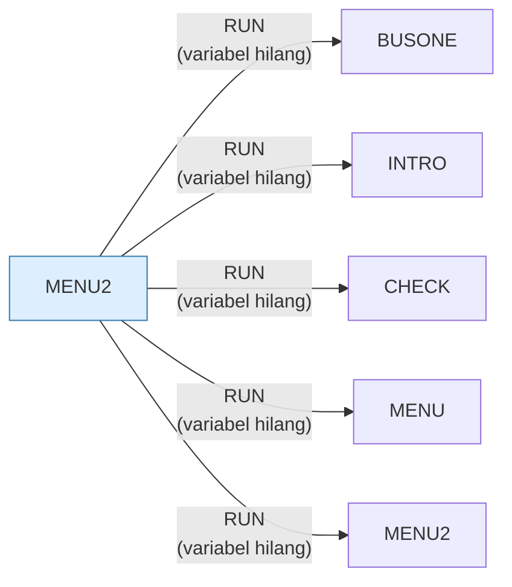

# MENU2.BAS — Friendlyware Menu #2

> Menu bisnis; tujuh dari sebelas entrinya adalah subrutin di dalam file ini sendiri.

| | |
|---|---|
| Sumber | Friendlyware PC Introductory Set |
| Tahun | 1982 |
| Panjang | 642 baris (nomor 20–6470) |
| Subrutin | 66, dipanggil dari 179 tempat |
| Percabangan | 92 `GOTO`, 179 `GOSUB`, 4 target `ON…` |
| Komentar | 0% dari baris |
| Jalankan | `run\MENU2.bat` |

## Peta arsitektur

*Diagram di bawah ini bukan tafsiran — semuanya diturunkan langsung dari
kode: tiap panah adalah `GOSUB` yang benar-benar ada, tiap kotak adalah
blok antara sebuah entri dan `RETURN`-nya.*

```mermaid
flowchart TD
    MAIN(["alur utama<br/>mulai baris 20"])
    S460["buang penyangga tombol<br/>460..490 (4 baris)"]
    S640["gambar ulang layar<br/>640..690 (6 baris)"]
    S790["color+locate+print 790<br/>790..920 (14 baris)"]
    S970["'Number Of Years'<br/>970..980 (2 baris)"]
    S990["'No. Payments Per Year'<br/>990..1000 (2 baris)"]
    S1030["'No. Payments Made'<br/>1030..1040 (2 baris)"]
    S1050["locate+print+if 1050<br/>1050..1140 (10 baris)"]
    S1550["gambar ulang layar<br/>1550..1670 (13 baris)"]
    S1580["gambar ulang layar<br/>1580..1670 (10 baris)"]
    S1680["color+locate+print 1680<br/>1680..1680 (1 baris)"]
    S2390["'Asset Cost'<br/>2390..2440 (6 baris)"]
    S3630["gambar ulang layar<br/>3630..3670 (5 baris)"]
    S3770["color+locate+print 3770<br/>3770..3860 (10 baris)"]
    S4760["gambar ulang layar<br/>4760..4880 (13 baris)"]
    S6030["gambar bingkai layar<br/>6030..6140 (12 baris)"]
    S6350["':DEF SEG:POKE 106,0:IF INKEY$ '<br/>6350..6390 (5 baris)"]
    MORE["... 50 subrutin lain"]
    MAIN -.-> MORE
    MAIN --> S640
    MAIN --> S460
    MAIN --> S790
    MAIN --> S970
    MAIN --> S990
    MAIN --> S1050
    MAIN --> S1030
    MAIN --> S4760
    MAIN --> S6030
    MAIN --> S6350
    S970 --> S6350
    S990 --> S6350
    S1030 --> S6350
    S1550 --> S460
    S1550 --> S1580
    S1550 --> S1680
    S4760 --> S460
```



Kotak bersudut miring berwarna = **penangan kejadian** (`ON KEY`/`ON ERROR`), yang dipanggil oleh interupsi, bukan oleh alur utama.

### Subrutin dan perannya

| Baris | Panjang | Dipanggil | Peran (diambil dari kode) |
|---|--:|--:|---|
| `460`–`490` | 4 baris | 20× | buang penyangga tombol |
| `6350`–`6390` | 5 baris | 12× | ":DEF SEG:POKE 106,0:IF INKEY$<>" |
| `6030`–`6140` | 12 baris | 10× | gambar bingkai layar |
| `640`–`690` | 6 baris | 5× | gambar ulang layar |
| `3630`–`3670` | 5 baris | 5× | gambar ulang layar |
| `4760`–`4880` | 13 baris | 5× | gambar ulang layar |
| `780`–`780` | 1 baris | 4× | "***** Strike Key To Return To Menu *" |
| `790`–`920` | 14 baris | 4× | color+locate+print @790 |
| `990`–`1000` | 2 baris | 4× | "No. Payments Per Year" |
| `1050`–`1140` | 10 baris | 4× | locate+print+if @1050 |
| `2220`–`2220` | 1 baris | 4× | "***** Strike Key To Return To Menu *" |
| `2230`–`2270` | 5 baris | 4× | color+locate+print @2230 |
| `2390`–`2440` | 6 baris | 4× | "Asset Cost" |
| `2580`–`2610` | 4 baris | 4× | color+locate+print @2580 |

*(52 subrutin lain tidak ditampilkan)*

### Program lain yang dimuat



### Kejadian yang dijebak

- `ON ERROR` → baris 0, 410
- `ON KEY(10)` → baris 6470

### Perulangan utama

`GOTO` mundur terpanjang: dari baris **6470** kembali ke **40** — melingkupi 6430 nomor baris.
Itulah loop utama program ini; segala sesuatu di dalam rentang tersebut
dijalankan berulang.

## Bagaimana program ini disusun

**66 subrutin, 60 panah** — jaringan internal terbesar di koleksi, di sebuah
berkas yang namanya cuma "menu".

Penyebabnya terungkap dari daftar overlay-nya: `MENU2` hanya memanggil `BUSONE`,
`INTRO`, `CHECK`, dan `MENU`. Padahal menunya menawarkan sebelas pilihan. Tujuh
sisanya — Depreciation, Inventory Reorder, Present/Future Value, Amortization,
EOQ, Break Even, Stock Ratio — **tinggal di dalam berkas ini sendiri**.

Keputusannya tampak dibuat per kasus berdasarkan ukuran: kalkulator kecil
(beberapa puluh baris rumus) disimpan di dalam; tutorial sepuluh bagian
dipisahkan ke berkas sendiri.

Itu keputusan yang wajar, tapi hasilnya berkas yang **tidak sesuai namanya**.
Siapa pun yang mencari rumus amortisasi tidak akan menebak untuk membuka
`MENU2.BAS`. Ini pelajaran penamaan modul yang masih relevan: nama berkas adalah
janji tentang isinya.

Rutin tunggu-tombol di baris 460 dipanggil **20 kali**, dan rutin bingkai di 6030
sepuluh kali. Dua puluh titik jeda berarti dua puluh layar.

Validasi inputnya patut dicontoh:

```basic
2430 IF VALUE#>COST# THEN PRINT "Salvage value cannot be greater than cost - Retry"
```

Pesan yang **menyebutkan aturan yang dilanggar**, bukan "input tidak valid".
Dan akhiran `#` (double precision) untuk perhitungan uang — pilihan tipe yang
benar.

## Yang menarik dari kodenya

642 baris — program terbesar kedua di koleksi — padahal namanya cuma "menu".
Sebabnya ada di strukturnya: **tujuh dari sebelas entri menunya bukan berkas
terpisah, melainkan subrutin di dalam berkas ini sendiri**.

Menu #2 menawarkan Depreciation Costs, Inventory Reorder, Present/Future Value,
Amortization Analysis, Economic Order Quantity, Break Even Analysis, dan Stock
Ratio Analysis. Ketujuhnya tinggal di sini. Hanya `BUSONE`, `INTRO`, dan `CHECK`
yang dipanggil lewat `RUN`.

Kenapa dicampur begitu? Kemungkinan besar karena ketujuh kalkulator itu kecil —
masing-masing hanya beberapa puluh baris rumus keuangan — sementara `BUSONE`
adalah tutorial sepuluh bagian yang jelas tidak muat. Jadi keputusan "pisah
berkas atau tidak" dibuat per kasus berdasarkan ukuran.

Itu keputusan yang wajar, tapi hasilnya berkas yang tidak sesuai namanya. Siapa
pun yang mencari rumus amortisasi tidak akan menebak untuk membuka `MENU2.BAS`.

Baris 2430 memperlihatkan validasi input yang benar:

```basic
2430 IF VALUE#>COST# THEN LOCATE 23,17:COLOR 11,0:PRINT"Salvage value cannot be greater than cost - Retry":...:GOTO 2410
```

Pesan galat yang **menjelaskan aturannya**, bukan sekadar "Invalid input". Dan
akhiran `#` pada `VALUE#`/`COST#` menandakan double precision — tepat untuk
perhitungan uang.

## Yang bisa dipelajari

- Pesan galat yang menyebutkan aturan yang dilanggar jauh lebih berguna daripada 'input tidak valid'.
- Pakai double precision (`#`) untuk perhitungan keuangan. Single precision hanya punya ~7 digit berarti.

## Yang jangan ditiru

- Berkas yang isinya tidak sesuai namanya. Kalau `MENU2` berisi tujuh kalkulator, ia bukan menu lagi.
- 179 `GOSUB` dan 92 `GOTO` dalam satu berkas tanpa satu pun komentar.

## Lampiran

### Perkakas bahasa yang dipakai

`PEEK` — baca memori langsung, `POKE` — tulis memori langsung, `DEF SEG` — pindah segmen memori, `ON KEY(n) GOSUB` — jebakan tombol fungsi, `ON ERROR GOTO` — penanganan galat, `ON x GOTO` — percabangan berindeks, `ON x GOSUB` — pemanggilan berindeks, `INKEY$` — baca tombol tanpa menunggu Enter, `RUN "nama"` — muat program lain, variabel hilang, `DEFSTR` — variabel default teks, `STRING$` — ulang satu karakter n kali, `LOCATE` — posisikan kursor, `COLOR` — warna teks

### Sepuluh baris pembuka

```basic
20 KEY OFF:CLEAR ,36000:SCREEN 0,0,0:WIDTH 80:ON ERROR GOTO 410
30 FOR A=1 TO 9:ON KEY(A) GOSUB 440:KEY(A) ON:NEXT:ON KEY(10) GOSUB 6470
40 KEY(10) ON
80 CLS:DEF SEG:POKE 106,0
90 COLOR 15,0:FOR I=1 TO 3 STEP 2:FOR J=20 TO 62:LOCATE I,J,0:PRINT "─":NEXT:NEXT
100 LOCATE 1,19:PRINT"┌":LOCATE 1,63:PRINT"┐":LOCATE 3,63:PRINT"┘":LOCATE 3,19:PRINT"└"
110 LOCATE 2,19:PRINT"│"SPC(43)"│"
120 COLOR 0,7:LOCATE 2,29:PRINT" F R I E N D L Y W A R E ":COLOR 3,0
130 LOCATE 5,18:PRINT"Menu #2 - Programs Available On This Diskette"
140 LOCATE 9,1:COLOR 0,7:PRINT" A ";:COLOR 3,0:PRINT" Business Simulation"
```

### Baris terpanjang (206 kolom)

```basic
2430 IF VALUE#>COST# THEN LOCATE 23,17:COLOR 11,0:PRINT"Salvage value cannot be greater than cost - Retry":FOR I=1 TO 2500:NEXT:LOCATE 23,17:PRINT SPACE$(49):LOCATE 9,45:PRINT SPACE$(20):COLOR 7,0:GOTO 2410
```

---
[Dasar-dasar BASIC](00-DASAR-BASIC.md) · [Daftar review](README.md) · [Katalog koleksi](../README.md)
