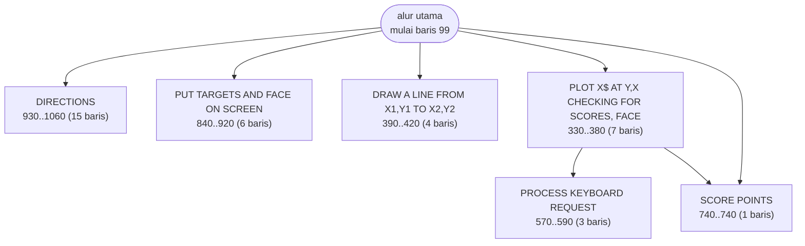

# METEOR.BAS — Meteor

> Edward T. Ordman, Nov 1981; terbit di Creative Computing Vol. 8 No. 8, hlm. 178-185.

| | |
|---|---|
| Sumber | Public domain / listing majalah lain-lain |
| Tahun | 1981 |
| Panjang | 80 baris (nomor 99–1060) |
| Subrutin | 6, dipanggil dari 8 tempat |
| Percabangan | 6 `GOTO`, 8 `GOSUB`, 0 target `ON…` |
| Komentar | 32% dari baris |
| Jalankan | `run\METEOR.bat` |

## Peta arsitektur

*Diagram di bawah ini bukan tafsiran — semuanya diturunkan langsung dari
kode: tiap panah adalah `GOSUB` yang benar-benar ada, tiap kotak adalah
blok antara sebuah entri dan `RETURN`-nya.*



Kotak bersudut miring berwarna = **penangan kejadian** (`ON KEY`/`ON ERROR`), yang dipanggil oleh interupsi, bukan oleh alur utama.

### Subrutin dan perannya

| Baris | Panjang | Dipanggil | Peran (diambil dari kode) |
|---|--:|--:|---|
| `740`–`740` | 1 baris | 3× | SCORE POINTS |
| `330`–`380` | 7 baris | 1× | PLOT X$ AT Y,X CHECKING FOR SCORES, FACE MOT |
| `390`–`420` | 4 baris | 1× | DRAW A LINE FROM  X1,Y1 TO X2,Y2 |
| `570`–`590` | 3 baris | 1× | PROCESS KEYBOARD REQUEST |
| `840`–`920` | 6 baris | 1× | PUT TARGETS AND FACE ON SCREEN |
| `930`–`1060` | 15 baris | 1× | DIRECTIONS |

### Perulangan utama

`GOTO` mundur terpanjang: dari baris **810** kembali ke **770** — melingkupi 40 nomor baris.
Itulah loop utama program ini; segala sesuatu di dalam rentang tersebut
dijalankan berulang.

## Bagaimana program ini disusun

Enam subrutin untuk 80 baris, semuanya diberi nama, dan pembagiannya adalah
contoh **pemisahan menurut tanggung jawab** yang sangat bersih:

| Baris | Nama di kode |
|---|---|
| 330 | `PLOT X$ AT Y,X CHECKING FOR SCORES, FACE MOTION` |
| 390 | `DRAW A LINE FROM X1,Y1 TO X2,Y2` |
| 570 | `PROCESS KEYBOARD REQUEST` |
| 740 | `SCORE POINTS` |
| 840 | `PUT TARGETS AND FACE ON SCREEN` |
| 930 | `DIRECTIONS` |

Gambar, garis, input, skor, tata letak, bantuan. Enam tanggung jawab, enam rutin.
Perhatikan nama-nama itu menyebutkan **variabel yang dipakai** (`X$`, `Y,X`,
`X1,Y1 TO X2,Y2`) — sekali lagi, komentar merangkap tanda tangan fungsi.

Program ini terbit di *Creative Computing* untuk **diketik ulang pembaca**, dan
itu menjelaskan 32% komentarnya — rasio tertinggi di koleksi.

Bagian paling cerdas ada di baris 150–170:

```basic
150 ... R=523:REM RANDOM SEED
170 IF R$="N" ... ELSE R=(R+511)MOD 32003:GOTO 160
```

Selagi menunggu pemain menekan tombol, program **terus mengaduk benih acaknya**.
Benihnya jadi ditentukan oleh berapa lama pemain berpikir.

Ini jauh lebih baik daripada `RANDOMIZE VAL(RIGHT$(TIME$,2))` yang dipakai
setengah koleksi ini dan hanya punya 60 kemungkinan. Waktu reaksi manusia adalah
sumber entropi yang bagus dan gratis.

## Yang menarik dari kodenya

Delapan puluh baris, **32% komentar** — rasio tertinggi di koleksi — dan
terbit di *Creative Computing* Vol. 8 No. 8. Rasio itu bukan kebetulan: program
yang ditulis untuk **dicetak di majalah dan diketik ulang pembaca** harus bisa
dipahami dari kertas.

Perhatikan cara komentarnya ditempel di ujung baris:

```basic
120 M$=CHR$(2):C$=CHR$(219):X$=CHR$(25):REM FACE,SOLID SQUARE,DOWN ARROW
130 C5$=C$+C$+C$+C$+C$:H$="":T=0:REM BLOCK,LATCH FOR FACE MOTION,SCORE
140 Y=178:E2$=STRING$(2,Y):E5$=STRING$(5,Y):E8$=STRING$(8,Y):REM SHADING
```

Tiap baris memuat beberapa penetapan, dan komentar di ujung menamai semuanya
berurutan. Padat, tapi lengkap — tidak ada satu pun variabel yang tidak
dijelaskan. Ini gaya "kamus di tempat" yang sangat cocok untuk listing majalah.

Baris 150 dan 170 menyembunyikan trik yang bagus:

```basic
150 ... R=523:REM RANDOM SEED
170 IF R$="N" ... ELSE R=(R+511)MOD 32003:GOTO 160
```

Selagi menunggu pemain menekan tombol, program terus mengaduk benih acaknya.
Jadi benihnya ditentukan oleh **berapa lama pemain berpikir** — sumber
keacakan yang nyata dan gratis, jauh lebih baik daripada
`RANDOMIZE VAL(RIGHT$(TIME$,2))` yang cuma punya 60 kemungkinan.

Seluruh grafiknya karakter: `CHR$(2)` wajah, `CHR$(219)` blok, `CHR$(178)`
arsiran. Judulnya sendiri menyebut "A CHARACTER GRAPHICS ARCADE GAME".

## Yang bisa dipelajari

- **Aduk benih acak selama menunggu input.** Waktu reaksi manusia adalah sumber entropi yang bagus dan tidak berbiaya.
- Komentar di ujung baris yang menamai tiap variabel berurutan adalah cara padat mendokumentasikan baris yang penuh.
- Kode yang ditulis untuk dibaca orang lain terlihat berbeda. 32% komentar adalah harga yang dibayar, dan sepadan.

## Lampiran

### Perkakas bahasa yang dipakai

`PLAY` — musik lewat bahasa makro not, `SOUND` — nada mentah (frekuensi, durasi), `DRAW` — bahasa makro menggambar garis, `INKEY$` — baca tombol tanpa menunggu Enter, `RANDOMIZE` — menyemai pengacak, `STRING$` — ulang satu karakter n kali, `LOCATE` — posisikan kursor

### Sepuluh baris pembuka

```basic
99 ' Source:  Creative Computing, Vol. 8, No. 8, pp. 178-185
100 REM  METEOR, A CHARACTER GRAPHICS ARCADE GAME
110 REM  BY EDWARD T. ORDMAN      NOVEMBER 1981
120 M$=CHR$(2):C$=CHR$(219):X$=CHR$(25):REM FACE,SOLID SQUARE,DOWN ARROW
130 C5$=C$+C$+C$+C$+C$:H$="":T=0:REM BLOCK,LATCH FOR FACE MOTION,SCORE
140 Y=178:E2$=STRING$(2,Y):E5$=STRING$(5,Y):E8$=STRING$(8,Y):REM SHADING
150 CLS:KEY OFF:PRINT "DO YOU WANT DIRECTIONS (Y/N)?":R=523:REM RANDOM SEED
160 R$=INKEY$:IF R$="Y" THEN GOSUB 930:GOTO 180
170 IF R$="N" OR R$=CHR$(13) THEN 180 ELSE R=(R+511)MOD 32003:GOTO 160
180 RANDOMIZE R:REM SEED BASED ON DELAY IN ANSWERING QUESTION
```

---
[Dasar-dasar BASIC](00-DASAR-BASIC.md) · [Daftar review](README.md) · [Katalog koleksi](../README.md)
