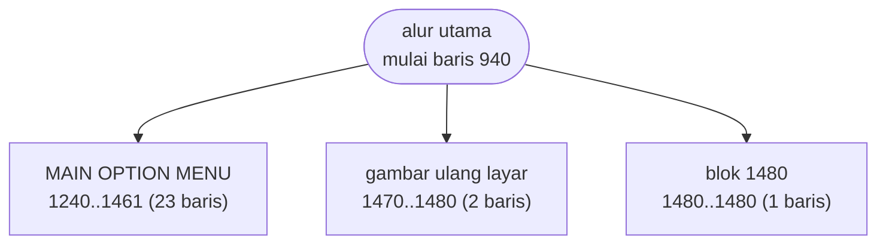
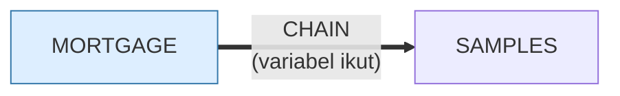

# MORTGAGE.BAS — IBM PC Mortgage v1.00

> (C) IBM 1981, 1982. Penulis Glenn Stuart Dardick; dimodifikasi Sep 1986 oleh Ayodele Isaac Anise.

| | |
|---|---|
| Sumber | Program contoh IBM Personal Computer |
| Tahun | 1982 |
| Panjang | 204 baris (nomor 940–2860) |
| Subrutin | 3, dipanggil dari 4 tempat |
| Percabangan | 31 `GOTO`, 4 `GOSUB`, 0 target `ON…` |
| Komentar | 4% dari baris |
| Jalankan | `run\MORTGAGE.bat` |

## Peta arsitektur

*Diagram di bawah ini bukan tafsiran — semuanya diturunkan langsung dari
kode: tiap panah adalah `GOSUB` yang benar-benar ada, tiap kotak adalah
blok antara sebuah entri dan `RETURN`-nya.*



Kotak bersudut miring berwarna = **penangan kejadian** (`ON KEY`/`ON ERROR`), yang dipanggil oleh interupsi, bukan oleh alur utama.

### Subrutin dan perannya

| Baris | Panjang | Dipanggil | Peran (diambil dari kode) |
|---|--:|--:|---|
| `1480`–`1480` | 1 baris | 2× | blok @1480 |
| `1240`–`1461` | 23 baris | 1× | MAIN OPTION MENU |
| `1470`–`1480` | 2 baris | 1× | gambar ulang layar |

### Program lain yang dimuat



### Perulangan utama

`GOTO` mundur terpanjang: dari baris **2850** kembali ke **1210** — melingkupi 1640 nomor baris.
Itulah loop utama program ini; segala sesuatu di dalam rentang tersebut
dijalankan berulang.

### Data yang dipegang

| Array | Dipakai | Ditulis di baris |
|---|--:|---|
| `AMORT` | 11× | 2470, 2490, 2500 |

## Bagaimana program ini disusun

Hanya tiga subrutin untuk 204 baris — hampir semuanya alur lurus. Yang layak
dipelajari bukan pembagiannya, melainkan **antarmuka programnya**.

Nomor barisnya mulai dari **940**, bukan 10. Baris 980–1010 menjelaskan kenapa:

```basic
980 SAMPLES$="NO"
990 GOTO 1010
1000 SAMPLES$="YES"
1010 KEY OFF:SCREEN 0,1: ...
```

Ada **dua pintu masuk**. Dijalankan biasa, program mulai di 980 dan
`SAMPLES$="NO"`. Di-`CHAIN` dari program lain dengan `CHAIN "MORTGAGE",1000`,
ia masuk di 1000 dan `SAMPLES$="YES"` — mode demonstrasi.

Jadi **nomor baris adalah antarmuka publik**, dan ruang 1–939 dicadangkan untuk
program pemanggil yang akan di-`MERGE`. Struktur yang persis sama muncul di
`MUSIC`, `PIECHART`, dan `SPACE` — seluruh keluarga program contoh IBM memakai
konvensi ini.

Ini *entry point overloading*, cara BASIC meniru argumen opsional. Anda melihat
teknik yang sama di `HEAREYE.BAS` dengan dua pintu ke satu blok.

Kelemahannya berat: menomori ulang program merusak semua pemanggilnya, dan tidak
ada apa pun di dalam kode yang mencatat kontrak itu selain kebiasaan.

Program ini juga satu-satunya di koleksi yang punya riwayat modifikasi tercatat
di header — penulis asli plus pengubah berikutnya dengan tanggalnya.

## Yang menarik dari kodenya

Program IBM resmi, dan satu-satunya di koleksi yang punya **riwayat modifikasi
tercatat**:

```basic
940 REM The IBM Personal Computer Mortgage
950 REM Version 1.00 (C)Copyright IBM Corp 1981, 1982
960 REM Licensed Material - Program Property of IBM
965 REM Author - Glenn Stuart Dardick
970 REM Modified by Ayodele Isaac Anise; September, 1986.
```

Penulis asli, dan pengubah berikutnya dengan tanggalnya. Ini *changelog* dalam
lima baris, empat tahun sebelum orang punya kendali versi di komputer pribadi.
Kebiasaan yang layak dihidupkan lagi di berkas yang tidak terlacak git.

Nomor barisnya mulai dari **940**, bukan 10. Baris 980–1000 menjelaskan kenapa:

```basic
980 SAMPLES$="NO"
990 GOTO 1010
1000 SAMPLES$="YES"
```

Ada dua pintu masuk. Kalau program dijalankan biasa, ia mulai di 980 dan
`SAMPLES$="NO"`. Kalau di-`CHAIN` dari program lain dengan `CHAIN "MORTGAGE",1000`,
ia masuk di baris 1000 dan `SAMPLES$="YES"` — mode demonstrasi.

Jadi **nomor baris adalah antarmuka publik program ini.** Ruang 1–939 dicadangkan
untuk program pemanggil yang akan di-`MERGE`. Struktur yang sama muncul di
`MUSIC`, `PIECHART`, dan `SPACE` — seluruh keluarga program contoh IBM memakai
konvensi ini.

`AMORT(500,2)` menampung sampai 500 periode angsuran — cukup untuk pinjaman
41 tahun bulanan.

## Yang bisa dipelajari

- Catat penulis dan riwayat perubahan di dalam berkas kalau tidak ada sistem versi.
- Beberapa pintu masuk lewat nomor baris berbeda adalah cara BASIC menyediakan 'argumen'. Kenali polanya di seluruh keluarga program IBM.
- Cadangkan rentang nomor baris dan dokumentasikan — itu kontrak antarprogram.

## Yang jangan ditiru

- Antarmuka yang berupa nomor baris. Menomori ulang program merusak semua pemanggilnya, dan tidak ada yang memperingatkan.

## Lampiran

### Perkakas bahasa yang dipakai

`PEEK` — baca memori langsung, `DEF SEG` — pindah segmen memori, `INKEY$` — baca tombol tanpa menunggu Enter, `CHAIN` — muat program lain, bawa variabel, `STRING$` — ulang satu karakter n kali, `LOCATE` — posisikan kursor, `COLOR` — warna teks

### Deklarasi array

```basic
DIM AMORT(500,2)
```

### Sepuluh baris pembuka

```basic
940 REM The IBM Personal Computer Mortgage
950 REM Version 1.00 (C)Copyright IBM Corp 1981, 1982
960 REM Licensed Material - Program Property of IBM
965 REM Author - Glenn Stuart Dardick
970 REM Modified by Ayodele Isaac Anise; September, 1986.
975 DEF SEG
980 SAMPLES$="NO"
990 GOTO 1010
1000 SAMPLES$="YES"
1010 KEY OFF:SCREEN 0,1:COLOR 15,0,0:WIDTH 40:CLS:LOCATE 5,19:PRINT "IBM"
```

---
[Dasar-dasar BASIC](00-DASAR-BASIC.md) · [Daftar review](README.md) · [Katalog koleksi](../README.md)
