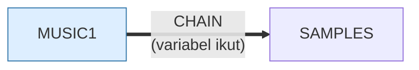

# MUSIC1.BAS — IBM PC Music v1.10 (duplikat)

> Nyaris kembar byte-per-byte dengan MUSIC.BAS, hanya disimpan dalam bentuk ASCII di tanggal berbeda.

| | |
|---|---|
| Sumber | Program contoh IBM Personal Computer |
| Tahun | 1984 |
| Panjang | 210 baris (nomor 940–4550) |
| Subrutin | 1, dipanggil dari 1 tempat |
| Percabangan | 22 `GOTO`, 1 `GOSUB`, 2 target `ON…` |
| Komentar | 3% dari baris |
| Jalankan | `run\MUSIC1.bat` |

## Peta arsitektur

*Diagram di bawah ini bukan tafsiran — semuanya diturunkan langsung dari
kode: tiap panah adalah `GOSUB` yang benar-benar ada, tiap kotak adalah
blok antara sebuah entri dan `RETURN`-nya.*

Hanya ada 1 subrutin, jadi diagram tidak menambah apa pun.

### Subrutin dan perannya

| Baris | Panjang | Dipanggil | Peran (diambil dari kode) |
|---|--:|--:|---|
| `1490`–`1510` | 3 baris | 1× | tunggu tombol |

### Program lain yang dimuat



### Kejadian yang dijebak

- `ON ERROR` → baris 0, 1148

### Perulangan utama

`GOTO` mundur terpanjang: dari baris **1830** kembali ke **1630** — melingkupi 200 nomor baris.
Itulah loop utama program ini; segala sesuatu di dalam rentang tersebut
dijalankan berulang.

### Data yang dipegang

| Array | Dipakai | Ditulis di baris |
|---|--:|---|
| `O` | 35× | 1390, 1400, 1410, 1420, 1430, … |
| `M` | 4× | 1370, 1380 |

## Bagaimana program ini disusun

Analisis arsitekturnya **identik** dengan `MUSIC.BAS` sampai ke nomor baris,
jumlah subrutin, dan tiga loop terbesarnya. Itu bukan kebetulan: keduanya program
yang sama, hanya berbeda bentuk penyimpanan di disket.

Justru karena itu pasangan ini berguna. Jalankan di prompt Windows:

```
fc run\MUSIC.BAS run\MUSIC1.BAS
```

Yang berbeda hanya spasi kecil dan cara angka ditulis — bukan logika, bukan
struktur. Ini **bukti konkret bahwa proses konversi biner-ke-teks di koleksi ini
tidak mengubah apa pun**: satu berkas aslinya tersimpan ter-*tokenize*, satunya
sudah teks sejak awal, dan hasilnya bertemu di tempat yang sama.

Untuk ulasan isinya, lihat [MUSIC.md](MUSIC.md).

## Yang menarik dari kodenya

Kembaran `MUSIC.BAS` — program yang sama persis (IBM PC Music v1.10), hanya
tersimpan dalam bentuk teks ASCII sementara `MUSIC.BAS` tersimpan
ter-*tokenize*, dan tanggal berkasnya berbeda dua tahun.

Justru karena itu pasangan ini berguna: **bandingkan keduanya dan Anda melihat
persis apa yang berubah antara `SAVE "X"` dan `SAVE "X",A`.** Isinya identik;
hanya representasi di disket yang berbeda. Ini bukti konkret bahwa proses
konversi di koleksi ini tidak mengubah apa pun.

Kalau Anda ingin memeriksa sendiri, jalankan di prompt Windows:

```
fc run\MUSIC.BAS run\MUSIC1.BAS
```

Perbedaan yang muncul hanya spasi kecil dan urutan penulisan angka — bukan
logika.

Untuk ulasan isinya, lihat [MUSIC.md](MUSIC.md).

## Yang bisa dipelajari

- Duplikat yang sama secara logis tapi berbeda format adalah alat bantu yang bagus untuk memverifikasi sebuah konverter.

## Yang jangan ditiru

- Menyimpan dua salinan program yang sama tanpa menandai mana yang utama. Empat puluh tahun kemudian, tidak ada yang tahu mana yang benar.

## Lampiran

### Perkakas bahasa yang dipakai

`PLAY` — musik lewat bahasa makro not, `SOUND` — nada mentah (frekuensi, durasi), `POKE` — tulis memori langsung, `DEF SEG` — pindah segmen memori, `ON ERROR GOTO` — penanganan galat, `ON x GOTO` — percabangan berindeks, `INKEY$` — baca tombol tanpa menunggu Enter, `CHAIN` — muat program lain, bawa variabel, `DEFINT` — variabel default bilangan bulat, `STRING$` — ulang satu karakter n kali, `LOCATE` — posisikan kursor, `COLOR` — warna teks

### Deklarasi array

```basic
DIM M(88),O(70)
```

### Sepuluh baris pembuka

```basic
940 REM The IBM Personal Computer Music
950 REM Version 1.10 (C)Copyright IBM Corp 1981, 1982
960 REM Licensed Material - Program Property of IBM
975 DEF SEG: POKE 106,0
980 SAMPLES$ = "NO"
990 GOTO 1010
1000 SAMPLES$ = "YES"
1010 KEY OFF:SCREEN 0,1:COLOR 15,0,0:WIDTH 40:CLS:LOCATE 5,19,0:PRINT "IBM"
1020 LOCATE 7,12:PRINT "Personal Computer"
1030 COLOR 10,0:LOCATE 10,9:PRINT CHR$(213)+STRING$(21,205)+CHR$(184)
```

---
[Dasar-dasar BASIC](00-DASAR-BASIC.md) · [Daftar review](README.md) · [Katalog koleksi](../README.md)
